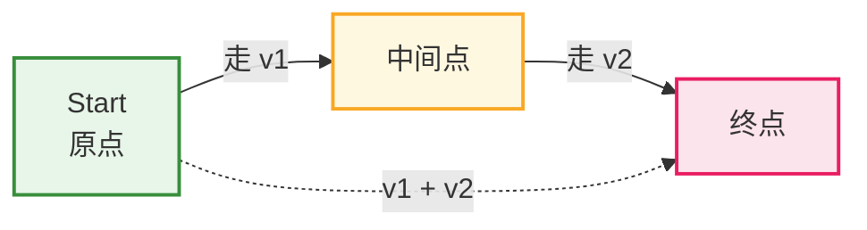
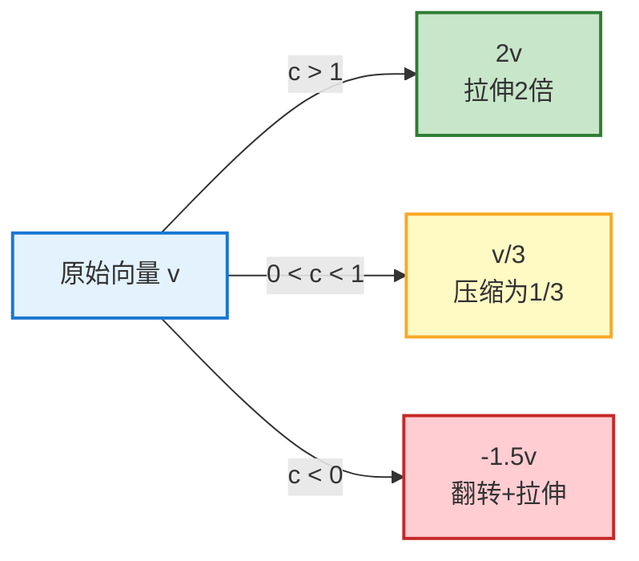
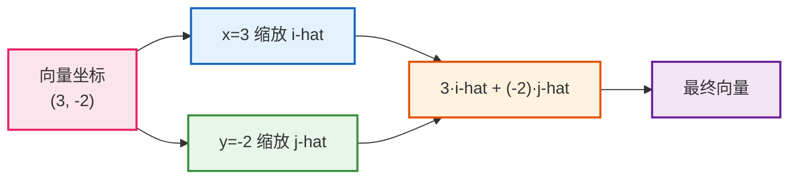
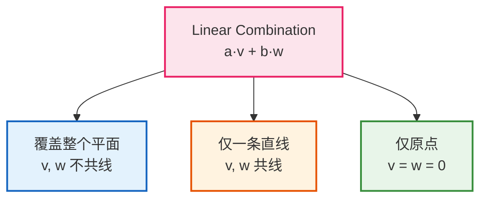
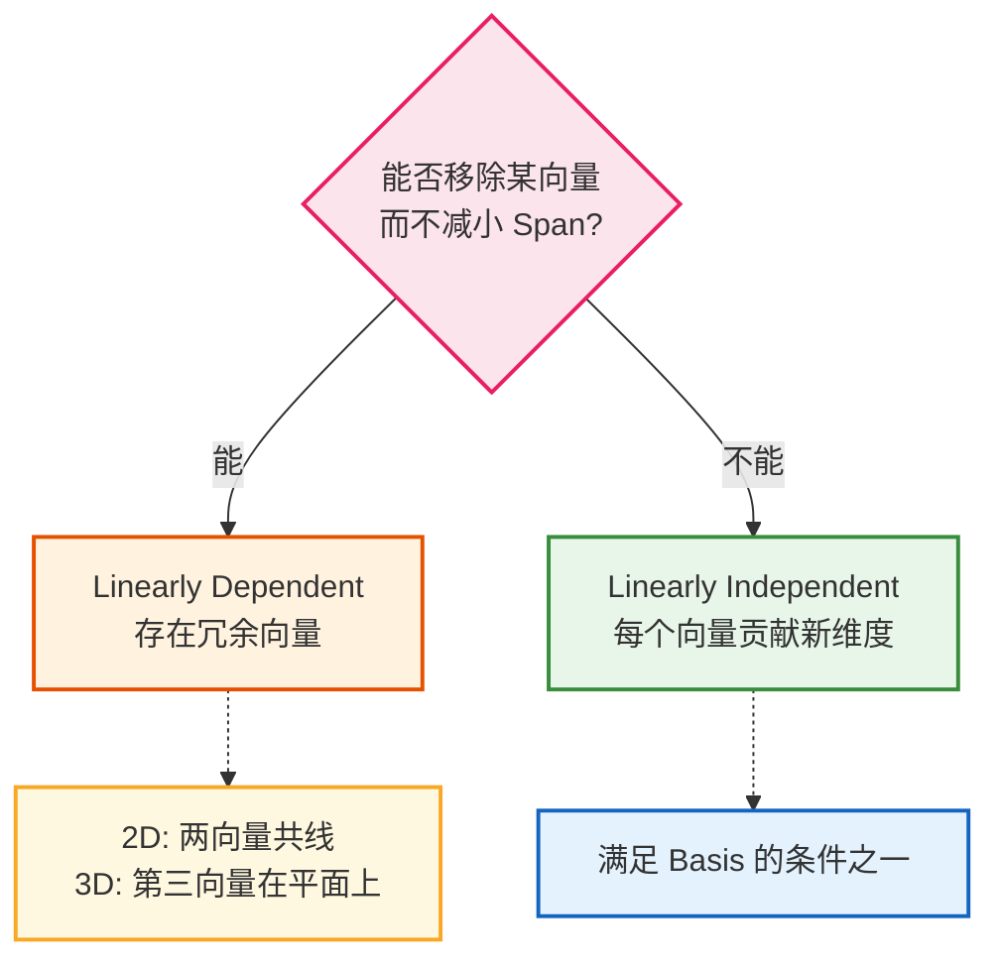
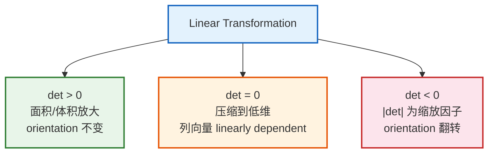
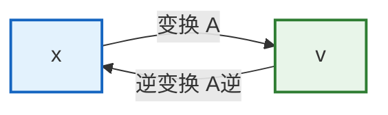
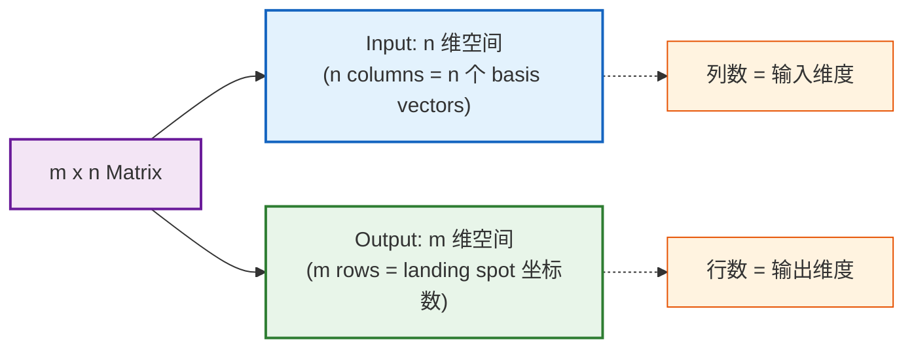

# 线性代数的本质 — 快速复习

> 核心思想：**几何直觉 ↔ 数值计算** 的自由切换。
>
> **来源：[3Blue1Brown - Essence of Linear Algebra](https://www.3blue1brown.com/topics/linear-algebra)**


**核心知识图谱**：

```
向量（坐标 = 缩放基向量）
  │
  ├── 线性组合 → Span → Basis（独立 + 张成）
  │
  ├── 线性变换 = 矩阵（列 = 基的落点）
  │     ├── 矩阵乘向量 = 对新基做线性组合
  │     ├── 矩阵乘矩阵 = 变换复合（从右往左）
  │     └── 非方阵 = 跨维度变换
  │
  ├── 行列式 = 空间缩放因子
  │     ├── det ≠ 0 → 可逆
  │     └── det = 0 → 降维，不可逆
  │
  ├── 线性方程组 Ax = v
  │     ├── det ≠ 0 → x = A⁻¹v（唯一解）
  │     └── det = 0 → 看 Column Space 与 Null Space
  │
  ├── 点积 / 叉积
  │     ├── 点积：投影 × 长度；到一维线性映射 ↔ 与某向量点积
  │     └── 叉积：有向面积 / 法向；det([u|v|w]) 对 u 线性 → 对偶向量即 v×w
  │
  ├── 换基：B、B⁻¹、B⁻¹MB
  │
  ├── 特征：Av = λv；det(A−λI)=0；eigenbasis → 对角化
  │
  └── 抽象向量空间：加法 + 数乘 + 公理
```

---


## 1. 向量、线性组合与基

### 1.1 向量的三种视角

| 视角 | 直观理解 | 关键特征 |
|------|----------|----------|
| 物理 | 空间中的箭头 | 长度 + 方向确定，与位置无关 |
| 计算机 | 有序数字列表 | 顺序重要，维度 = 列表长度 |
| 数学 | 抽象对象 | 只要定义了合理的加法与数乘即可 |

三者统一于两种运算：**向量加法** 与 **标量乘法**。


### 1.2 基本运算

> **Vector Addition（向量加法）**
> 
> $$\begin{bmatrix} x_1 \\ y_1 \end{bmatrix} + \begin{bmatrix} x_2 \\ y_2 \end{bmatrix} = \begin{bmatrix} x_1+x_2 \\ y_1+y_2 \end{bmatrix}$$
> 

**向量加法的几何直觉**:



1. **Tip-to-Tail 法**：将 $\vec{v}_2$ 的尾部接到 $\vec{v}_1$ 的尖端，原点到最终尖端即为和向量。
2. **直觉**：先走 $\vec{v}_1$，再走 $\vec{v}_2$，总效果 = 走 $\vec{v}_1 + \vec{v}_2$


> **Scalar Multiplication（标量乘法）**：
> 
> $$c \cdot \begin{bmatrix} x \\ y \end{bmatrix} = \begin{bmatrix} cx \\ cy \end{bmatrix}$$
> 


**标量乘法的几何直觉**:



1. **直觉**：拉伸、压缩、翻转


### 1.3 基、线性组合与张成空间

#### 基向量（Basis Vectors）



> **Basis 的严格定义**
> 
> $$\text{Basis} = \text{Linearly Independent} + \text{Span the Space}$$
> 
> $\hat{\imath}$、$\hat{\jmath}$ 是 2D basis：不共线（独立）且 span 覆盖整个平面。
> 
> **核心公式**：任意向量 = 坐标分量对基向量的缩放之和
>
> $$\vec{\mathbf{v}} = x\hat{\imath} + y\hat{\jmath}$$
> 


| 符号 | 含义 |
|------|------|
| $\hat{\imath}$ | x 方向单位向量（右方，长度 1） |
| $\hat{\jmath}$ | y 方向单位向量（上方，长度 1） |
| **Basis** | 坐标系中 scalar 实际缩放的对象集合 |

**基的非唯一性**：

1. 可选择任意一对合适的向量作为 basis，同一向量在不同 basis 下坐标不同。
2. 任何用数字描述向量的方式，都依赖于 basis vectors 的选择。


#### 线性组合（Linear Combination）

> **定义**：对向量分别 scalar 缩放后求和
>
> $$a\vec{\mathbf{v}} + b\vec{\mathbf{w}}$$
> 

**"Linear" 的来源**：
1. scalar 遍历所有实数时，乘以某向量产生一条过原点的直线；
2. linear combination 本质是两条直线的组合。




#### 张成空间（Span）

> **定义**：一组向量通过 linear combination 所能到达的所有向量的集合。
>
> $$\text{span}(\vec{\mathbf{v}}, \vec{\mathbf{w}}) = \{a\vec{\mathbf{v}} + b\vec{\mathbf{w}} \mid a, b \in \mathbb{R}\}$$
> 

**核心问题**：仅用 vector addition 和 scalar multiplication，能到达哪些向量？


#### Linear Dependence & Independence



| 性质 | 等价表述 |
|------|----------|
| **Linearly Dependent** | 某向量可表示为其他向量的 linear combination |
| **Linearly Independent** | 没有任何向量可由其他向量线性组合得到 |

---


## 2. 线性变换与矩阵

### 2.1 线性变换的定义

> **线性变换（Linear Transformation）**的严格定义
>
> 设 $L: \mathbb{R}^n \to \mathbb{R}^m$ 是一个映射。如果 $L$ 满足以下两条性质，就称它为**线性变换**：
> 1. **可加性**：$L(u + v) = L(u) + L(v)$，对所有 $u, v \in \mathbb{R}^n$
> 2. **齐次性**：$L(cu) = c \cdot L(u)$，对所有 $c \in \mathbb{R}, u \in \mathbb{R}^n$
> 
> 等价地，可以合并写成：
> $$L(c_1 u + c_2 v) = c_1 L(u) + c_2 L(v)$$
> 
> **核心含义**：线性变换保持"线性组合"的结构——先组合再变换，等于先变换再组合。
> 


### 2.2 Martix 变换

> **Martix变换**：给定任意 $m \times n$ 矩阵 $A$，定义映射：
>
> $$L(\vec{v}) = A \vec{v}$$
> 


**矩阵定义与乘法：**
$$
A \vec{v} = \begin{bmatrix} a & b \\ c & d \end{bmatrix} \begin{bmatrix} x \\ y \end{bmatrix} = x \begin{bmatrix} a \\ c \end{bmatrix} + y \begin{bmatrix} b \\ d \end{bmatrix} = \begin{bmatrix} ax + by \\ cx + dy \end{bmatrix}
$$

- **第一列** = $\hat{\imath}$ 的落点，**第二列** = $\hat{\jmath}$ 的落点
- 乘法本质 = 对变换后的 basis vectors 做 linear combination


**关键洞察**：**一个线性变换 $A$ 完全由它对 $\vec{v}$ 的基向量（$\hat{i}, \hat{j}$）的作用决定。** 只需记录 $\hat{\imath}$、$\hat{\jmath}$ 的落点，其他一切可推导。因为任何向量 $x = \begin{bmatrix} x \\ y \end{bmatrix}$ 都可以写成 $x\hat{i} + y\hat{j}$，而线性变换保持线性组合，所以：
$$
L(\vec{v}) = A \vec{v} = A(x\hat{i} + y\hat{j}) = x(A\hat{i}) + y(A\hat{j}) = x \cdot L(\hat{\imath}) + y \cdot L(\hat{\jmath})
$$
最终有 $A \vec{v} = x \cdot L(\hat{\imath}) + y \cdot L(\hat{\jmath})$，矩阵不只是"一堆数字的表格"，它是某个线性变换的"完全描述"——只要知道基向量被变到哪里（即矩阵的列），就能算出任何向量被变到哪里。


### 2.3 典型 2D 变换

| 变换 | $\hat{\imath}$ 落点 | $\hat{\jmath}$ 落点 | 矩阵 | 效果 |
|------|---------------------|---------------------|-------|------|
| 逆时针旋转 90° | $(0, 1)$ | $(-1, 0)$ | $\begin{bmatrix} 0 & -1 \\ 1 & 0 \end{bmatrix}$ | 所有向量逆时针转 90° |
| Shear（剪切） | $(1, 0)$ | $(1, 1)$ | $\begin{bmatrix} 1 & 1 \\ 0 & 1 \end{bmatrix}$ | $\hat{\imath}$ 不动，$\hat{\jmath}$ 向右倾斜 |
| 列线性相关 | $(a, b)$ | $(ka, kb)$ | 列成比例 | 空间压缩到一条线（降维） |

**验证示例（旋转 90°）：**

$$
\begin{bmatrix} 0 & -1 \\ 1 & 0 \end{bmatrix} \begin{bmatrix} 2 \\ 3 \end{bmatrix} = \begin{bmatrix} -3 \\ 2 \end{bmatrix}
$$


### 2.4 多个矩阵乘法（变换的复合）

依次应用两个 linear transformation（如先旋转再剪切），整体效果仍是一个 linear transformation，称为 **composition**。

**求 composition 矩阵的方法：** 跟踪基向量经两次变换后的最终落点。


$M_2 \cdot M_1$ 表示**先应用 $M_1$，再应用 $M_2$**（从右往左读）。

$$
M_2 \cdot M_1 \cdot \vec{v} =  
\begin{bmatrix} a & b \\ c & d \end{bmatrix}
\begin{bmatrix} e & f \\ g & h \end{bmatrix}
\begin{bmatrix} x \\ y \end{bmatrix}
=
\begin{bmatrix} ae+bg & af+bh \\ ce+dg & cf+dh \end{bmatrix}
$$

| 性质 | 结论 | 直觉 |
|------|------|------|
| 交换律 | ❌ 一般不成立，$AB \neq BA$ | 先旋转再剪切 ≠ 先剪切再旋转 |
| 结合律 | ✅ $(AB)C = A(BC)$ | 同一操作序列，仅分组不同 |


### 2.5 三维线性变换

二维结论直接推广：3×3 矩阵的三列分别记录 $\hat{\imath}, \hat{\jmath}, \hat{k}$ 的落点。

$$
\begin{bmatrix} | & | & | \\ \hat{\imath}' & \hat{\jmath}' & \hat{k}' \\ | & | & | \end{bmatrix}
\begin{bmatrix} x \\ y \\ z \end{bmatrix}
= x\hat{\imath}' + y\hat{\jmath}' + z\hat{k}'
$$

---


## 3. 行列式

### 3.1 几何意义

**Determinant = linear transformation 对空间的缩放因子**（2D 为面积，3D 为体积）。



**为什么只看单位正方形/立方体？** grid lines 保持 parallel 且 evenly spaced → 所有区域按相同因子缩放 → 单位区域的缩放因子即全局缩放因子。


| $\det(A)$ | 含义 |
|-----------|------|
| $\det(A) > 0$ | 放大，orientation 不变 |
| $\det(A) = 0$ | 压缩到低维，列向量线性相关 |
| $\det(A) < 0$ | $\|\det(A)\|$ 为缩放因子，orientation 翻转 |


### 3.2 计算公式

| 维度 | 公式 |
|------|------|
| 2D | $\det\begin{bmatrix} a & b \\ c & d \end{bmatrix} = ad - bc$ |
| 3D | $a(ei - fh) - b(di - fg) + c(dh - eg)$（沿第一行 cofactor expansion） |


### 3.3 乘积性质

$$
\det(M_1 M_2) = \det(M_1) \cdot \det(M_2)
$$

**几何证明：** $M_2$ 先缩放 $\det(M_2)$ 倍 → $M_1$ 再缩放 $\det(M_1)$ 倍 → 总缩放 = 两者之积。

---


## 4. 线性方程组、逆矩阵、秩与零空间

### 4.1 线性方程组的矩阵形式

将方程组打包为 $A\vec{\mathbf{x}} = \vec{\mathbf{v}}$：

$$
\underbrace{\begin{bmatrix} 2 & 5 & 3 \\ 4 & 0 & 8 \\ 1 & 3 & 0 \end{bmatrix}}_{A}
\underbrace{\begin{bmatrix} x \\ y \\ z \end{bmatrix}}_{\vec{\mathbf{x}}}
=
\underbrace{\begin{bmatrix} -3 \\ 0 \\ 2 \end{bmatrix}}_{\vec{\mathbf{v}}}
$$

**几何解读**：寻找一个向量 $\vec{\mathbf{x}}$，使其经过变换 $A$ 后落在 $\vec{\mathbf{v}}$ 上。"Linear" 意味着变量只被常数缩放后相加，无指数、无变量乘积。


### 4.2 逆矩阵

**前提**：$\det(A) \neq 0$（空间未被压缩）



**核心公式**：

$$
A^{-1} A = I \qquad \Rightarrow \qquad \vec{\mathbf{x}} = A^{-1}\vec{\mathbf{v}}
$$

**几何意义**：将变换倒放，跟踪 $\vec{\mathbf{v}}$ 回到起点即为 $\vec{\mathbf{x}}$。

**Irreversibility（不可逆）**：

1. **当 $\det(A) = 0$**：空间被压缩到更低维度，无法"展开"回去（一个输出对应无穷多输入，不构成函数）
2. **但解可能仍存在**：若 $\vec{\mathbf{v}}$ 恰好落在变换的输出空间（column space）上，方程仍有解。


### 4.3 秩、列空间与零空间

概念与定义：

| 概念 | 定义 | 几何意义 |
|------|------|----------|
| 列空间 | 矩阵列向量的 $\operatorname{span}$ | 所有可能输出的集合 |
| 秩 $\operatorname{rank}(A)$ | 列空间的维度 | 满秩 ⟺ $\det(A) \neq 0$ |
| 零空间 / 核 | 所有被变换映射到 $\vec{\mathbf{0}}$ 的向量集合（$A\vec{\mathbf{x}} = \vec{\mathbf{0}}$ 的解集） | 被压缩到零向量的输入集合 |


矩阵的秩（$\operatorname{rank}(A)$）：

| 矩阵大小 | Rank | 输出维度 | 含义 |
|---|---|---|---|
| 3×3 | 3 | 整个 3D 空间 | Full rank，无压缩 |
| 3×3 | 2 | 一个平面 | 部分压缩 |
| 3×3 | 1 | 一条线 | 严重压缩 |


秩-零度定理：

$$
\dim(\ker(A)) + \dim(\operatorname{Im}(A)) = \dim(V)
$$

---


## 5. 非方阵、点积与叉积

### 5.1 非方阵表示跨维度变换

$\vec{y} = M \vec{x}, x \in R^n, M \in R^{m \times n}$：Nonsquare matrices 表示**不同维度之间**的 linear transformations。编码方式不变：columns 记录每个 basis vector 的 landing spot。



线性变换条件不变：grid lines 保持 parallel 且 evenly spaced，origin 映射到 origin。

| 矩阵尺寸 | 映射方向 | 列空间 |
|----------|----------|--------|
| $3 \times 2$ | 2D → 3D | 3D 中过原点的平面 |
| $2 \times 3$ | 3D → 2D | 2D 子空间 |
| $1 \times 2$ | 2D → 1D | 数轴，本质即点积 |


### 5.2 Dot products and duality（点积与对偶）

**点积数值定义**：
$$
\mathbf{v} \cdot \mathbf{w} = \sum_i v_i w_i
$$

**点积几何意义**：
$$
\mathbf{v} \cdot \mathbf{w} = \|\mathbf{v}\| \cdot (\mathbf{w}\text{ 在 }\mathbf{v}\text{ 方向上的有向投影长度})
$$

- 同向为正，反向为负，垂直为 0
- 满足对称性：$\mathbf{v} \cdot \mathbf{w} = \mathbf{w} \cdot \mathbf{v}$


**对偶性（Duality）**：任意 $\mathbb{R}^n \to \mathbb{R}$ 的线性变换，都唯一对应一个向量 $\mathbf{p}$，使得
$$
L(\mathbf{u}) = \mathbf{p} \cdot \mathbf{u}
$$


### 5.3 Cross products（叉积）

**二维（标量）**：

$$
\vec{\mathbf{v}} \times \vec{\mathbf{w}} = \det\begin{bmatrix} \vec{\mathbf{v}} & \vec{\mathbf{w}} \end{bmatrix}
$$

其绝对值为张成平行四边形的面积，符号由定向决定。


**三维（向量）**：

$\vec{\mathbf{v}} \times \vec{\mathbf{w}}$ 是同时垂直于两者的向量，满足：

- 模长 = 张成平行四边形的面积
- 方向 = 右手定则

可通过含 $\hat{\imath}, \hat{\jmath}, \hat{k}$ 的 3×3 行列式展开记忆。

---


## 6. 换基、特征值与抽象向量空间

### 6.1 换基

设他人基向量用我方坐标写成矩阵 $B = [\mathbf{b}_1 \mid \mathbf{b}_2]$，则：

- 她 → 我：$\mathbf{x}_{\text{ours}} = B\,\mathbf{c}_{\text{hers}}$
- 我 → 她：$\mathbf{c}_{\text{hers}} = B^{-1}\mathbf{x}_{\text{ours}}$

同一变换 $M$ 在她方基下的矩阵为：

$$
B^{-1} M B
$$

### 6.2 特征向量与特征值

若 $A\vec{\mathbf{v}} = \lambda \vec{\mathbf{v}}$ 且 $\vec{\mathbf{v}} \neq \vec{\mathbf{0}}$，则：

- $\vec{\mathbf{v}}$ 为 **特征向量**
- $\lambda$ 为 **特征值**

几何意义：变换后向量仍落在自身张成的直线上，仅被伸缩。

**求解**：

$$
(A - \lambda I)\vec{\mathbf{v}} = \vec{\mathbf{0}} \Rightarrow \det(A - \lambda I) = 0
$$

$\det(A - \lambda I)$ 称为 **特征多项式**，其根为特征值。

**2×2 速算**：设 $m = \frac{a+d}{2}$，$p = \det(A)$，则

$$
\lambda_{1,2} = m \pm \sqrt{m^2 - p}
$$

若存在由特征向量组成的基（eigenbasis），则在该基下矩阵为对角阵，矩阵幂次运算可大幅简化。

### 6.3 抽象向量空间

**向量空间** = 集合 + 满足公理的加法与数乘。只要满足这两条，箭头、数组、函数等都可以是向量。

**线性（形式定义）**：

$$
L(\mathbf{u}+\mathbf{v}) = L(\mathbf{u}) + L(\mathbf{v}), \quad L(c\mathbf{u}) = cL(\mathbf{u})
$$

例子：求导是函数空间上的线性变换（线性算子）。

---


