# 3Blue1Brown「线性代数的本质」— 合集（第 01–05 章）

> 说明：本文档由 `ch01`–`ch05` 合并而成，便于集中阅读。数学术语与公式保持英文原文为主。  
> 内容范围：向量、线性组合与基、矩阵表示、矩阵乘法与复合、三维线性变换。

## 本册目录

- [Ch.01 — Vectors, What Even Are They?](#ch01)
- [Ch.02 — Linear Combinations, Span, and Basis Vectors](#ch02)
- [Ch.03 — Linear Transformations and Matrices](#ch03)
- [Ch.04 — Matrix Multiplication as Composition](#ch04)
- [Ch.05 — Three-Dimensional Linear Transformations](#ch05)

---

## Ch.01 — Vectors, What Even Are They?

> The introduction of numbers as coordinates is an act of violence. — Hermann Weyl

---

### 三种视角看向量

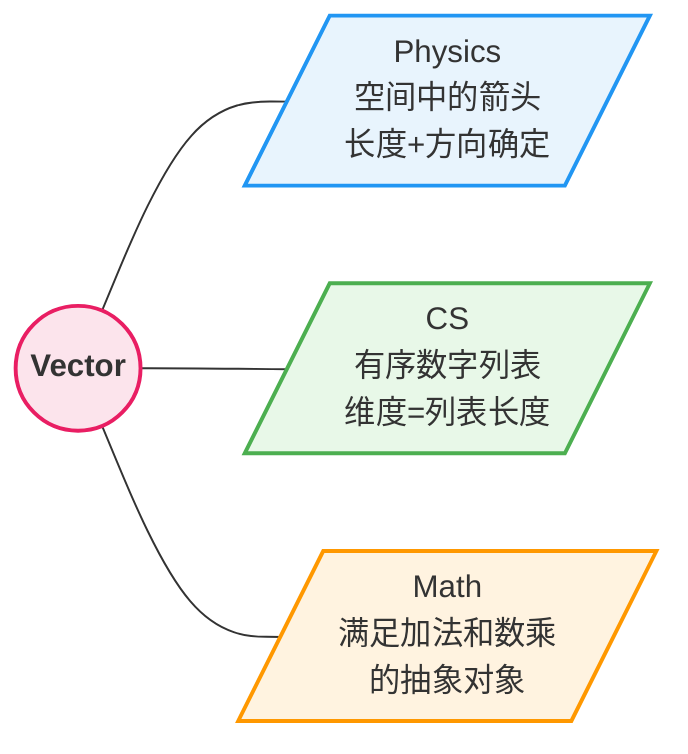

| 视角 | 向量是什么 | 关键特征 |
|------|-----------|---------|
| 物理 | 空间中的箭头 | 长度 + 方向唯一确定，位置无关 |
| CS | 有序数字列表 | 顺序重要，维度 = 列表长度 |
| 数学 | 抽象对象 | 只要定义了合理的加法和数乘即可 |

核心洞察：三种视角统一于 **vector addition** 和 **scalar multiplication** 两个基本运算。

---

### 坐标系：连接几何与数值

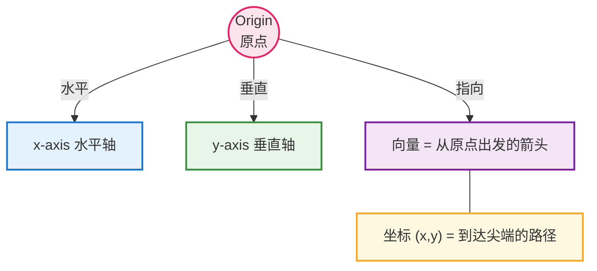

- 坐标 $\begin{bmatrix} x \\ y \end{bmatrix}$：x 为水平位移（右+左−），y 为垂直位移（上+下−）
- 坐标与向量**一一对应**
- 三维扩展：增加 z-axis → $\begin{bmatrix} x \\ y \\ z \end{bmatrix}$

---

### 两大基本运算

#### Vector Addition

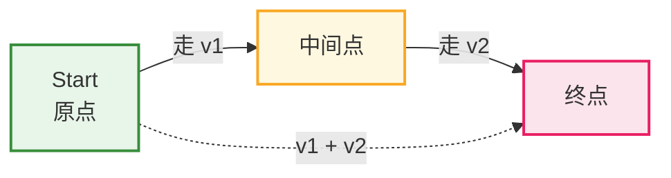

**Tip-to-Tail 法**：将 $\vec{v}_2$ 的尾部接到 $\vec{v}_1$ 的尖端，原点到最终尖端即为和向量。

**直觉**：先走 $\vec{v}_1$，再走 $\vec{v}_2$，总效果 = 走 $\vec{v}_1 + \vec{v}_2$

**计算**：对应分量相加

$$\begin{bmatrix} x_1 \\ y_1 \end{bmatrix} + \begin{bmatrix} x_2 \\ y_2 \end{bmatrix} = \begin{bmatrix} x_1 + x_2 \\ y_1 + y_2 \end{bmatrix}$$

#### Scalar Multiplication

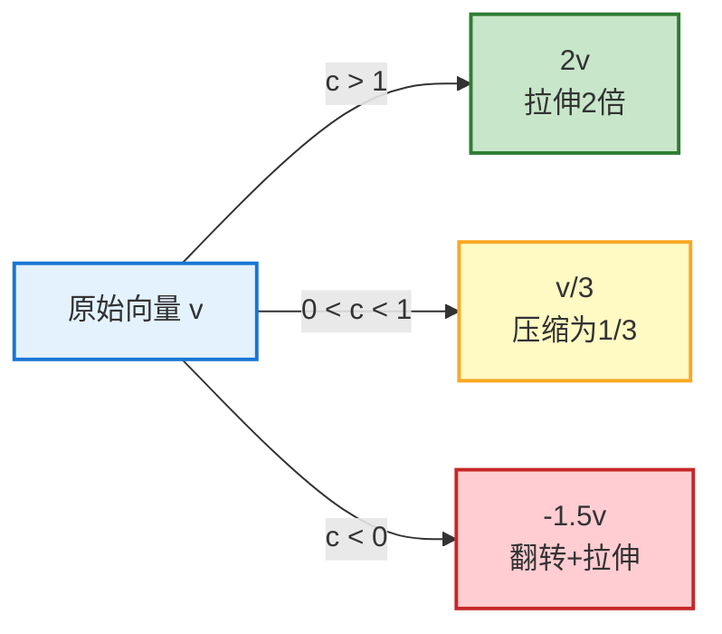

**计算**：每个分量乘以标量

$$c \cdot \begin{bmatrix} x \\ y \end{bmatrix} = \begin{bmatrix} cx \\ cy \end{bmatrix}$$

> Scalar（标量）= 执行缩放的数字。线性代数中 scalar 和 number 常互换使用。

---

### 总结

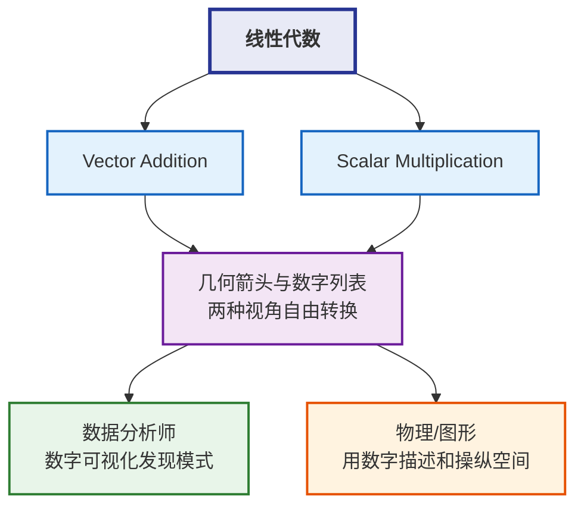

线性代数的威力 = **几何直觉** ↔ **数值计算** 之间的自由切换。

---

*来源：[3Blue1Brown - Vectors, what even are they?](https://www.3blue1brown.com/lessons/vectors)*

## Ch.02 — Linear Combinations, Span, and Basis Vectors

> Mathematics requires a small dose, not of genius, but of an imaginative freedom which, in a larger dose, would be insanity. — Angus K. Rodgers

---

### Basis Vectors

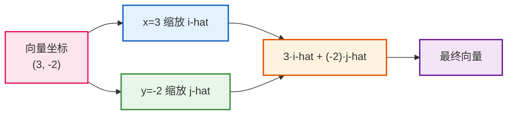

| 符号 | 含义 |
|------|------|
| $\hat{\imath}$ | x 方向单位向量（右方，长度 1） |
| $\hat{\jmath}$ | y 方向单位向量（上方，长度 1） |
| **Basis** | 坐标系中 scalar 实际缩放的对象集合 |

**核心公式**：任意向量 = 坐标分量对基向量的缩放之和

$$\vec{\mathbf{v}} = x\hat{\imath} + y\hat{\jmath}$$

**基的非唯一性**：可选择任意一对合适的向量作为 basis，同一向量在不同 basis 下坐标不同。任何用数字描述向量的方式，都依赖于 basis vectors 的选择。

---

### Linear Combination

**定义**：对向量分别 scalar 缩放后求和

$$a\vec{\mathbf{v}} + b\vec{\mathbf{w}}$$

**"Linear" 的来源**：scalar 遍历所有实数时，乘以某向量产生一条过原点的直线；linear combination 本质是两条直线的组合。

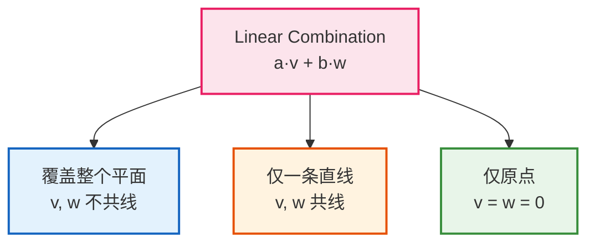

---

### Span

**定义**：一组向量通过 linear combination 所能到达的所有向量的集合。

$$\text{span}(\vec{\mathbf{v}}, \vec{\mathbf{w}}) = \{a\vec{\mathbf{v}} + b\vec{\mathbf{w}} \mid a, b \in \mathbb{R}\}$$

**核心问题**：仅用 vector addition 和 scalar multiplication，能到达哪些向量？

| 维度 | 情形 | Span 结果 |
|------|------|-----------|
| 2D | 两向量不共线 | 整个平面 |
| 2D | 两向量共线 | 一条直线 |
| 3D | 两向量不共线 | 过原点的平面 |
| 3D | 第三向量在平面外 | 整个三维空间 |
| 3D | 第三向量在平面内 | 仍为该平面（冗余） |

**可视化约定**：单个向量用箭头思考；向量集合用点（尖端位置）思考。

---

### Linear Dependence & Independence

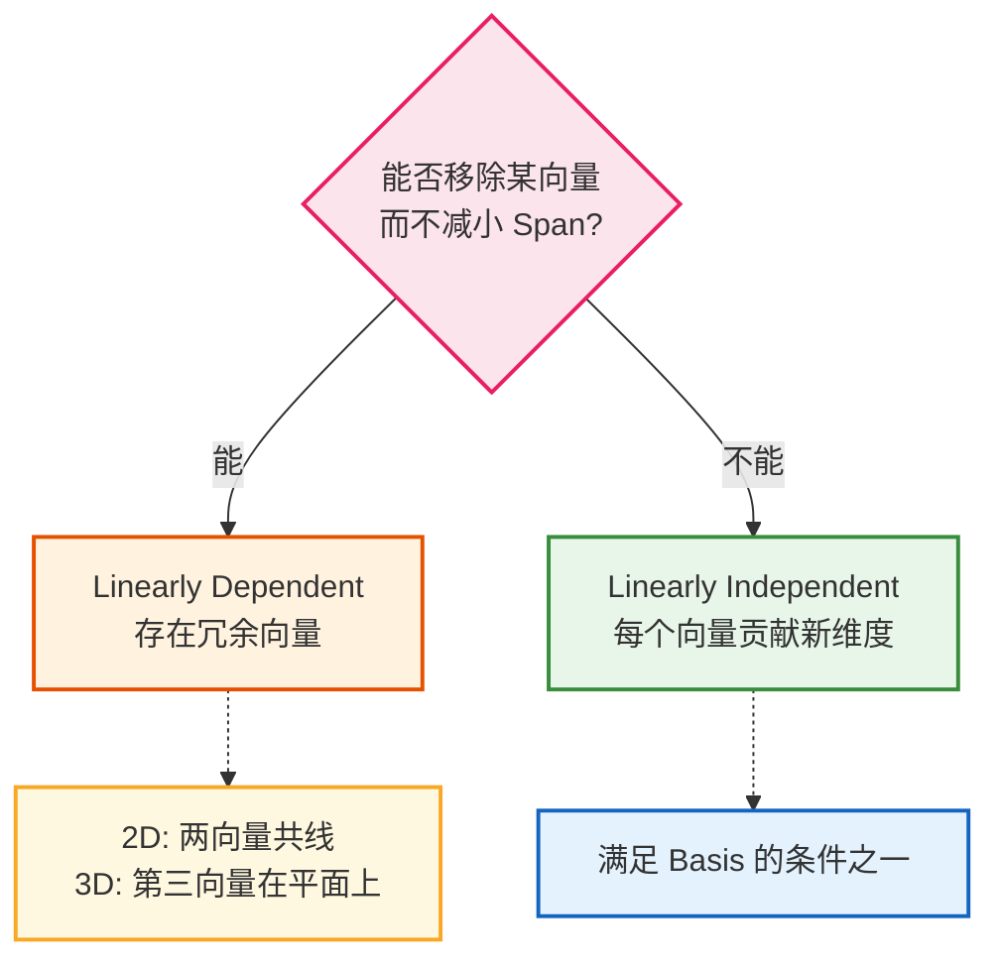

| 性质 | 等价表述 |
|------|----------|
| **Linearly Dependent** | 某向量可表示为其他向量的 linear combination |
| **Linearly Independent** | 没有任何向量可由其他向量线性组合得到 |

---

### Basis 的严格定义

$$\text{Basis} = \text{Linearly Independent} + \text{Span the Space}$$

$\hat{\imath}$、$\hat{\jmath}$ 是 2D basis：不共线（独立）且 span 覆盖整个平面。

---

### 全章脉络总结

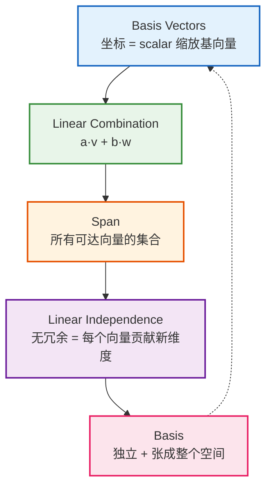

**关键直觉**：坐标本质是缩放 basis → 缩放求和即 linear combination → 所有可达结果构成 span → 无冗余的 span 全空间的向量组即 basis。

---

*来源：[3Blue1Brown - Linear combinations, span, and basis vectors](https://www.3blue1brown.com/lessons/span)*

## Ch.03 — Linear Transformations and Matrices

> 来源：[3Blue1Brown - Linear transformations and matrices](https://www.3blue1brown.com/lessons/linear-transformations)

---

### Linear Transformation 的判定

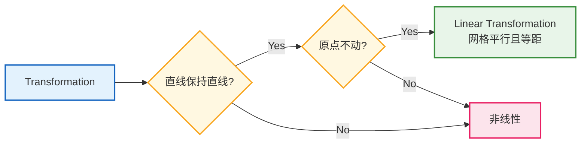

| 视觉条件 | 代数等价 |
|----------|----------|
| 直线保持直线 | Additivity: $L(\vec{u}+\vec{v}) = L(\vec{u})+L(\vec{v})$ |
| 原点不动 | Scaling: $L(c\vec{v}) = cL(\vec{v})$ → $L(\vec{0})=\vec{0}$ |
| 网格平行等距 | 两条性质的几何推论 |

---

### Matrix = 变换的数值描述

**关键洞察：** 只需记录 $\hat{\imath}$、$\hat{\jmath}$ 的落点，其他一切可推导。

$$\vec{v} = x\hat{\imath} + y\hat{\jmath} \implies L(\vec{v}) = x \cdot L(\hat{\imath}) + y \cdot L(\hat{\jmath})$$

**矩阵定义与乘法：**

$$\begin{bmatrix} a & b \\ c & d \end{bmatrix} \begin{bmatrix} x \\ y \end{bmatrix} = x \begin{bmatrix} a \\ c \end{bmatrix} + y \begin{bmatrix} b \\ d \end{bmatrix} = \begin{bmatrix} ax + by \\ cx + dy \end{bmatrix}$$

- **第一列** = $\hat{\imath}$ 的落点，**第二列** = $\hat{\jmath}$ 的落点
- 乘法本质 = 对变换后的 basis vectors 做 linear combination

---

### 典型变换示例

| 变换 | $\hat{\imath}$ 落点 | $\hat{\jmath}$ 落点 | 矩阵 | 效果 |
|------|---------------------|---------------------|-------|------|
| 逆时针旋转 90° | $(0, 1)$ | $(-1, 0)$ | $\begin{bmatrix} 0 & -1 \\ 1 & 0 \end{bmatrix}$ | 所有向量逆时针转 90° |
| Shear（剪切） | $(1, 0)$ | $(1, 1)$ | $\begin{bmatrix} 1 & 1 \\ 0 & 1 \end{bmatrix}$ | $\hat{\imath}$ 不动，$\hat{\jmath}$ 向右倾斜 |
| 列线性相关 | $(a, b)$ | $(ka, kb)$ | 列成比例 | 空间压缩到一条线（降维） |

**验证示例（旋转 90°）：**

$$\begin{bmatrix} 0 & -1 \\ 1 & 0 \end{bmatrix} \begin{bmatrix} 2 \\ 3 \end{bmatrix} = \begin{bmatrix} -3 \\ 2 \end{bmatrix}$$

---

### 从矩阵读变换 / 从变换写矩阵

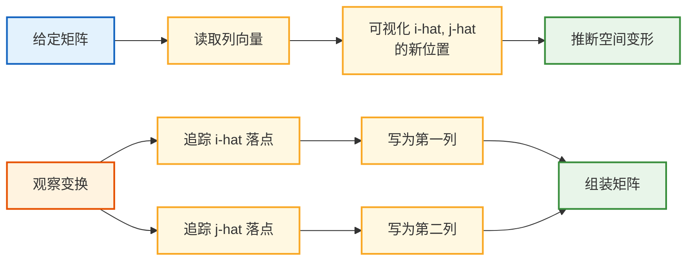

## Ch.04 — Matrix Multiplication as Composition

> 来源：[3Blue1Brown - Matrix multiplication as composition](https://www.3blue1brown.com/lessons/matrix-multiplication)

---

### 核心脉络

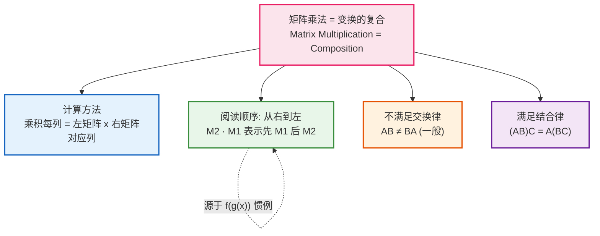

---

### Composition of Transformations

依次应用两个 linear transformation（如先旋转再剪切），整体效果仍是一个 linear transformation，称为 **composition**。

**求 composition 矩阵的方法：** 跟踪基向量经两次变换后的最终落点。

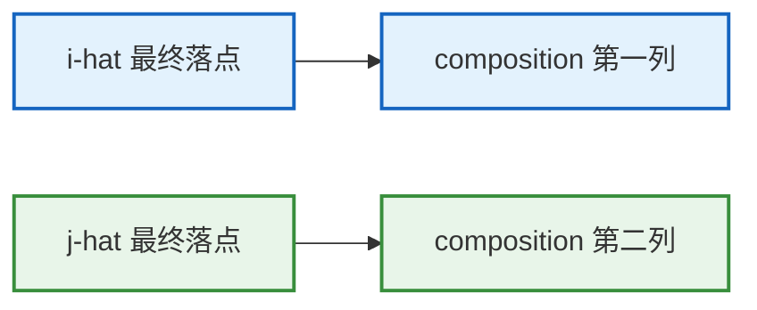

**示例：** 先旋转 $90°$ 再 shear：

$\underbrace{\begin{bmatrix} 1 & 1 \\ 0 & 1 \end{bmatrix}}_{\text{Shear}} \underbrace{\begin{bmatrix} 0 & -1 \\ 1 & 0 \end{bmatrix}}_{\text{Rotation}} = \begin{bmatrix} 1 & -1 \\ 1 & 0 \end{bmatrix}$

---

### 计算方法与一般公式

**计算流程：**

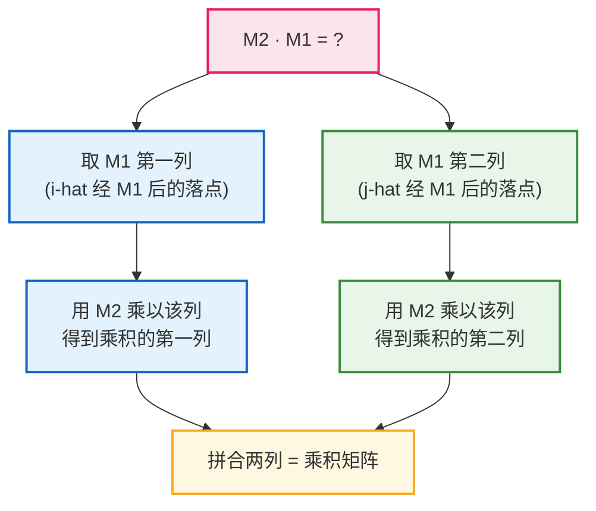

**一般公式（2×2）：**

$$\begin{bmatrix} a & b \\ c & d \end{bmatrix} \begin{bmatrix} e & f \\ g & h \end{bmatrix} = \begin{bmatrix} ae + bg & af + bh \\ ce + dg & cf + dh \end{bmatrix}$$

> 不要死记公式——理解为"左矩阵分别作用于右矩阵的每一列"。

---

### 性质对比

| 性质 | 结论 | 直觉 |
|------|------|------|
| 交换律 | ❌ $AB \neq BA$（一般） | 先 shear 再旋转 ≠ 先旋转再 shear |
| 结合律 | ✅ $(AB)C = A(BC)$ | 都是同一操作序列 C→B→A，仅分组不同 |
| 特殊可交换 | 均匀缩放矩阵与任何矩阵可交换 | 缩放不改变方向关系 |

## Ch.05 — Three-Dimensional Linear Transformations

> 来源：[3Blue1Brown - Three-dimensional linear transformations](https://www.3blue1brown.com/lessons/3d-transformations)

---

### 核心概念

二维 linear transformation 的所有核心思想无缝推广到三维：变换由 basis vectors 的落点决定，用矩阵列记录。

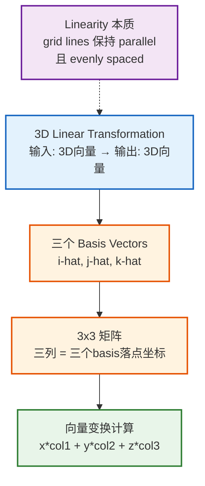

**3×3 矩阵构造：**

$$\begin{bmatrix} | & | & | \\ \hat{\imath}' & \hat{\jmath}' & \hat{k}' \\ | & | & | \end{bmatrix}$$

**向量变换：** 对 $\vec{\mathbf{v}} = \begin{bmatrix} x \\ y \\ z \end{bmatrix}$，变换结果 = $x \cdot \text{col}_1 + y \cdot \text{col}_2 + z \cdot \text{col}_3$

**原理：** 坐标是对 basis vectors 的缩放指令，linearity 保证 scaling-and-adding 在变换前后都成立。

---

### 旋转示例

| 变换 | $\hat{\imath}'$ | $\hat{\jmath}'$ | $\hat{k}'$ | 矩阵 |
|------|:---:|:---:|:---:|:---:|
| 绕 y 轴旋转 90° | $(0,0,-1)^T$ | $(0,1,0)^T$ | $(1,0,0)^T$ | $\begin{bmatrix} 0 & 0 & 1 \\ 0 & 1 & 0 \\ -1 & 0 & 0 \end{bmatrix}$ |
| 绕 z 轴逆时针 90° | $(0,1,0)^T$ | $(-1,0,0)^T$ | $(0,0,1)^T$ | $\begin{bmatrix} 0 & -1 & 0 \\ 1 & 0 & 0 \\ 0 & 0 & 1 \end{bmatrix}$ |

**方法：** 确定旋转轴不动的 basis vector，再用右手定则判断另外两个的落点。

---

### Combining Transformations

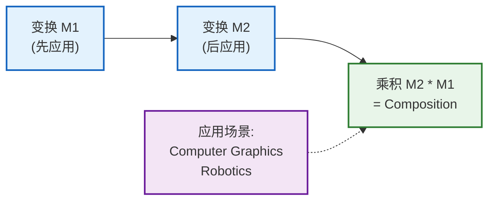

**计算规则：** 乘积矩阵第 $j$ 列 = $M_2 \cdot (M_1 \text{ 的第 } j \text{ 列})$

**实际意义：** 复杂 3D 旋转难以直接描述，但可分解为多个简单变换的 composition。

---

### 跨维度变换

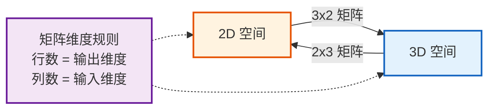

**矩阵乘法兼容条件：** $AB$ 有意义 ⟺ $A$ 的列数 = $B$ 的行数（$B$ 的输出维度 = $A$ 的输入维度）。

