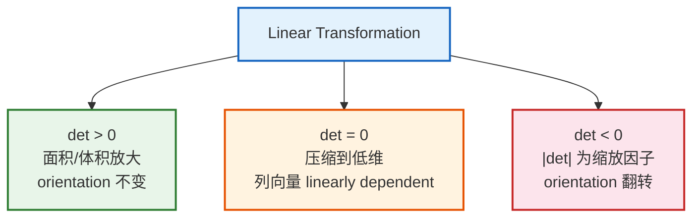
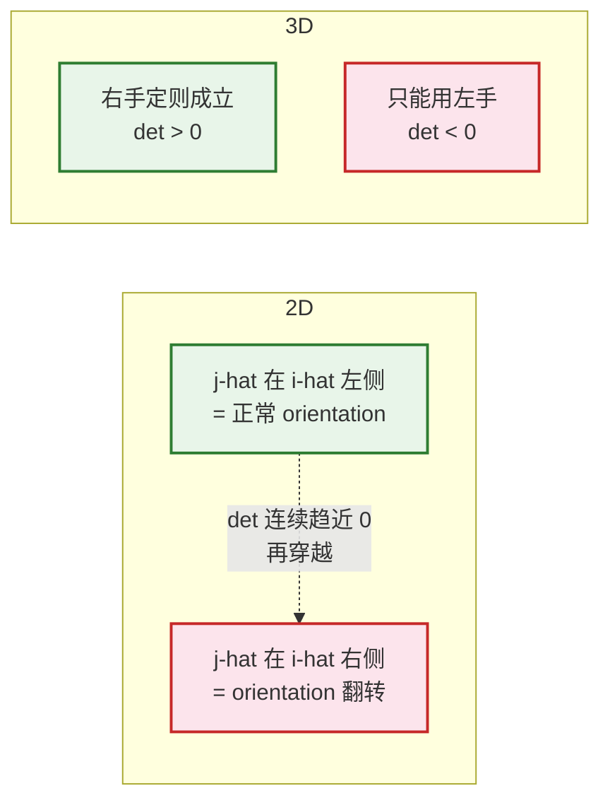
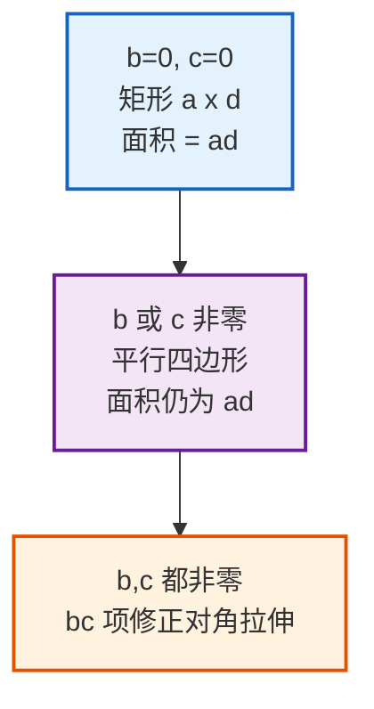
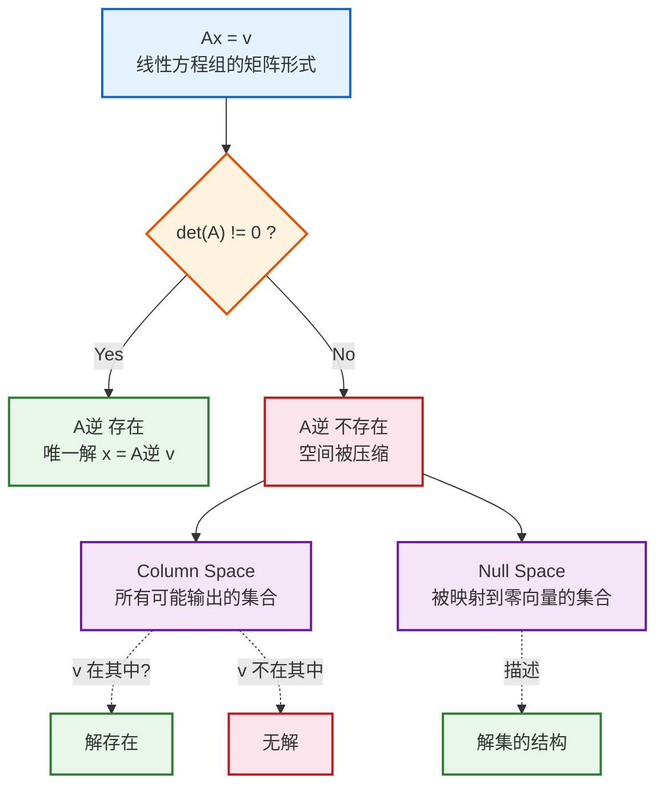
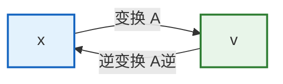
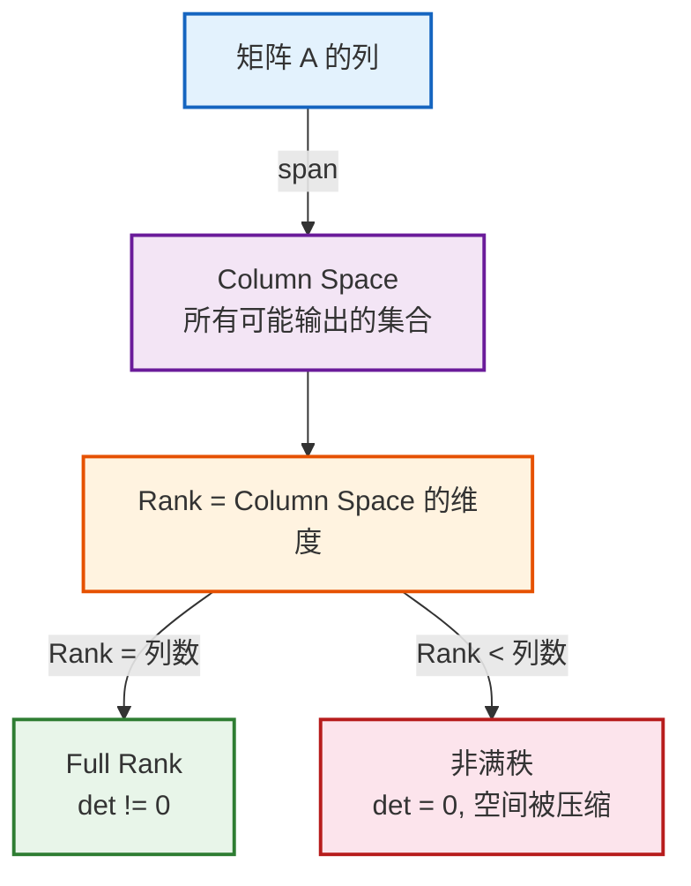
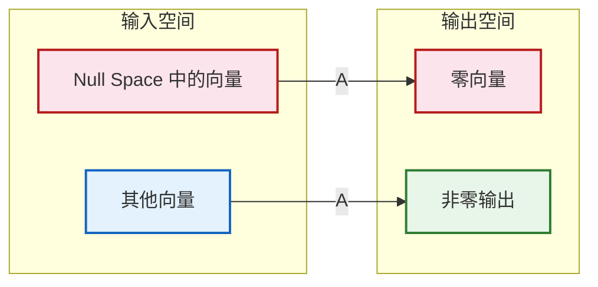
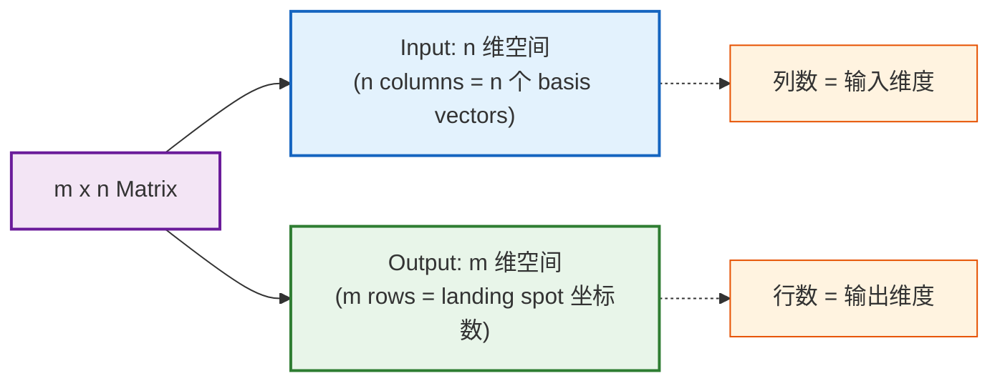
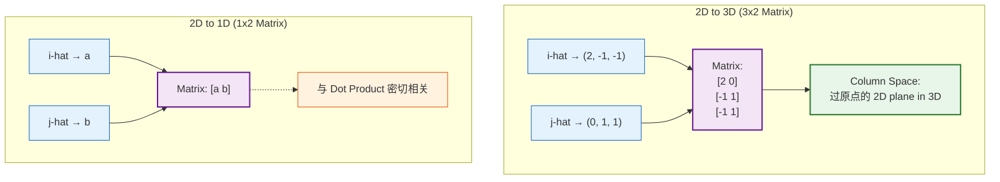

# 3Blue1Brown「线性代数的本质」— 合集（第 06–11 章）

> 说明：本文档由 `ch06`–`ch11` 合并而成，便于集中阅读。数学术语与公式保持英文原文为主。  
> 内容范围：行列式、逆矩阵与 column/null space、非方阵、点积与对偶、叉积及其变换视角。

## 本册目录

- [Ch.06 — The Determinant](#ch06)
- [Ch.07 — Inverse Matrices, Column Space, and Null Space](#ch07)
- [Ch.08 — Nonsquare Matrices as Transformations Between Dimensions](#ch08)
- [Ch.09 — Dot products and duality（点积与对偶）](#ch09)
- [Ch.10 — Cross products（叉积）](#ch10)
- [Ch.11 — Cross products in the light of linear transformations（线性变换视角下的叉积）](#ch11)

---

## Ch.06 — The Determinant

> 来源：[3Blue1Brown - The determinant](https://www.3blue1brown.com/lessons/determinant)

---

### 核心概念

**Determinant = linear transformation 对空间的缩放因子**（2D 为面积，3D 为体积）。

**为什么只看单位正方形/立方体？** grid lines 保持 parallel 且 evenly spaced → 所有区域按相同因子缩放 → 单位区域的缩放因子即全局缩放因子。

---

### Orientation 与负 Determinant

**连续性直觉：** $\hat{\imath}$ 逐渐靠近 $\hat{\jmath}$ → det 趋近 0 → 穿越后 det 自然变负，"负面积"是 orientation 翻转的自然描述。

---

### 计算公式

| 维度 | 公式 |
|------|------|
| 2D | $\det\begin{bmatrix} a & b \\ c & d \end{bmatrix} = ad - bc$ |
| 3D | $a(ei - fh) - b(di - fg) + c(dh - eg)$（沿第一行 cofactor expansion） |

**2D 公式直觉：**

---

### 乘积性质

$$\det(M_1 M_2) = \det(M_1) \cdot \det(M_2)$$

**几何证明：** $M_2$ 先缩放 $\det(M_2)$ 倍 → $M_1$ 再缩放 $\det(M_1)$ 倍 → 总缩放 = 两者之积。

---

### 速查表

| 概念 | 要点 |
|------|------|
| det（2D/3D） | 面积/体积缩放因子 |
| det = 0 | 压缩到低维，列向量 linearly dependent |
| det < 0 | orientation 翻转（2D 左右互换；3D 右手变左手） |
| 乘积 | $\det(M_1 M_2) = \det(M_1) \cdot \det(M_2)$ |
| 核心建议 | 理解几何意义 >> 记住计算公式 |

## Ch.07 — Inverse Matrices, Column Space, and Null Space

> 来源：[3Blue1Brown - Inverse matrices, column space, and null space](https://www.3blue1brown.com/lessons/inverse-matrices)

---

### 核心关系总览

---

### 线性方程组的矩阵形式

将方程组打包为 $A\vec{\mathbf{x}} = \vec{\mathbf{v}}$：

$$\underbrace{\begin{bmatrix} 2 & 5 & 3 \\ 4 & 0 & 8 \\ 1 & 3 & 0 \end{bmatrix}}_{A}
\underbrace{\begin{bmatrix} x \\ y \\ z \end{bmatrix}}_{\vec{\mathbf{x}}}
=
\underbrace{\begin{bmatrix} -3 \\ 0 \\ 2 \end{bmatrix}}_{\vec{\mathbf{v}}}$$

**几何解读**：寻找一个向量 $\vec{\mathbf{x}}$，使其经过变换 $A$ 后落在 $\vec{\mathbf{v}}$ 上。"Linear" 意味着变量只被常数缩放后相加，无指数、无变量乘积。

---

### Inverse Matrix

**前提**：$\det(A) \neq 0$（空间未被压缩）

**核心公式**：

$$A^{-1} A = I \qquad \Rightarrow \qquad \vec{\mathbf{x}} = A^{-1}\vec{\mathbf{v}}$$

**示例**：

| 变换 $A$ | Inverse $A^{-1}$ |
|---|---|
| 逆时针旋转 90° | 顺时针旋转 90° |
| 向右 shear | 向左 shear |
| 旋转 180° | 自身（对合变换） |

**几何意义**：将变换倒放，跟踪 $\vec{\mathbf{v}}$ 回到起点即为 $\vec{\mathbf{x}}$。

---

### Irreversibility（不可逆）

**当 $\det(A) = 0$**：空间被压缩到更低维度，无法"展开"回去（一个输出对应无穷多输入，不构成函数）。

**但解可能仍存在**：若 $\vec{\mathbf{v}}$ 恰好落在变换的输出空间（column space）上，方程仍有解。

---

### Column Space 与 Rank

| 矩阵大小 | Rank | 输出维度 | 含义 |
|---|---|---|---|
| 3×3 | 3 | 整个 3D 空间 | Full rank，无压缩 |
| 3×3 | 2 | 一个平面 | 部分压缩 |
| 3×3 | 1 | 一条线 | 严重压缩 |

**Column Space** = 变换后 basis vectors 的 span = 矩阵所有可能输出的集合。

---

### Null Space（Kernel）

> 所有被变换映射到 $\vec{\mathbf{0}}$ 的向量集合。

| 变换类型 | Null Space |
|---|---|
| Full rank | 仅零向量 |
| 3D → 平面 | 一条线 |
| 3D → 线 | 一个平面 |

**与方程组的关系**：Null space 给出 $A\vec{\mathbf{x}} = \vec{\mathbf{0}}$ 的所有解。

---

### 关键要点速查

| 概念 | 核心要点 |
|------|------|
| $A\vec{\mathbf{x}} = \vec{\mathbf{v}}$ | 寻找经变换 $A$ 后落在 $\vec{\mathbf{v}}$ 上的向量 |
| $\det(A) \neq 0$ | Inverse 存在，唯一解 $\vec{\mathbf{x}} = A^{-1}\vec{\mathbf{v}}$ |
| $\det(A) = 0$ | Inverse 不存在，空间被压缩 |
| Rank | Column space 的维度；Full rank ↔ $\det \neq 0$ |
| Column Space | span of columns = 所有可能输出 |
| Null Space | 被映射到 $\vec{\mathbf{0}}$ 的向量集合 = $A\vec{\mathbf{x}}=\vec{\mathbf{0}}$ 的解集 |
| 求解策略 | $\det \neq 0$ → inverse；$\det = 0$ → column space 判存在性，null space 描述解集 |

## Ch.08 — Nonsquare Matrices as Transformations Between Dimensions

> 来源：[3Blue1Brown - Nonsquare matrices as transformations between dimensions](https://www.3blue1brown.com/lessons/nonsquare-matrices)

---

### 核心概念

Nonsquare matrices 表示**不同维度之间**的 linear transformations。编码方式不变：columns 记录每个 basis vector 的 landing spot。

线性变换条件不变：grid lines 保持 parallel 且 evenly spaced，origin 映射到 origin。

---

### 维度映射示例

| Matrix 尺寸 | 映射方向 | Column Space | Full Rank 条件 |
|---|---|---|---|
| 3×2 | 2D → 3D | 3D 中过原点的 2D plane | dim(column space) = 2 |
| 2×3 | 3D → 2D | 2D 中的子空间 | dim(column space) = 2 |
| 1×2 | 2D → 1D (number line) | 一条数轴 | dim(column space) = 1 |

---

### 2D → 1D 的线性性判定

普通变换中 grid lines 平行等距的条件，在压缩到 number line 时等价于：

> 一组 evenly spaced dots 组成的线，映射后仍保持 evenly spaced。

---

### 要点速记

- $m \times n$ matrix：$n$ 维 → $m$ 维的 linear transformation
- 编码方式统一：columns = basis vectors 的 landing spots
- Matrix multiplication、linear systems 概念同样适用于跨维度变换
- 1×n matrix（高维→一维）本质是 dot product

## Ch.09 — Dot products and duality（点积与对偶）

> 来源：[3Blue1Brown — Dot products and duality](https://www.3blue1brown.com/lessons/dot-products/)（Chapter 9）  
> 说明：数学符号与术语保留英文原文。

### 目录（对应原文结构）

1. [Numerical Method](#numerical-method)
2. [Geometric Interpretation](#geometric-interpretation)
   - [Order Doesn't Matter](#order-doesnt-matter)
3. [Linear transformations](#linear-transformations)
   - [Unit Vector](#unit-vector)
4. [Duality](#duality)
5. [Conclusion](#conclusion)

---

### Numerical Method

- **定义**：两个同维向量做 **dot product**，就是把对应分量两两相乘再全部相加。
- **要点**：这是课程里“标准入门”写法；作者刻意把点积放到线性变换之后再讲，是为了后面能讲清 **duality**。

### Geometric Interpretation

- **几何意义**：$\mathbf{v} \cdot \mathbf{w}$ 可以理解为：把 $\mathbf{w}$ **投影**到过原点、沿 $\mathbf{v}$ 方向的直线上，再乘以 $\|\mathbf{v}\|$。
- **符号**：投影与 $\mathbf{v}$ **反向**时点积为负；同向为正；垂直时投影为零，故点积为零。
- **直观**：点积大小反映两向量“指向有多一致”。

#### Order Doesn't Matter

- **对称性**：虽然几何叙述看似“不对称”（先投影哪一个），但 $\mathbf{v} \cdot \mathbf{w} = \mathbf{w} \cdot \mathbf{v}$；可用等长时的对称性，再对某一向量缩放论证缩放对两种读法的影响一致。
- **遗留问题**：为何“分量相乘再相加”会与投影这种几何过程一致？答案在 **duality**。

### Linear transformations

- **多维到一维**：讨论 $\mathbb{R}^2 \to \mathbb{R}$（数轴）的 **linear transformation**。
- **视觉判据**：把输入空间里一条等距点列变换到数轴上，像仍等距，则（在该直观框架下）可视为线性。
- **矩阵形式**：输出是一维，故变换矩阵是 **$1 \times 2$**；由 $\hat{\imath}, \hat{\jmath}$ 的像（两个数）作为列（此处即一行里的两个元素）完全决定变换。
- **与点积同构**：$1 \times 2$ 矩阵乘二维列向量，在**数值运算**上与把矩阵“立起来”当成向量做 **dot product** 一致——由此埋下“向量 $\leftrightarrow$ 到数轴的线性映射”的伏笔。

#### Unit Vector

- **单位向量 $\hat{\mathbf{u}}$**：把数轴斜嵌入平面，使数 $1$ 落在 $\hat{\mathbf{u}}$ 尖端；向该数轴投影定义了一个 $\mathbb{R}^2 \to \mathbb{R}$ 的线性函数。
- **矩阵即 $\hat{\mathbf{u}}$ 的分量**：$\hat{\imath}, \hat{\jmath}$ 在该投影下的像，分别等于 $\hat{\mathbf{u}}$ 的 $x,y$ 分量（对称性论证）。
- **推广**：与任意向量（非单位）做点积 = 先投影到其方向，再按其长度缩放。

### Duality

- **核心命题**：任意 $\mathbb{R}^n \to \mathbb{R}$ 的 **linear transformation**，都存在唯一的向量 $\mathbf{v}$，使得  
  $L(\mathbf{w}) = \mathbf{v} \cdot \mathbf{w}$（对一切 $\mathbf{w}$）。  
  这就是（本课语境下的）**duality**：向量与“到一维的线性映射”之间自然但深刻的对应。
- **读法**：有时把向量看成箭头更直观；有时把它看成“某个线性泛函的坐标表示”更好想（例如 multivariable calculus 里的 **gradient**）。

### Conclusion

- **表层**：点积用于投影、判断大致同向/反向/垂直。
- **深层**：两向量点积，是把其中一个嵌入“线性变换到数轴”的语言；**dual** 视角下，向量可视为变换的化身。

## Ch.10 — Cross products（叉积）

> 来源：[3Blue1Brown — Cross products](https://www.3blue1brown.com/lessons/cross-products)（Chapter 10）  
> 说明：数学符号与术语保留英文原文。

### 目录（对应原文结构）

1. [Two dimensions](#two-dimensions)
2. [Compute with determinant](#compute-with-determinant)
   - [Determinant example](#determinant-example)
3. [Properties](#properties)
4. [Standard 3d View](#standard-3d-view)
5. [Computing](#computing)

---

### Two dimensions

- **平行四边形**：由 $\vec{\mathbf{v}}, \vec{\mathbf{w}}$ 张成的平行四边形。
- **二维“叉积”数值**：取其**有向面积**——$\vec{\mathbf{w}}$ 相对 $\vec{\mathbf{v}}$ 为逆时针则 $\vec{\mathbf{v}} \times \vec{\mathbf{w}}$ 为正（等于面积）；顺时针则为负（面积的相反数）。
- **反交换**：$\vec{\mathbf{v}} \times \vec{\mathbf{w}} = -\vec{\mathbf{w}} \times \vec{\mathbf{v}}$。
- **定向记忆**：$\hat{\imath} \times \hat{\jmath}$ 为正，与基的顺序所定义的 **orientation** 一致。

### Compute with determinant

- **算法**：把 $\vec{\mathbf{v}}, \vec{\mathbf{w}}$ 的坐标作为 $2 \times 2$ 矩阵两列，取 **determinant**，即二维叉积（标量）。
- **与线性变换联系**：列向量为 $\vec{\mathbf{v}}, \vec{\mathbf{w}}$ 的矩阵把单位正方形变为该平行四边形；**determinant** 给出面积缩放因子及定向是否翻转。

#### Determinant example

- **例题思路**：算出 $|\det|$ 得面积大小；由两向量相对旋转方向决定符号。

### Properties

- **接近垂直**：两边更接近垂直时平行四边形面积更大，叉积绝对值更大。
- **齐次性**：$(c\vec{\mathbf{v}}) \times \vec{\mathbf{w}} = c(\vec{\mathbf{v}} \times \vec{\mathbf{w}})$（对 $\vec{\mathbf{w}}$ 同理）。

### Standard 3d View

- **真·三维叉积**：两向量 $\in \mathbb{R}^3$，结果为新 **3d vector**。
- **长度**：等于两向量张成平行四边形的 **area**。
- **方向**：垂直于该平行四边形所在平面；用 **right-hand rule** 在两种法向中选定向量：食指 $\vec{\mathbf{v}}$，中指 $\vec{\mathbf{w}}$，拇指为 $\vec{\mathbf{v}} \times \vec{\mathbf{w}}$。

### Computing

- **分量公式**：可按 $v_2 w_3 - v_3 w_2$ 等三项记忆。
- **determinant 记法**：写 $3 \times 3$ 矩阵，第一列为 $\hat{\imath}, \hat{\jmath}, \hat{k}$，后两列为 $\vec{\mathbf{v}}, \vec{\mathbf{w}}$，对第一列形式展开 **determinant**；课堂常称“记号技巧”，下一章用 **duality** 解释其必然性。

## Ch.11 — Cross products in the light of linear transformations（线性变换视角下的叉积）

> 来源：[3Blue1Brown — Cross products in the light of linear transformations](https://www.3blue1brown.com/lessons/cross-products-extended)（Chapter 11）  
> 说明：数学符号与术语保留英文原文。

### 目录（对应原文结构）

1. [Under the light of transformations](#under-the-light-of-transformations)
2. [The idea](#the-idea)
3. [Conclusion](#conclusion)
4. [Practice](#practice)

---

### Under the light of transformations

- **回顾 duality**：任意 **linear transformation** 从某空间到数轴（$\mathbb{R}$），都对应空间中唯一向量 **dual vector**，使得“做变换”等于“与该向量 **dot product**”。
- **记号**：到一维的变换用 **$1 \times n$** 矩阵表示；与向量点积在数值上等价。

### The idea

- **构造**：固定 $\vec{\mathbf{v}}, \vec{\mathbf{w}}$，把 $\vec{\mathbf{u}}$ 视为变量，定义  
  $L(\vec{\mathbf{u}}) = \det[\vec{\mathbf{u}} \mid \vec{\mathbf{v}} \mid \vec{\mathbf{w}}]$（列向量拼成的 $3 \times 3$ 行列式）。  
  几何上：有向 **volume** of **parallelepiped** 由 $\vec{\mathbf{u}}, \vec{\mathbf{v}}, \vec{\mathbf{w}}$ 张成。
- **线性性**：$L$ 是 $\mathbb{R}^3 \to \mathbb{R}$ 的 **linear transformation**。
- **对偶向量 $\vec{\mathbf{p}}$**：存在唯一 $\vec{\mathbf{p}}$ 使 $\vec{\mathbf{p}} \cdot \vec{\mathbf{u}} = L(\vec{\mathbf{u}})$ 恒成立。
- **代数**：把 $\det$ 按第一列展开，系数恰为叉积分量形式；把 $\hat{\imath},\hat{\jmath},\hat{k}$ 放进第一列只是把这些系数**打包成向量**的记号。
- **几何**：$\vec{\mathbf{p}} \cdot \vec{\mathbf{u}}$ = 将 $\vec{\mathbf{u}}$ 投影到垂直于 $\vec{\mathbf{v}},\vec{\mathbf{w}}$ 的直线上，再乘以 $\vec{\mathbf{v}},\vec{\mathbf{w}}$ 张成平行四边形 **area**；定向与 **right-hand rule** 一致。故 $\vec{\mathbf{p}} = \vec{\mathbf{v}} \times \vec{\mathbf{w}}$。

### Conclusion

- **同一对象两读法**：计算上 = 含基向量的 **determinant** 展开；几何上 = 垂直于两向量、模长为面积、满足右手法则的向量。
- **本质**：叉积向量是该“体积泛函”的 **dual vector**。

### Practice

- 原文含图示判断 **right-hand rule** 与数值练习；复习时可自算 $\vec{\mathbf{v}} \times \vec{\mathbf{w}}$ 与几何结论对照。

