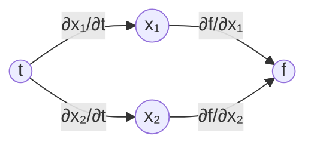
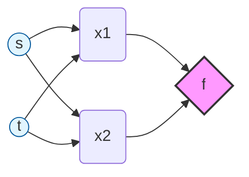

# Vector Calculus(向量微积分)

## 5.1 一元函数的微分

> **定义 5.2 （导数）**

对正实数 $h > 0$，函数 $f$ 在 $x$ 处的导数由下面的极限定义：
$$
\frac{\mathrm{d}f}{\mathrm{d}x} := \lim_{h \to 0} \frac{f(x + h) - f(x)}{h} \tag{5.4}
$$

对应到图 5.3 中，割线将变为切线。$f$ 的导数时刻指向 $f$ 提升最快的方向。

### 5.1.1 Taylor 级数

所谓 Taylor 级数是将函数 $f$ 表示成的那个无限项求和式，其中的所有的项都和 $f$ 在点 $x_{0}$ 处的导数相关。

> **定义 5.3（Taylor 多项式）**

函数 $f: \mathbb{R} \rightarrow \mathbb{R}$ 在点 $x_{0}$ 的 $n$ 阶 Taylor 多项式是 
$$
T_n(x) := \sum_{k=0}^{n} \frac{f^{(k)}(x_0)}{k!} (x - x_0)^k, \tag{5.7}
$$

其中 
- $f^{(k)}(x_{0})$ 是 $f$ 在 $x_{0}$ 处的 $k$ 阶导数（假设其存在）
- 而 $\displaystyle \frac{f^{(k)}(x_{0})}{k!}$ 是多项式各项的系数。

对于所有的 $t \in \mathbb{R}$ 我们约定 $t^{0} := 1$

----

> **定义 5.4（Taylor 级数）**

对于光滑函数 $f \in \mathcal{C}^{\infty}, f: \mathbb{R}\rightarrow \mathbb{R}$，它在点 $x_{0}$ 处的 Taylor 级数定义为
$$
T_\infty(x) = \sum_{k=0}^{\infty} \frac{f^{(k)}(x_0)}{k!} (x - x_0)^k. \tag{5.8}
$$

- 若 $x_{0} = 0$，我们得到了一个 Taylor 级数的特殊情况 —— Maclaurin 级数。
- 如果 $f(x) = T_{\infty}(x)$，则我们称 $f$ 是**解析函数**。

---

> 注：一般而言，某个不一定为多项式函数的 $n$ 阶 Taylor 多项式是这个函数的近似，它在 $x_{0}$ 的邻域中与 $f$ 接近。事实上，对于阶数为 $k \leqslant n$ 的多项式函数 $f$，$n$ 阶 Taylor 多项式就是这个多项式函数本身，因为对所有的 $i > k$，多项式函数 $f$ 的 $i$ 阶导数 $f^{(i)}$ 均为零。

### 5.1.2 微分法则

下面我们简要介绍基本的微分法则，其中我们使用 $f'$ 表示 $f$ 的导数。
$$
\begin{align}
\text{乘法法则:}\quad & [f(x)g(x)]' = f'(x)g(x) + f(x)g'(x) \tag{5.29}\\[0.2em]
\text{除法法则:}\quad & \left[ \frac{f(x)}{g(x)} \right]' = \frac{f'(x)g(x)-f(x)g'(x)}{\big[ g(x) \big]^{2}}\tag{5.30}\\[0.2em]
\text{加法法则:}\quad & [f(x) + g(x)]' = f'(x) + g'(x) \tag{5.31}\\[0.2em]
\text{链式法则:}\quad & \Big( g\big[ f(x) \big] \Big)' = (g \circ f)'(x) = g'\big[f(x)\big]f'(x)\tag{5.32}
\end{align}
$$

其中 $g \circ f$ 表示函数的复合：$x \mapsto f(x) \mapsto g\big[f(x)\big]$。

## 5.2 偏导数和梯度

> **定义 5.5（偏导数）**

给定 $n$ 元函数 $f: \mathbb{R}^{n} \rightarrow \mathbb{R}$，$\boldsymbol{x} \mapsto f(\boldsymbol{x}), \boldsymbol{x} \in \mathbb{R}^{n}$，它的各偏导数为
$$
\begin{align}\frac{ \partial f }{ \partial x_{1} } &= \lim_{ h \to 0 } \frac{f(x_{1}+h, x_{2}, \dots, x_{n}) - f(\boldsymbol{x})}{h}\\&\,\,\, \vdots\\\frac{ \partial f }{ \partial x_{n} } &= \lim_{ h \to 0 } \frac{f(x_{1}, \dots, x_{n-1}, x_{n}+h) - f(\boldsymbol{x})}{h}\end{align}\tag{5.39}
$$

然后将各偏导数组合为向量，就得到了梯度向量
$$
\nabla_{x}f = \text{grad} f = \frac{\mathrm{d}f}{\mathrm{d}\boldsymbol{x}} = \left[ \frac{ \partial f(\boldsymbol{x}) }{ \partial x_{1} }, \frac{ \partial f(\boldsymbol{x}) }{ \partial x_{2} }, \dots, \frac{ \partial f(\boldsymbol{x}) }{ \partial x_{n} } \right] \in \mathbb{R}^{1 \times n}, \tag{5.40}
$$

其中 
- $n$ 是变元数，$1$ 是 $f$ 像集（陪域）的维数。
- 我们在此定义列向量 $\boldsymbol{x} = [x_{1}, \dots, x_{n}]^{\top} \in \mathbb{R}^{n}$。
- 行向量 $(5.40)$ 称为 $f$ 的**梯度**或者**Jacobi 矩阵**，是 5.1 节中的导数的推广。

### 5.2.1 偏导数的基本法则

下面是一般的加法、乘法、和链式法则：

$$
\begin{align}
\text{Product rule:}~&~\frac{ \partial  }{ \partial \boldsymbol{x} } \big[ f(\boldsymbol{x})g(\boldsymbol{x}) \big] = \frac{ \partial f }{ \partial \boldsymbol{x} }g(\boldsymbol{x}) + f(\boldsymbol{x})\frac{ \partial g }{ \partial \boldsymbol{x} } \tag{5.46}\\
\text{Sum rule:}~&~\frac{ \partial  }{ \partial \boldsymbol{ x }  } \big[ f(\boldsymbol{x}) + g(\boldsymbol{x})\big] = \frac{ \partial f }{ \partial \boldsymbol{ x }  } + \frac{ \partial g }{ \partial \boldsymbol{ x }  } \tag{5.47}\\
\text{Chain rule:}~&~\frac{ \partial  }{ \partial \boldsymbol{ x }  } (g \circ f)(x) = \frac{ \partial  }{ \partial \boldsymbol{ x }  } g\big[ f(\boldsymbol{ x } ) \big] = \frac{ \partial g }{ \partial f } \frac{ \partial f }{ \partial \boldsymbol{ x }  } \tag{5.48} 
\end{align}
$$

其中 $g \circ f$ 表示函数的复合：$x \mapsto f(x) \mapsto g\big[f(x)\big]$。

### 5.2.2 链式法则（chain rule）

考虑变元为 $x_{1}, x_{2}$ 函数 $f: \mathbb{R}^{2} \rightarrow \mathbb{R}$，而 $x_{1}(t)$ 和 $x_{2}(t)$ 又是变元 $t$ 的函数。为了计算 $f$ 对 $t$ 的梯度，需要用到链式法则 $(5.48)$：

$$
\frac{\mathrm{d}f}{\mathrm{d}t} = \frac{\mathrm{d}f}{\mathrm{d}\boldsymbol{x}} \frac{\mathrm{d}\boldsymbol{x}}{\mathrm{d}t} =  \begin{bmatrix}
\displaystyle \frac{ \partial f }{ \partial x_{1} } & \displaystyle \frac{ \partial f }{ \partial x_{2} }  
\end{bmatrix} \begin{bmatrix}
\displaystyle \frac{ \partial x_{1}(t) }{ \partial t }\\
\displaystyle \frac{ \partial x_{2}(t) }{ \partial t }\\
\end{bmatrix} = \frac{ \partial f }{ \partial x_{1} } \frac{ \partial x_{1} }{ \partial t }  + \frac{ \partial f }{ \partial x_{2} } \frac{ \partial x_{2} }{ \partial t },\tag{5.49} 
$$
其中 $\mathrm{d}$ 表示梯度，而 $\partial$ 表示偏导数。

对应的计算图如下，从输入 $t$ 出发，经过中间变量 $x_1, x_2$ 到达输出 $f$，每条边上标注了对应的偏导数：

沿两条路径将偏导数相乘再求和，即得到全导数：$\displaystyle\frac{\mathrm{d}f}{\mathrm{d}t} = \frac{\partial f}{\partial x_1}\frac{\partial x_1}{\partial t} + \frac{\partial f}{\partial x_2}\frac{\partial x_2}{\partial t}$

> **示例 5.8**
> 考虑函数 $f(x_{1}, x_{2}) = x_{1}^{2} + 2x_{2}$，其中 $x_{1} = \sin t$，$x_{2} = \cos t$，则 
> 
> $$
> \begin{align}\frac{\mathrm{d}f}{\mathrm{d}t} &= \frac{ \partial f }{ \partial x_{1} } \frac{ \partial x_{1} }{ \partial t } + \frac{ \partial f }{ \partial x_{2} } \frac{ \partial x_{2} }{ \partial t } \tag{5.50a}\\&= 2\sin t \frac{ \partial \sin t }{ \partial t } + 2 \frac{ \partial \cos t }{ \partial t } \tag{5.50b}\\&= 2\sin t \cos t - 2\sin t = 2\sin t(\cos t-1)\tag{5.50c}\end{align}
> $$
> 
> 就是 $f$ 关于 $t$ 的梯度。

如果 $f(x_{1}, x_{2})$ 是 $x_{1}$ 和 $x_{2}$ 的函数，而 $x_{1}(s, t)$ 和 $x_{2}(s,t)$ 又分别为 $s$ 和 $t$ 的函数，那么根据链式法则会得到下面的结果：

$$
\begin{align}
\frac{ \partial f }{ \partial {\color{orange} s }  } &= \frac{ \partial f }{ \partial {\color{blue} x_{1} }  } \frac{ \partial {\color{blue} x_{1} }  }{ \partial {\color{orange} s }  }  + \frac{ \partial f }{ \partial {\color{blue} x_{2} }  } \frac{ \partial {\color{blue} x_{2} }  }{ \partial {\color{orange} s }  } \tag{5.51}\\
\frac{ \partial f }{ \partial {\color{orange} t }  } &= \frac{ \partial f }{ \partial {\color{blue} x_{1} }  } \frac{ \partial {\color{blue} x_{1} }  }{ \partial {\color{orange} t }  }  + \frac{ \partial f }{ \partial {\color{blue} x_{2} }  } \frac{ \partial {\color{blue} x_{2} }  }{ \partial {\color{orange} t }  } \tag{5.52}
\end{align}
$$

对应的计算图如下，从输入 $s, t$ 出发，经过中间变量 $x_1, x_2$ 到达输出 $f$：

例如计算 $\partial f / \partial s$ 时，从 $s$ 到 $f$ 有两条路径：$s \to x_1 \to f$ 和 $s \to x_2 \to f$，将每条路径上的偏导数相乘再求和，即得到公式 $(5.51)$；对 $t$ 同理可得 $(5.52)$。

而函数的梯度为
$$
\frac{\mathrm{d}f}{\mathrm{d}(s,t)} = \frac{ \partial f }{ \partial \boldsymbol{ x }  } \frac{ \partial \boldsymbol{ x }  }{ \partial (s,t) } = \underbrace{ \begin{bmatrix}
\displaystyle \frac{ \partial f }{\color{blue} \partial x_{1} } &
\displaystyle \frac{ \partial f }{\color{orange} \partial x_{2} } 
\end{bmatrix} }_{ \displaystyle =\frac{ \partial f }{ \partial \boldsymbol{ x }  }  } \underbrace{ \begin{bmatrix}
\displaystyle {\color{blue} \frac{ \partial x_{1} }{ \partial s }  } & 
\displaystyle {\color{blue} \frac{ \partial x_{1} }{ \partial t }  } \\
\displaystyle {\color{orange} \frac{ \partial x_{2} }{ \partial s }  } & 
\displaystyle {\color{orange} \frac{ \partial x_{2} }{ \partial t }  } \\
\end{bmatrix} }_{ \displaystyle =\frac{ \partial \boldsymbol{x} }{ \partial (s,t) }  }.\tag{5.53}
$$

以上的写法 $(5.53)$ 当且仅当梯度被写为行向量时才是正确的，否则我们需要对结果进行转置，以保证矩阵的维度对应。在梯度为向量或矩阵时这样看来似乎比较显然，但当之后讨论中涉及的梯度变成 **张量（tensor）** 时对其进行转置就不那么容易了。

## 5.3 向量值函数的梯度

一直以来我们讨论的都是实值函数 $f : \mathbb{R}^{n} \rightarrow \mathbb{R}$ 的偏导数和梯度，接下来我们将将此概念扩展至向量值函数（向量场）$\boldsymbol{f}: \mathbb{R}^{n} \rightarrow \mathbb{R}^{m}$ 的情形，其中 $n \geqslant 1, m \geqslant 1$。

给定向量值函数 $\boldsymbol{f}: \mathbb{R}^{n} \rightarrow \mathbb{R}^{m}$ 和向量 $\boldsymbol{x} = [x_{1}, \dots, x_{n}]^{\top}\in \mathbb{R}^{n}$，则该函数的函数值可以写为

$$
\boldsymbol{f}(\boldsymbol{x}) = \begin{bmatrix}
f_{1}(\boldsymbol{x})\\
\vdots\\
f_{m}(\boldsymbol{x})\\
\end{bmatrix} \in \mathbb{R}^{m}.\tag{5.54}
$$

这样写可以让我们将向量值函数 $\boldsymbol{f}: \mathbb{R}^{n} \rightarrow \mathbb{R}^{m}$ 看成一个全部由实值函数 $f_{i}: \mathbb{R}^{n} \rightarrow \mathbb{R}$  构成的向量 $[f_{1}, \dots, f_{m}]^{\top}$，而对于每一个 $f_{i}$ 我们可以不加修改的直接应用 5.2 节中的所有微分法则。这样一来，向量值函数对变元 $x_{i} \in \mathbb{R}, i=1, \dots, n$ 的偏导数由下式给出

$$
\frac{ \partial \boldsymbol{f} }{ \partial x_{i} } = \begin{bmatrix}
\displaystyle \frac{ \partial f_{1} }{ \partial x_{i} } \\
\vdots\\
\displaystyle \frac{ \partial f_{m} }{ \partial x_{i} } 
\end{bmatrix} = \begin{bmatrix}
\displaystyle \lim_{ h \to 0 } \frac{f_{1}(x_{1}, \dots, x_{i-1}, x_{i}+h, x_{i+1}, x_{n}) - f_{1}(\boldsymbol{x})}{h}\\
\vdots\\
\displaystyle \lim_{ h \to 0 } \frac{f_{m}(x_{1}, \dots, x_{i-1}, x_{i}+h, x_{i+1}, x_{n}) - f_{m}(\boldsymbol{x})}{h}\\
\end{bmatrix} \in \mathbb{R}^{m}\tag{5.55}
$$

从 $(5.40)$ 中我们了解到函数 $\boldsymbol{f}$ 对向量求导得到的是由一系列偏导数组合得到的行向量。在 $(5.55)$ 中，每个偏导数 $\displaystyle \frac{ \partial \boldsymbol{f}(\boldsymbol{x}) }{ \partial x_{i} }$ 自己就是一个列向量，于是我们可以将它们组合起来得到函数 $\boldsymbol{f}: \mathbb{R}^{n} \rightarrow \mathbb{R}^{m}$ 对向量 $\boldsymbol{x} \in \mathbb{R}^{n}$ 的梯度：

$$
\begin{align}
\frac{\mathrm{d}\boldsymbol{f}}{\mathrm{d}\boldsymbol{x}} &= 
\begin{bmatrix}
{\color{blue} \displaystyle \frac{ \partial \boldsymbol{f}(x) }{ \partial x_{1} }}  & \cdots & \color{orange} \displaystyle \frac{ \partial \boldsymbol{f}(x) }{ \partial x_{n} } 
\end{bmatrix} \\[0.2em] &= \begin{bmatrix}
\color{blue} \displaystyle \frac{ \partial f_{1}(\boldsymbol{x}) }{ \partial x_{1} } &\cdots &  \color{orange} \displaystyle \frac{ \partial f_{1}(\boldsymbol{x}) }{ \partial x_{n} } \\
\color{blue} \vdots & \ddots & \color{orange} \vdots\\
\color{blue} \displaystyle \frac{ \partial f_{m}(\boldsymbol{x}) }{ \partial x_{1} } & \cdots & \color{orange}  \displaystyle \frac{ \partial f_{m}(\boldsymbol{x}) }{ \partial x_{n} } \\
\end{bmatrix} \in \mathbb{R}^{m \times n} 
\end{align} \tag{5.56}
$$

> **定义 5.6 (Jacobi 矩阵)**
> 向量值函数 $\boldsymbol{f}: \mathbb{R}^{n} \rightarrow \mathbb{R}^{m}$ 的各一阶偏微分的合集称为 Jacobi 矩阵，它的形状是 $m \times n$ ，定义如下：
> $$\begin{align}\boldsymbol{J} &= \nabla_{x} \boldsymbol{f} = \frac{\mathrm{d}\boldsymbol{f}(\boldsymbol{x})}{\mathrm{d}\boldsymbol{x}} = \begin{bmatrix}\displaystyle \frac{ \partial \boldsymbol{f} }{ \partial x_{1} } & \cdots & \displaystyle \frac{ \partial \boldsymbol{f} }{ \partial x_{n} } \tag{5.57}\\\end{bmatrix}\\&= \begin{bmatrix}
 \displaystyle \frac{ \partial f_{1}(\boldsymbol{x}) }{ \partial x_{1} } &\cdots &  \displaystyle \frac{ \partial f_{1}(\boldsymbol{x}) }{ \partial x_{n} } \\\vdots & \ddots &  \vdots\\\displaystyle \frac{ \partial f_{m}(\boldsymbol{x}) }{ \partial x_{1} } & \cdots & \displaystyle \frac{ \partial f_{m}(\boldsymbol{x}) }{ \partial x_{n} } \\\end{bmatrix}, \tag{5.58}\\[0.2em]&\quad \boldsymbol{x} = \begin{bmatrix}x_{1}\\\vdots\\x_{n}\end{bmatrix}, \quad J(i,j) = \frac{ \partial f_{i} }{ \partial x_{j} }. \tag{5.59} \end{align}$$

作为 $(5.58)$ 的一个特例，标量值的向量变元函数 $f: \mathbb{R}^{n} \rightarrow \mathbb{R}^{1}$ （如 $\displaystyle f(\boldsymbol{x}) = \sum\limits_{i=1}^{n}x_{i}$）的 Jacobi 矩阵是一个行向量（形状为 $1 \times n$）；见 $(5.40)$。

> 注：本书中的微分使用 **分子布局（numerator layout）**。这是说函数 $\boldsymbol{f} \in \mathbb{R}^{m}$ 对 $\boldsymbol{x} \in \mathbb{R}^{n}$ 的微分 $\displaystyle \frac{ \mathrm{d}\boldsymbol{f} }{ \mathrm{d}\boldsymbol{x} }$ 得到矩阵的形状为 $m \times n$ ——如 $(4.58)$ —— 其中 $\boldsymbol{f}$ 决定这矩阵的行，$\boldsymbol{x}$ 决定矩阵的列。当然也有所谓的 **分母布局（denominator layout）**，得到的结果是分子布局的转置。

Jacobi 矩阵将在 6.7 节中概率分布的变量变换方法中起作用，而其中的缩放大小取决于其**行列式（determinant）**。

图 5.5

在 4.1 节中，我们已使用行列式计算平行四边形的面积：如果给定正方形的两边所对应的两个向量$\boldsymbol{b}_{1} = [1, 0]^{\top}$ 和 $\boldsymbol{b}_{2} = [0, 1]^{\top}$，那么它们构成的正方形的面积是

$$
\begin{vmatrix}
\text{det}\left(\begin{bmatrix}
1 & 0\\0 & 1
\end{bmatrix}\right)
\end{vmatrix} = 1. \tag{5.60}
$$

如果我们取平行四边形的两边 $\boldsymbol{c}_{1} = [-2, 1]^{\top}$ 和 $\boldsymbol{c}_{2} = [1, 1]^{\top}$（如图 5.5 所示），其面积等于下面行列式的绝对值：

$$
\begin{vmatrix}
\text{det}\left( \begin{bmatrix}
-2 & 1\\1 & 1
\end{bmatrix} \right) 
\end{vmatrix} = |-3| = 3,
\tag{5.61}
$$

其刚好是单位正方形面积的三倍。我们可以通过测量单位正方形映射后得到的图形面积得到对应的缩放比例。如果使用线性代数的语言，我们做了一个从 $(\boldsymbol{b}_{1}, \boldsymbol{b}_{2})$ 到 $(\boldsymbol{c}_{1}, \boldsymbol{c}_{2})$ 的变量变换。在本例中，这个变换是线性的，变换本身的行列式就给出了缩放比例。

现在我们介绍两种确认这样的映射的方法。首先我们假设这个变换是线性的，这样就可以使用第二张中的内容确定它。随后我们将使用本章介绍的偏导数计算这个映射。

> **方法 1**
> 为了使用线性代数的工具，我们假定 $\{ \boldsymbol{b}_{1}, \boldsymbol{b}_{2} \}$ 和 $\{ \boldsymbol{c}_{1}, \boldsymbol{c}_{2} \}$ 是 $\mathbb{R}^{2}$ 的一个基（见 2.6.1 节），可见事实上我们做了一个从 $(\boldsymbol{b}_{1}, \boldsymbol{b}_{2})$ 到 $(\boldsymbol{c}_{1}, \boldsymbol{c}_{2})$ 的基变换，我们要找的变换矩阵就是执行这一基变换的矩阵。使用 2.7.2 节的结论，可以得到变换矩阵$$\boldsymbol{J} = \begin{bmatrix}-2 & 1\\ 1 & 1\end{bmatrix}, \tag{5.62}$$满足 $\boldsymbol{Jb}*_{1} = \boldsymbol{c}_*{1}$，$\boldsymbol{Jb}*_{2} = \boldsymbol{c}_*{2}$。该矩阵行列式的绝对值为 $|\det(\boldsymbol{J})| = 3$，这就是所求的缩放参数，也即基 $(\boldsymbol{c}_{1}, \boldsymbol{c}_{2})$ 张成的平行四边形的面积是基 $(\boldsymbol{b}_{1}, \boldsymbol{b}_{2})$ 张成的平行四边形的面积的三倍。

> **方法 2**
> 线性代数的方法可用于解线性函数的 Jacobi 矩阵，而对于非线性函数（在 6.7 节中涉及），我们使用一种更具一般性的方法 —— 使用偏导数。

考虑一个变量转换函数 $\boldsymbol{f} : \mathbb{R}^{2} \rightarrow \mathbb{R}^{2}$ ，它将基 $(\boldsymbol{b}_{1}, \boldsymbol{b}_{2})$ 下表示的向量 $\boldsymbol{x} \in \mathbb{R}^{2}$ 转换为基 $(\boldsymbol{c}_{1}, \boldsymbol{c}_{2})$ 表示下的向量 $\boldsymbol{y} \in \mathbb{R}^{2}$，我们通过计算映射 $\boldsymbol{f}$ 作用前后单位面积/体积的变化来确定这个映射。从这个角度出发，我们可以研究当我们稍稍改变 $\boldsymbol{x}$ 一点后 $\boldsymbol{f}(\boldsymbol{x})$ 的变化，而这恰好就是 $\displaystyle \frac{\mathrm{d}\boldsymbol{f}}{\mathrm{d}\boldsymbol{x}} \in \mathbb{R}^{2 \times 2}$。我们可以写出 $\boldsymbol{x}$ 和 $\boldsymbol{y}$ 的联系如下：$$\begin{align}y_{1} &= -2x_{1} + x_{2} \tag{5.63}\\y_{2} &= x_{1} + x_{2} \tag{5.64}\end{align}$$就可以容易的写出各项偏导数：$$\frac{ \partial y_{1} }{ \partial x_{1} }  = -2, \quad \frac{ \partial y_{1} }{ \partial x_{2} } = 1, \quad \frac{ \partial y_{2} }{ \partial x_{1} } =1, \quad \frac{ \partial y_{2} }{ \partial x_{2} } = 1\tag{5.65}$$

并得到表示坐标变换的 Jacobi 矩阵$$\boldsymbol{J} = \begin{bmatrix}\displaystyle \frac{ \partial y_{1} }{ \partial x_{1} } & \displaystyle \frac{ \partial y_{1} }{ \partial x_{2} } \\\displaystyle \frac{ \partial y_{2} }{ \partial x_{1} } & \displaystyle \frac{ \partial y_{2} }{ \partial x_{2} }\end{bmatrix} = \begin{bmatrix}-2 & 1 \\ 1 & 1\end{bmatrix}.\tag{5.66}$$

如果我们处理的是线性函数，则刚刚的 Jacobi 矩阵即为所求（注意 $(5.66)$ 和 $(5.62)$ 完全一样）；如若不然， Jacobi 矩阵是非线性映射的局部线性近似。Jacobi 矩阵的行列式 $|\boldsymbol{J}|$ 称为 Jabobian 行列式，它的值就是面积或体积变换前后的缩放比例，在这个例子中有 $|\boldsymbol{J}| = 3$。

上面提到的 Jacobian 行列式和变量替换在 6.7 节中对随机变量和分布进行变换时会涉及，它们在机器学习和深度学习中的 **重参数技巧（Reparametrization Trick）** 中十分重要，也被称为 **无穷摄动分析（Infinite Perturbation Analysis）**。

图5.6 （偏）导数的维度和形状

在本章讨论了函数的导数，图5.6给出它们的形状。如果$f: \mathbb{R} \rightarrow \mathbb{R}$，其梯度只是一个标量（左上角）。如果$f: \mathbb{R}^{D} \rightarrow \mathbb{R}$，它的梯度是一个形状为 $1 \times D$ 的行向量（右上角）。如果$\boldsymbol{f}: \mathbb{R} \rightarrow \mathbb{R}^{E}$，它的梯度是一个形状为 $E×1$ 的列向量，而如果 $\boldsymbol{f}: \mathbb{R}^{D} \rightarrow \mathbb{R}^{E}$，梯度则是一个形状为 $E×D$ 的矩阵。

> **示例 5.9（向量值函数的梯度）**
> 给定$$\boldsymbol{f}(\boldsymbol{x}) = \boldsymbol{Ax}, \quad \boldsymbol{f}(\boldsymbol{x}) \in \mathbb{R}^{M}, \quad \boldsymbol{A} \in \mathbb{R}^{N}.$$
> 为了计算梯度$\displaystyle \displaystyle \frac{ \mathrm{d}\boldsymbol{f} }{ \mathrm{d}\boldsymbol{x} }$，我们首先确定$\displaystyle \displaystyle \frac{ \mathrm{d}\boldsymbol{f} }{ \mathrm{d}\boldsymbol{x} }$的维数：由于$\boldsymbol{f}: \mathbb{R}^{N} \rightarrow \mathbb{R}^{M}$，所以有 $\displaystyle \displaystyle \frac{ \mathrm{d}\boldsymbol{f} }{ \mathrm{d}\boldsymbol{x} } \in \mathbb{R}^{M \times N}$。为了计算梯度，我们接下来计算 $\boldsymbol{f}$ 相对于每个变元 $x_j$ 的偏导数$$f_{i}(\boldsymbol{x}) = \sum\limits_{j=1}^{N} A_{i,j}x_{j} \implies \frac{ \partial f_{i} }{ \partial x_{j} } = A_{i,j} \tag{5.67}$$
> 知道了这些偏导数，我们就得到了梯度$$\frac{ \mathrm{d}\boldsymbol{f} }{ \mathrm{d}\boldsymbol{x} }  = \begin{bmatrix}\displaystyle \frac{ \partial f_{1} }{ \partial x_{1} } & \cdots & \displaystyle \frac{ \partial f_{1} }{ \partial x_{N} } \\\vdots & \ddots & \vdots\\\displaystyle \frac{ \partial f_{M} }{ \partial x_{1} } & \cdots &\displaystyle \frac{ \partial f_{M} }{ \partial x_{N } } \end{bmatrix} = \begin{bmatrix}A_{1,1} & \cdots & A_{1,N}\\\vdots & \ddots & \vdots\\A_{M,1} & \cdots & A_{M,N}\end{bmatrix} = \boldsymbol{A} \in \mathbb{R}^{M \times N}.\tag{5.68}$$

> **示例 5.10（链式法则）**
> 考虑函数 $h: \mathbb{R} \rightarrow \mathbb{R}$，$h(t) = (f \circ g)(t)$，其中
$$
\begin{align}
f &: \mathbb{R}^{2} \rightarrow \mathbb{R} \tag{5.69}\\
g &: \mathbb{R} \rightarrow \mathbb{R}^{2} \tag{5.70}\\
f(\boldsymbol{x}) &= \exp (x_{1}, x_{2}^{2}), \tag{5.71}\\
\boldsymbol{x} &= \begin{bmatrix}
x_{1} \\ x_{2}
\end{bmatrix} = g(t) = \begin{bmatrix}
t\cos t\\t\sin t
\end{bmatrix} \tag{5.72}
\end{align}
$$
> 计算 $h$ 关于 $t$ 的梯度。
> 因为 $f:\mathbb{R}^{2}→\mathbb{R}$ 和 $g:\mathbb{R}\rightarrow \mathbb{R}^{2}$，于是我们有$$\displaystyle \frac{ \partial f }{ \partial \boldsymbol{x} } \in \mathbb{R}^{1 \times 2}, \quad \displaystyle \frac{ \partial g }{ \partial t } \in \mathbb{R}^{2 \times 1}. \tag{5.73}$$
> 复合函数的梯度可通过链式法则求得：$$\begin{align}\displaystyle \frac{ \mathrm{d}h }{ \mathrm{d}t } &= {\color{blue} \displaystyle \frac{ \partial f }{ \partial \boldsymbol{x} } } {\color{orange} \displaystyle \frac{ \partial \boldsymbol{x} }{ \partial t }  } = {\color{blue} \begin{bmatrix}\displaystyle \frac{ \partial f }{ \partial x_{1} } & \displaystyle \frac{ \partial f }{ \partial x_{2} } \end{bmatrix} } {\color{orange} \begin{bmatrix}\displaystyle \frac{ \partial x_{1} }{ \partial t } \\ \displaystyle \frac{ \partial x_{2} }{ \partial t }\end{bmatrix} }  \tag{5.74a}\\&= {\color{blue} \begin{bmatrix} \exp(x_{1}x_{2}^{2})x_{2}^{2} & 2\exp(x_{1}x_{2}^{2})x_{1}x_{2} \end{bmatrix}}{\color{orange} \begin{bmatrix}\cos t - t\sin t\\sin t + t\cos t\end{bmatrix}} \tag{5.74b}\\&= \exp(x_{1}x_{2}^{2}) \big[ x_{2}^{2}(\cos t - t\sin t) + 2x_{1}x_{2}(\sin t + t\cos t) \big] , \tag{5.74c}\end{align}$$
> 其中，$x_{1} = t\cos t$，$x_{2} = t\sin t$；见（5.72）。

> **示例 5.11（线性模型中最小二乘损失之梯度）**
> 考虑下面的线性模型$$\boldsymbol{y} = \boldsymbol{\Phi \theta },\tag{5.75}$$其中 $\boldsymbol{\theta} \in \mathbb{R}^{D}$ 是参数向量，$\boldsymbol{\Phi}\in \mathbb{R}^{N \times D}$ 是输入特征，$\boldsymbol{y} \in \mathbb{R}^{N}$ 是对应的观测值。为方便叙述，我们定义$$\begin{align}L(\boldsymbol{e}) &:= \|\boldsymbol{e}\|^{2}, \tag{5.76}\\\boldsymbol{e}(\boldsymbol{\theta}) &:= \boldsymbol{y} - \boldsymbol{\Phi \theta}. \tag{5.77}\end{align}$$我们使用链式法则计算偏导数 $\displaystyle \frac{ \partial L }{ \partial \boldsymbol{\theta} }$，其中$L$称为*最小二乘损失函数 (Least-squares loss function)*。开始计算之前，我们首先确定梯度的维数： $$\displaystyle \frac{ \partial L }{ \partial \boldsymbol{\theta} } \in \mathbb{R}^{L \times D}. \tag{5.78}$$然后使用链式法则：$$\displaystyle \frac{ \partial L }{ \partial \boldsymbol{\theta} } = {\color{blue} \displaystyle \frac{ \partial L }{ \partial \boldsymbol{e} }  } {\color{orange} \displaystyle \frac{ \partial \boldsymbol{e} }{ \partial \boldsymbol{\theta} }  } , \tag{5.79}$$其中等式左边向量从左往右的第 $d$ 个元素是由$$\displaystyle \frac{ \partial L }{ \partial \boldsymbol{\theta} } [1,d] = \sum\limits_{n=1}^{N} \displaystyle \frac{ \partial L }{ \partial \boldsymbol{e} } [n] \displaystyle \frac{ \partial \boldsymbol{e} }{ \partial \boldsymbol{\theta} } [n,d] \tag{5.80}$$给出的。我们知道 $\|\boldsymbol{e}\|^{2} = \boldsymbol{e}^{\top}\boldsymbol{e}$（见 3.2 节）因此有$${\color{blue} \displaystyle \frac{ \partial L }{ \partial \boldsymbol{e} }  = 2\boldsymbol{e}^{\top} } \in \mathbb{R}^{1 \times N}. \tag{5.81}$$进一步，我们有$${\color{orange} \displaystyle \frac{ \partial \boldsymbol{e} }{ \partial \boldsymbol{\theta} } = -\boldsymbol{\Phi} } \in \mathbb{R}^{N \times D} , \tag{5.82}$$结合起来即为所求：$$\displaystyle \frac{ \partial L }{ \partial \boldsymbol{\theta} } = {\color{orange} - } {\color{blue} 2\boldsymbol{e}^{\top} }{\color{orange} \boldsymbol{\Phi} } {~}\mathop{=\!=\!=}\limits^{(5.77)}{~} {\color{orange} - } {\color{blue} \underbrace{ 2(\boldsymbol{y}^{\top} - \boldsymbol{\theta}^{\top}\boldsymbol{\Phi}^{\top}) }*_{ 1 \times N } }~{\color{orange} \underbrace{ \boldsymbol{\Phi} }_*{ N \times D } } \in \mathbb{R}^{1 \times D}. \tag{5.83}$$

> 注：如果不使用链式法则，我们就可以通过展开下面的函数进行求导以得到相同的结果$$L_{2}(\boldsymbol{\theta}) := \|\boldsymbol{y} - \boldsymbol{\Phi \theta}\|^{2} = (\boldsymbol{y} - \boldsymbol{\Phi \theta})^{\top}(\boldsymbol{y} - \boldsymbol{\Phi \theta}). \tag{5.84}$$然而这种方法虽然可用于这样的简单函数，但当我们面对深度复合的复杂函数时这样做就不现实了。

## 5.4 矩阵的梯度

接下来我们将会看见需要求矩阵对向量（或其他矩阵）的梯度的情形。它们的结果是一个多维度的*张量（tensor）*，我们可以将其看做装有偏导数的多维数组。例如，如果我们计算一个 $m \times n$ 形状的矩阵 $\boldsymbol{A}$ 对 $p \times q$ 形状的矩阵 $\boldsymbol{B}$ 的梯度，结果Jacobian 矩阵的形状将是 $(m \times n) \times (p \times q)$，即一个四维张量 $\boldsymbol{J}$，它的每个分量可以写为 $\boldsymbol{J}_{i,j,k,l} = \displaystyle \frac{ \partial \boldsymbol{A}_{i,j} }{ \partial \boldsymbol{B}_{k, l} }$。

由于矩阵代表着线性变换。我们可以用这样的事实构造形状为 $m \times n$ 矩阵空间 $\mathbb{R}^{m \times n}$ 到 $mn$ 长度的线性空间 $\mathbb{R}^{mn}$ 的线性空间同构（可逆的线性映射）。这样一来我们就可以调整矩阵 $\boldsymbol{A}$ 和 $\boldsymbol{B}$ 的形状，使其分别变成长度为 $mn$ 和长度为 $pq$ 的向量。因此对这样的向量求梯度就得到形状为 $mn \times pq$ 的Jacobi矩阵。图 5.7 画出了上面两种方法的示意图。实际操作中，将矩阵压扁成向量然后继续处理Jacobi矩阵的方法较受欢迎，因为这样一来链式法则（5.48）就变成简单的矩阵乘法；而如果处理的是Jacobi张量，我们就得对于二者相乘时求和的维度倍加小心。

## 5.5 常用梯度恒等式

下面，我们列出了一些在机器学习环境中常用的梯度恒等式（Petersen and Pedersen，2012）。其中 $\text{tr}(\cdot)$ 代表矩阵的迹（见定义4.4），$\text{det}(\cdot)$ 表示矩阵的行列式（见 4.1 节），$\boldsymbol{f}(\boldsymbol{X})^{-1}$ 表示 $\boldsymbol{f}(\boldsymbol{X})$ 的逆（假设其存在）。

$$
\begin{align}
\frac{ \partial }{ \partial \boldsymbol{X} } \boldsymbol{f}(\boldsymbol{X})^{\top} &= \left( \frac{ \partial \boldsymbol{f}(\boldsymbol{X}) }{ \partial \boldsymbol{X} }  \right)^{\top}, \tag{5.99}\\[0.2em]
\frac{ \partial  }{ \partial \boldsymbol{X} } \text{tr}\big[ \boldsymbol{f}(\boldsymbol{X}) \big] &= \text{tr}\left[ \frac{ \partial \boldsymbol{f}(\boldsymbol{X}) }{ \partial \boldsymbol{X} }  \right], \tag{5.100}\\[0.2em]
\frac{ \partial  }{ \partial \boldsymbol{X} } \det \big[ \boldsymbol{f}(\boldsymbol{X}) \big] &= \det \big[ \boldsymbol{f}(\boldsymbol{X}) \big] \text{tr}\left[ \boldsymbol{f}(\boldsymbol{X})^{-1} \frac{ \partial \boldsymbol{f}(\boldsymbol{X}) }{ \partial \boldsymbol{X} }  \right], \tag{5.101}\\[0.2em]
\frac{ \partial  }{ \partial \boldsymbol{X} } \boldsymbol{f}(\boldsymbol{X})^{-1} &= -\boldsymbol{f}(\boldsymbol{X})^{-1} \left[ \frac{ \partial \boldsymbol{f}(\boldsymbol{X}) }{ \partial \boldsymbol{X} }  \right]\boldsymbol{f}(\boldsymbol{X})^{-1} \tag{5.102}\\[0.2em]
\frac{ \partial \boldsymbol{a}^{\top}\boldsymbol{X}^{-1}\boldsymbol{b} }{ \partial \boldsymbol{X} } &= -(\boldsymbol{X}^{-1})^{\top}\boldsymbol{a}\boldsymbol{b}^{\top}(\boldsymbol{X}^{-1})^{\top}\tag{5.103}\\[0.2em]
\frac{ \partial \boldsymbol{x}^{\top}\boldsymbol{a} }{ \partial \boldsymbol{x} } &= \boldsymbol{a}^{\top}\tag{5.104}\\[0.2em]
\frac{ \partial \boldsymbol{a}^{\top}\boldsymbol{x} }{ \partial \boldsymbol{x} } &= \boldsymbol{a}^{\top}\tag{5.105}\\[0.2em]
\frac{ \partial \boldsymbol{a}^{\top}\boldsymbol{X}\boldsymbol{b} }{ \partial \boldsymbol{X} } &= \boldsymbol{a}\boldsymbol{b}^{\top} \tag{5.106}\\[0.2em]
\frac{ \partial \boldsymbol{x}^{\top}\boldsymbol{B}\boldsymbol{x} }{ \partial \boldsymbol{x} } &= \boldsymbol{x}^{\top}(\boldsymbol{B} + \boldsymbol{B}^{\top})\tag{5.107}\\[0.2em]
\frac{ \partial  }{ \partial \boldsymbol{s} } (\boldsymbol{x} - \boldsymbol{A}\boldsymbol{s})^{\top}\boldsymbol{W}(\boldsymbol{x} - \boldsymbol{A}\boldsymbol{s}) &= -2(\boldsymbol{x} - \boldsymbol{A}\boldsymbol{s})^{\top}\boldsymbol{W}\boldsymbol{A}, \tag{5.108}\\[0.2em]
& \quad \quad \text{for symmetric }\boldsymbol{W}
\end{align}
$$

## 5.6 反向传播与自动微分

### 5.6.1 深度神经网络中的梯度

深度学习领域将链式法则的功用发挥到了极致，输入 $\boldsymbol{x}$ 通过多层复合的函数得到函数值 $\boldsymbol{y}$ ：

$$
\boldsymbol{y} = (f_{K} \circ f_{K-1} \circ \cdots \circ f_{1})(\boldsymbol{x}) = f_{K}\Big\{ f_{K-1}\big[\cdots (f_{1}(\boldsymbol{x})\cdots )\big] \Big\} , \tag{5.111}
$$

其中，$\boldsymbol{x}$ 是输入（如图像），$\boldsymbol{y}$ 是观测值（如类标签），每个函数 $f_{i}, i = 1, \dots, K$，有各自的参数。

图 5.8 多层神经网络的前向传播

在一般的多层神经网络中，第 $i$ 层中有函数  $f_{i}(\boldsymbol{x}_{i-1}) = \sigma(\boldsymbol{A}_{i-1}\boldsymbol{x}_{i-1} + \boldsymbol{b}_{i-1})$ 。其中 $x_{i-1}$ 是 $i=1$ 层的输出和一个激活函数 $\sigma$，例如 sigmoid 函数 $\displaystyle \frac{1}{1-e^{-x}}$，$\tanh$ 或修正线性单元（rectified linear unit, ReLU）。训练这样的模型，我们需要一个损失函数 $L$，对其值求关于所有模型参数 $\boldsymbol{A}_j, \boldsymbol{b}_{j}, j=1, \dots, K$ 的梯度。这同时要求我们求其对模型中各层的输入的梯度。例如，如果我们有输入$\boldsymbol{x}$和观测值$\boldsymbol{y}$和一个网络结构（如图 5.8）：

$$
\begin{align}
\boldsymbol{f}_{0} &:= \boldsymbol{x} \tag{5.112}\\
\boldsymbol{f}_{i} &:= \sigma_{i} \Big( \boldsymbol{A}_{i-1}\boldsymbol{f}_{i-1} + \boldsymbol{b}_{i-1} \Big), \quad  i=1, \dots, K, \tag{5.113} 
\end{align}
$$

我们关心找到使得下面的平方损失最小的 $\boldsymbol{A}_{j}, \boldsymbol{b}_{j}, j=1, \dots, K$：

$$
L(\boldsymbol{\theta}) = \Big\| \boldsymbol{y} - \boldsymbol{f}_{K}\big( \boldsymbol{\theta, x} \big)  \Big\|^{2} \tag{5.114}
$$

其中 $\boldsymbol{\theta} = \{ \boldsymbol{A}_{0}, \boldsymbol{b}_{0}, \dots, \boldsymbol{A}_{K-1}, \boldsymbol{b}_{K-1} \}$。

为得到相对于参数集 $\boldsymbol{\theta}$ 的梯度，我们需要得到 $L$ 对每一层参数 $\theta_j = \{\boldsymbol{A}_j, \boldsymbol{b}_{j}\}, j=0, \dots, K-1$ 的偏导数。根据链式法则，我们得到

$$
\begin{align}
\displaystyle \frac{ \partial L }{ \partial \boldsymbol{\theta}_{K-1} } &= \displaystyle \frac{ \partial L }{ \partial \boldsymbol{f}_{K} } {\color{blue} \displaystyle \frac{ \partial \boldsymbol{f}_{K} }{ \partial \boldsymbol{\theta}_{K-1} } } \tag{5.115}\\
\displaystyle \frac{ \partial L }{ \partial \boldsymbol{\theta}_{K-2} }  &= \displaystyle \frac{ \partial L }{ \partial \boldsymbol{f}_{K} } \boxed{ {\color{orange} \displaystyle \frac{ \partial \boldsymbol{f}_{K} }{ \partial \boldsymbol{f}_{K-1} }  } {\color{blue} \displaystyle \frac{ \partial \boldsymbol{f}_{K-1} }{ \partial \boldsymbol{\theta}_{K-2} }  }}\tag{5.116}\\  
\displaystyle \frac{ \partial L }{ \partial \boldsymbol{\theta}_{K-3} } &= \displaystyle \frac{ \partial L }{ \partial \boldsymbol{f}_{K} } {\color{orange} \displaystyle \frac{ \partial \boldsymbol{f}_{K} }{ \partial \boldsymbol{f}_{K-1} }  } \boxed{ {\color{orange} \displaystyle \frac{ \partial \boldsymbol{f}_{K-1} }{ \partial \boldsymbol{f}_{K-2} }  } {\color{blue} \displaystyle \frac{ \partial \boldsymbol{f}_{K-2} }{ \partial \boldsymbol{\theta}_{K-3} }  } } \tag{5.117}\\
\displaystyle \frac{ \partial L }{ \partial \boldsymbol{\theta}_{i} }  &= \displaystyle \frac{ \partial L }{ \partial \boldsymbol{f}_{K} } {\color{orange} \displaystyle \frac{ \partial \boldsymbol{f}_{K} }{ \partial \boldsymbol{f}_{K-1} } \cdots } \boxed{ {\color{orange} \displaystyle \frac{ \partial \boldsymbol{f}_{i+2} }{ \partial \boldsymbol{f}_{i+1} }  } {\color{blue} \displaystyle \frac{ \partial \boldsymbol{f}_{i+1} }{ \partial \boldsymbol{\theta}_{i} }  }  } \tag{5.118}
\end{align}
$$

其中橙色的项是某层输出相对于其输入的偏导数，而蓝色的项是某层的输出相对于其参数的偏导数。假设我们已经计算出了 $\displaystyle \frac{\partial L}{\partial \boldsymbol{\theta}_{i+1}}$，那么我们可以在计算 $\displaystyle \frac{\partial L}{\partial \boldsymbol{\theta}_{i}}$ 中省去大量的工作，因为我们只需计算方框中的项。图 5.9 中表示了像这样在网络中反向传递梯度的图示。

](https://datawhalechina.github.io/math-for-ai/ch5/attachments/Pasted%20image%2020250225123510.png)

图 5.9 在多层神经网络中使用反向传播计算损失函数的梯度

> 对此更深入的讨论见  Justin Domke 的 [Lecture Notes](https://tinyurl.com/yalcxgtv)

### 5.6.2 自动微分

事实上，**反向传播**是数值分析中常采用采用的**自动微分 (automatic differentiation)** 的一种特殊情况。我们可将其看作是一组通过中间变量和链式法则，计算一个函数之（直到机器精度的）精确数值（而非符号）梯度。

**自动微分**始于一系列初等算术运算（如加法、乘法）和初等函数（如 $\sin$、$\cos$、$\exp$、$\log$）。通过将链式法则应用于这些操作，我们可以自动计算出相当复杂的函数的梯度。自动微分适用于一般的程序，具有正向和反向两种模式。Baydin 等人（2018）对机器学习中的自动微分进行了很好的概述。

图5.10显示了一个简单的描述数据流动的图。数据流从输入节点 $x$ 开始，通过中间变量 $a,b$ 最后得到输出 $y$。如果我们要计算导数 $\displaystyle \frac{\mathrm{d}y}{\mathrm{d}x}$，我们可以用链式法则：

$$
\displaystyle \frac{ \mathrm{d}y }{ \mathrm{d}x }  = \displaystyle \frac{ \mathrm{d}y }{ \mathrm{d}b } \displaystyle \frac{ \mathrm{d}b }{ \mathrm{d}a } \displaystyle \frac{ \mathrm{d}a }{ \mathrm{d}x } . \tag{5.119}
$$

直观来讲，正向模式和反向模式的自动微分在处理多重嵌套梯度的乘积顺序上有所不同。由于矩阵乘法有结合律，我们可以采用下面两种不同的方法计算梯度：

$$
\begin{align}
\displaystyle \frac{ \mathrm{d}y }{ \mathrm{d}x } &= \left( \displaystyle \frac{ \mathrm{d}y }{ \mathrm{d}b } \displaystyle \frac{ \mathrm{d}b }{ \mathrm{d}a }  \right) \displaystyle \frac{ \mathrm{d}a }{ \mathrm{d}x } , \tag{5.120}\\
\displaystyle \frac{ \mathrm{d}y }{ \mathrm{d}x } &= \displaystyle \frac{ \mathrm{d}y }{ \mathrm{d}b } \left( \displaystyle \frac{ \mathrm{d}b }{ \mathrm{d}a } \displaystyle \frac{ \mathrm{d}a }{ \mathrm{d}x }  \right). \tag{5.121}
\end{align}
$$

式（5.120）就是**反向**自动微分，因为梯度通过计算图向后传播（即与数据流流向相反）。式（5.121）是**正向**自动微分，其中梯度与数据的流向都是从左到右。

下面，我们将重点关注反向自动微分，即反向传播。在神经网络中，输入的维数通常比标签的维数高得多，反向自动微分在计算上比正向的计算消耗低得多。让我们从一个典型的的例子开始理解它。

> **示例 5.14 反向自动微分** 
> 考虑函数$$f(x) = \sqrt{ x^{2} + \exp\{ x^{2} \} } + \cos \Big( x^{2} + \exp\{ x^{2} \} \Big) \tag{5.122}$$这个函数就是（5.109）。如果我们要在计算机上实现这个函数，我们将使用一些中间变量来节省一些计算：$$\begin{align}a &= x^{2}, \tag{5.123}\\b &= \exp\{ a \}, \tag{5.124}\\c &= a + b, \tag{5.125}\\d &= \sqrt{ c }, \tag{5.126}\\e &= \cos(c), \tag{5.127}\\f &= d + e. \tag{5.128}\\\end{align}$$
> 
> 
图 5.11 计算图。输入为 x，输出为函数值 f，并有中间变量 a ~ e

> 
> 计算该函数的梯度和我们使用链式法则的思想类似。请注意，前面一组方程所需的操作比（5.109）中定义的函数的直接实现要少。图 5.11 中对应的计算图显示了得到函数值 $f$ 所需的数据流和计算。
> 包含中间变量的方程组可以被认为是一个计算图，它被广泛应用于神经网络库的实现。回顾初等函数导数的定义，我们可以直接计算中间变量与其相应输入的导数，就得到了下面这些式子：$$\begin{align}\displaystyle \frac{ \partial a }{ \partial x } &= 2x \tag{5.129}\\\displaystyle \frac{ \partial b }{ \partial a } &= \exp\{ a \}\tag{5.130}\\\displaystyle \frac{ \partial c }{ \partial a } &= 1 = \displaystyle \frac{ \partial c }{ \partial b } \tag{5.131}\\\displaystyle \frac{ \partial d }{ \partial c } &= \frac{1}{2\sqrt{ c }}\tag{5.132}\\\displaystyle \frac{ \partial e }{ \partial c } &= -\sin(c)\tag{5.133}\\\displaystyle \frac{ \partial f }{ \partial d } &= 1 = \displaystyle \frac{ \partial f }{ \partial e }. \tag{5.134}\end{align} $$此时我们看图 5.11 中的计算图，我们可以通过从输出逆向地计算以得到 $\displaystyle \frac{\partial f}{\partial x}$：$$\begin{align}\displaystyle \frac{ \partial f }{ \partial c } &= \displaystyle \frac{ \partial f }{ \partial d } \displaystyle \frac{ \partial d }{ \partial c }  + \displaystyle \frac{ \partial f }{ \partial e } \displaystyle \frac{ \partial e }{ \partial c } \tag{5.135}\\\displaystyle \frac{ \partial f }{ \partial b } &= \displaystyle \frac{ \partial f }{ \partial c } \displaystyle \frac{ \partial c }{ \partial b } \tag{5.136}\\\displaystyle \frac{ \partial f }{ \partial a } &= \displaystyle \frac{ \partial f }{ \partial b } \displaystyle \frac{ \partial b }{ \partial a } + \displaystyle \frac{ \partial f }{ \partial c } \displaystyle \frac{ \partial c }{ \partial a } \tag{5.137}\\\displaystyle \frac{ \partial f }{ \partial x } &= \displaystyle \frac{ \partial f }{ \partial a } \displaystyle \frac{ \partial a }{ \partial x }. \tag{5.138}\\\end{align}$$注意，我们在上面隐式地应用了链式法则。最后我们用上前面求得的初等函数导数代入上面的式子，得到$$\begin{align}\displaystyle \frac{ \partial f }{ \partial c } &= 1 \cdot \frac{1}{2\sqrt{ c }} + 1 \cdot \big[ -\sin(c) \big] \tag{5.139}\\\displaystyle \frac{ \partial f }{ \partial b } &= \displaystyle \frac{ \partial f }{ \partial c } \cdot 1\tag{5.140}\\\displaystyle \frac{ \partial f }{ \partial a } &= \displaystyle \frac{ \partial f }{ \partial b } \exp\{ a \} + \displaystyle \frac{ \partial f }{ \partial c } \cdot 1 \tag{5.141}\\\displaystyle \frac{ \partial f }{ \partial x } &= \displaystyle \frac{ \partial f }{ \partial a }  \cdot 2x. \tag{5.142}\end{align}$$r如果把上面的每个偏导数看做一个变量，我们可以观察到，计算导数所需的计算量与函数值本身的计算量相似。这非常违反直觉，因为式（5.110）中 $\displaystyle \frac{\partial f}{\partial x}$ 的比式（5.109）中的函数 $f (x)$ 要复杂得多。

一般的自动微分是示例 5.14 的形式化。设 $x_{1}, \dots, x_{d}$ 是函数的输入变量，$x_{d+1}, \dots, x_{D-1}$ 是中间变量，$x_{D}$ 是输出变量。则计算图可以表示为：

$$
\text{For }i = d+1, \dots, D:\quad x_{i} = g_{i}\Big[x_{\text{Pa}(x_{i})}\Big], \tag{5.143}
$$

其中，$g_{i}(\cdot)$ 是初等函数，$x_{\text{Pa}(x_{i})}$ 是图中变量 $x_i$ 的所有父节点。给定一个以这种方式定义的函数，我们可以使用链式法则逐步计算该函数的导数。回想一下，根据定义，$f=x_{D}$，因此

$$
\displaystyle \frac{ \partial f }{ \partial x_{D} } =1. \tag{5.144}
$$

对于其他变量 $x_{i}$，我们应用链式法则

$$
\displaystyle \frac{ \partial f }{ \partial x_{i} } = \sum\limits_{x_{j}: x_{i} \in \text{Pa}(x_{j})} \displaystyle \frac{ \partial f }{ \partial x_{j} } \displaystyle \frac{ \partial x_{j} }{ \partial x_{i} } = \sum\limits_{x_{j}: x_{i} \in \text{Pa}(x_{j})} \displaystyle \frac{ \partial f }{ \partial x_{j} } \displaystyle \frac{ \partial g_{j} }{ \partial x_{i} } ,\tag{5.145}  
$$

其中，$x_{\text{Pa}(x_{i})}$ 是计算图中 $x_j$ 的父节点的集合。式（5.143）是一个函数的正向传播，而（5.145）是梯度通过计算图的反向传播。在神经网络的训练中，我们将标签的预测误差反向传播。

自动微分应用于可表示为计算图，且组成计算图的基本的函数是可微时的情形。事实上，这个函数甚至可能不是一个数学意义上的函数，而是一个程序。然而并不是所有的程序都能自动微分，例如当我们找不到可微的初等函数时。程序结构中，如循环和if语句，在涉及自动微分的处理时需要更为小心。

## 5.7 高阶导数

## 5.8 线性近似和多元 Taylor 级数

