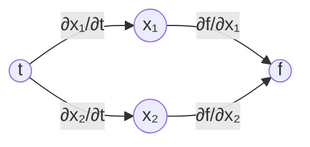
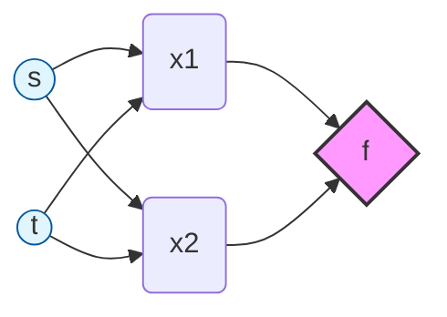
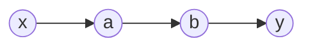
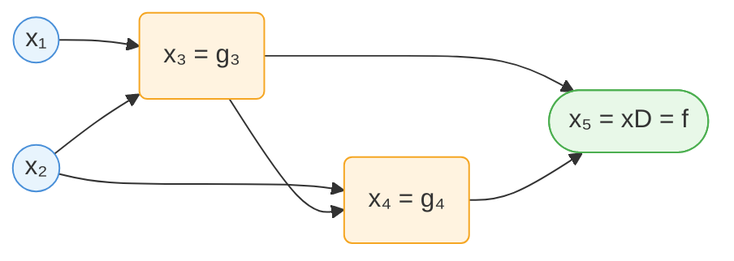

# Vector Calculus(向量微积分)

## 5.1 一元函数的微分

> **定义 5.1 （差商）** 一元函数的差商
> 对正实数 $\Delta x > 0$，函数 $y = f(x), f: \mathbb{R} \rightarrow \mathbb{R}$ 在 $x$ 处的差商定义为
> $$\frac{\Delta y}{\Delta x} := \frac{f(x + \Delta x) - f(x)}{\Delta x} \tag{5.1}$$
> 

> **定义 5.2 （导数）**
> 对正实数 $h > 0$，有函数 $y = f(x), f: \mathbb{R} \rightarrow \mathbb{R}$ ，则 $f$ 在 $x$ 处的导数由下面的极限定义：
> $$\frac{\mathrm{d}y}{\mathrm{d}x} := \lim_{h \to 0} \frac{f(x + h) - f(x)}{h} \tag{5.2}$$
> 
> $f$ 的导数时刻指向 $f$ 提升最快的方向。

> **定义 5.2a （可微性与微分）**
> 设函数 $y = f(x)$ 在点 $x_0$ 的某邻域内有定义。若存在常数 $A \in \mathbb{R}$，使得函数增量 $\Delta y$ 可分解为：
> $$\Delta y = f(x_0 + \Delta x) - f(x_0) = A \cdot \Delta x + o(\Delta x), \quad (\Delta x \to 0) \tag{5.3}$$
> 
> 则称 $f$ 在点 $x_0$ 处**可微**（differentiable），并称线性主部 $\mathrm{d}y$ 为 $f$ 在点 $x_0$ 处的**微分**（differential）：
> $$\mathrm{d}y\big|_{x=x_0} := A \cdot \Delta x = A \cdot \mathrm{d}x = f'(x_0) \cdot \mathrm{d}x \tag{5.4}$$
> 
> 其中 $A = f'(x_0)$，$\Delta x = \mathrm{d}x$。
> 微分 $\mathrm{d}y = f'(x_0) \cdot \mathrm{d}x$ 是关于 $\mathrm{d}x$ 的**线性函数**，而非增量 $\Delta y$ 本身。
> 
> 微分的几何意义：$\mathrm{d}y$ 是切线上纵坐标的增量，而 $\Delta y$ 是曲线上纵坐标的增量。导数 $\dfrac{\mathrm{d}y}{\mathrm{d}x}$ 本质上是微分之商（微商），即因变量微分与自变量微分之比。

### 5.1.1 Taylor 级数

所谓 Taylor 级数是将函数 $f$ 表示成的那个无限项求和式，其中的所有的项都和 $f$ 在点 $x_{0}$ 处的导数相关。

> **定义 5.3（Taylor 多项式）**
> 函数 $f: \mathbb{R} \rightarrow \mathbb{R}$ 在点 $x_{0}$ 的 $n$ 阶 Taylor 多项式是 
> $$T_n(x) := \sum_{k=0}^{n} \frac{f^{(k)}(x_0)}{k!} (x - x_0)^k, \tag{5.5}$$
> 
> 其中 
> - $f^{(k)}(x_{0})$ 是 $f$ 在 $x_{0}$ 处的 $k$ 阶导数（假设其存在）
> - 而 $\displaystyle \frac{f^{(k)}(x_{0})}{k!}$ 是多项式各项的系数。
> 
> 对于所有的 $t \in \mathbb{R}$ 我们约定 $t^{0} := 1$

> **定义 5.4（Taylor 级数）**
> 对于光滑函数 $f \in \mathcal{C}^{\infty}, f: \mathbb{R}\rightarrow \mathbb{R}$，它在点 $x_{0}$ 处的 Taylor 级数定义为
> $$T_\infty(x) = \sum_{k=0}^{\infty} \frac{f^{(k)}(x_0)}{k!} (x - x_0)^k. \tag{5.6}$$
> 
> - 若 $x_{0} = 0$，我们得到了一个 Taylor 级数的特殊情况 —— Maclaurin 级数。
> - 如果 $f(x) = T_{\infty}(x)$，则我们称 $f$ 是**解析函数**。

> 注：一般而言，某个不一定为多项式函数的 $n$ 阶 Taylor 多项式是这个函数的近似，它在 $x_{0}$ 的邻域中与 $f$ 接近。事实上，对于阶数为 $k \leqslant n$ 的多项式函数 $f$，$n$ 阶 Taylor 多项式就是这个多项式函数本身，因为对所有的 $i > k$，多项式函数 $f$ 的 $i$ 阶导数 $f^{(i)}$ 均为零。

### 5.1.2 微分法则

下面我们简要介绍基本的微分法则，其中我们使用 $f'$ 表示 $f$ 的导数。

- **乘法法则**:
$$
[f(x)g(x)]' = f'(x)g(x) + f(x)g'(x) \tag{5.7}
$$

- **除法法则**:
$$
\left[ \frac{f(x)}{g(x)} \right]' = \frac{f'(x)g(x)-f(x)g'(x)}{\big[ g(x) \big]^{2}}\tag{5.8}
$$

- **加法法则**:
$$
[f(x) + g(x)]' = f'(x) + g'(x) \tag{5.9}
$$

- **链式法则**: $g \circ f$ 表示函数的复合：$x \mapsto f(x) \mapsto g\big[f(x)\big]$。

$$
\Big( g\big[ f(x) \big] \Big)' = (g \circ f)'(x) = g'\big[f(x)\big]f'(x)\tag{5.10}
$$

## 5.2 偏导数和梯度

> **定义 5.5（偏导数）**
> 给定 $n$ 元函数 $f: \mathbb{R}^{n} \rightarrow \mathbb{R}$，$\boldsymbol{x} \mapsto f(\boldsymbol{x}), \boldsymbol{x} \in \mathbb{R}^{n}$，它的各偏导数为
> $$\begin{align}\frac{ \partial f }{ \partial x_{1} } &= \lim_{ h \to 0 } \frac{f(x_{1}+h, x_{2}, \dots, x_{n}) - f(\boldsymbol{x})}{h}\\&\,\,\, \vdots\\\frac{ \partial f }{ \partial x_{n} } &= \lim_{ h \to 0 } \frac{f(x_{1}, \dots, x_{n-1}, x_{n}+h) - f(\boldsymbol{x})}{h}\end{align}\tag{5.11}$$
>
> 然后将各偏导数组合为向量，就得到了梯度向量
> $$\nabla_{x}f = \text{grad} f = \frac{\mathrm{d}f}{\mathrm{d}\boldsymbol{x}} = \left[ \frac{ \partial f(\boldsymbol{x}) }{ \partial x_{1} }, \frac{ \partial f(\boldsymbol{x}) }{ \partial x_{2} }, \dots, \frac{ \partial f(\boldsymbol{x}) }{ \partial x_{n} } \right] \in \mathbb{R}^{1 \times n} \tag{5.12}$$
> 
> 其中 
> - $n$ 是变元数，$1$ 是 $f$ 像集（陪域）的维数。
> - 我们在此定义列向量 $\boldsymbol{x} = [x_{1}, \dots, x_{n}]^{\top} \in \mathbb{R}^{n}$。
> - 行向量 $(5.12)$ 称为 $f$ 的**梯度**或者**Jacobi 矩阵**，是 5.1 节中的导数的推广。

> **定义 5.5a（全微分）**
> 设 $n$ 元函数 $z = f(\boldsymbol{x}), f: \mathbb{R}^{n} \rightarrow \mathbb{R}$ 在点 $\boldsymbol{x}_0$ 的某邻域内有定义。若存在仅与 $\boldsymbol{x}_0$ 有关而与 $\Delta \boldsymbol{x}$ 无关的线性函数 $A_1 \Delta x_1 + A_2 \Delta x_2 + \cdots + A_n \Delta x_n$，使得函数增量可分解为：
> $$\Delta z = f(\boldsymbol{x}_0 + \Delta \boldsymbol{x}) - f(\boldsymbol{x}_0) = \sum_{i=1}^{n} A_i \Delta x_i + o(\|\Delta \boldsymbol{x}\|), \quad (\|\Delta \boldsymbol{x}\| \to 0) \tag{5.13}$$
> 
> 则称 $f$ 在点 $\boldsymbol{x}_0$ 处**可微**，并称该线性主部为 $f$ 在 $\boldsymbol{x}_0$ 处的**全微分**（total differential）：
> $$\mathrm{d}z = \sum_{i=1}^{n} \frac{\partial f}{\partial x_i} \mathrm{d}x_i = \frac{\partial f}{\partial x_1}\mathrm{d}x_1 + \frac{\partial f}{\partial x_2}\mathrm{d}x_2 + \cdots + \frac{\partial f}{\partial x_n}\mathrm{d}x_n \tag{5.14}$$
> 
> 其中 $A_i = \dfrac{\partial f}{\partial x_i}\bigg|_{\boldsymbol{x}_0}$，$\mathrm{d}x_i = \Delta x_i$。用梯度的记号可简写为：
> $$\mathrm{d}z = \nabla_{\boldsymbol{x}} f \cdot \mathrm{d}\boldsymbol{x} \tag{5.15}$$
> 
> 注意：多元函数中，各偏导数存在**不能**保证可微（与一元情况不同）；但若各偏导数在该点**连续**，则函数可微。

本质上全微分就是一次矩阵乘法：梯度（最佳线性逼近的系数）作用在微元向量上，得到线性逼近的增量。

$$
\mathrm{d}z = \underbrace{\nabla_{\boldsymbol{x}} f}_{1 \times n} \cdot \underbrace{\mathrm{d}\boldsymbol{x}}_{n \times 1} = \begin{bmatrix} \frac{\partial f}{\partial x_1} & \cdots & \frac{\partial f}{\partial x_n} \end{bmatrix} \begin{bmatrix} \mathrm{d}x_1 \\ \vdots \\ \mathrm{d}x_n \end{bmatrix} = \sum_{i=1}^{n} \frac{\partial f}{\partial x_i} \mathrm{d}x_i
$$

### 5.2.1 偏导数的基本法则

下面是一般法则：
- **Product rule**:
$$
\frac{ \partial  }{ \partial \boldsymbol{x} } \big[ f(\boldsymbol{x})g(\boldsymbol{x}) \big] = \frac{ \partial f }{ \partial \boldsymbol{x} }g(\boldsymbol{x}) + f(\boldsymbol{x})\frac{ \partial g }{ \partial \boldsymbol{x} } \tag{5.16}
$$

- **Sum rule**:

$$
\frac{ \partial  }{ \partial \boldsymbol{ x }  } \big[ f(\boldsymbol{x}) + g(\boldsymbol{x})\big] = \frac{ \partial f }{ \partial \boldsymbol{ x }  } + \frac{ \partial g }{ \partial \boldsymbol{ x }  } \tag{5.17}
$$

- **Chain rule**: $g \circ f$ 表示函数的复合：$x \mapsto f(x) \mapsto g\big[f(x)\big]$

$$
\frac{ \partial  }{ \partial \boldsymbol{ x }  } (g \circ f)(x) = \frac{ \partial  }{ \partial \boldsymbol{ x }  } g\big[ f(\boldsymbol{ x } ) \big] = \frac{ \partial g }{ \partial f } \frac{ \partial f }{ \partial \boldsymbol{ x }  } \tag{5.18}
$$

### 5.2.2 链式法则（chain rule）

考虑变元为 $x_{1}, x_{2}$ 函数 $f: \mathbb{R}^{2} \rightarrow \mathbb{R}$，而 $x_{1}(t)$ 和 $x_{2}(t)$ 又是变元 $t$ 的函数。

**公式视角**: 为了计算 $f$ 对 $t$ 的梯度，需要用到链式法则 $(5.18)$：

$$
\frac{\mathrm{d}f}{\mathrm{d}t} = \frac{\mathrm{d}f}{\mathrm{d}\boldsymbol{x}} \frac{\mathrm{d}\boldsymbol{x}}{\mathrm{d}t} =  \begin{bmatrix}
\displaystyle \frac{ \partial f }{ \partial x_{1} } & \displaystyle \frac{ \partial f }{ \partial x_{2} }  
\end{bmatrix} \begin{bmatrix}
\displaystyle \frac{ \partial x_{1}(t) }{ \partial t }\\
\displaystyle \frac{ \partial x_{2}(t) }{ \partial t }\\
\end{bmatrix} = \frac{ \partial f }{ \partial x_{1} } \frac{ \partial x_{1} }{ \partial t }  + \frac{ \partial f }{ \partial x_{2} } \frac{ \partial x_{2} }{ \partial t } \tag{5.19} 
$$
其中 $\mathrm{d}$ 表示梯度，而 $\partial$ 表示偏导数。

**计算图视角**: 对应的计算图如下，从输入 $t$ 出发，经过中间变量 $x_1, x_2$ 到达输出 $f$，每条边上标注了对应的偏导数：

```mermaid
graph LR
    t((t))
    x1((x₁))
    x2((x₂))
    f((f))

    t -- "∂x₁/∂t" --> x1
    t -- "∂x₂/∂t" --> x2
    x1 -- "∂f/∂x₁" --> f
    x2 -- "∂f/∂x₂" --> f
```

沿两条路径将偏导数相乘再求和，即得到全导数：$\displaystyle\frac{\mathrm{d}f}{\mathrm{d}t} = \frac{\partial f}{\partial x_1}\frac{\partial x_1}{\partial t} + \frac{\partial f}{\partial x_2}\frac{\partial x_2}{\partial t}$

---

如果 $f(x_{1}, x_{2})$ 是 $x_{1}$ 和 $x_{2}$ 的函数，而 $x_{1}(s, t)$ 和 $x_{2}(s,t)$ 又分别为 $s$ 和 $t$ 的函数，那么根据链式法则会得到下面的结果：

$$
\begin{align}
\frac{ \partial f }{ \partial {\color{orange} s }  } &= \frac{ \partial f }{ \partial {\color{blue} x_{1} }  } \frac{ \partial {\color{blue} x_{1} }  }{ \partial {\color{orange} s }  }  + \frac{ \partial f }{ \partial {\color{blue} x_{2} }  } \frac{ \partial {\color{blue} x_{2} }  }{ \partial {\color{orange} s }  } \tag{5.20}\\
\frac{ \partial f }{ \partial {\color{orange} t }  } &= \frac{ \partial f }{ \partial {\color{blue} x_{1} }  } \frac{ \partial {\color{blue} x_{1} }  }{ \partial {\color{orange} t }  }  + \frac{ \partial f }{ \partial {\color{blue} x_{2} }  } \frac{ \partial {\color{blue} x_{2} }  }{ \partial {\color{orange} t }  } \tag{5.21}
\end{align}
$$

对应的计算图如下，从输入 $s, t$ 出发，经过中间变量 $x_1, x_2$ 到达输出 $f$：

```mermaid
graph LR
    %% 定义输入节点
    S((s))
    T((t))
    
    %% 定义中间变量节点
    X1(x1)
    X2(x2)
    
    %% 定义最终输出节点
    F{f}

    %% 建立连接 (自左向右)
    S --> X1
    S --> X2
    T --> X1
    T --> X2
    X1 --> F
    X2 --> F

    %% 样式美化
    style F fill:#f9f,stroke:#333,stroke-width:2px
    style S fill:#e1f5fe,stroke:#01579b
    style T fill:#e1f5fe,stroke:#01579b
```

例如计算 $\partial f / \partial s$ 时，从 $s$ 到 $f$ 有两条路径：$s \to x_1 \to f$ 和 $s \to x_2 \to f$，将每条路径上的偏导数相乘再求和，即得到公式 $(5.20)$；对 $t$ 同理可得 $(5.21)$。

而函数的梯度为
$$
\frac{\mathrm{d}f}{\mathrm{d}(s,t)} = \frac{ \partial f }{ \partial \boldsymbol{ x }  } \frac{ \partial \boldsymbol{ x }  }{ \partial (s,t) } = \underbrace{ \begin{bmatrix}
\displaystyle \frac{ \partial f }{\color{blue} \partial x_{1} } &
\displaystyle \frac{ \partial f }{\color{orange} \partial x_{2} } 
\end{bmatrix} }_{ \displaystyle =\frac{ \partial f }{ \partial \boldsymbol{ x }  }  } \underbrace{ \begin{bmatrix}
\displaystyle {\color{blue} \frac{ \partial x_{1} }{ \partial s }  } & 
\displaystyle {\color{blue} \frac{ \partial x_{1} }{ \partial t }  } \\
\displaystyle {\color{orange} \frac{ \partial x_{2} }{ \partial s }  } & 
\displaystyle {\color{orange} \frac{ \partial x_{2} }{ \partial t }  } \\
\end{bmatrix} }_{ \displaystyle =\frac{ \partial \boldsymbol{x} }{ \partial (s,t) }  }
$$

以上的写法 当且仅当梯度被写为行向量时才是正确的，否则我们需要对结果进行转置，以保证矩阵的维度对应。在梯度为向量或矩阵时这样看来似乎比较显然，但当之后讨论中涉及的梯度变成 **张量（tensor）** 时对其进行转置就不那么容易了。

## 5.3 向量值函数的梯度

一直以来我们讨论的都是实值函数 $f : \mathbb{R}^{n} \rightarrow \mathbb{R}$ 的偏导数和梯度，接下来我们将将此概念扩展至向量值函数（向量场）$\boldsymbol{f}: \mathbb{R}^{n} \rightarrow \mathbb{R}^{m}$ 的情形，其中 $n \geqslant 1, m \geqslant 1$。

### 5.3.1 向量值函数的偏导数

给定向量值函数 $\boldsymbol{f}: \mathbb{R}^{n} \rightarrow \mathbb{R}^{m}$ 和向量 $\boldsymbol{x} = [x_{1}, \dots, x_{n}]^{\top}\in \mathbb{R}^{n}$，则该函数的函数值可以写为

$$
\boldsymbol{f}(\boldsymbol{x}) = \begin{bmatrix}
f_{1}(\boldsymbol{x})\\
\vdots\\
f_{m}(\boldsymbol{x})\\
\end{bmatrix} \in \mathbb{R}^{m}.\tag{5.22}
$$

这样写可以让我们将向量值函数 $\boldsymbol{f}: \mathbb{R}^{n} \rightarrow \mathbb{R}^{m}$ 看成一个全部由实值函数 $f_{i}: \mathbb{R}^{n} \rightarrow \mathbb{R}$  构成的向量 $[f_{1}, \dots, f_{m}]^{\top}$，而对于每一个 $f_{i}$ 我们可以不加修改的直接应用 5.2 节中的所有微分法则。这样一来，向量值函数对变元 $x_{i} \in \mathbb{R}, i=1, \dots, n$ 的偏导数由下式给出

$$
\frac{ \partial \boldsymbol{f} }{ \partial x_{i} } = \begin{bmatrix}
\displaystyle \frac{ \partial f_{1} }{ \partial x_{i} } \\
\vdots\\
\displaystyle \frac{ \partial f_{m} }{ \partial x_{i} } 
\end{bmatrix} = \begin{bmatrix}
\displaystyle \lim_{ h \to 0 } \frac{f_{1}(x_{1}, \dots, x_{i-1}, x_{i}+h, x_{i+1}, x_{n}) - f_{1}(\boldsymbol{x})}{h}\\
\vdots\\
\displaystyle \lim_{ h \to 0 } \frac{f_{m}(x_{1}, \dots, x_{i-1}, x_{i}+h, x_{i+1}, x_{n}) - f_{m}(\boldsymbol{x})}{h}\\
\end{bmatrix} \in \mathbb{R}^{m}\tag{5.23}
$$

### 5.3.2 Jacobi 矩阵

从 $(5.12)$ 中我们了解到函数 $\boldsymbol{f}$ 对向量求导得到的是由一系列偏导数组合得到的行向量。在 $(5.23)$ 中，每个偏导数 $\displaystyle \frac{ \partial \boldsymbol{f}(\boldsymbol{x}) }{ \partial x_{i} }$ 自己就是一个列向量，于是我们可以将它们组合起来得到函数 $\boldsymbol{f}: \mathbb{R}^{n} \rightarrow \mathbb{R}^{m}$ 对向量 $\boldsymbol{x} \in \mathbb{R}^{n}$ 的梯度：

$$
\begin{align}
\frac{\mathrm{d}\boldsymbol{f}}{\mathrm{d}\boldsymbol{x}} &= 
\begin{bmatrix}
{\color{blue} \displaystyle \frac{ \partial \boldsymbol{f}(x) }{ \partial x_{1} }}  & \cdots & \color{orange} \displaystyle \frac{ \partial \boldsymbol{f}(x) }{ \partial x_{n} } 
\end{bmatrix} \\[0.2em] &= \begin{bmatrix}
\color{blue} \displaystyle \frac{ \partial f_{1}(\boldsymbol{x}) }{ \partial x_{1} } &\cdots &  \color{orange} \displaystyle \frac{ \partial f_{1}(\boldsymbol{x}) }{ \partial x_{n} } \\
\color{blue} \vdots & \ddots & \color{orange} \vdots\\
\color{blue} \displaystyle \frac{ \partial f_{m}(\boldsymbol{x}) }{ \partial x_{1} } & \cdots & \color{orange}  \displaystyle \frac{ \partial f_{m}(\boldsymbol{x}) }{ \partial x_{n} } \\
\end{bmatrix} \in \mathbb{R}^{m \times n} 
\end{align} \tag{5.24}
$$

> **定义 5.6 (Jacobi 矩阵)**
> 向量值函数 $\boldsymbol{f}: \mathbb{R}^{n} \rightarrow \mathbb{R}^{m}$ 的各一阶偏微分的合集称为 Jacobi 矩阵，它的形状是 $m \times n$ ，定义如下：
> $$\begin{align}\boldsymbol{J} &= \nabla_{x} \boldsymbol{f} = \frac{\mathrm{d}\boldsymbol{f}(\boldsymbol{x})}{\mathrm{d}\boldsymbol{x}} = \begin{bmatrix}\displaystyle \frac{ \partial \boldsymbol{f} }{ \partial x_{1} } & \cdots & \displaystyle \frac{ \partial \boldsymbol{f} }{ \partial x_{n} } \tag{5.25}\\\end{bmatrix}\\&= \begin{bmatrix}
 \displaystyle \frac{ \partial f_{1}(\boldsymbol{x}) }{ \partial x_{1} } &\cdots &  \displaystyle \frac{ \partial f_{1}(\boldsymbol{x}) }{ \partial x_{n} } \\\vdots & \ddots &  \vdots\\\displaystyle \frac{ \partial f_{m}(\boldsymbol{x}) }{ \partial x_{1} } & \cdots & \displaystyle \frac{ \partial f_{m}(\boldsymbol{x}) }{ \partial x_{n} } \\\end{bmatrix}, \tag{5.26}\\[0.2em]&\quad \boldsymbol{x} = \begin{bmatrix}x_{1}\\\vdots\\x_{n}\end{bmatrix}, \quad J(i,j) = \frac{ \partial f_{i} }{ \partial x_{j} }. \tag{5.27} \end{align}$$

作为 $(5.26)$ 的一个特例，标量值的向量变元函数 $f: \mathbb{R}^{n} \rightarrow \mathbb{R}^{1}$ （如 $\displaystyle f(\boldsymbol{x}) = \sum\limits_{i=1}^{n}x_{i}$）的 Jacobi 矩阵是一个行向量（形状为 $1 \times n$）；见 $(5.12)$。

> 注：本书中的微分使用 **分子布局（numerator layout）**。这是说函数 $\boldsymbol{f} \in \mathbb{R}^{m}$ 对 $\boldsymbol{x} \in \mathbb{R}^{n}$ 的微分 $\displaystyle \frac{ \mathrm{d}\boldsymbol{f} }{ \mathrm{d}\boldsymbol{x} }$ 得到矩阵的形状为 $m \times n$ ——如 $(4.58)$ —— 其中 $\boldsymbol{f}$ 决定这矩阵的行，$\boldsymbol{x}$ 决定矩阵的列。当然也有所谓的 **分母布局（denominator layout）**，得到的结果是分子布局的转置。

### 5.3.3 Jacobian 行列式与坐标变换

Jacobi 矩阵将在 6.7 节中概率分布的变量变换方法中起作用，而其中的缩放大小取决于其**行列式（determinant）**。

  
   
  图 5.5

在 4.1 节中，我们已使用行列式计算平行四边形的面积：如果给定正方形的两边所对应的两个向量$\boldsymbol{b}_{1} = [1, 0]^{\top}$ 和 $\boldsymbol{b}_{2} = [0, 1]^{\top}$，那么它们构成的正方形的面积是

$$
\begin{vmatrix}
\text{det}\left(\begin{bmatrix}
1 & 0\\0 & 1
\end{bmatrix}\right)
\end{vmatrix} = 1
$$

如果我们取平行四边形的两边 $\boldsymbol{c}_{1} = [-2, 1]^{\top}$ 和 $\boldsymbol{c}_{2} = [1, 1]^{\top}$（如图 5.5 所示），其面积等于下面行列式的绝对值：

$$
\begin{vmatrix}
\text{det}\left( \begin{bmatrix}
-2 & 1\\1 & 1
\end{bmatrix} \right) 
\end{vmatrix} = |-3| = 3
$$

其刚好是单位正方形面积的三倍。我们可以通过测量单位正方形映射后得到的图形面积得到对应的缩放比例。如果使用线性代数的语言，我们做了一个从 $(\boldsymbol{b}_{1}, \boldsymbol{b}_{2})$ 到 $(\boldsymbol{c}_{1}, \boldsymbol{c}_{2})$ 的变量变换。在本例中，这个变换是线性的，变换本身的行列式就给出了缩放比例。

现在我们介绍两种确认这样的映射的方法。首先我们假设这个变换是线性的，这样就可以使用第二张中的内容确定它。随后我们将使用本章介绍的偏导数计算这个映射。

> **方法 1**
> 为了使用线性代数的工具，我们假定 $\{ \boldsymbol{b}_{1}, \boldsymbol{b}_{2} \}$ 和 $\{ \boldsymbol{c}_{1}, \boldsymbol{c}_{2} \}$ 是 $\mathbb{R}^{2}$ 的一个基（见 2.6.1 节），可见事实上我们做了一个从 $(\boldsymbol{b}_{1}, \boldsymbol{b}_{2})$ 到 $(\boldsymbol{c}_{1}, \boldsymbol{c}_{2})$ 的基变换，我们要找的变换矩阵就是执行这一基变换的矩阵。使用 2.7.2 节的结论，可以得到变换矩阵
> $$\boldsymbol{J} = \begin{bmatrix}-2 & 1\\ 1 & 1\end{bmatrix}$$
> 
> 满足 $\boldsymbol{Jb}*_{1} = \boldsymbol{c}_*{1}$，$\boldsymbol{Jb}*_{2} = \boldsymbol{c}_*{2}$。该矩阵行列式的绝对值为 $|\det(\boldsymbol{J})| = 3$，这就是所求的缩放参数，也即基 $(\boldsymbol{c}_{1}, \boldsymbol{c}_{2})$ 张成的平行四边形的面积是基 $(\boldsymbol{b}_{1}, \boldsymbol{b}_{2})$ 张成的平行四边形的面积的三倍。

> **方法 2**
> 线性代数的方法可用于解线性函数的 Jacobi 矩阵，而对于非线性函数（在 6.7 节中涉及），我们使用一种更具一般性的方法 —— 使用偏导数。

考虑一个变量转换函数 $\boldsymbol{f} : \mathbb{R}^{2} \rightarrow \mathbb{R}^{2}$ ，它将基 $(\boldsymbol{b}_{1}, \boldsymbol{b}_{2})$ 下表示的向量 $\boldsymbol{x} \in \mathbb{R}^{2}$ 转换为基 $(\boldsymbol{c}_{1}, \boldsymbol{c}_{2})$ 表示下的向量 $\boldsymbol{y} \in \mathbb{R}^{2}$，我们通过计算映射 $\boldsymbol{f}$ 作用前后单位面积/体积的变化来确定这个映射。从这个角度出发，我们可以研究当我们稍稍改变 $\boldsymbol{x}$ 一点后 $\boldsymbol{f}(\boldsymbol{x})$ 的变化，而这恰好就是 $\displaystyle \frac{\mathrm{d}\boldsymbol{f}}{\mathrm{d}\boldsymbol{x}} \in \mathbb{R}^{2 \times 2}$。我们可以写出 $\boldsymbol{x}$ 和 $\boldsymbol{y}$ 的联系如下：
$$
\begin{aligned}
y_{1} &= -2x_{1} + x_{2} \\
y_{2} &= x_{1} + x_{2} 
\end{aligned}$$

就可以容易的写出各项偏导数：
$$
\frac{ \partial y_{1} }{ \partial x_{1} }  = -2, \quad \frac{ \partial y_{1} }{ \partial x_{2} } = 1, \quad \frac{ \partial y_{2} }{ \partial x_{1} } =1, \quad \frac{ \partial y_{2} }{ \partial x_{2} } = 1
$$

并得到表示坐标变换的 Jacobi 矩阵
$$
\boldsymbol{J} = \begin{bmatrix}\displaystyle \frac{ \partial y_{1} }{ \partial x_{1} } & \displaystyle \frac{ \partial y_{1} }{ \partial x_{2} } \\\displaystyle \frac{ \partial y_{2} }{ \partial x_{1} } & \displaystyle \frac{ \partial y_{2} }{ \partial x_{2} }\end{bmatrix} = \begin{bmatrix}-2 & 1 \\ 1 & 1\end{bmatrix}
$$

如果我们处理的是线性函数，则刚刚的 Jacobi 矩阵即为所求（注意 $(5.66)$ 和 $(5.62)$ 完全一样）；如若不然， Jacobi 矩阵是非线性映射的局部线性近似。Jacobi 矩阵的行列式 $|\boldsymbol{J}|$ 称为 Jabobian 行列式，它的值就是面积或体积变换前后的缩放比例，在这个例子中有 $|\boldsymbol{J}| = 3$。

上面提到的 Jacobian 行列式和变量替换在 6.7 节中对随机变量和分布进行变换时会涉及，它们在机器学习和深度学习中的 **重参数技巧（Reparametrization Trick）** 中十分重要，也被称为 **无穷摄动分析（Infinite Perturbation Analysis）**。

### 5.3.4 梯度的维度总结

  
   
  图 5.6 偏导数的维度和形状

图 5.6 总结了本章讨论的各类函数导数的形状：

| 函数映射 | 梯度形状 | 说明 |
|:---:|:---:|:---:|
| $f: \mathbb{R} \rightarrow \mathbb{R}$ | 标量 | 对应图 5.6 左上角 |
| $f: \mathbb{R}^{D} \rightarrow \mathbb{R}$ | $1 \times D$ 行向量 | 对应图 5.6 右上角 |
| $\boldsymbol{f}: \mathbb{R} \rightarrow \mathbb{R}^{E}$ | $E \times 1$ 列向量 | 对应图 5.6 左下角 |
| $\boldsymbol{f}: \mathbb{R}^{D} \rightarrow \mathbb{R}^{E}$ | $E \times D$ 矩阵 | 对应图 5.6 右下角 |

### 5.3.5 示例

**示例 5.9（向量值函数的梯度）**，给定
$$
\boldsymbol{f}(\boldsymbol{x}) = \boldsymbol{Ax}, \quad \boldsymbol{f}(\boldsymbol{x}) \in \mathbb{R}^{M}, \quad \boldsymbol{A} \in \mathbb{R}^{M \times N}
$$

为了计算梯度$\displaystyle \displaystyle \frac{ \mathrm{d}\boldsymbol{f} }{ \mathrm{d}\boldsymbol{x} }$，我们首先确定$\displaystyle \displaystyle \frac{ \mathrm{d}\boldsymbol{f} }{ \mathrm{d}\boldsymbol{x} }$的维数：由于$\boldsymbol{f}: \mathbb{R}^{N} \rightarrow \mathbb{R}^{M}$，所以有 $\displaystyle \displaystyle \frac{ \mathrm{d}\boldsymbol{f} }{ \mathrm{d}\boldsymbol{x} } \in \mathbb{R}^{M \times N}$。

为了计算梯度，我们接下来计算 $\boldsymbol{f}$ 相对于每个变元 $x_j$ 的偏导数
$$
f_{i}(\boldsymbol{x}) = \sum\limits_{j=1}^{N} A_{i,j}x_{j} \implies \frac{ \partial f_{i} }{ \partial x_{j} } = A_{i,j}
$$
 
知道了这些偏导数，我们就得到了梯度
$$
\frac{ \mathrm{d}\boldsymbol{f} }{ \mathrm{d}\boldsymbol{x} }  = \begin{bmatrix}\displaystyle \frac{ \partial f_{1} }{ \partial x_{1} } & \cdots & \displaystyle \frac{ \partial f_{1} }{ \partial x_{N} } \\\vdots & \ddots & \vdots\\\displaystyle \frac{ \partial f_{M} }{ \partial x_{1} } & \cdots &\displaystyle \frac{ \partial f_{M} }{ \partial x_{N } } \end{bmatrix} = \begin{bmatrix}A_{1,1} & \cdots & A_{1,N}\\\vdots & \ddots & \vdots\\A_{M,1} & \cdots & A_{M,N}\end{bmatrix} = \boldsymbol{A} \in \mathbb{R}^{M \times N}
$$
 
---

**示例 5.10（链式法则）**，考虑函数 $h: \mathbb{R} \rightarrow \mathbb{R}$，$h(t) = (f \circ g)(t)$，$f : \mathbb{R}^{2} \rightarrow \mathbb{R}$，$g : \mathbb{R} \rightarrow \mathbb{R}^{2}$ 其中
$$
\begin{aligned}
f(\boldsymbol{x}) & =\exp \left(x_{1}, x_{2}^{2}\right) 
\end{aligned}
$$

$$
\boldsymbol{x}=\left[\begin{array}{l} x_{1} \\ x_{2} \end{array}\right]=g(t)=\left[\begin{array}{l} t \cos t \\ t \sin t \end{array}\right]
$$

计算 $h$ 关于 $t$ 的梯度。
 
因为 $f:\mathbb{R}^{2}→\mathbb{R}$ 和 $g:\mathbb{R}\rightarrow \mathbb{R}^{2}$，于是我们有
$$
\displaystyle \frac{ \partial f }{ \partial \boldsymbol{x} } \in \mathbb{R}^{1 \times 2}, \quad \displaystyle \frac{ \partial g }{ \partial t } \in \mathbb{R}^{2 \times 1}
$$
 
复合函数的梯度可通过链式法则求得：
$$
\begin{aligned}
\displaystyle \frac{ \mathrm{d}h }{ \mathrm{d}t } &= {\color{blue} \displaystyle \frac{ \partial f }{ \partial \boldsymbol{x} } } {\color{orange} \displaystyle \frac{ \partial \boldsymbol{x} }{ \partial t }  } = {\color{blue} \begin{bmatrix}\displaystyle \frac{ \partial f }{ \partial x_{1} } & \displaystyle \frac{ \partial f }{ \partial x_{2} } \end{bmatrix} } {\color{orange} \begin{bmatrix}\displaystyle \frac{ \partial x_{1} }{ \partial t } \\ \displaystyle \frac{ \partial x_{2} }{ \partial t }\end{bmatrix} }  \\&= {\color{blue} \begin{bmatrix} \exp(x_{1}x_{2}^{2})x_{2}^{2} & 2\exp(x_{1}x_{2}^{2})x_{1}x_{2} \end{bmatrix}}{\color{orange} \begin{bmatrix}\cos t - t\sin t\\sin t + t\cos t\end{bmatrix}} \\&= \exp(x_{1}x_{2}^{2}) \big[ x_{2}^{2}(\cos t - t\sin t) + 2x_{1}x_{2}(\sin t + t\cos t) \big]
\end{aligned}
$$
 
其中，$x_{1} = t\cos t$，$x_{2} = t\sin t$ 

### 5.3.6 讨论：Jacobian 与深度学习中的反向传播

**（1）$\frac{\partial y}{\partial x}$ 结果维度的一般规律**

| $y$ | $x$ | $\frac{\partial y}{\partial x}$ 的结果 | 名称 |
|:---:|:---:|:---:|:---:|
| 标量 | 标量 | 标量 | 普通导数 |
| 标量 | 向量 ($n$) | 行向量 ($1 \times n$) | 梯度 |
| 向量 ($m$) | 标量 | 列向量 ($m \times 1$) | — |
| 向量 ($m$) | 向量 ($n$) | 矩阵 ($m \times n$) | Jacobian |
| 向量/标量 | **矩阵或更高阶** | ⚠️ 降维拆解 | — |

> 核心原则：**Jacobian 只定义在"向量对向量"这一层**。遇到矩阵或更高阶，需按行拆解回归 Jacobian 框架。

**（2）深度网络 = 多层复合的向量值函数**

$$\boldsymbol{f} = \boldsymbol{f}_L \circ \boldsymbol{f}_{L-1} \circ \cdots \circ \boldsymbol{f}_1, \quad \boldsymbol{f}_i(\boldsymbol{x}) = \sigma(\boldsymbol{W}_i \boldsymbol{x} + \boldsymbol{b}_i)$$

每层是 $\mathbb{R}^n \to \mathbb{R}^m$ 的向量值函数；各输出分量 $y_i$ 本质上是 $\mathbb{R}^n \to \mathbb{R}$ 的标量函数，但通过共享隐藏层而相互耦合。

**（3）反向传播：逐层 VJP**

以两层网络为例（$\boldsymbol{W}_1 = \begin{bmatrix} 1 & 2 \\ 3 & 4 \end{bmatrix}$，$\boldsymbol{W}_2 = \begin{bmatrix} 5 & 6 \\ 7 & 8 \end{bmatrix}$，$\boldsymbol{x} = [1,1]^T$，$\boldsymbol{y}^* = [1,1]^T$）：

$$\boldsymbol{x} \xrightarrow{\boldsymbol{W}_1} \boldsymbol{z} \xrightarrow{\text{ReLU}} \boldsymbol{h} \xrightarrow{\boldsymbol{W}_2} \boldsymbol{y} \xrightarrow{\text{MSE}} L$$

- **前向**：$\boldsymbol{z} = [3,7]^T \to \boldsymbol{h} = [3,7]^T \to \boldsymbol{y} = [57,77]^T \to L = 4456$
- **反向**（每步均为行向量 $\times$ Jacobian，即 **VJP**）：

$$\frac{\partial L}{\partial \boldsymbol{y}} = [56, 76] \xrightarrow{\times\, \boldsymbol{W}_2} \frac{\partial L}{\partial \boldsymbol{h}} = [812, 944] \xrightarrow{\times\, \text{diag}(\text{ReLU}')} \frac{\partial L}{\partial \boldsymbol{z}} = [812, 944]$$

> 线性层的 Jacobian 就是权重矩阵本身：$\frac{\partial(\boldsymbol{W}\boldsymbol{x})}{\partial \boldsymbol{x}} = \boldsymbol{W}$，这是标量法则 $\frac{d(ax)}{dx} = a$ 的高维推广。

**（4）对矩阵参数求梯度：外积公式**

$\boldsymbol{W}_1$ 是矩阵，直接求导会得到三阶张量。按行拆解 $z_i = \boldsymbol{w}_i^T \boldsymbol{x}$，退化为标量对向量求导后再堆叠：

$$\frac{\partial L}{\partial \boldsymbol{W}} = \left(\frac{\partial L}{\partial \boldsymbol{z}}\right)^T \boldsymbol{x}^T = \begin{bmatrix}812\\944\end{bmatrix}[1,1] = \begin{bmatrix}812 & 812\\944 & 944\end{bmatrix}$$

> 这解释了为什么框架在前向传播时需要**缓存每层输入**——反向时需要它与上游梯度做外积来计算权重梯度。

## 5.4 矩阵的梯度

当需要对矩阵求梯度时，结果是一个多维**张量（tensor）**。

**张量形式**：设 $\boldsymbol{A} \in \mathbb{R}^{m \times n}$，$\boldsymbol{B} \in \mathbb{R}^{p \times q}$，则 $\frac{\partial \boldsymbol{A}}{\partial \boldsymbol{B}}$ 是一个 $(m \times n) \times (p \times q)$ 的四维张量 $\boldsymbol{J}$：

$$\boldsymbol{J}_{i,j,k,l} = \frac{ \partial \boldsymbol{A}_{i,j} }{ \partial \boldsymbol{B}_{k, l} }$$

**向量化（实践中的常用做法）**：利用 $\mathbb{R}^{m \times n} \cong \mathbb{R}^{mn}$ 的线性同构，将矩阵压扁（reshape）为向量：

| 对象 | 原始形状 | 向量化后 |
|:---:|:---:|:---:|
| $\boldsymbol{A}$ | $m \times n$ | $\mathbb{R}^{mn}$ |
| $\boldsymbol{B}$ | $p \times q$ | $\mathbb{R}^{pq}$ |
| Jacobian | 四维张量 | $mn \times pq$ 矩阵 |

> 向量化方法更受欢迎：链式法则（5.18）退化为简单的矩阵乘法，无需关心张量收缩时的求和维度。图 5.7 给出了两种方法的对比示意。

## 5.5 常用梯度恒等式

下面列出机器学习中常用的梯度恒等式（Petersen and Pedersen，2012）。其中 $\text{tr}(\cdot)$ 为矩阵的迹（定义4.4），$\text{det}(\cdot)$ 为行列式（4.1节），$\boldsymbol{f}(\boldsymbol{X})^{-1}$ 表示逆矩阵（假设存在）。

**一般法则（矩阵函数的导数）**

$$
\begin{align}
\frac{ \partial }{ \partial \boldsymbol{X} } \boldsymbol{f}(\boldsymbol{X})^{\top} &= \left( \frac{ \partial \boldsymbol{f}(\boldsymbol{X}) }{ \partial \boldsymbol{X} }  \right)^{\top} \tag{5.28}\\[0.2em]
\frac{ \partial  }{ \partial \boldsymbol{X} } \text{tr}\big[ \boldsymbol{f}(\boldsymbol{X}) \big] &= \text{tr}\left[ \frac{ \partial \boldsymbol{f}(\boldsymbol{X}) }{ \partial \boldsymbol{X} }  \right] \tag{5.29}\\[0.2em]
\frac{ \partial  }{ \partial \boldsymbol{X} } \det \big[ \boldsymbol{f}(\boldsymbol{X}) \big] &= \det \big[ \boldsymbol{f}(\boldsymbol{X}) \big] \text{tr}\left[ \boldsymbol{f}(\boldsymbol{X})^{-1} \frac{ \partial \boldsymbol{f}(\boldsymbol{X}) }{ \partial \boldsymbol{X} }  \right] \tag{5.30}\\[0.2em]
\frac{ \partial  }{ \partial \boldsymbol{X} } \boldsymbol{f}(\boldsymbol{X})^{-1} &= -\boldsymbol{f}(\boldsymbol{X})^{-1} \left[ \frac{ \partial \boldsymbol{f}(\boldsymbol{X}) }{ \partial \boldsymbol{X} }  \right]\boldsymbol{f}(\boldsymbol{X})^{-1} \tag{5.31}
\end{align}
$$

**向量/矩阵的线性与二次型**

$$
\begin{align}
\frac{ \partial \boldsymbol{x}^{\top}\boldsymbol{a} }{ \partial \boldsymbol{x} } &= \boldsymbol{a}^{\top} \tag{5.32}\\[0.2em]
\frac{ \partial \boldsymbol{a}^{\top}\boldsymbol{x} }{ \partial \boldsymbol{x} } &= \boldsymbol{a}^{\top} \tag{5.33}\\[0.2em]
\frac{ \partial \boldsymbol{a}^{\top}\boldsymbol{X}\boldsymbol{b} }{ \partial \boldsymbol{X} } &= \boldsymbol{a}\boldsymbol{b}^{\top} \tag{5.34}\\[0.2em]
\frac{ \partial \boldsymbol{a}^{\top}\boldsymbol{X}^{-1}\boldsymbol{b} }{ \partial \boldsymbol{X} } &= -(\boldsymbol{X}^{-1})^{\top}\boldsymbol{a}\boldsymbol{b}^{\top}(\boldsymbol{X}^{-1})^{\top} \tag{5.35}\\[0.2em]
\frac{ \partial \boldsymbol{x}^{\top}\boldsymbol{B}\boldsymbol{x} }{ \partial \boldsymbol{x} } &= \boldsymbol{x}^{\top}(\boldsymbol{B} + \boldsymbol{B}^{\top}) \tag{5.36}
\end{align}
$$

**加权残差的梯度**（$\boldsymbol{W}$ 对称）

$$
\frac{ \partial  }{ \partial \boldsymbol{s} } (\boldsymbol{x} - \boldsymbol{A}\boldsymbol{s})^{\top}\boldsymbol{W}(\boldsymbol{x} - \boldsymbol{A}\boldsymbol{s}) = -2(\boldsymbol{x} - \boldsymbol{A}\boldsymbol{s})^{\top}\boldsymbol{W}\boldsymbol{A} \tag{5.37}
$$

## 5.6 反向传播与自动微分

### 5.6.1 深度神经网络中的梯度

深度学习领域将链式法则的功用发挥到了极致，输入 $\boldsymbol{x}$ 通过多层复合的函数得到函数值 $\boldsymbol{y}$ ：

$$
\boldsymbol{y} = (f_{K} \circ f_{K-1} \circ \cdots \circ f_{1})(\boldsymbol{x}) = f_{K}\Big\{ f_{K-1}\big[\cdots (f_{1}(\boldsymbol{x})\cdots )\big] \Big\} \tag{5.38}
$$

其中，$\boldsymbol{x}$ 是输入（如图像），$\boldsymbol{y}$ 是观测值（如类标签），每个函数 $f_{i}, i = 1, \dots, K$，有各自的参数。在一般的多层神经网络中，第 $i$ 层中有函数
$$
f_{i}(\boldsymbol{x}_{i-1}) = \sigma(\boldsymbol{A}_{i-1}\boldsymbol{x}_{i-1} + \boldsymbol{b}_{i-1})
$$ 

其中 $x_{i-1}$ 是 $i=1$ 层的输出和一个激活函数 $\sigma$，例如 sigmoid 函数 ，$\tanh$ 或 ReLU。

训练这样的模型，我们需要一个损失函数 $L$，对其值求关于所有模型参数 $\boldsymbol{A}_j, \boldsymbol{b}_{j}, j=1, \dots, K$ 的梯度。这同时要求我们求其对模型中各层的输入的梯度。

例如，如果我们有输入$\boldsymbol{x}$和观测值$\boldsymbol{y}$和一个网络结构（如图 5.8）：

  
   
  图 5.8 多层神经网络的前向传播

$$
\begin{align}
\boldsymbol{f}_{0} &:= \boldsymbol{x} \tag{5.39}\\
\boldsymbol{f}_{i} &:= \sigma_{i} \Big( \boldsymbol{A}_{i-1}\boldsymbol{f}_{i-1} + \boldsymbol{b}_{i-1} \Big), \quad  i=1, \dots, K, \tag{5.40} 
\end{align}
$$

我们关心找到使得下面的平方损失最小的 $\boldsymbol{A}_{j}, \boldsymbol{b}_{j}, j=1, \dots, K$：

$$
L(\boldsymbol{\theta}) = \Big\| \boldsymbol{y} - \boldsymbol{f}_{K}\big( \boldsymbol{\theta, x} \big)  \Big\|^{2} \tag{5.41}
$$

其中 $\boldsymbol{\theta} = \{ \boldsymbol{A}_{0}, \boldsymbol{b}_{0}, \dots, \boldsymbol{A}_{K-1}, \boldsymbol{b}_{K-1} \}$。

为得到相对于参数集 $\boldsymbol{\theta}$ 的梯度，我们需要得到 $L$ 对每一层参数 $\theta_j = \{\boldsymbol{A}_j, \boldsymbol{b}_{j}\}, j=0, \dots, K-1$ 的偏导数。根据链式法则，我们得到

$$
\begin{align}
\displaystyle \frac{ \partial L }{ \partial \boldsymbol{\theta}_{K-1} } &= \displaystyle \frac{ \partial L }{ \partial \boldsymbol{f}_{K} } {\color{blue} \displaystyle \frac{ \partial \boldsymbol{f}_{K} }{ \partial \boldsymbol{\theta}_{K-1} } } \tag{5.42}\\
\displaystyle \frac{ \partial L }{ \partial \boldsymbol{\theta}_{K-2} }  &= \displaystyle \frac{ \partial L }{ \partial \boldsymbol{f}_{K} } \boxed{ {\color{orange} \displaystyle \frac{ \partial \boldsymbol{f}_{K} }{ \partial \boldsymbol{f}_{K-1} }  } {\color{blue} \displaystyle \frac{ \partial \boldsymbol{f}_{K-1} }{ \partial \boldsymbol{\theta}_{K-2} }  }}\tag{5.43}\\  
\displaystyle \frac{ \partial L }{ \partial \boldsymbol{\theta}_{K-3} } &= \displaystyle \frac{ \partial L }{ \partial \boldsymbol{f}_{K} } {\color{orange} \displaystyle \frac{ \partial \boldsymbol{f}_{K} }{ \partial \boldsymbol{f}_{K-1} }  } \boxed{ {\color{orange} \displaystyle \frac{ \partial \boldsymbol{f}_{K-1} }{ \partial \boldsymbol{f}_{K-2} }  } {\color{blue} \displaystyle \frac{ \partial \boldsymbol{f}_{K-2} }{ \partial \boldsymbol{\theta}_{K-3} }  } } \tag{5.44}\\
\displaystyle \frac{ \partial L }{ \partial \boldsymbol{\theta}_{i} }  &= \displaystyle \frac{ \partial L }{ \partial \boldsymbol{f}_{K} } {\color{orange} \displaystyle \frac{ \partial \boldsymbol{f}_{K} }{ \partial \boldsymbol{f}_{K-1} } \cdots } \boxed{ {\color{orange} \displaystyle \frac{ \partial \boldsymbol{f}_{i+2} }{ \partial \boldsymbol{f}_{i+1} }  } {\color{blue} \displaystyle \frac{ \partial \boldsymbol{f}_{i+1} }{ \partial \boldsymbol{\theta}_{i} }  }  } \tag{5.45}
\end{align}
$$

其中橙色的项是某层输出相对于其输入的偏导数，而蓝色的项是某层的输出相对于其参数的偏导数。假设我们已经计算出了 $\displaystyle \frac{\partial L}{\partial \boldsymbol{\theta}_{i+1}}$，那么我们可以在计算 $\displaystyle \frac{\partial L}{\partial \boldsymbol{\theta}_{i}}$ 中省去大量的工作，因为我们只需计算方框中的项。图 5.9 中表示了像这样在网络中反向传递梯度的图示。

  
   
  图 5.9 在多层神经网络中使用反向传播计算损失函数的梯度

> 对此更深入的讨论见  Justin Domke 的 [Lecture Notes](https://tinyurl.com/yalcxgtv)

### 5.6.2 自动微分理论

事实上，**反向传播**是数值分析中常采用采用的**自动微分 (automatic differentiation)** 的一种特殊情况。我们可将其看作是一组通过中间变量和链式法则，计算一个函数之（直到机器精度的）精确数值（而非符号）梯度。

**自动微分**始于一系列初等算术运算（如加法、乘法）和初等函数（如 $\sin$、$\cos$、$\exp$、$\log$）。通过将链式法则应用于这些操作，我们可以自动计算出相当复杂的函数的梯度。

自动微分适用于一般的程序，具有正向和反向两种模式。Baydin 等人（2018）对机器学习中的自动微分进行了很好的概述。

```mermaid
graph LR
    x((x)) --> a((a)) --> b((b)) --> y((y))
```

图 5.10 简单的数据流图。数据从输入 x 流经中间变量 a, b 到达输出 y

图5.10显示了一个简单的描述数据流动的图。数据流从输入节点 $x$ 开始，通过中间变量 $a,b$ 最后得到输出 $y$。如果我们要计算导数 $\displaystyle \frac{\mathrm{d}y}{\mathrm{d}x}$，我们可以用链式法则：

$$
\displaystyle \frac{ \mathrm{d}y }{ \mathrm{d}x }  = \displaystyle \frac{ \mathrm{d}y }{ \mathrm{d}b } \displaystyle \frac{ \mathrm{d}b }{ \mathrm{d}a } \displaystyle \frac{ \mathrm{d}a }{ \mathrm{d}x } . \tag{5.46}
$$

直观来讲，正向模式和反向模式的自动微分在处理多重嵌套梯度的乘积顺序上有所不同。由于矩阵乘法有结合律，我们可以采用下面两种不同的方法计算梯度：

$$
\begin{align}
\displaystyle \frac{ \mathrm{d}y }{ \mathrm{d}x } &= \left( \displaystyle \frac{ \mathrm{d}y }{ \mathrm{d}b } \displaystyle \frac{ \mathrm{d}b }{ \mathrm{d}a }  \right) \displaystyle \frac{ \mathrm{d}a }{ \mathrm{d}x } , \tag{5.47}\\
\displaystyle \frac{ \mathrm{d}y }{ \mathrm{d}x } &= \displaystyle \frac{ \mathrm{d}y }{ \mathrm{d}b } \left( \displaystyle \frac{ \mathrm{d}b }{ \mathrm{d}a } \displaystyle \frac{ \mathrm{d}a }{ \mathrm{d}x }  \right). \tag{5.48}
\end{align}
$$

- 式（5.47）就是**反向自动微分**，因为梯度通过计算图向后传播（即与数据流流向相反）。
- 式（5.48）是**正向自动微分**，其中梯度与数据的流向都是从左到右。

---

**一般的自动微分可以形式化** 如下。设 $x_{1}, \dots, x_{d}$ 是函数的输入变量，$x_{d+1}, \dots, x_{D-1}$ 是中间变量，$x_{D}$ 是输出变量。则计算图可以表示为：

$$
\text{For }i = d+1, \dots, D:\quad x_{i} = g_{i}\Big[x_{\text{Pa}(x_{i})}\Big] \tag{5.49}
$$

其中，$g_{i}(\cdot)$ 是初等函数，$x_{\text{Pa}(x_{i})}$ 是图中变量 $x_i$ 的所有父节点。

给定一个以这种方式定义的函数，我们可以使用链式法则逐步计算该函数的导数。回想一下，根据定义，$f=x_{D}$，因此

$$
\displaystyle \frac{ \partial f }{ \partial x_{D} } =1 \tag{5.50}
$$

对于其他变量 $x_{i}$，我们应用链式法则

$$
\displaystyle \frac{ \partial f }{ \partial x_{i} } = \sum\limits_{x_{j}: x_{i} \in \text{Pa}(x_{j})} \displaystyle \frac{ \partial f }{ \partial x_{j} } \displaystyle \frac{ \partial x_{j} }{ \partial x_{i} } = \sum\limits_{x_{j}: x_{i} \in \text{Pa}(x_{j})} \displaystyle \frac{ \partial f }{ \partial x_{j} } \displaystyle \frac{ \partial g_{j} }{ \partial x_{i} }  \tag{5.51}  
$$

其中，$x_{\text{Pa}(x_{i})}$ 是计算图中 $x_j$ 的父节点的集合。式（5.49）是一个函数的正向传播，而（5.51）是梯度通过计算图的反向传播。在神经网络的训练中，我们将标签的预测误差反向传播。

**式（5.51）的高效之处在于**：每个节点只需枚举其 **直接子节点（出边）** 并求和，通过复用已算好的中间梯度 $\displaystyle\frac{\partial f}{\partial x_j}$，将"全局路径枚举"压缩为"逐层局部求和"。

自动微分应用于可表示为计算图，且组成计算图的基本的函数是可微时的情形。事实上，这个函数甚至可能不是一个数学意义上的函数，而是一个程序。然而并不是所有的程序都能自动微分，例如当我们找不到可微的初等函数时。程序结构中，如循环和if语句，在涉及自动微分的处理时需要更为小心。

---

**一般形式的计算示例**：以 $d=2,\;D=5$ 为例，计算图的结构如下，

```mermaid
graph LR
    x1(("x₁")) --> x3("x₃ = g₃")
    x2(("x₂")) --> x3
    x2 --> x4("x₄ = g₄")
    x3 --> x4
    x3 --> x5(["x₅ = xD = f"])
    x4 --> x5

    style x1 fill:#e8f4fd,stroke:#4a90d9
    style x2 fill:#e8f4fd,stroke:#4a90d9
    style x3 fill:#fff3e0,stroke:#f5a623
    style x4 fill:#fff3e0,stroke:#f5a623
    style x5 fill:#e8f8e8,stroke:#4caf50
```

一般计算图示意（蓝色：输入变量 x₁, x₂；橙色：中间变量 x₃, x₄；绿色：输出 xD = f）

图中各节点的父节点关系为：

| 节点 | 父节点 $\text{Pa}(\cdot)$ | 计算 |
| --- | --- | --- |
| $x_3$ | $\{x_1,\, x_2\}$ | $x_3 = g_3(x_1, x_2)$ |
| $x_4$ | $\{x_2,\, x_3\}$ | $x_4 = g_4(x_2, x_3)$ |
| $x_5$ | $\{x_3,\, x_4\}$ | $x_5 = g_5(x_3, x_4) = f$ |

现在应用式（5.51）反向计算梯度。式（5.51）的求和遍历的是 $x_i$ 的所有**子节点**（即以 $x_i$ 为父节点的所有 $x_j$）。从输出 $x_5$ 开始逐层向后：

**第一步**，由式（5.50）：

$$\frac{\partial f}{\partial x_{5}} = 1$$

**第二步**，$x_4$ 的子节点只有 $x_5$（单路径）：

$$\frac{\partial f}{\partial x_{4}} = \frac{\partial f}{\partial x_{5}}\frac{\partial g_{5}}{\partial x_{4}} = \frac{\partial g_{5}}{\partial x_{4}}$$

**第三步**，$x_3$ 的子节点有 $x_4$ 和 $x_5$（多路径求和）：

$$\frac{\partial f}{\partial x_{3}} = \frac{\partial f}{\partial x_{4}}\frac{\partial g_{4}}{\partial x_{3}} + \frac{\partial f}{\partial x_{5}}\frac{\partial g_{5}}{\partial x_{3}}$$

**第四步**，回传到输入变量。$x_1$ 的子节点只有 $x_3$；$x_2$ 的子节点有 $x_3$ 和 $x_4$：

$$
\begin{aligned}
\frac{\partial f}{\partial x_{1}} &= \frac{\partial f}{\partial x_{3}}\frac{\partial g_{3}}{\partial x_{1}} \\[6pt]
\frac{\partial f}{\partial x_{2}} &= \frac{\partial f}{\partial x_{3}}\frac{\partial g_{3}}{\partial x_{2}} + \frac{\partial f}{\partial x_{4}}\frac{\partial g_{4}}{\partial x_{2}}
\end{aligned}
$$

可以看到，反向传播从 $\displaystyle\frac{\partial f}{\partial x_5}=1$ 出发，沿计算图箭头的反方向逐层回传梯度。当某个节点同时是多个后续节点的父节点时（如 $x_3$ 之于 $x_4, x_5$，$x_2$ 之于 $x_3, x_4$），需要将来自各路径的梯度**求和**——这正是式（5.51）中 $\sum$ 的含义。

**路径求和的直觉**：如果将式（5.51）递归地完全展开，会发现 $\displaystyle\frac{\partial f}{\partial x_i}$ 等于**从 $x_i$ 到 $f$ 的所有路径上，每条路径各边偏导数之积的总和**：

$$
\frac{\partial f}{\partial x_{i}} = \sum_{\text{路径 } p:\, x_i \to f} \;\prod_{\text{边 } (x_k \to x_l) \in p} \frac{\partial g_{l}}{\partial x_{k}}
$$

以 $\displaystyle\frac{\partial f}{\partial x_3}$ 为例，从 $x_3$ 到 $f$ 有两条路径：

| 路径 | 各边偏导数之积 |
| --- | --- |
| $x_3 \to x_5(=f)$ | $\dfrac{\partial g_5}{\partial x_3}$ |
| $x_3 \to x_4 \to x_5(=f)$ | $\dfrac{\partial g_4}{\partial x_3} \cdot \dfrac{\partial g_5}{\partial x_4}$ |

求和即得 $\displaystyle\frac{\partial f}{\partial x_3} = \frac{\partial g_5}{\partial x_3} + \frac{\partial g_4}{\partial x_3} \cdot \frac{\partial g_5}{\partial x_4}$，与前面的结果一致。

式（5.51）的高效之处在于：每个节点只需枚举其**直接子节点**（出边）并求和，通过复用已算好的中间梯度 $\displaystyle\frac{\partial f}{\partial x_j}$，将"全局路径枚举"压缩为"逐层局部求和"。在复杂图中，从 $x_i$ 到 $f$ 的完整路径数量可能指数级增长，但式（5.51）的计算量始终与**边数**成正比。

### 5.6.3 典型自动微分案例

下面，我们将重点关注反向自动微分，即反向传播。在神经网络中，输入的维数通常比标签的维数高得多，反向自动微分在计算上比正向的计算消耗低得多。让我们从一个典型的的例子开始理解它。

**示例 5.14 反向自动微分**：考虑函数 $f(x)$ 如下，

$$
f(x) = \sqrt{ x^{2} + \exp\{ x^{2} \} } + \cos \Big( x^{2} + \exp\{ x^{2} \} \Big) \tag{5.52}
$$

如果我们要在计算机上实现这个函数，我们将使用一些中间变量来节省一些计算：

$$
a = x^{2}, \quad
b = \exp\{ a \}, \quad 
c = a + b, \quad 
d = \sqrt{ c }, \quad 
e = \cos(c), \quad 
f = d + e.
$$

  
   
  图 5.11 计算图。输入为 x，输出为函数值 f，并有中间变量 a ~ e

计算该函数的梯度和我们使用链式法则的思想类似。图 5.11 中对应的计算图显示了得到函数值 $f$ 所需的数据流和计算。包含中间变量的方程组可以被认为是一个计算图，它被广泛应用于神经网络库的实现。

回顾初等函数导数的定义，我们可以直接计算中间变量与其相应输入的导数，就得到了下面这些式子：

$$
\frac{ \partial a }{ \partial x } = 2x, \quad 
\frac{ \partial b }{ \partial a } = \exp\{ a \}, \quad 
\frac{ \partial c }{ \partial a } = 1 = \frac{ \partial c }{ \partial b }, \quad
\frac{ \partial d }{ \partial c } = \frac{1}{2\sqrt{ c }}, \quad 
\frac{ \partial e }{ \partial c } = -\sin(c).
$$

此时我们看图 5.11 中的计算图，我们可以通过从输出逆向地计算(从 $f$ 点BFS反向传播到 $x$ 点)以得到 $\displaystyle \frac{\partial f}{\partial x}$：

$$
\begin{aligned}
\frac{\partial f}{\partial d} &= \frac{\partial f}{\partial e} = 1, \\[6pt]
\frac{\partial f}{\partial c} &= \frac{\partial f}{\partial d} \frac{\partial d}{\partial c} + \frac{\partial f}{\partial e} \frac{\partial e}{\partial c}, \\[6pt]
\frac{\partial f}{\partial b} &= \frac{\partial f}{\partial c} \frac{\partial c}{\partial b}, \\[6pt]
\frac{\partial f}{\partial a} &= \frac{\partial f}{\partial b} \frac{\partial b}{\partial a} + \frac{\partial f}{\partial c} \frac{\partial c}{\partial a}, \\[6pt]
\frac{\partial f}{\partial x} &= \frac{\partial f}{\partial a} \frac{\partial a}{\partial x}.
\end{aligned}
$$

注意，我们在上面隐式地应用了链式法则。最后我们用上前面求得的初等函数导数代入上面的式子，得到

$$\begin{aligned}
\frac{\partial f}{\partial c} &= 1 \cdot \frac{1}{2 \sqrt{c}}+1 \cdot[-\sin (c)], \\[6pt]
\frac{\partial f}{\partial b} &= \frac{\partial f}{\partial c} \cdot 1, \\[6pt]
\frac{\partial f}{\partial a} &= \frac{\partial f}{\partial b} \exp \{a\}+\frac{\partial f}{\partial c} \cdot 1, \\[6pt]
\frac{\partial f}{\partial x} &= \frac{\partial f}{\partial a} \cdot 2 x .
\end{aligned}$$

如果把上面的每个偏导数看做一个变量，我们可以观察到，计算导数所需的计算量与函数值本身的计算量相似。这非常违反直觉，因为显式求导的 $\displaystyle \frac{\partial f}{\partial x}$ 的比式（5.52）中的函数 $f (x)$ 要复杂得多。

> 对 式（5.52）显式求导：
> 
> $$\frac{\mathrm{d} f}{\mathrm{~d} x}=\frac{2 x+2 x \exp \left\{x^{2}\right\}}{2 \sqrt{x^{2}+\exp \left\{x^{2}\right\}}}-\sin \left(x^{2}+\exp \left\{x^{2}\right\}\right)\left(2 x+2 x \exp \left\{x^{2}\right\}\right)$$
> 

## 5.7 高阶导数

在优化问题中，我们常需要用到二阶甚至更高阶导数。对于函数 $z=f(x,y), f:\mathbb{R}^{2}\to \mathbb{R}$，高阶偏导数的记号如下：

- $f$ 关于 $x$ 的二阶偏导：
$$
\displaystyle \frac{\partial^{2}f}{\partial x^{2}}
$$

- $f$ 先对 $x$、再对 $y$ 求偏导：
$$
\displaystyle \frac{\partial^{2}f}{\partial y\,\partial x} = \frac{\partial}{\partial y}\!\left(\frac{\partial f}{\partial x}\right)
$$

- $f$ 关于 $x$ 的 $n$ 阶偏导：
$$
\displaystyle \frac{\partial^{n}f}{\partial x^{n}}
$$

**Schwarz 定理（混合偏导数的对称性）**：若 $f(x,y)$ 是二阶连续可微函数，则
$$
\frac{\partial^{2}f}{\partial x\,\partial y} = \frac{\partial^{2}f}{\partial y\,\partial x},
$$
即二阶混合偏导与求导顺序无关。

> **定义（Hessian 矩阵）**
> 
> 所有二阶偏导数构成的矩阵称为 **Hessian 矩阵**。对于 $f:\mathbb{R}^{2}\to \mathbb{R}$：
> $$\boldsymbol{H} = \begin{bmatrix}\displaystyle \frac{\partial^{2}f}{\partial x^{2}} & \displaystyle \frac{\partial^{2}f}{\partial x\,\partial y} \\[0.8em] \displaystyle \frac{\partial^{2}f}{\partial y\,\partial x} & \displaystyle \frac{\partial^{2}f}{\partial y^{2}} \end{bmatrix} \tag{5.53}$$
> 一般地，对于 $f:\mathbb{R}^{n}\to \mathbb{R}$，Hessian 是 $n\times n$ 矩阵，也记作 $\nabla_{\boldsymbol{x}}^{2}f(\boldsymbol{x})$。

由 Schwarz 定理可知，二阶连续可微函数的 Hessian 矩阵是**对称矩阵**。Hessian 矩阵衡量了函数在某点附近的**局部曲率**。

> 注：若 $f:\mathbb{R}^{n}\to \mathbb{R}^{m}$ 是向量场，则其 Hessian 是一个 $(m\times n\times n)$ 的张量。

## 5.8 线性近似和多元 Taylor 级数

### 梯度作为局部线性近似

函数 $f$ 的梯度可用于构造其在 $\boldsymbol{x}_{0}$ 附近的**线性近似**：
$$
f(\boldsymbol{x}) \approx f(\boldsymbol{x}_{0}) + (\nabla_{\boldsymbol{x}}f)(\boldsymbol{x}_{0})(\boldsymbol{x} - \boldsymbol{x}_{0}) \tag{5.54}
$$
这本质上是多元 Taylor 级数只保留前两项的特例。近似精度在 $\boldsymbol{x}_{0}$ 附近较高，随距离增大而下降。

### 多元 Taylor 级数

对光滑函数 $f: \mathbb{R}^{D}\to \mathbb{R}$，令 $\boldsymbol{\delta} := \boldsymbol{x} - \boldsymbol{x}_{0}$，其 Taylor 级数为
$$
f(\boldsymbol{x}) = \sum_{k=0}^{\infty} \frac{D_{\boldsymbol{x}}^{k}f(\boldsymbol{x}_{0})}{k!}\,\boldsymbol{\delta}^{k}, \tag{5.55}
$$
其中 $D_{\boldsymbol{x}}^{k}f(\boldsymbol{x}_{0})$ 是 $f$ 在 $\boldsymbol{x}_{0}$ 处的第 $k$ 阶全导数。截取前 $n+1$ 项即得 $n$ 阶 Taylor 多项式：
$$
T_{n}(\boldsymbol{x}) = \sum_{k=0}^{n} \frac{D_{\boldsymbol{x}}^{k}f(\boldsymbol{x}_{0})}{k!}\,\boldsymbol{\delta}^{k} \tag{5.56}
$$

**张量记号**：当 $\boldsymbol{x}\in \mathbb{R}^{D}$ 且 $k > 1$ 时，$D_{\boldsymbol{x}}^{k}f$ 和 $\boldsymbol{\delta}^{k}$ 均为 $k$ 阶张量。$\boldsymbol{\delta}^{k}\in \mathbb{R}^{\overbrace{D\times \cdots \times D}^{k}}$ 由向量 $\boldsymbol{\delta}$ 的 $k$ 重外积（$\otimes$）得到，例如
$$
\begin{align}
\boldsymbol{\delta}^{2} := \boldsymbol{\delta}\otimes\boldsymbol{\delta} = \boldsymbol{\delta}\boldsymbol{\delta}^{\top}, &\quad \boldsymbol{\delta}^{2}[i,j] = \delta[i]\,\delta[j]; \tag{5.57}\\
\boldsymbol{\delta}^{3} := \boldsymbol{\delta}\otimes\boldsymbol{\delta}\otimes\boldsymbol{\delta}, &\quad \boldsymbol{\delta}^{3}[i,j,k] = \delta[i]\,\delta[j]\,\delta[k]. \tag{5.58}
\end{align}
$$
第 $k$ 阶项的完整展开为
$$
D_{\boldsymbol{x}}^{k}f(\boldsymbol{x}_{0})\,\boldsymbol{\delta}^{k} = \sum_{i_{1}=1}^{D}\cdots\sum_{i_{k}=1}^{D} D_{\boldsymbol{x}}^{k}f(\boldsymbol{x}_{0})[i_{1},\dots,i_{k}]\,\delta[i_{1}]\cdots\delta[i_{k}] \tag{5.59}
$$

### 前几阶展开项

设 $\boldsymbol{\delta} = \boldsymbol{x} - \boldsymbol{x}_{0}$，$\boldsymbol{H}(\boldsymbol{x}_{0})$ 为 $f$ 在 $\boldsymbol{x}_{0}$ 的 Hessian 矩阵：

| 阶 $k$ | $D_{\boldsymbol{x}}^{k}f(\boldsymbol{x}_{0})\,\boldsymbol{\delta}^{k}$ |
| --- | --- |
| 0 | $f(\boldsymbol{x}_{0})$ |
| 1 | $\nabla_{\boldsymbol{x}}f(\boldsymbol{x}_{0})\,\boldsymbol{\delta}$ |
| 2 | $\boldsymbol{\delta}^{\top}\boldsymbol{H}(\boldsymbol{x}_{0})\,\boldsymbol{\delta}$ |
| 3 | $\displaystyle\sum_{i,j,k} D_{\boldsymbol{x}}^{3}f(\boldsymbol{x}_{0})[i,j,k]\,\delta[i]\,\delta[j]\,\delta[k]$ |

因此 Taylor 级数的前几项为
$$
f(\boldsymbol{x}) = f(\boldsymbol{x}_{0}) + \nabla_{\boldsymbol{x}}f(\boldsymbol{x}_{0})\,\boldsymbol{\delta} + \frac{1}{2!}\boldsymbol{\delta}^{\top}\boldsymbol{H}(\boldsymbol{x}_{0})\,\boldsymbol{\delta} + \frac{1}{3!}D_{\boldsymbol{x}}^{3}f(\boldsymbol{x}_{0})\,\boldsymbol{\delta}^{3} + \cdots
$$

> **示例 5.15（二元多项式的 Taylor 展开）**
> 
> 对 $f(x,y) = x^{2}+2xy+y^{3}$ 在 $(1,2)$ 处展开。由于 $f$ 是三阶多项式，Taylor 展开只有 $k=0,1,2,3$ 四项非零。依次计算：
> - $k=0$：$f(1,2) = 13$
> - $k=1$：$\nabla f(1,2) = [6,\;14]$，贡献 $6(x-1)+14(y-2)$
> - $k=2$：$\boldsymbol{H}(1,2) = \begin{bmatrix}2 & 2\\2 & 12\end{bmatrix}$，贡献 $(x-1)^{2}+2(x-1)(y-2)+6(y-2)^{2}$
> - $k=3$：唯一非零三阶导 $\displaystyle\frac{\partial^{3}f}{\partial y^{3}}=6$，贡献 $(y-2)^{3}$
> 
> 最终
> $$f(x,y) = 13 + 6(x{-}1)+14(y{-}2) + (x{-}1)^{2}+2(x{-}1)(y{-}2)+6(y{-}2)^{2} + (y{-}2)^{3} $$
> 
> 该结果与原多项式完全一致，因为原函数本身就是三阶多项式。

