# 深度学习入门-笔记1

# 2 感知机

## 2.1 感知机是什么

**感知机接收多个输入信号，输出一个信号。**感知机的信号只有“流/不流”（1/0）两种取值。

图2-1是一个接收两个输入信号的感知机的例子。x1、x2是输入信号，y是输出信号，w1、w2是权重（w是weight的首字母）。图中的○称为“神经元”或者“节点”。

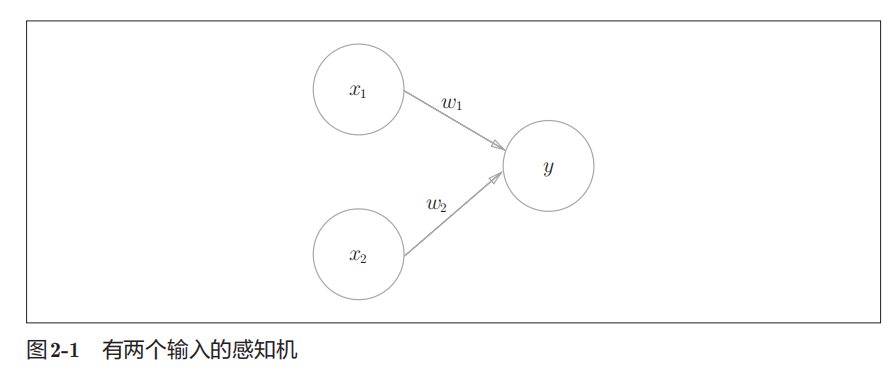

感知机的运行原理只有这些！把上述内容用数学式来表示，就是式（2.1）。
$$
y=\begin{cases} 0&(w_1x_1+w_2x_2\leqslant\theta)\\[2ex] 1&(w_1x_1+w_2x_2>\theta)\end{cases}
$$


## 2.2 简单逻辑电路

如图2-2所示，与门仅在两个输入均为1时输出1，其他时候则输出0

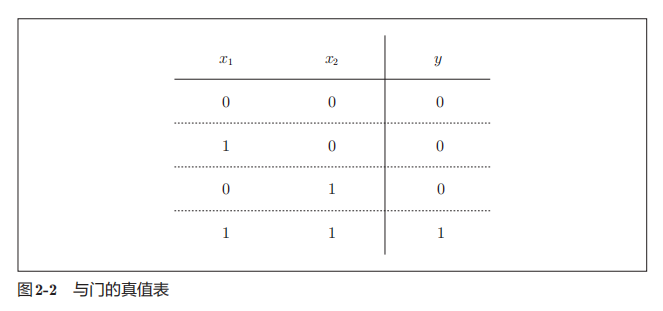


如图2-3所示，仅当x1和x2同时为1时输出0，其他时候则输出1。

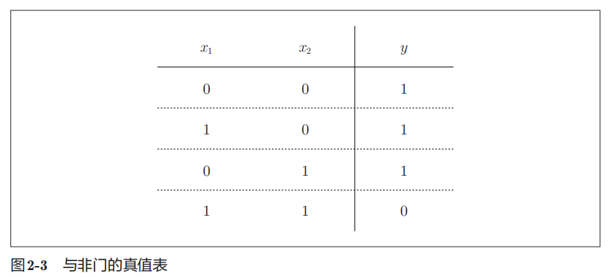


图2-4所示的或门。或门是“只要有一个输入信号是1，输出就为1”的逻辑电路。

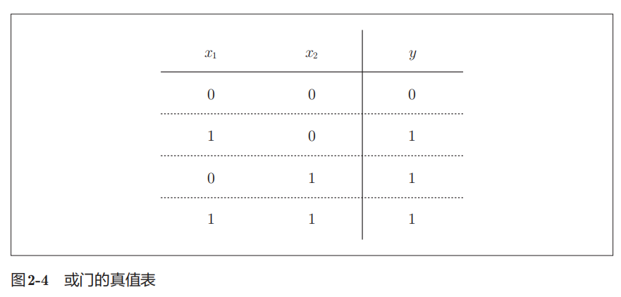

**使用感知机可以表示与门、与非门、或门的逻辑电路。**


## 2.3 感知机的实现

### 2.3.1　简单的实现

```python
def AND(x1, x2):
     w1, w2, theta = 0.5, 0.5, 0.7
     tmp = x1*w1 + x2*w2
     if tmp <= theta:
     	return 0
     elif tmp > theta:
     	return 1
```


### 2.3.2　导入权重和偏置

先把式（2.1）的θ换成−b，于是就可以用式（2.2）来表示感知机的行为。
$$
y=\left\{\begin{array}{ll}0&(b+w_1x_1+w_2x_2\leqslant0)\\[1ex]1&(b+w_1x_1+w_2x_2>0)\end{array}\right.
$$
此处，b称为偏置，w1和w2称为权重。


### 2.3.3　使用权重和偏置的实现

```python
def AND(x1, x2):
     x = np.array([x1, x2])
     w = np.array([0.5, 0.5])
     b = -0.7
     tmp = np.sum(w*x) + b
     if tmp <= 0:
     	return 0
     else:
     	return 1
```

这里把−θ命名为偏置b，但是请注意，偏置和权重w1、w2的作用是不一样的。具体地说，w1和w2是控制输入信号的重要性的参数，而偏置是调整神经元被激活的容易程度（输出信号为1的程度）的参数。偏置的值决定了神经元被激活的容易程度。


```python
def NAND(x1, x2):
     x = np.array([x1, x2])
     w = np.array([-0.5, -0.5]) # 仅权重和偏置与AND不同！
     b = 0.7
     tmp = np.sum(w*x) + b
     if tmp <= 0:
     	return 0
     else:
     	return 1

def OR(x1, x2):
    x = np.array([x1, x2])
 	w = np.array([0.5, 0.5]) # 仅权重和偏置与AND不同！
    b = -0.2
    tmp = np.sum(w*x) + b
    if tmp <= 0:
        return 0
    else:
        return 1
```

与门、与非门、或门是具有相同构造的感知机，区别只在于权重参数的值。


## 2.4 感知机的局限性

使用感知机可以实现与门、与非门、或门三种逻辑电路。现在我们来考虑一下异或门（XOR gate）

### 2.4.1　异或门

异或门也被称为逻辑异或电路。如图2-5所示，仅当x1或x2中的一方为1时，才会输出1（“异或”是拒绝其他的意思）。

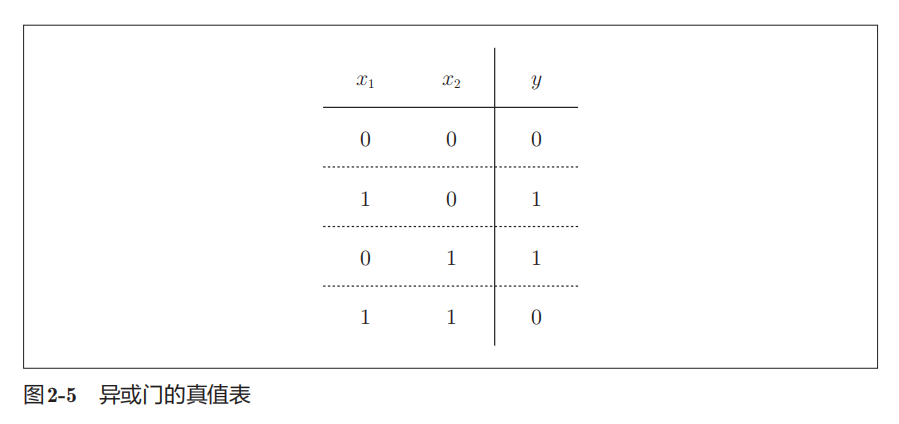

实际上，用前面介绍的感知机是无法实现这个异或门的。


那么，换成异或门的话会如何呢？能否像或门那样，用一条直线作出分割图2-7中的○和△的空间呢？

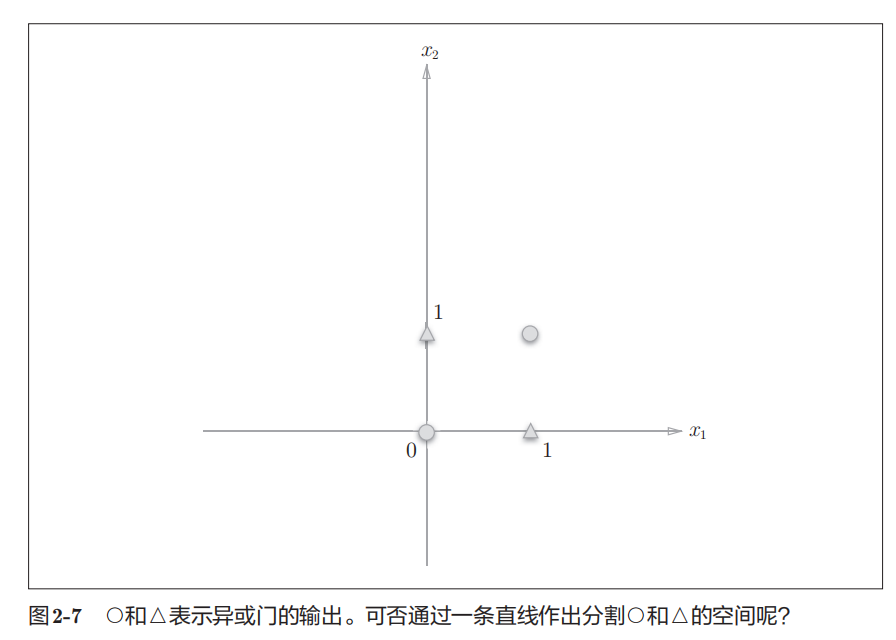


### 2.4.2　线性和非线性

感知机的局限性就在于它只能表示由一条直线分割的空间。图2-8这样弯曲的曲线无法用感知机表示。另外，由图2-8这样的曲线分割而成的空间称为非线性空间，由直线分割而成的空间称为线性空间。

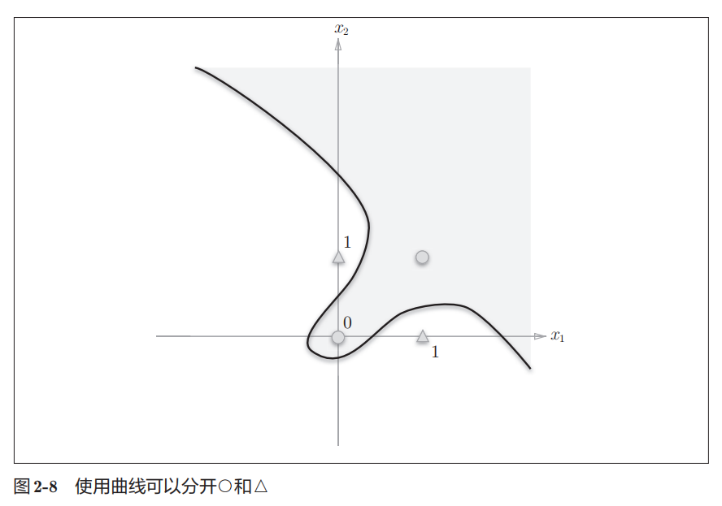


## 2.5 多层感知机

实际上，感知机的绝妙之处在于它可以“叠加层”


### 2.5.1　已有门电路的组合

与门、与非门、或门用图2-9中的符号表示。

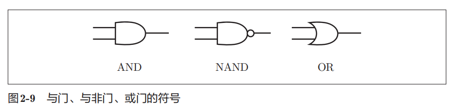


异或门可以通过图2-11所示的配置来实现。这里，x1和x2表示输入信号，y表示输出信号。

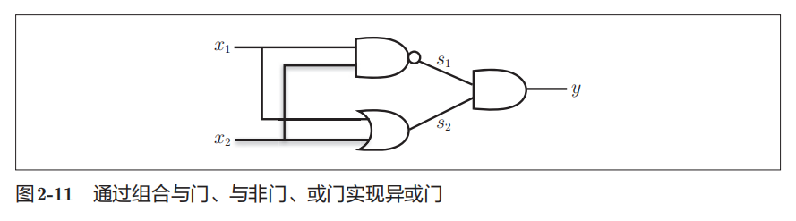

如图2-12所示，观察x1、x2、y，可以发现确实符合异或门的输出。

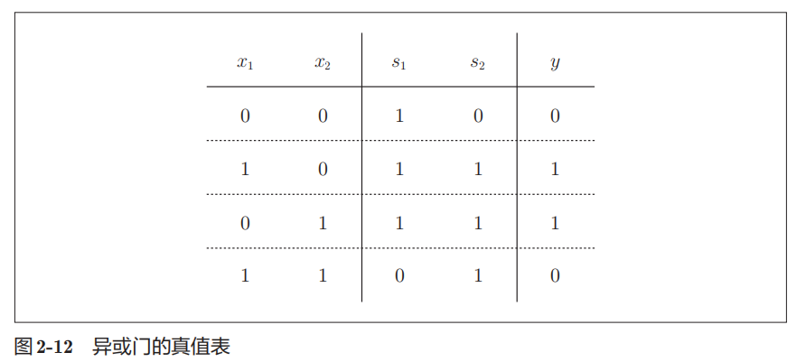


### 2.5.2　异或门的实现

```python
def XOR(x1, x2):
    s1 = NAND(x1, x2)
    s2 = OR(x1, x2)
    y = AND(s1, s2)
    return y
```

如图2-13所示，异或门是一种多层结构的神经网络。实际上，与门、或门是单层感知机，而异或门是2层感知机。叠加了多层的感知机也称为多层感知机（multi-layered perceptron）

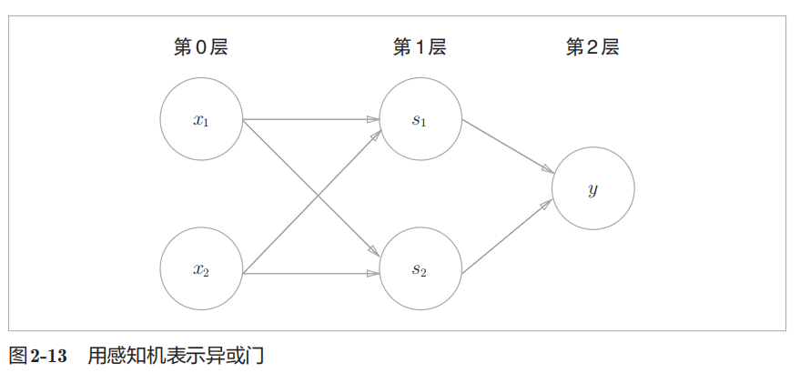


## 2.6 从与非门到计算机

如果通过组合与非门可以实现计算机的话，那么通过组合感知机也可以表示计算机（感知机的组合可以通过叠加了多层的单层感知机来表示）

感知机通过叠加层能够进行非线性的表示，理论上还可以表示计算机进行的处理。


# 3 神经网络

感知机的优劣：

- 优：即便对于复杂的函数，感知机也隐含着能够表示它的可能性。
- 劣：设定权重的工作，即确定合适的、能符合预期的输入与输出的权重，现在还是由人工进行的。

神经网络的出现就是为了解决刚才的劣势。具体地讲，神经网络的一个重要性质是它可以自动地从数据中学习到合适的权重参数。


## 3.1 从感知机到神经网络

### 3.1.1　神经网络的例子

用图来表示神经网络的话，如图3-1所示。我们把最左边的一列称为输入层，最右边的一列称为输出层，中间的一列称为中间层。中间层有时也称为隐藏层。图3-1中，第0层对应输入层，第1层对应中间层，第2层对应输出层。

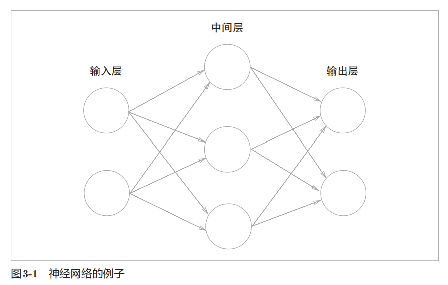


### 3.1.2　复习感知机

图3-2中的感知机接收 $x1$ 和 $x2$ 两个输入信号，输出y。如果用数学式来表示图3-2中的感知机，则如式（3.1）所示。

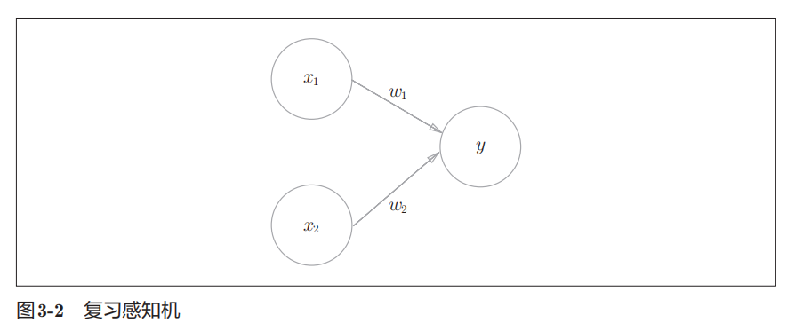
$$
y=\left\{\begin{array}{ll}0&(b+w_1x_1+w_2x_2\leqslant0)\\[1ex]1&(b+w_1x_1+w_2x_2>0)\end{array}\right.\quad(3.1)
$$
图3-3中添加了权重为b的输入信号1。这个感知机将`x1, x2, 1`三个信号作为神经元的输入，将其和各自的权重相乘后，传送至下一个神经元。在下一个神经元中，计算这些加权信号的总和。如果这个总和超过0，则输出1，否则输出0。

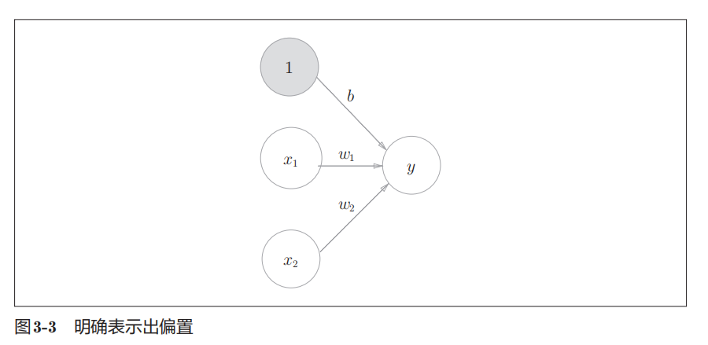

为了简化式（3.1），我们用一个函数来表示这种分情况的动作（超过0则输出1，否则输出0）。引入新函数
$h(x)$，将式（3.1）改写成下面的式（3.2）和式（3.3）

`(3.2)`
$$
y = h(b + w_1x_1 + w_2x_2)\quad(3.2)
$$
`(3.3)`
$$
h(x)=\begin{cases} 0&(x\leqslant0)\\ 1&(x>0)\end{cases}\quad(3.3)
$$


### 3.1.3　激活函数登场

刚才登场的 $h(x)$ 函数会将输入信号的总和转换为输出信号，这种函数一般称为**激活函数（activation function）**。
$$
a=b+w_1x_1+w_2x_2\quad(3.4)\\y=h(a)\quad(3.5)
$$
首先，式（3.4）计算加权输入信号和偏置的总和，记为`a`。然后，式（3.5）用`h()`函数将`a`转换为输出`y`。

如果要在图中明确表示出式（3.4）和式（3.5），则可以像图3-4这样做。

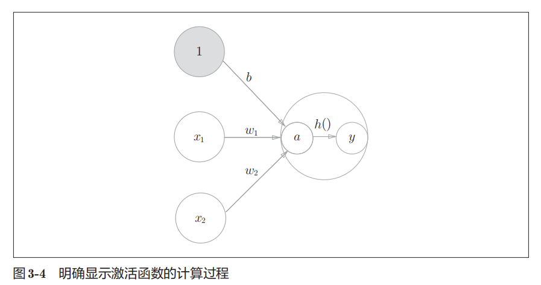


**激活函数是连接感知机和神经网络的桥梁。**

“朴素感知机”是指单层网络，指的是激活函数使用了阶跃函数A 的模型。“多层感知机”是指神经网络，即使用 sigmoid函数（后述）等平滑的激活函数的多层网络


## 3.2 激活函数

式（3.3）表示的激活函数以阈值为界，一旦输入超过阈值，就切换输出。这样的函数称为“阶跃函数”。

实际上，如果将激活函数从阶跃函数换成其他函数，就可以进入神经网络的世界了。下面我们就来介绍一下神经网络使用的激活函数。


### 3.2.1　sigmoid函数

神经网络中经常使用的一个激活函数就是式（3.6）表示的**sigmoid函数（sigmoid function）**。
$$
h(x)=\frac{1}{1+\exp(-x)}\quad(3.6)
$$
神经网络中用sigmoid函数作为激活函数，进行信号的转换，转换后的信号被传送给下一个神经元。实际上，上一章介绍的**感知机**和接下来要介绍的**神经网络**的**主要区别就在于这个激活函数**。


### 3.2.2　阶跃函数的实现

支持NumPy数组的实现

```python
def step_function(x):
    y = x > 0
    return y.astype(np.int)
```


### 3.2.3　阶跃函数的图形

```python
import numpy as np
import matplotlib.pylab as plt


def step_function(x):
 return np.array(x > 0, dtype=np.int)

x = np.arange(-5.0, 5.0, 0.1)
y = step_function(x)
plt.plot(x, y)
plt.ylim(-0.1, 1.1) # 指定y轴的范围
plt.show()
```

`step_function()`以该NumPy数组为参数，对数组的各个元素执行阶跃函数运算，并以数组形式返回运算结果。对数组x、y进行绘图，结果如图3-6所示。

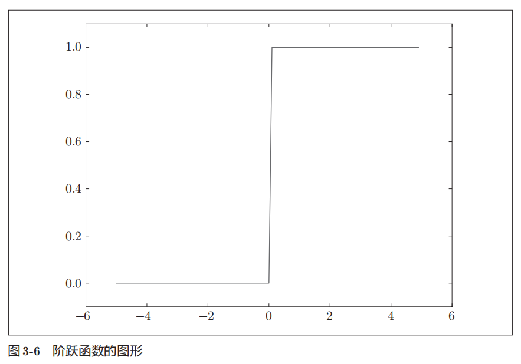


### 3.2.4　sigmoid函数的实现

```python
def sigmoid(x):
    return 1 / (1 + np.exp(-x))
```

sigmoid函数的实现能支持NumPy数组，秘密就在于NumPy的广播功能


sigmoid函数画在图上。

```python
x = np.arange(-5.0, 5.0, 0.1)
y = sigmoid(x)
plt.plot(x, y)
plt.ylim(-0.1, 1.1) # 指定y轴的范围
plt.show()
```

运行上面的代码，可以得到图3-7。

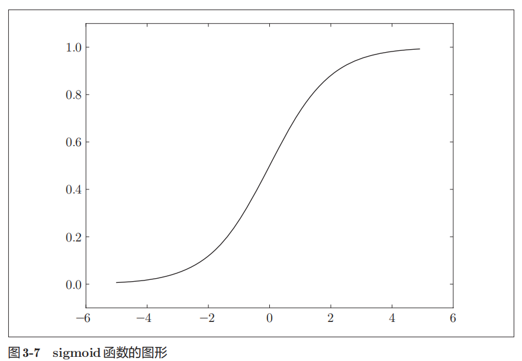


### 3.2.5　sigmoid函数和阶跃函数的比较

观察图3-8

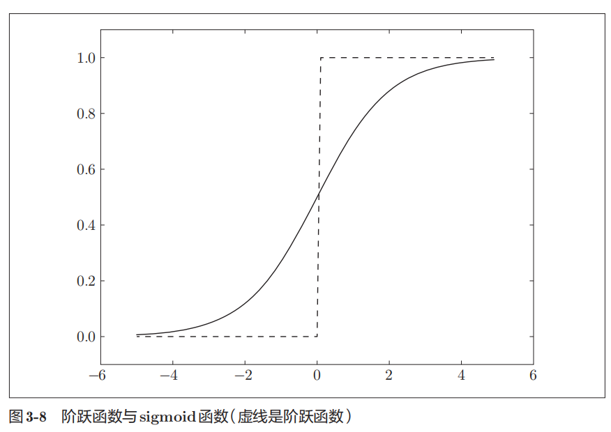

**不同点：**

- 首先注意到的是“平滑性”的不同。sigmoid函数是一条平滑的曲线，输出随着输入发生连续性的变化。而阶跃函数以0为界，输出发生急剧性的变化。sigmoid函数的平滑性对神经网络的学习具有重要意义
- 另一个不同点是，**感知机中神经元之间流动的是0或1的二元信号，而神经网络中流动的是连续的实数值信号**

**相同点：**

- 两者的结构均是“输入小时，输出接近0（为0）；随着输入增大，输出向1靠近（变成1）”。也就是说，当输入信号为重要信息时，阶跃函数和sigmoid函数都会输出较大的值；当输入信号为不重要的信息时，两者都输出较小的值。
- 不管输入信号有多小，或者有多大，输出信号的值都在0到1之间。


### 3.2.6　非线性函数

阶跃函数和sigmoid函数还有其他共同点，就是两者均为非线性函数。sigmoid函数是一条曲线，阶跃函数是一条像阶梯一样的折线，两者都属于非线性的函数

神经网络的激活函数必须使用非线性函数。为什么不能使用线性函数呢？因为使用线性函数的话，加深神经网络的层数就没有意义了。

线性函数的问题在于，不管如何加深层数，总是存在与之等效的“无隐藏层的神经网络”。

为了发挥叠加层所带来的优势，激活函数必须使用非线性函数


### 3.2.7　ReLU函数

ReLU函数可以表示为下面的式(3.7)。
$$
h(x)=\begin{cases} x&(x>0)\\ 0&(x\leqslant0)\end{cases}\quad(3.7)
$$
ReLU（Rectified Linear Unit）函数在输入大于0时，直接输出该值；在输入小于等于0时，输出0（图3-9）。

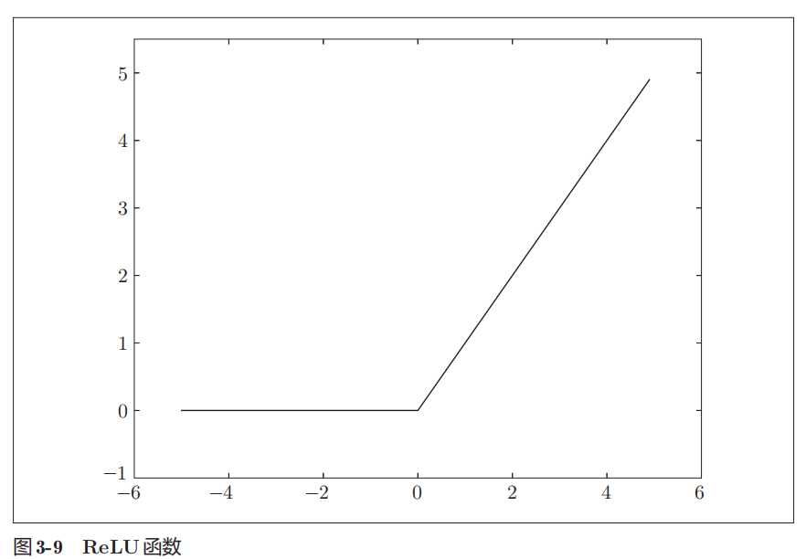

ReLU函数的实现也很简单，可以写成如下形式。

```python
def relu(x):
    return np.maximum(0, x)
```


## 3.3 多维数组的运算

### 3.3.1　多维数组

```python
>>> import numpy as np
>>> A = np.array([1, 2, 3, 4])
>>> print(A)
[1 2 3 4]
>>> np.ndim(A)
1
>>> A.shape
(4,)
>>> A.shape[0]
4
```

如上所示，数组的维数可以通过np.ndim()函数获得。此外，数组的形状可以通过实例变量shape获得。


下面我们来生成一个二维数组。

```python
>>> B = np.array([[1,2], [3,4], [5,6]])
>>> print(B)
[[1 2]
 [3 4]
 [5 6]]
>>> np.ndim(B)
2
>>> B.shape
(3, 2)
```

二维数组也称为矩阵（matrix）。如图3-10所示，数组的横向排列称为行（row），纵向排列称为列（column）


### 3.3.2　矩阵乘法

矩阵（二维数组）的乘积。比如2 × 2的矩阵，其乘积可以像图3-11这样进行计算

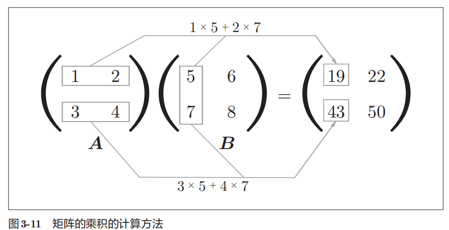

如本例所示，矩阵的乘积是通过左边矩阵的行（横向）和右边矩阵的列（纵向）以对应元素的方式相乘后再求和而得到的。

这个运算在Python中可以用如下代码实现。

```python
>>> A = np.array([[1,2], [3,4]])
>>> A.shape
(2, 2)
>>> B = np.array([[5,6], [7,8]])
>>> B.shape
(2, 2)
>>> np.dot(A, B)
array([[19, 22],
 [43, 50]])
```

np.dot()接收两个NumPy数组作为参数，并返回数组的乘积。


### 3.3.3　神经网络的内积

这里我们以图3-14中的简单神经网络为对象。这个神经网络省略了偏置和激活函数，只有权重。

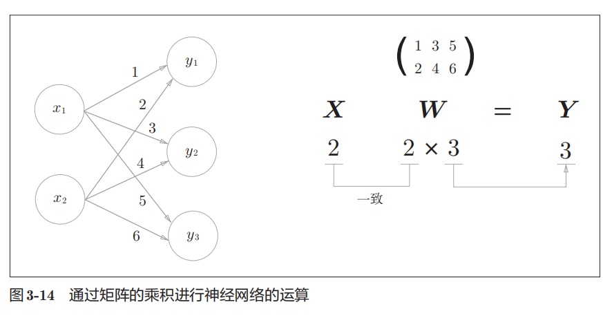

实现该神经网络时，要注意$X、W、Y$的形状，特别是$X$和$W$的对应维度的元素个数是否一致，这一点很重要。

```python
>>> X = np.array([1, 2])
>>> X.shape
(2,)
>>> W = np.array([[1, 3, 5], [2, 4, 6]])
>>> print(W)
[[1 3 5]
 [2 4 6]]
>>> W.shape
(2, 3)
>>> Y = np.dot(X, W)
>>> print(Y)
[ 5 11 17]
```


## 3.4 3层神经网络的实现

以图3-15的3层神经网络为对象，实现从输入到输出的（前向）处理。

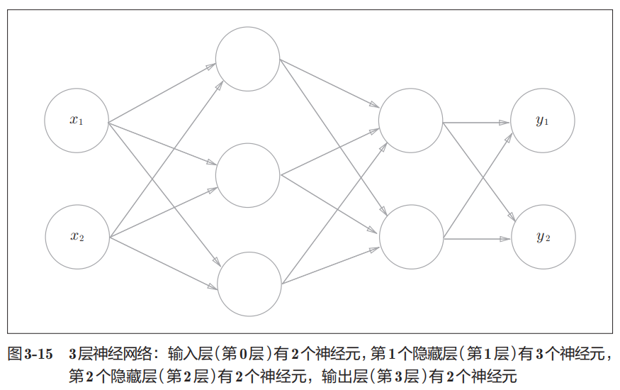


### 3.4.1 符号确认

我们先从定义符号开始。请看图3-16。图3-16中只突出显示了从输入层神经元 $x_2$ 到后一层的神经元 $a_1^{(1)}$ 的权重。

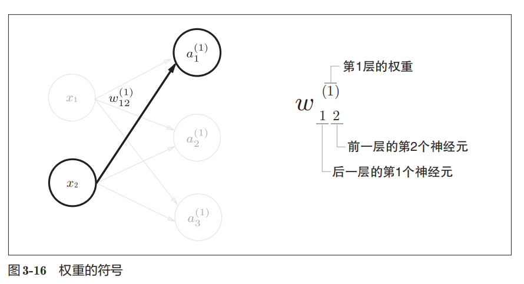


### 3.4.2 各层间信号传递的实现

现在看一下从输入层到第1层的第1个神经元的信号传递过程，如图3-17所示。图3-17中增加了表示偏置的神经元“1”

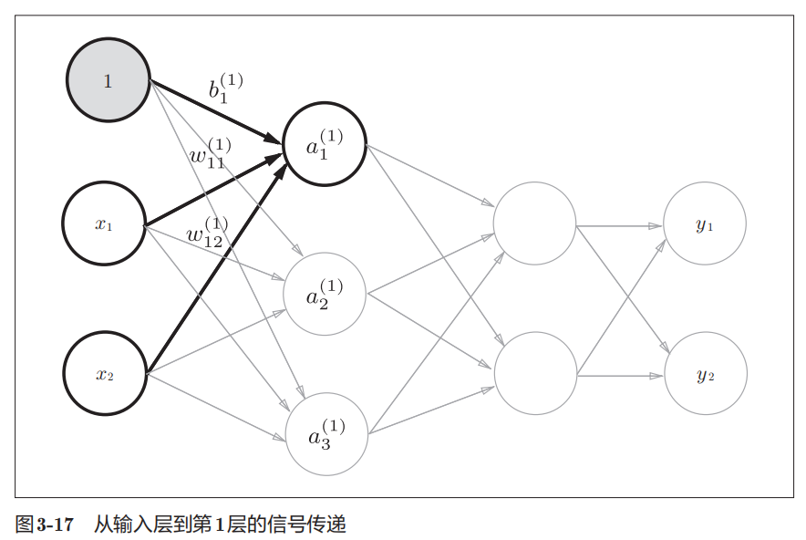

为了确认前面的内容，现在用数学式表示 。 通过加权信号和偏置的和按如下方式进行计算。
$$
a_1^{(1)}=w_{11}^{(1)}x_1+w_{12}^{(1)}x_2+b_1^{(1)}
$$
此外，如果使用矩阵的乘法运算，则可以将第1层的加权和表示成下面的式（3.9）
$$
A^{(1)}=XW^{(1)}+B^{(1)}\quad(3.9)
$$
其中，$A^{(1)}、X、B^{(1)}、W^{(1)}$ 如下所示。
$$
\begin{aligned}
&A^{(1)} =\begin{pmatrix}a_1^{(1)}&a_2^{(1)}&a_3^{(1)}\end{pmatrix}, \boldsymbol{X}=\begin{pmatrix}x_1&x_2\end{pmatrix}, \boldsymbol{B}^{(1)}=\begin{pmatrix}b_1^{(1)}&b_2^{(1)}&b_3^{(1)}\end{pmatrix} \\
&W^{(1)} =\begin{pmatrix}w_{11}^{(1)}&w_{21}^{(1)}&w_{31}^{(1)}\\w_{12}^{(1)}&w_{22}^{(1)}&w_{32}^{(1)}\end{pmatrix} 
\end{aligned}
$$
**下面我们用NumPy多维数组来实现式（3.9）**，这里将输入信号、权重、偏置设置成任意值。

```python
X = np.array([1.0, 0.5])
W1 = np.array([[0.1, 0.3, 0.5], [0.2, 0.4, 0.6]])
B1 = np.array([0.1, 0.2, 0.3])

print(W1.shape) # (2, 3)
print(X.shape) # (2,)
print(B1.shape) # (3,)

A1 = np.dot(X, W1) + B1
```


**接下来，我们观察第1层中激活函数的计算过程。**如果把这个计算过程用图来表示的话，则如图3-18所示。

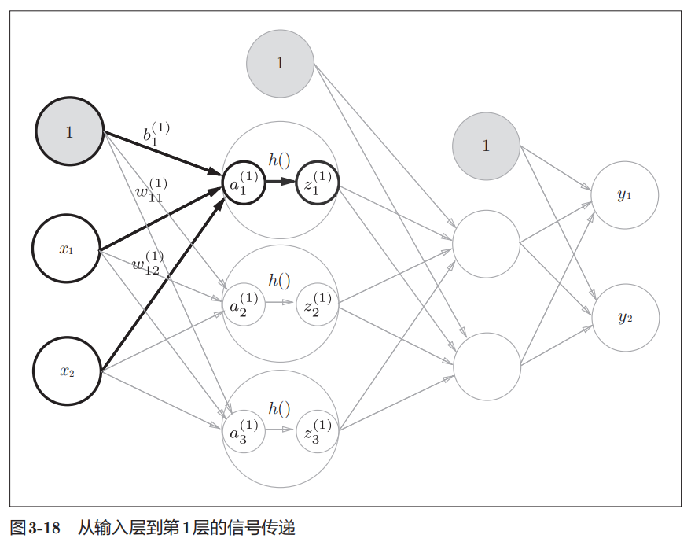

如图3-18所示，**隐藏层的加权和（加权信号和偏置的总和）用a表示，被激活函数转换后的信号用z表示**。此外，图中h()表示激活函数，这里我们使用的是sigmoid函数。用Python来实现，代码如下所示。

```python
Z1 = sigmoid(A1)

print(A1) # [0.3, 0.7, 1.1]
print(Z1) # [0.57444252, 0.66818777, 0.75026011]
```


**下面，我们来实现第1层到第2层的信号传递（图3-19）。**

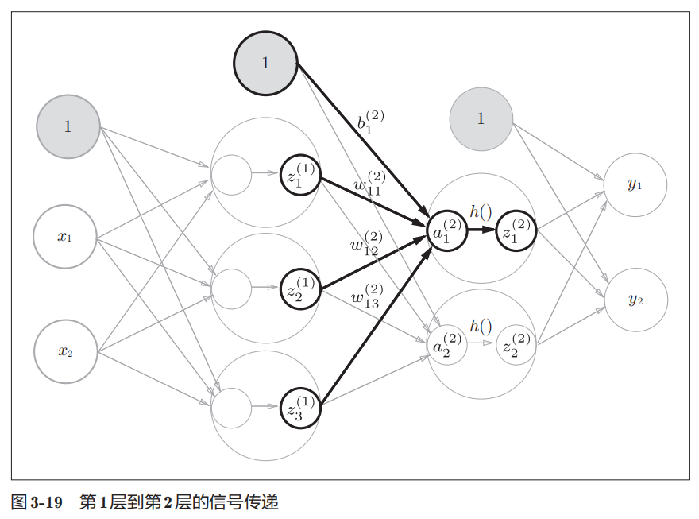

```python
W2 = np.array([[0.1, 0.4], [0.2, 0.5], [0.3, 0.6]])
B2 = np.array([0.1, 0.2])

print(Z1.shape) # (3,)
print(W2.shape) # (3, 2)
print(B2.shape) # (2,)

A2 = np.dot(Z1, W2) + B2
Z2 = sigmoid(A2)
```


**最后是第2层到输出层的信号传递（图3-20）。**输出层的实现也和之前的实现基本相同。不过，最后的激活函数和之前的隐藏层有所不同。

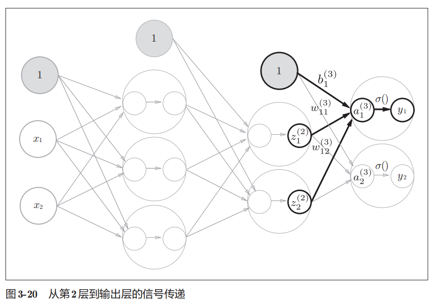

```python
def identity_function(x):
    return x

W3 = np.array([[0.1, 0.3], [0.2, 0.4]])
B3 = np.array([0.1, 0.2])

A3 = np.dot(Z2, W3) + B3
Y = identity_function(A3) # 或者Y = Z3
```

这里我们定义了identity_function()函数（也称为“恒等函数”），并将其作为输出层的激活函数。图3-20中，输出层的激活函数用σ()表示，不同于隐藏层的激活函数h()（σ读作sigma）


### 3.4.3 代码实现小结

这里，我们按照神经网络的实现惯例，只把权重记为大写字母W1，其他的（偏置或中间结果等）都用小写字母表示。

```python
def init_network():
    network = {}
    network['W1'] = np.array([[0.1, 0.3, 0.5], [0.2, 0.4, 0.6]])
    network['b1'] = np.array([0.1, 0.2, 0.3])
    network['W2'] = np.array([[0.1, 0.4], [0.2, 0.5], [0.3, 0.6]])
    network['b2'] = np.array([0.1, 0.2])
    network['W3'] = np.array([[0.1, 0.3], [0.2, 0.4]])
    network['b3'] = np.array([0.1, 0.2])
    return network


def forward(network, x):
    W1, W2, W3 = network['W1'], network['W2'], network['W3']
    b1, b2, b3 = network['b1'], network['b2'], network['b3']
    a1 = np.dot(x, W1) + b1
    z1 = sigmoid(a1)
    a2 = np.dot(z1, W2) + b2
    z2 = sigmoid(a2)
    a3 = np.dot(z2, W3) + b3
    y = identity_function(a3)
    return y


network = init_network()
x = np.array([1.0, 0.5])
y = forward(network, x)
print(y) # [ 0.31682708 0.69627909]
```

forward()函数中则封装了将输入信号转换为输出信号的处理过程。这里出现了forward（前向）一词，它表示的是从输入到输出方向的传递处理。


## 3.5 输出层的设计

神经网络可以用在分类问题和回归问题上，不过需要根据情况改变输出层的激活函数。

一般而言，回归问题用**恒等函数**，分类问题用**softmax函数**。


### 3.5.1 恒等函数和 softmax函数

**恒等函数**的处理过程用之前的神经网络图来表示的话，则如图3-21所示。

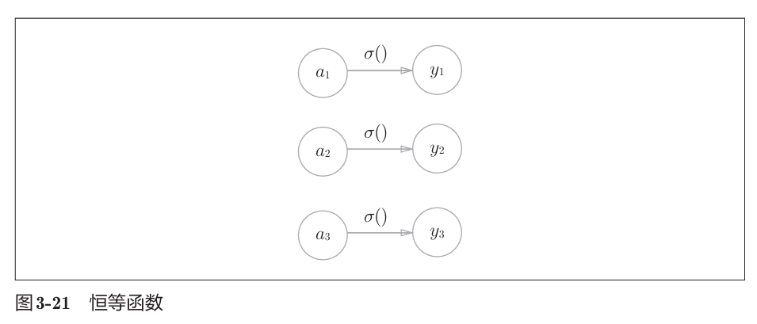


分类问题中使用的**softmax函数**可以用下面的式（3.10）表示。
$$
y_k=\frac{\exp(a_k)}{\sum\limits_{i=1}^n\exp(a_i)}\quad(3.10)
$$
用图表示softmax函数的话，如图3-22所示。图3-22中，softmax函数的输出通过箭头与所有的输入信号相连。

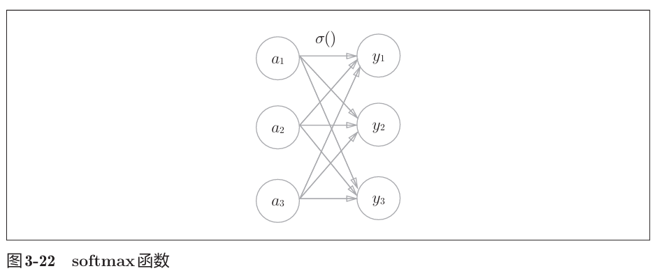

Python实现softmax函数：

```python
def softmax(a):
    exp_a = np.exp(a)
    sum_exp_a = np.sum(exp_a)
    y = exp_a / sum_exp_a
    return a
```


### 3.5.2 实现 softmax函数时的注意事项

上面的softmax函数的实现虽然正确描述了式（3.10），但在计算机的运算上有一定的缺陷。这个缺陷就是**溢出问题**。softmax函数的实现中要进行指数函数的运算，但是此时**指数函数的值很容易变得非常大**。如果在这些超大值之间进行除法运算，结果会出现“不确定”的情况。

softmax函数的实现可以像式（3.11）这样进行改进。
$$
\begin{aligned}y_k=\frac{\exp(a_k)}{\sum\limits_{i=1}^n\exp(a_i)}&=\frac{\mathrm{C}\exp(a_k)}{\mathrm{C}\sum\limits_{i=1}^n\exp(a_i)}\\&=\frac{\exp(a_k+\log\mathrm{C})}{\sum\limits_{i=1}^n\exp(a_i+\log\mathrm{C})}\\&=\frac{\exp(a_k+\mathrm{C}^{\prime})}{\sum\limits_{i=1}^n\exp(a_i+\mathrm{C}^{\prime})}\end{aligned}\quad(3.11)
$$
**式（3.11）说明，在进行softmax的指数函数的运算时，加上（或者减去）某个常数并不会改变运算的结果**。这里的C 可以使用任何值，但是为了防止溢出，一般会使用输入信号中的最大值。

增加溢出对策，Python实现：

```python
def softmax(a):
    c = np.max(a)
    exp_a = np.exp(a - c)  # 溢出对策
    sum_exp_a = np.sum(exp_a)
    y = exp_a / sum_exp_a
    return y
```


### 3.5.3 softmax函数的特征

使用softmax()函数，可以按如下方式计算神经网络的输出。

```python
>>> a = np.array([0.3, 2.9, 4.0])
>>> y = softmax(a)
>>> print(y)
[ 0.01821127 0.24519181 0.73659691]
>>> np.sum(y)
1.0
```

如上所示，softmax函数的输出是0.0到1.0之间的实数。并且，softmax函数的输出值的总和是1。输出总和为1是softmax函数的一个重要性质。正因为有了这个性质，我们才可以把softmax函数的输出解释为“概率”

通过使用softmax函数，我们可以用概率的（统计的）方法处理问题。

**一般而言，神经网络只把输出值最大的神经元所对应的类别作为识别结果。**并且，即便使用softmax函数，输出值最大的神经元的位置也不会变。因此，神经网络在进行分类时，输出层的softmax函数可以省略。在实际的问题中，由于指数函数的运算需要一定的计算机运算量，因此输出层的softmax函数一般会被省略。


### 3.5.4 输出层的神经元数量

输出层的神经元数量需要根据待解决的问题来决定。**对于分类问题，输出层的神经元数量一般设定为类别的数量。**

如图3-23所示，在这个例子中，输出层的神经元从上往下依次对应数字0, 1, ..., 9。此外，图中输出层的神经元的值用不同的灰度表示。这个例子中神经元y2颜色最深，输出的值最大。

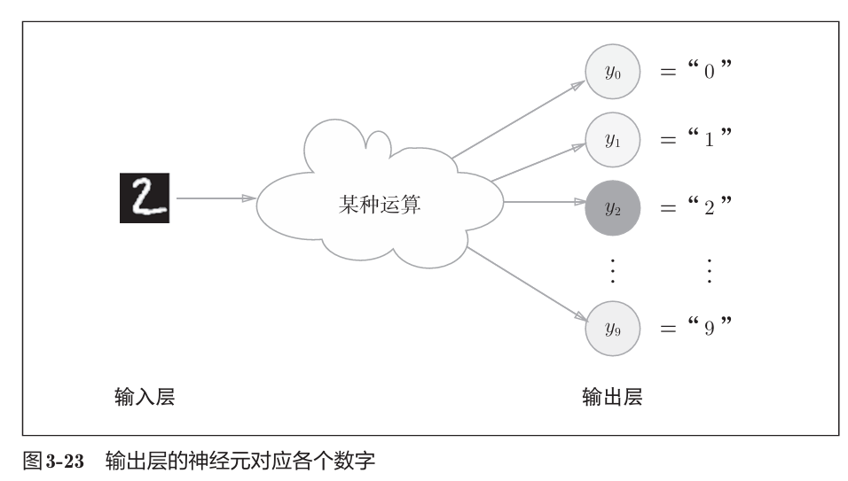


## 3.6 手写数字识别

这里我们来进行手写数字图像的分类。假设学习已经全部结束，我们使用学习到的参数，先实现神经网络的“推理处理”。这个推理处理也称为神经网络的**前向传播（forward propagation）**。


### 3.6.1 MNIST数据集

MNIST数据集是由0到9的数字图像构成的（图3-24）。训练图像有6万张，测试图像有1万张，这些图像可以用于学习和推理。MNIST数据集的一般使用方法是，先用训练图像进行学习，再用学习到的模型度量能在多大程度上对测试图像进行正确的分类

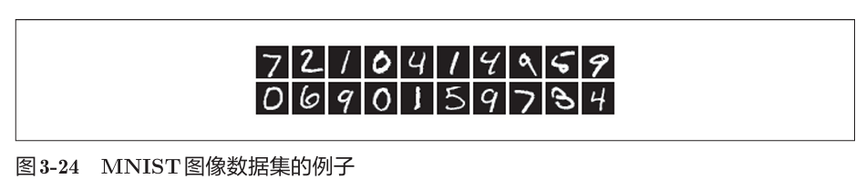

使用mnist.py中的load_mnist()函数，就可以按下述方式轻松读入MNIST数据。

```python
import sys, os
sys.path.append(os.pardir) # 为了导入父目录中的文件而进行的设定
from dataset.mnist import load_mnist

# 第一次调用会花费几分钟 ……
(x_train, t_train), (x_test, t_test) = load_mnist(flatten=True, normalize=False)

# 输出各个数据的形状
print(x_train.shape) # (60000, 784)
print(t_train.shape) # (60000,)
print(x_test.shape) # (10000, 784)
print(t_test.shape) # (10000,)
```


现在，我们试着显示MNIST图像，同时也确认一下数据。图像的显示使用PIL（Python Image Library）模块。执行下述代码后，训练图像的第一张就会显示出来，如图3-25所示（源代码在ch03/mnist_show.py中）。

```python
import sys, os
sys.path.append(os.pardir)
import numpy as np
from dataset.mnist import load_mnist
from PIL import Image

def img_show(img):
    pil_img = Image.fromarray(np.uint8(img))
    pil_img.show()


(x_train, t_train), (x_test, t_test) = load_mnist(flatten=True, normalize=False)
img = x_train[0]
label = t_train[0]
print(label) # 5

print(img.shape) # (784,)
img = img.reshape(28, 28) # 把图像的形状变成原来的尺寸
print(img.shape) # (28, 28)

img_show(img)
```


### 3.6.2 神经网络的推理处理

神经网络的输入层有784个神经元，输出层有10个神经元。输入层的784这个数字来源于图像大小的28 × 28 = 784，输出层的10这个数字来源于10类别分类（数字0到9，共10类别）。此外，这个神经网络有2个隐藏层，第1个隐藏层有50个神经元，第2个隐藏层有100个神经元。这个50和100可以设置为任何值。

`ch03/neuralnet_mnist.py`

```python
def get_data():
    (x_train, t_train), (x_test, t_test) = load_mnist(normalize=True, flatten=True, one_hot_label=False)
    return x_test, t_test


def init_network():
    with open("sample_weight.pkl", 'rb') as f:
        network = pickle.load(f)
    return network


def predict(network, x):
    W1, W2, W3 = network['W1'], network['W2'], network['W3']
    b1, b2, b3 = network['b1'], network['b2'], network['b3']
    a1 = np.dot(x, W1) + b1
    z1 = sigmoid(a1)
    a2 = np.dot(z1, W2) + b2
    z2 = sigmoid(a2)
    a3 = np.dot(z2, W3) + b3
    y = softmax(a3)
    return y
```


**现在，我们用这3个函数来实现神经网络的推理处理。然后，评价它的识别精度（accuracy）**，即能在多大程度上正确分类。

```python
x, t = get_data()
network = init_network()

accuracy_cnt = 0
for i in range(len(x)):
    y = predict(network, x[i])
    p = np.argmax(y) # 获取概率最高的元素的索引
    if p == t[i]:
        accuracy_cnt += 1

print("Accuracy:" + str(float(accuracy_cnt) / len(x)))
```

在这个例子中，我们把load_mnist函数的参数normalize设置成了True。将normalize设置成True后，函数内部会进行转换，将图像的各个像素值除以255，使得数据的值在0.0～1.0的范围内。**像这样把数据限定到某个范围内的处理称为正规化（normalization）**。此外，**对神经网络的输入数据进行某种既定的转换称为预处理（pre-processing）**。


### 3.6.3 批处理

现在我们来关注输入数据和权重参数的“形状”。使用Python解释器，输出刚才的神经网络的各层的权重的形状。

```python
>>> x, _ = get_data()
>>> network = init_network()
>>> W1, W2, W3 = network['W1'], network['W2'], network['W3']
>>>
>>> x.shape
(10000, 784)
>>> x[0].shape
(784,)
>>> W1.shape
(784, 50)
>>> W2.shape
(50, 100)
>>> W3.shape
(100, 10)
```

用图表示的话，如图3-26所示。可以发现，多维数组的对应维度的元素个数确实是一致的。

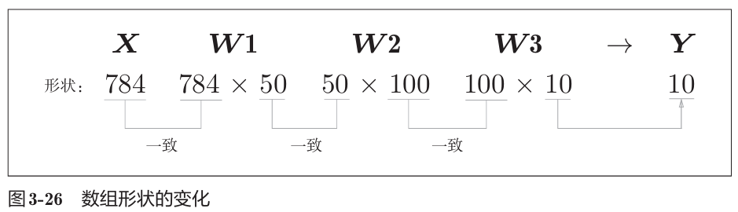

从整体的处理流程来看，图3-26中，输入一个由784个元素（原本是一个28 × 28的二维数组）构成的一维数组后，输出一个有10个元素的一维数组。这是只输入一张图像数据时的处理流程。


现在我们来考虑打包输入多张图像的情形。比如，我们想用predict()函数一次性打包处理100张图像。为此，可以把x的形状改为100 × 784，将100张图像打包作为输入数据。用图表示的话，如图3-27所示。

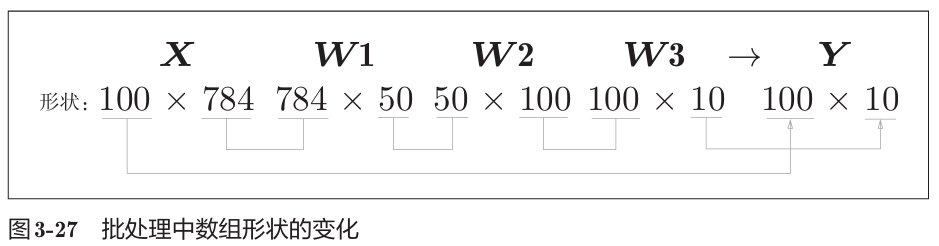

这种打包式的输入数据称为**批（batch）**。下面我们进行基于**批处理**的代码实现。

```python
x, t = get_data()
network = init_network()

batch_size = 100 # 批数量
accuracy_cnt = 0

for i in range(0, len(x), batch_size):
    x_batch = x[i:i+batch_size]
    y_batch = predict(network, x_batch)
    p = np.argmax(y_batch, axis=1)
    accuracy_cnt += np.sum(p == t[i:i+batch_size])

print("Accuracy:" + str(float(accuracy_cnt) / len(x)))
```


批处理对计算机的运算大有利处，可以大幅缩短每张图像的处理时间。这是因为大多数处理数值计算的库都进行了能够高效处理大型数组运算的最优化。并且，在神经网络的运算中，当数据传送成为瓶颈时，批处理可以减轻数据总线的负荷。**批处理一次性计算大型数组要比分开逐步计算各个小型数组速度更快。**


# 4 神经网络的学习

这里所说的“学习”是指从训练数据中自动获取最优权重参数的过程。


## 4.1 从数据中学习

### 4.1.1 数据驱动

数据是机器学习的命根子。从数据中寻找答案、从数据中发现模式、根据数据讲故事


现在我们来思考一个具体的问题，比如如何实现数字“5”的识别。数字5是图4-1所示的手写图像，我们的目标是实现能区别是否是5的程序。这个问题看起来很简单，大家能想到什么样的算法呢？

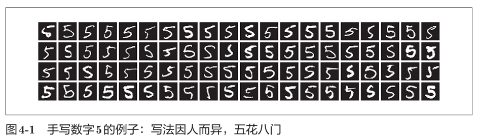

与其绞尽脑汁，从零开始想出一个可以识别5的算法，不如考虑通过有效利用数据来解决这个问题。

如图4-2所示，神经网络直接学习图像本身。在第2个方法，即利用特征量和机器学习的方法中，特征量仍是由人工设计的，而在神经网络中，连图像中包含的重要特征量也都是由机器来学习的。

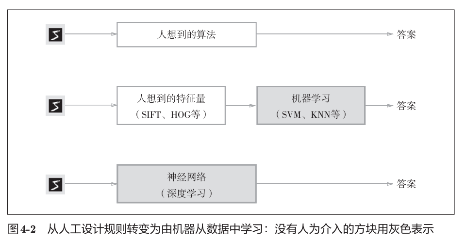

深度学习有时也称为端到端机器学习（end-to-end machine learning）。这里所说的端到端是指从一端到另一端的意思，也就是从原始数据（输入）中获得目标结果（输出）的意思。

神经网络的优点是对所有的问题都可以用同样的流程来解决。


### 4.1.2 训练数据和测试数据

机器学习中，一般将数据分为**训练数据**和**测试数据**两部分来进行学习和实验等。

- 使用**训练数据**进行学习，寻找最优的参数；
- 使用**测试数据**评价训练得到的模型的实际能力。

为了正确评价**模型的泛化能力**，就必须划分训练数据和测试数据。

**泛化能力**是指处理未被观察过的数据（不包含在训练数据中的数据）的能力。获得泛化能力是机器学习的最终目标。

因此，仅仅用一个数据集去学习和评价参数，是无法进行正确评价的。这样会导致可以顺利地处理某个数据集，但无法处理其他数据集的情况。只对某个数据集过度拟合的状态称为**过拟合（over fitting）**。


## 4.2 损失函数

神经网络的学习通过某个指标表示现在的状态。然后，以这个指标为基准，寻找最优权重参数。神经网络以某个指标为线索寻找最优权重参数。神经网络的学习中所用的指标称为**损失函数（loss function）**。这个损失函数可以使用任意函数，但一般用**均方误差**和**交叉熵误差**等。

损失函数是表示神经网络性能的“恶劣程度”的指标，即**当前的神经网络对监督数据在多大程度上不拟合，在多大程度上不一致。**


### 4.2.1 均方误差

可以用作损失函数的函数有很多，其中最有名的是**均方误差（mean squared error）**。均方误差如下式所示。
$$
E=\frac{1}{2}\sum_k(y_k-t_k)^2\quad(4.1)
$$
这里，yk是表示神经网络的输出，tk表示监督数据，k表示数据的维数。

```python
>>> y = [0.1, 0.05, 0.6, 0.0, 0.05, 0.1, 0.0, 0.1, 0.0, 0.0]
>>> t = [0, 0, 1, 0, 0, 0, 0, 0, 0, 0]
```

这里，神经网络的输出y是softmax函数的输出。由于softmax函数的输出可以理解为概率。将正确解标签表示为1，其他标签表示为0的表示方法称为**one-hot表示**。

现在，我们用Python来实现这个均方误差:

```python
def mean_squard_error(y, t):
    return 0.5 * np.sum((y - t) ** 2)
```


### 4.2.2 交叉熵误差

**交叉熵误差（cross entropy error）**也经常被用作损失函数。交叉熵误差如下式所示。
$$
E=-\sum_kt_k\log y_k\quad(4.2)
$$
这里，log表示以e为底数的自然对数（log e）。yk是神经网络的输出，tk是正确解标签。

用代码实现交叉熵误差:

```python
def cross_entropy_error(y, t):
    delta = 1e-7
    return -np.sum(t * np.log(y + delta))
```

这里，参数y和t是NumPy数组。函数内部在计算np.log时，加上了一个微小值delta。这是因为，当出现np.log(0)时，np.log(0)会变为负无限大的-inf，这样一来就会导致后续计算无法进行。作为保护性对策，添加一个微小值可以防止负无限大的发生。


### 4.2.3 mini-batch学习

机器学习使用训练数据进行学习。就是针对训练数据计算损失函数的值，找出使该值尽可能小的参数。因此，**计算损失函数时必须将所有的训练数据作为对象。**


如果要求所有训练数据的损失函数的总和，以交叉熵误差为例，可以写成下面的式（4.3）
$$
E=-\frac{1}{N}\sum_{n}\sum_{k}t_{nk}\log y_{nk}\quad(4.3)
$$
这里,假设数据有N个，tnk表示第n个数据的第k个元素的值（ynk是神经网络的输出，tnk是监督数据）。其实只是把求单个数据的损失函数的式（4.2）扩大到了N份数据，不过最后还要除以N进行正规化。通过除以N，可以求单个数据的“平均损失函数”。通过这样的平均化，可以获得和训练数据的数量无关的统一指标。


从全部数据中选出一部分，作为全部数据的“近似”。神经网络的学习也是从训练数据中选出一批数据（称为mini-batch,小批量），然后对每个mini-batch进行学习。这种学习方式称为**mini-batch学习**。

代码实现：

```python
import sys, os
sys.path.append(os.pardir)
import numpy as np
from dataset.mnist import load_mnist

(x_train, t_train), (x_test, t_test) = load_mnist(normalize=True,one_hot_label=True)
print(x_train.shape) # (60000, 784)
print(t_train.shape) # (60000, 10)

train_size = x_train.shape[0]
batch_size = 10
batch_mask = np.random.choice(train_size, batch_size)
x_batch = x_train[batch_mask]
t_batch = t_train[batch_mask]
```


### 4.2.4 mini-batch版交叉熵误差的实现

实现一个可以同时处理单个数据和批量数据（数据作为batch集中输入）两种情况的函数。

```python
def cross_entropy_error(y, t):
    if y.ndim == 1:
        t = t.reshape(1, t.size)
        y = y.reshape(1, y.size)
	
    batch_size = y.shape[0]
    return -np.sum(t * np.log(y + 1e-7)) / batch_size
```


此外，当监督数据是标签形式（非one-hot表示，而是像“2”“7”这样的标签）时，交叉熵误差可通过如下代码实现。

```python
def cross_entropy_error(y, t):
    if y.ndim == 1:
        t = t.reshape(1, t.size)
        y = y.reshape(1, y.size)
        
	batch_size = y.shape[0]
	return -np.sum(np.log(y[np.arange(batch_size), t] + 1e-7)) / batch_size
```

实现的要点是，由于one-hot表示中t为0的元素的交叉熵误差也为0，因此针对这些元素的计算可以忽略。


### 4.2.5 为何要设定损失函数

在神经网络的学习中，寻找最优参数（权重和偏置）时，要寻找使损失函数的值尽可能小的参数。为了找到使损失函数的值尽可能小的地方，需要计算参数的导数（确切地讲是梯度），然后以这个导数为指引，逐步更新参数的值。

在进行神经网络的学习时，不能将识别精度作为指标。因为如果以识别精度为指标，则参数的导数在绝大多数地方都会变为0。

识别精度对微小的参数变化基本上没有什么反应，即便有反应，它的值也是不连续地、突然地变化。作为激活函数的阶跃函数也有同样的情况。出于相同的原因，如果使用阶跃函数作为激活函数，神经网络的学习将无法进行。

阶跃函数就像“竹筒敲石”一样，只在某个瞬间产生变化。而sigmoid函数，如图4-4所示，不仅函数的输出（竖轴的值）是连续变化的，曲线的斜率（导数）也是连续变化的。也就是说，sigmoid函数的导数在任何地方都不为0。这对神经网络的学习非常重要。

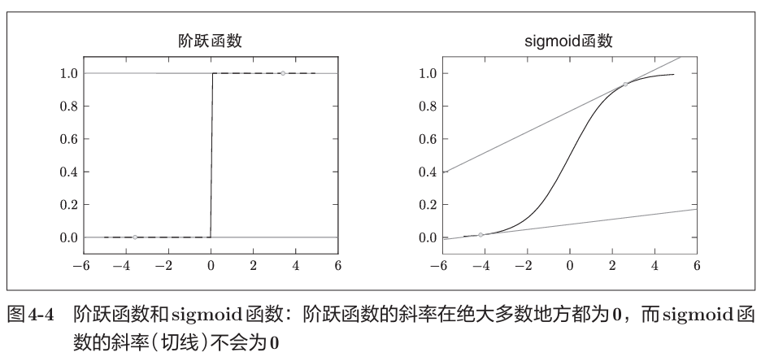


## 4.3 数值微分

梯度法使用梯度的信息决定前进的方向。


### 4.3.1 导数

导数就是表示某个瞬间的变化量。它可以定义成下面的式子。
$$
\frac{\mathrm df(x)}{\mathrm dx}=\lim\limits_{h\to0}\frac{f(x+h)-f(x)}{h}\quad(4.4)
$$
式（4.4）表示的是函数的导数。左边的符号 $ df(x)/dx $ 表示f（x）关于x的导数，即 f(x) 相对于x的变化程度。式（4.4）表示的导数的含义是，x的“微小变化”将导致函数f（x）的值在多大程度上发生变化。


如图4-5所示，数值微分含有误差。为了减小这个误差，我们可以**计算函数f在(x + h)和(x − h)之间的差分**。因为这种计算方法以x为中心，计算它左右两边的差分，所以也称为**中心差分**（而(x + h)和x之间的差分称为前向差分）。

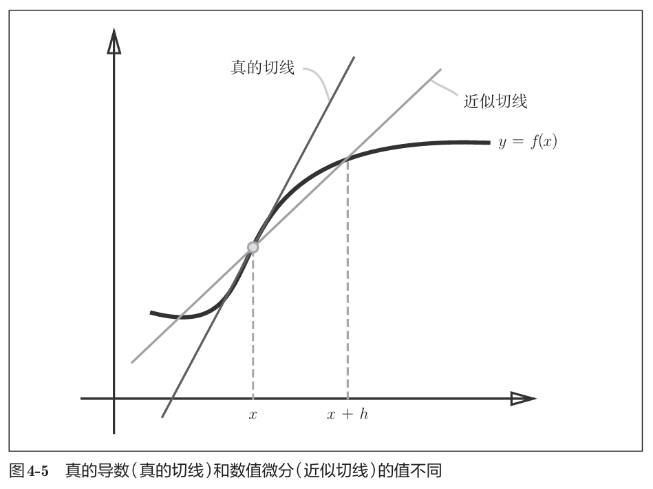

利用中心差分的实现：

```python
def numerical_diff(f, x):
    h = 1e-4  # 0.0001
    return (f(x + h) - f(x - h)) / (2 * h)
```

- 利用微小的差分求导数的过程称为**数值微分**（numerical differentiation）。
- 而基于数学式的推导求导数的过程，则用“解析性”（analytic）一词，称为“**解析性求解**”或者“**解析性求导**”。解析性求导得到的导数是不含误差的“真的导数”。


### 4.3.2 数值微分的例子

现在我们试着用上述的数值微分对简单函数进行求导。
$$
y = 0.01x^2 + 0.1x\quad(4.5)
$$
Python实现并绘制函数图像：

```python
import numpy as np
import matplotlib.pylab as plt


def function_1(x):
    return 0.01*x**2 + 0.1*x


x = np.arange(0.0, 20.0, 0.1) # 以0.1为单位，从0到20的数组x
y = function_1(x)
plt.xlabel("x")
plt.ylabel("f(x)")
plt.plot(x, y)
plt.show()
```

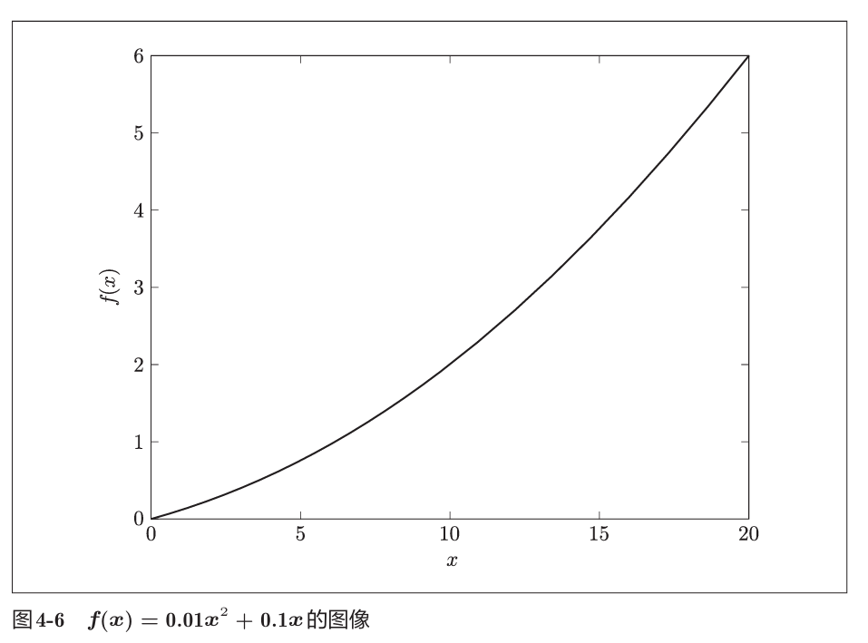


我们来计算一下这个函数在x = 5和x = 10处的导数。

```python
>>> numerical_diff(function_1, 5)
0.1999999999990898
>>> numerical_diff(function_1, 10)
0.2999999999986347
```

我们用上面的数值微分的值作为斜率，画一条直线。结果如图4-7所示，可以确认这些直线确实对应函数的切线（源代码在ch04/gradient_1d.py中）

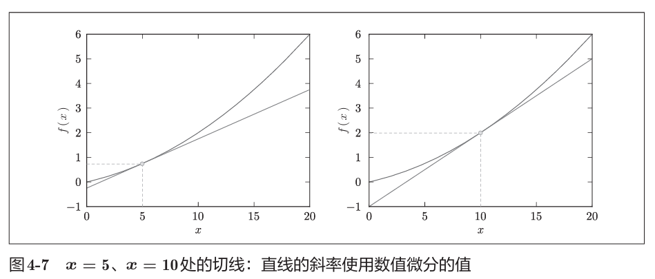


### 4.3.3 偏导数

$$
f(x_0, x_1) = x_0^{2} + x_1^{2}\quad(4.6)
$$

Python实现：

```python
def function_2(x):
    # 或者return np.sum(x**2)
	return x[0]**2 + x[1]**2
```

这里，我们假定向参数输入了一个NumPy数组。函数的内部实现比较简单，先计算NumPy数组中各个元素的平方，再求它们的和（`np.sum(x**2)`也可以实现同样的处理）。我们来画一下这个函数的图像。结果如图4-8所示，是一个三维图像。

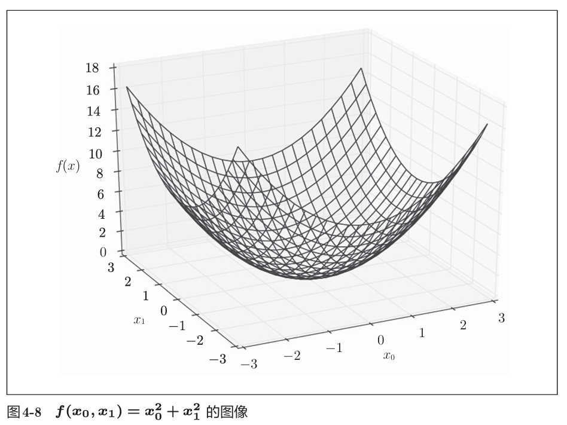

有多个变量的函数的导数称为偏导数。用数学式表示的话，可以写成 $\frac{\partial f}{\partial x_{0}}$,  $\frac{\partial f}{\partial x_{1}}$ 。

**偏导数求解需要将多个变量中的某一个变量定为目标变量，并将其他变量固定为某个值。**


## 4.4 梯度

像 $\left(\frac{\partial f}{\partial x_{0}},\frac{\partial f}{\partial x_{1}}\right)$ 这样的由全部变量的偏导数汇总而成的向量称为**梯度（gradient）**。

梯度可以像下面这样来实现。

```python
def numerical_gradient(f: typing.Callable, x: np.ndarray):
    h = 1e-4  # 0.0001
    grad = np.zeros_like(x)

    it = np.nditer(x, flags=['multi_index'], op_flags=['readwrite'])
    while not it.finished:
        idx = it.multi_index
        tmp_val = x[idx]
        x[idx] = float(tmp_val) + h
        fxh1 = f(x)  # f(x+h)

        x[idx] = tmp_val - h
        fxh2 = f(x)  # f(x-h)
        grad[idx] = (fxh1 - fxh2) / (2 * h)

        x[idx] = tmp_val  # 还原值
        it.iternext()

    return grad
```

函数`numerical_gradient(f, x)`中，参数f为函数，`x`为NumPy数组，该函数对NumPy数组x的各个元素求数值微分。现在，我们用这个函数实际计算一下梯度。这里我们求点(3, 4)、(0, 2)、(3, 0)处的梯度。

```python
>>> numerical_gradient(function_2, np.array([3.0, 4.0]))
array([ 6., 8.])
>>> numerical_gradient(function_2, np.array([0.0, 2.0]))
array([ 0., 4.])
>>> numerical_gradient(function_2, np.array([3.0, 0.0]))
array([ 6., 0.])
```


为了更好地理解，我们把 的梯度画在图上。不过，这里我们画的是元素值为负梯度的向量（源代码在ch04/gradient_2d.py中）。如图4-9所示， 的梯度呈现为有向向量（箭头）

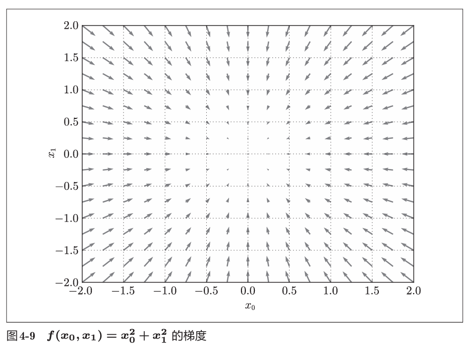

更严格地讲，梯度指示的方向是各点处的函数值减小最多的方向 。


### 4.4.1 梯度法

机器学习的主要任务是在学习时寻找最优参数。这里所说的最优参数是指损失函数取最小值时的参数。使用梯度来寻找函数最小值（或者尽可能小的值）的方法就是梯度法。

梯度表示的是各点处的函数值减小最多的方向。因此，无法保证梯度所指的方向就是函数的最小值或者真正应该前进的方向。

函数的极小值、最小值以及被称为鞍点（saddle point）的地方，梯度为 0。虽然梯度法是要寻找梯度为 0的地方，但是那个地方不一定就是最小值（也有可能是极小值或者鞍点）。

虽然梯度的方向并不一定指向最小值，但沿着它的方向能够最大限度地减小函数的值。因此，在寻找函数的最小值（或者尽可能小的值）的位置的任务中，**要以梯度的信息为线索，决定前进的方向。**

在梯度法中，函数的取值从当前位置沿着梯度方向前进一定距离，然后在新的地方重新求梯度，再沿着新梯度方向前进，如此反复，不断地沿梯度方向前进。像这样，通过不断地沿梯度方向前进，逐渐减小函数值的过程就是**梯度法（gradient method）**。

根据目的是寻找最小值还是最大值，梯度法的叫法有所不同。严格地讲，寻找最小值的梯度法称为**梯度下降法（gradient descent method）**，寻找最大值的梯度法称为梯度上升法（gradient ascent method）。但是通过反转损失函数的符号，求最小值的问题和求最大值的问题会变成相同的问题，因此“下降”还是“上升”的差异本质上并不重要。**一般来说，神经网络（深度学习）中，梯度法主要是指梯度下降法。**


现在，我们尝试用**数学式来表示梯度法**，如式（4.7）所示。
$$
\begin{aligned}x_0&=x_0-\eta\frac{\partial f}{\partial x_0}\\x_1&=x_1-\eta\frac{\partial f}{\partial x_1}\end{aligned}\quad(4.7)
$$
式（4.7）的η表示更新量，在神经网络的学习中，称为学习率（learning rate）。学习率决定在一次学习中，应该学习多少，以及在多大程度上更新参数。

学习率需要事先确定为某个值，比如0.01或0.001。一般而言，这个值过大或过小，都无法抵达一个“好的位置”。在神经网络的学习中，一般会一边改变学习率的值，一边确认学习是否正确进行了。

**用Python来实现梯度下降法:**

```python
def gradient_descent(f, init_x, lr=0.01, step_num=100):
    x = init_x
    
    for i in range(step_num):
        grad = numerical_gradient(f, x)
        x -= lr * grad
	return x
```

参数`f`是要进行最优化的函数，`init_x`是初始值，`lr`是学习率`learning rate`，`step_num`是梯度法的重复次数。


**使用案例：**请用梯度法求 $f(x_{0}+x_{1})=x_{0}^{2}+x_{1}^{2}$ 的最小值。

```python
>>> def function_2(x):
... return x[0]**2 + x[1]**2
...
>>> init_x = np.array([-3.0, 4.0])
>>> gradient_descent(function_2, init_x=init_x, lr=0.1, step_num=100)
array([ -6.11110793e-10, 8.14814391e-10])
```

如果用图来表示梯度法的更新过程，则如图4-10所示。可以发现，原点处是最低的地方，函数的取值一点点在向其靠近。这个图的源代码在ch04/gradient_method.py 中（但ch04/gradient_method.py不显示表示等高线的虚线）

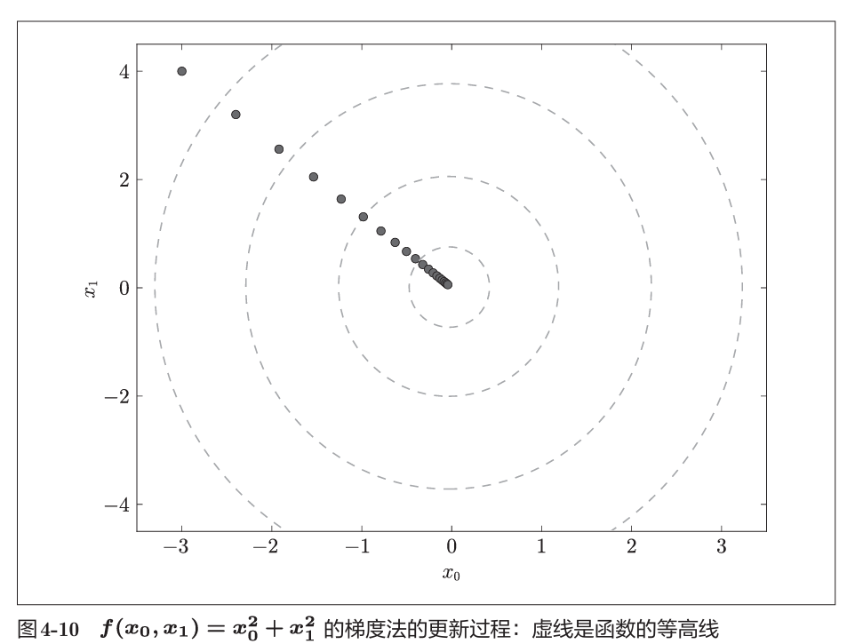


**使用案例：**学习率过大或者过小都无法得到好的结果。

```python
# 学习率过大的例子：lr=10.0
>>> init_x = np.array([-3.0, 4.0])
>>> gradient_descent(function_2, init_x=init_x, lr=10.0, step_num=100)
array([ -2.58983747e+13, -1.29524862e+12])
# 学习率过小的例子：lr=1e-10
>>> init_x = np.array([-3.0, 4.0])
>>> gradient_descent(function_2, init_x=init_x, lr=1e-10, step_num=100)
array([-2.99999994, 3.99999992])
```

实验结果表明

- **学习率过大的话，会发散成一个很大的值**；
- **学习率过小的话，基本上没怎么更新就结束了**。


### 4.4.2 神经网络的梯度

神经网络的学习也要求梯度。这里所说的梯度是指**损失函数关于权重参数的梯度**。

比如，有一个只有一个形状为2 × 3的权重W的神经网络，损失函数用L表示。此时，梯度可以用 表示。用数学式表示的话，如下所示。
$$
\begin{gathered}
\boldsymbol{W} \left.=\left(\begin{array}{ccc}{{w_{11}}}&{{w_{12}}}&{{w_{13}}}\\{{w_{21}}}&{{w_{22}}}&{{w_{23}}}\end{array}\right.\right) \\
\frac{\partial L}{\partial W} \left.=\left(\begin{array}{ccc}\frac{\partial L}{\partial w_{11}}&\frac{\partial L}{\partial w_{12}}&\frac{\partial L}{\partial w_{13}}\\\frac{\partial L}{\partial w_{21}}&\frac{\partial L}{\partial w_{22}}&\frac{\partial L}{\partial w_{23}}\end{array}\right.\right) 
\end{gathered}\quad(4.8)
$$
下面，我们以一个简单的神经网络为例，来实现求梯度的代码。为此，我们要**实现一个名为simpleNet的类**

```python
import sys, os
sys.path.append(os.pardir)
import numpy as np
from common.functions import softmax, cross_entropy_error
from common.gradient import numerical_gradient


class simpleNet:
    def __init__(self):
        self.W = np.random.randn(2,3) # 用高斯分布进行初始化
	
    def predict(self, x):
        return np.dot(x, self.W)
    
    def loss(self, x, t):
        z = self.predict(x)
        y = softmax(z)
        loss = cross_entropy_error(y, t)
        
        return loss
```

**试着用一下这个simpleNet:**

```python
>>> net = simpleNet()
>>> print(net.W) # 权重参数
[[ 0.47355232 0.9977393 0.84668094],
 [ 0.85557411 0.03563661 0.69422093]])
>>>
>>> x = np.array([0.6, 0.9])
>>> p = net.predict(x)
>>> print(p)
[ 1.05414809 0.63071653 1.1328074]

>>> np.argmax(p) # 最大值的索引
2
>>> t = np.array([0, 0, 1]) # 正确解标签
>>> net.loss(x, t)
0.92806853663411326
```

接下来求梯度。和前面一样，我们使用numerical_gradient(f, x)求梯度（这里定义的函数f(W)的参数W是一个伪参数。)

```python
>>> def f(W):
... return net.loss(x, t)
...
>>> dW = numerical_gradient(f, net.W)
>>> print(dW)
[[ 0.21924763 0.14356247 -0.36281009]
 [ 0.32887144 0.2153437 -0.54421514]]
```


## 4.5 学习算法的实现

**前提**
神经网络存在合适的权重和偏置，调整权重和偏置以便拟合训练数据的过程称为“学习”。神经网络的学习分成下面4个步骤。

1. **步骤1（mini-batch）**

   从训练数据中随机选出一部分数据，这部分数据称为mini-batch。我们的目标是减小mini-batch的损失函数的值。

2. **步骤2（计算梯度）**

   为了减小mini-batch的损失函数的值，需要求出各个权重参数的梯度。梯度表示损失函数的值减小最多的方向。

3. **步骤3（更新参数）**

   将权重参数沿梯度方向进行微小更新。

4. **步骤4（重复）**

   重复步骤1、步骤2、步骤3。

这个方法通过梯度下降法更新参数，不过因为这里使用的数据是随机选择的mini batch数据，所以又称为**随机梯度下降法（stochastic gradient descent）**。“


下面，我们来实现手写数字识别的神经网络。这里以2层神经网络（隐藏层为1层的网络）为对象，使用MNIST数据集进行学习。


### 4.5.1 2层神经网络的类

首先，我们将这个2层神经网络实现为一个名为`TwoLayerNet`的类，实现过程如下所示。

源代码在`ch04/two_layer_net.py`中。

```python
import sys, os
sys.path.append(os.pardir)
from common.functions import *
from common.gradient import numerical_gradient


class TwoLayerNet:
    def __init__(self, input_size: int, hidden_size: int, output_size: int, weight_init_std=0.01):
        # 初始化权重
        self.params = {
            'W1': weight_init_std * np.random.randn(input_size, hidden_size), 'b1': np.zeros(hidden_size),
            'W2': weight_init_std * np.random.randn(hidden_size, output_size), 'b2': np.zeros(output_size),
        }

    def predict(self, x: np.ndarray) -> np.ndarray:
        W1, W2 = self.params['W1'], self.params['W2']
        b1, b2 = self.params['b1'], self.params['b2']

        a1 = np.dot(x, W1) + b1
        z1 = sigmoid(a1)

        a2 = np.dot(z1, W2) + b2
        y = softmax(a2)
        return y

    # x:输入数据, t:监督数据
    def loss(self, x: np.ndarray, t: np.ndarray):
        y = self.predict(x)
        return cross_entropy_error(y, t)

    def accuracy(self, x: np.ndarray, t: np.ndarray):
        y = self.predict(x)
        y = np.argmax(y, axis=1)
        t = np.argmax(t, axis=1)

        accuracy = np.sum(y == t) / float(x.shape[0])
        return accuracy

    def numerical_gradient(self, x: np.ndarray, t: np.ndarray):
        loss_W = lambda W: self.loss(x, t)

        grads = {
            'W1': numerical_gradient(loss_W, self.params['W1']), 'b1': numerical_gradient(loss_W, self.params['b1']),
            'W2': numerical_gradient(loss_W, self.params['W2']), 'b2': numerical_gradient(loss_W, self.params['b2']),
        }
        return grads
```

`numerical_gradient(self, x, t)`基于**数值微分**计算参数的**梯度**。


**使用案例：**从第1个参数开始，依次表示输入层的神经元数、隐藏层的神经元数、输出层的神经元数。另外，
因为进行手写数字识别时，输入图像的大小是784（28 × 28），输出为10个类别，所以指定参input_size=784、output_size=10，将隐藏层的个数hidden_size设置为一个合适的值即可。

```python
net = TwoLayerNet(input_size=784, hidden_size=100, output_size=10)
net.params['W1'].shape # (784, 100)
net.params['b1'].shape # (100,)
net.params['W2'].shape # (100, 10)
net.params['b2'].shape # (10,)

x = np.random.rand(100, 784) # 伪输入数据（100笔）
y = net.predict(x)

x = np.random.rand(100, 784) # 伪输入数据（100笔）
t = np.random.rand(100, 10) # 伪正确解标签（100笔）

grads = net.numerical_gradient(x, t) # 计算梯度

grads['W1'].shape # (784, 100)
grads['b1'].shape # (100,)
grads['W2'].shape # (100, 10)
grads['b2'].shape # (10,)
```


### 4.5.2 mini-batch的实现

所谓**mini-batch学习**，就是从训练数据中随机选择一部分数据（称为mini-batch），再以这些mini-batch为对象，使用梯度法更新参数的过程。下面，我们就以TwoLayerNet类为对象，使用MNIST数据集进行学习（源代码在ch04/train_neuralnet.py中）

```python
import numpy as np
from dataset.mnist import load_mnist
from two_layer_net import TwoLayerNet

(x_train, t_train), (x_test, t_test) = load_mnist(normalize=True, one_hot_label = True)

train_loss_list = []

# 超参数
iters_num = 10000
train_size = x_train.shape[0]
batch_size = 100
learning_rate = 0.1

network = TwoLayerNet(input_size=784, hidden_size=50, output_size=10)

for i in range(iters_num):
    # 获取mini-batch
    batch_mask = np.random.choice(train_size, batch_size)
    x_batch = x_train[batch_mask]
    t_batch = t_train[batch_mask]
    
    # 计算梯度
    grad = network.numerical_gradient(x_batch, t_batch)
    # grad = network.gradient(x_batch, t_batch) # 高速版!
    
    # 更新参数
    for key in ('W1', 'b1', 'W2', 'b2'):
        network.params[key] -= learning_rate * grad[key]
        
	# 记录学习过程
	loss = network.loss(x_batch, t_batch)
	train_loss_list.append(loss)
```

这里，mini-batch的大小为100，需要每次从60000个训练数据中随机取出100个数据（图像数据和正确解标签数据）。然后，对这个包含100笔数据的mini-batch求梯度，使用随机梯度下降法（SGD）更新参数。这里，梯
度法的更新次数（循环的次数）为10000。每更新一次，都对训练数据计算损失函数的值，并把该值添加到数组中。用图像来表示这个损失函数的值的推移，如图4-11所示。

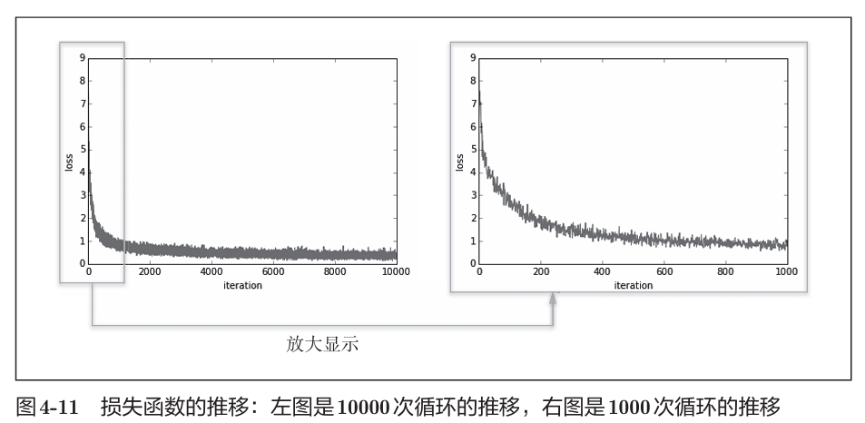

观察图4-11，可以发现随着学习的进行，损失函数的值在不断减小。这是学习正常进行的信号，表示神经网络的权重参数在逐渐拟合数据。也就是说，神经网络的确在学习！通过反复地向它浇灌（输入）数据，神经网络正在逐渐向最优参数靠近。


### 4.5.3 基于测试数据的评价

损失函数的值，严格地讲是“对训练数据的某个mini-batch的损失函数”的值。训练数据的损失函数值减小，虽说是神经网络的学习正常进行的一个信号，但光看这个结果还不能说明该神经网络在其他数据集上也一定能有同等程度的表现。

神经网络的学习中，**必须确认是否能够正确识别训练数据以外的其他数据**，即确认**是否会发生过拟合**。过拟合是指，虽然训练数据中的数字图像能被正确辨别，但是不在训练数据中的数字图像却无法被识别的现象。

神经网络学习的最初目标是掌握泛化能力，因此，要评价神经网络的**泛化能力**，就必须使用不包含在训练数据中的数据。下面的代码在进行学习的过程中，会定期地对训练数据和测试数据记录识别精度。这里，每经过一个epoch，我们都会记录下训练数据和测试数据的识别精度。

epoch是一个单位。一个 epoch表示学习中所有训练数据均被使用过一次时的更新次数。

```python
import numpy as np
from dataset.mnist import load_mnist
from two_layer_net import TwoLayerNet


def train_and_test(iters_num: int = 10000, batch_size: int = 100, learning_rate: float = 0.01):
    (x_train, y_train), (x_test, y_test) = load_mnist(normalize=True, one_hot_label=True)
    train_size = x_train.shape[0]

    train_loss_list = []
    train_acc_list = []
    test_acc_list = []
    iter_per_epoch = int(max(train_size / batch_size, 1))

    network = TwoLayerNet(input_size=784, hidden_size=50, output_size=10)

    test_grad = network.numerical_gradient(x_train[[0]], y_train[[0]])
    print('test_grad', test_grad)

    for i in range(iters_num):
        # 获取mini-batch
        batch_mask = np.random.choice(train_size, batch_size)
        x_batch = x_train[batch_mask]
        t_batch = y_train[batch_mask]

        # 计算梯度
        grad = network.numerical_gradient(x_batch, t_batch)
        # grad = network.gradient(x_batch, t_batch)  # 高速版

        # 更新参数
        for key in ('W1', 'b1', 'W2', 'b2'):
            network.params[key] -= learning_rate * grad[key]

            # 记录学习过程
            loss = network.loss(x_batch, t_batch)
            train_loss_list.append(loss)

            # 计算每个epoch的识别精度
            if i % iter_per_epoch == 0:
                train_acc = network.accuracy(x_train, y_train)
                test_acc = network.accuracy(x_test, y_test)
                train_acc_list.append(train_acc)
                test_acc_list.append(test_acc)
                print("train acc, test acc | " + str(train_acc) + ", " + str(test_acc))

    print("Train and Test done.")
```

把从上面的代码中得到的结果用图表示的话，如图4-12所示。

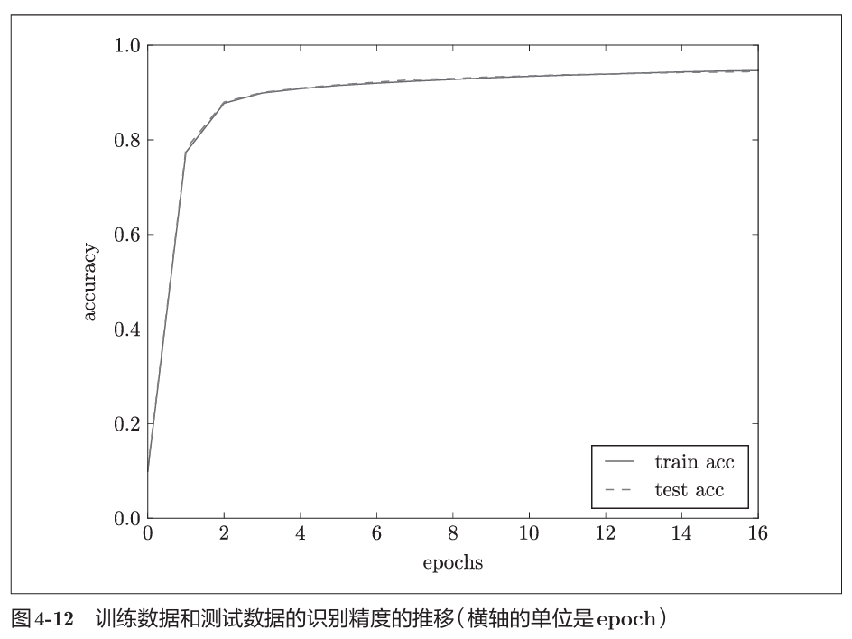

图4-12中，实线表示训练数据的识别精度，虚线表示测试数据的识别精度。如图所示，随着epoch的前进（学习的进行），我们发现使用训练数据和测试数据评价的识别精度都提高了，并且，这两个识别精度基本上没有差异（两条线基本重叠在一起）。因此，可以说这次的学习中没有发生过拟合的现象。


# 5 误差反向传播法

一个能够高效计算权重参数的梯度的方法——**误差反向传播法**


## 5.1 计算图

计算图将计算过程用图形表示出来。这里说的图形是数据结构图，通过多个节点和边表示（连接节点的直线称为“边”）。


### 5.1.1 用计算图求解

问题2：太郎在超市买了2个苹果、3个橘子。其中，苹果每个100日元，橘子每个150日元。消费税是10%，请计算支付金额。

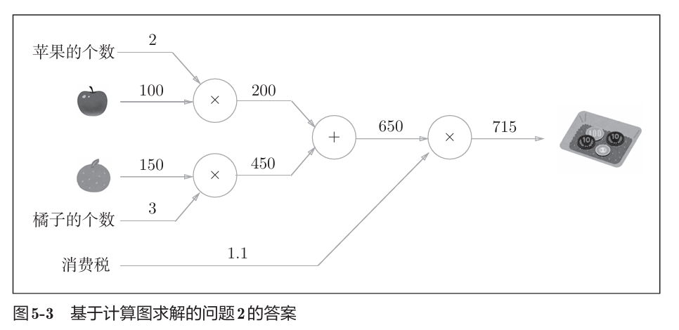

综上，用计算图解题的情况下，需要按如下流程进行。

1. 构建计算图。
2. 在计算图上，从左向右进行计算。

这里的第2歩“从左向右进行计算”是一种正方向上的传播，简称为**正向传播（forward propagation）**。


### 5.1.2 局部计算

计算图的特征是可以通过传递“局部计算”获得最终结果。局部计算是指，无论全局发生了什么，都能只根据与自己相关的信息输出接下来的结果。

图5-4所示的计算图。

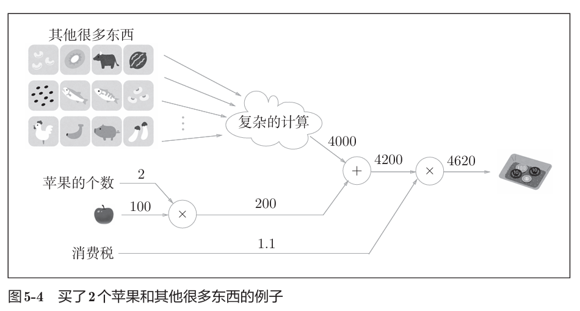

虽然局部计算非常简单，但是通过传递它的计算结果，可以获得全局的复杂计算的结果。


### 5.1.3 为何用计算图解题

计算图到底有什么优点呢？

- 一个优点就在于前面所说的**局部计算**。无论全局是多么复杂的计算，都可以通过局部计算使各个节点致力于简单的计算，从而简化问题。
- 另一个优点是，利用计算图可以将**中间的计算结果全部保存起来**
- 实际上，使用计算图最大的原因是，可以通过**反向传播高效计算导数**。


如图5-5所示，可以通过计算图的反向传播求导数

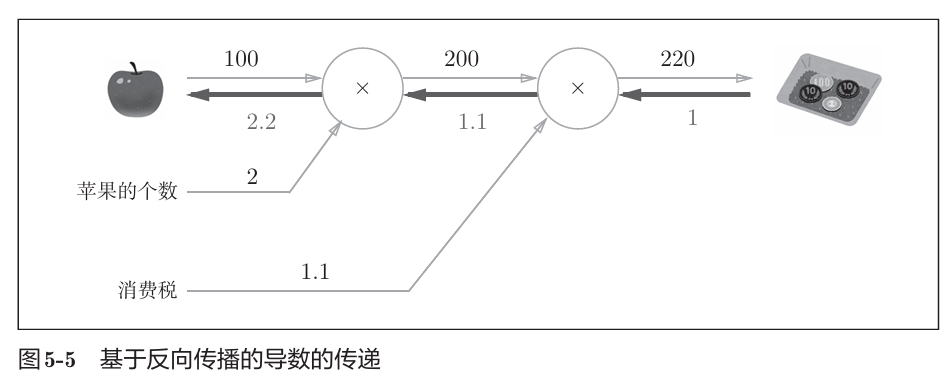

如图5-5所示，反向传播使用与正方向相反的箭头（粗线）表示。反向传播传递“局部导数”，将导数的值写在箭头的下方。

综上，计算图的优点是，可以通过正向传播和反向传播高效地计算各个变量的导数值。


## 5.2 链式法则

反向传播将局部导数向正方向的反方向（从右到左）传递，传递这个局部导数的原理，是基于**链式法则（chain rule）**的。


### 5.2.1 计算图的反向传播

假设存在$y = f(x)$的计算，这个计算的反向传播如图5-6所示。

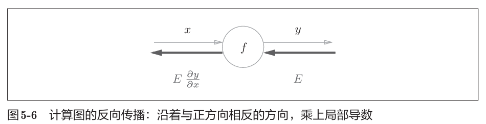

如图所示，反向传播的计算顺序是，将信号E乘以节点的局部导数（ $\frac{\partial y}{\partial x}$），然后将结果传递给下一个节点。

通过这样的计算，可以高效地求出导数的值，这是反向传播的要点。


### 5.2.2 什么是链式法则

链式法则是关于复合函数的导数的性质，定义如下。

[^链式法则]: 如果某个函数由复合函数表示，则该复合函数的导数可以用构成复合函数的各个函数的导数的乘积表示。


基于链式法则的求导案例：

1. 复合函数
   $$
   z=t^2\\t=x + y
   $$

2. 链式法则应用
   $$
   \frac{\partial z}{\partial x}=\frac{\partial z}{\partial t}\frac{\partial t}{\partial x}
   $$

3. 求导

   1:
   $$
   \begin{aligned}&\frac{\partial z}{\partial t}=2t\\&&(5.3)\\&\frac{\partial t}{\partial x}=1\end{aligned}
   $$
   2:
   $$
   \frac{\partial z}{\partial x}=\frac{\partial z}{\partial t}\frac{\partial t}{\partial x}=2t\cdot1=2(x+y)\quad(5.4)
   $$


### 5.2.3 链式法则和计算图

现在我们尝试将式（5.4）的链式法则的计算用计算图表示出来。如果用“**2”节点表示平方运算的话，则计算图如图5-7所示。

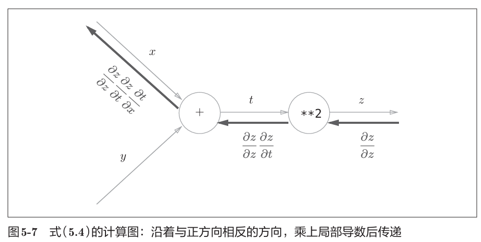

如图所示，计算图的反向传播从右到左传播信号。**反向传播的计算顺序是，先将节点的输入信号乘以节点的局部导数（偏导数），然后再传递给下一个节点。**比如，反向传播时，“**2”节点的输入是$\frac{\partial z}{\partial z}$ ，将其乘以局部导数 $\frac{\partial z}{\partial t}$（因为正向传播时输入是t、输出是z，所以这个节点的局部导数是 $\frac{\partial z}{\partial t}$），然后传递给下一个节点。


把式（5.3）的结果代入到图 5-7 中，结果如图 5-8 所示，$\frac{\partial z}{\partial x}$ 的结果为$2(x + y)$。

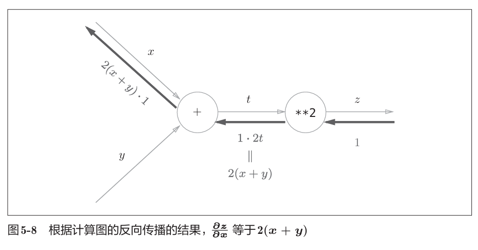


## 5.3 反向传播

### 5.3.1 加法节点的反向传播

这里以$z = x + y$为对象，观察它的反向传播。
$$
\begin{aligned}&\frac{\partial z}{\partial x}=1\\&&(5.5)\\&\frac{\partial z}{\partial y}=1\end{aligned}
$$
用计算图表示的话，如图5-9所示。

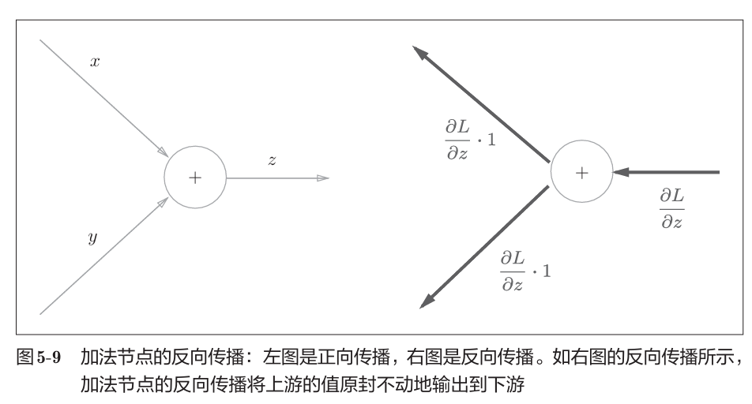

另外，本例中把从上游传过来的导数的值设为 $\frac{\partial L}{\partial z}$。这是因为，如图5-10所示，**我们假定了一个最终输出值为L的大型计算图**。$z = x + y$ 的计算位于这个大型计算图的某个地方，从上游会传来 $\frac{\partial L}{\partial z}$ 的值，并向下游传递 $\frac{\partial L}{\partial x}$ 和 $\frac{\partial L}{\partial y}$

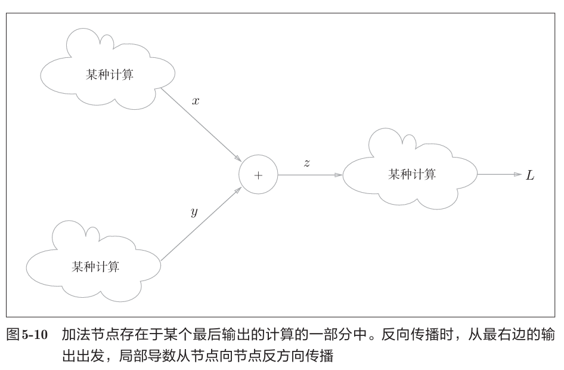


### 5.3.2 乘法节点的反向传播

乘法节点的反向传播。这里我们考虑$z = xy$。
$$
\begin{aligned}&\frac{\partial z}{\partial x}=y\\&&(5.6)\\&\frac{\partial z}{\partial y}=x\end{aligned}
$$
根据式（5.6），可以像图5-12那样画计算图。

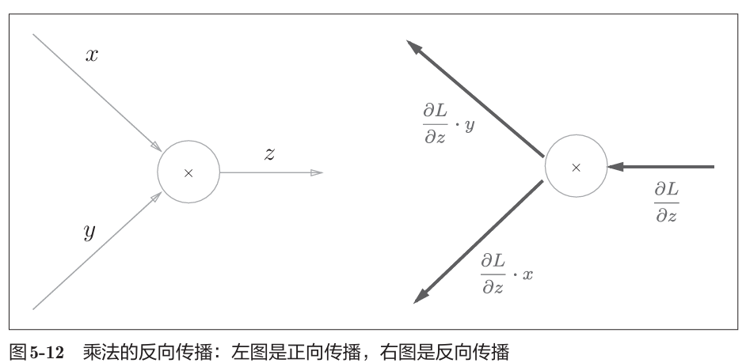


看一个具体的例子。比如，假设有“10 × 5 = 50”这一计算，反向传播时，从上游会传来值1.3。用计算图表示的话，如图5-13所示。

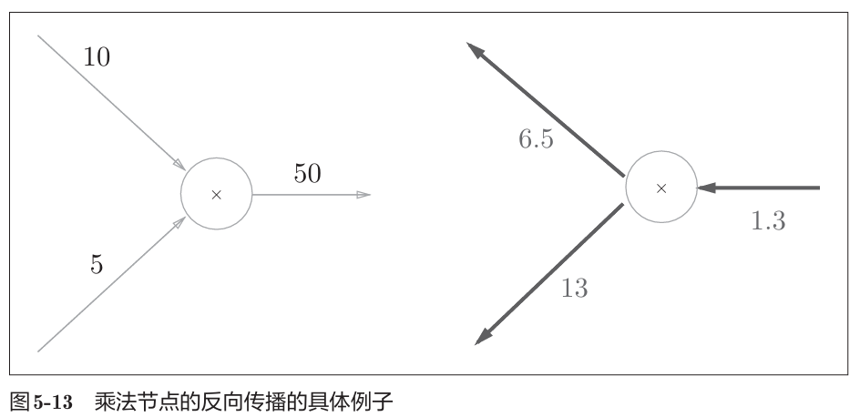


### 5.3.3 苹果的例子

用计算图的反向传播来解的话，求解过程如图5-14所示。

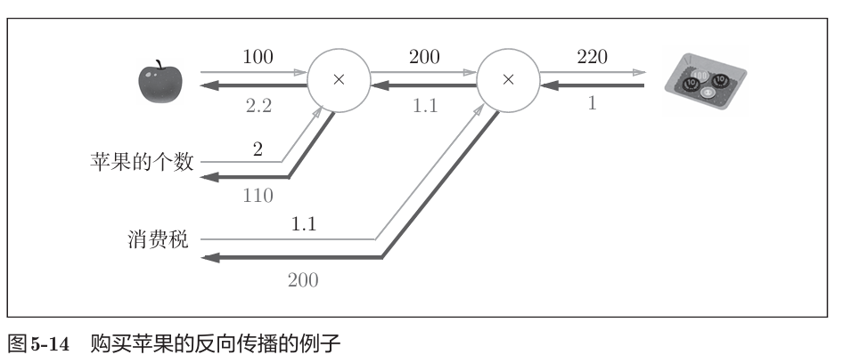


## 5.4 简单层的实现

这里，我们把要实现的计算图的乘法节点称为“乘法层”（MulLayer），加法节点称为“加法层”（AddLayer）


### 5.4.1 乘法层的实现

层的实现中有两个共通的方法（接口）forward()和backward()。forward()对应正向传播，backward()对应反向传播。

现在来实现乘法层。乘法层作为`MulLayer`类，其实现过程如下所示（源代码在`ch05/layer_naive.py`中）

```python
class MulLayer:
    def __init__(self):
        self.x, self.y = None, None

	def forward(self, x, y):
        self.x, self.y = x, y
        out = x * y
        return out
    
    def backward(self, dout):
        dx = dout * self.y
        dy = dout * self.x
        return dx, dy
```


### 5.4.2 加法层的实现

实现加法节点的加法层，如下所示。

```python
class AddLayer:
    def __init__(self):
        pass
    
    def forward(self, x, y):
        return x + y
    
    def backward(self, dout):
        dx = dout * 1
        dy = dout * 1
        return dx, dy
```


**使用案例：**现在，我们使用加法层和乘法层，实现图5-17所示的购买2个苹果和3个橘子的例子。

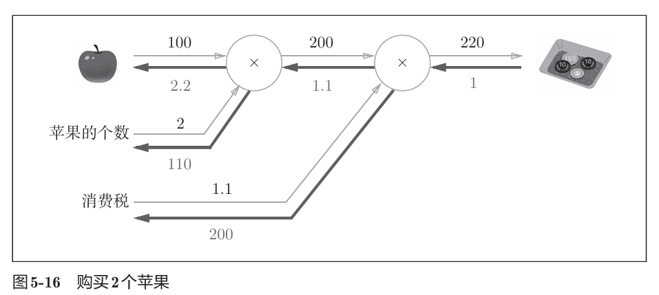

用Python实现图5-17的计算图的过程如下所示（源代码在ch05/buy_apple_orange.py中）

```python
apple = 100
apple_num = 2
orange = 150
orange_num = 3
tax = 1.1

# layer
mul_apple_layer = MulLayer()
mul_orange_layer = MulLayer()
add_apple_orange_layer = AddLayer()
mul_tax_layer = MulLayer()

# forward
apple_price = mul_apple_layer.forward(apple, apple_num) #(1)
orange_price = mul_orange_layer.forward(orange, orange_num) #(2)
all_price = add_apple_orange_layer.forward(apple_price, orange_price) #(3)
price = mul_tax_layer.forward(all_price, tax) #(4)

# backward
dprice = 1
dall_price, dtax = mul_tax_layer.backward(dprice) #(4)
dapple_price, dorange_price = add_apple_orange_layer.backward(dall_price) #(3)
dorange, dorange_num = mul_orange_layer.backward(dorange_price) #(2)
dapple, dapple_num = mul_apple_layer.backward(dapple_price) #(1)

print(price) # 715
print(dapple_num, dapple, dorange, dorange_num, dtax) # 110 2.2 3.3 165 650
```


## 5.5 激活函数层的实

们将计算图的思路应用到神经网络中。这里，我们把构成神经网络的层实现为一个类。先来实现激活函数的ReLU层和Sigmoid层。


### 5.5.1 ReLU层

激活函数ReLU（Rectified Linear Unit）由下式（5.7）表示。
$$
y=\begin{cases}x&(x>0)\\0&(x\leqslant0)\end{cases}\quad(5.7)
$$
通过式（5.7），可以求出y关于x的导数，如式（5.8）所示。
$$
\frac{\partial y}{\partial x}=\begin{cases}1&(x>0)\\0&(x\leqslant0)\end{cases}\quad(5.8)
$$
用计算图表示的话，如图5-18所示。

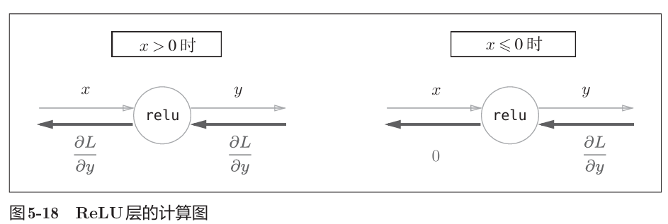


现在我们来实现ReLU层。在神经网络的层的实现中，**一般假定forward()和backward()的参数是NumPy数组**。另外，实现ReLU层的源代码在`common/layers.py`中。

```python
class Relu:
    def __init__(self):
        self.mask = None
        
	def forward(self, x):
        self.mask = (x <= 0)
        out = x.copy()
        out[self.mask] = 0
        return out

    def backward(self, dout):
        dout[self.mask] = 0
        dx = dout
        return dx
```


### 5.5.2 Sigmoid层

接下来，我们来实现sigmoid函数。sigmoid函数由式（5.9）表示。
$$
y=\frac{1}{1+\exp(-x)}\quad(5.9)
$$
用计算图表示式（5.9）的话，则如图5-19所示。

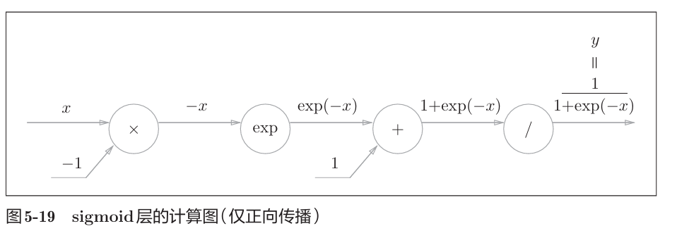


如图5-20 Sigmoid层的计算图

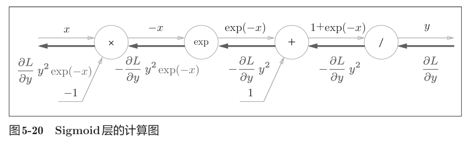

图5-20的计算图可以画成图5-21的集约化的“sigmoid”节点。

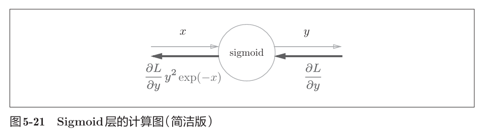

进一步整理 $\frac{\partial L}{\partial y}y^2\exp(-x)$ 如下：
$$
\begin{aligned}
\frac{\partial L}{\partial y}y^{2}\exp(-x)& =\frac{\partial L}{\partial y}\frac{1}{(1+\exp(-x))^{2}}\exp(-x) \\
&=\frac{\partial L}{\partial y}\frac{1}{1+\exp(-x)}\frac{\exp(-x)}{1+\exp(-x)}\quad(5.12) \\
&=\frac{\partial L}{\partial y}y(1-y)
\end{aligned}
$$
因此，图5-21所表示的Sigmoid层的反向传播，只根据正向传播的输出就能计算出来

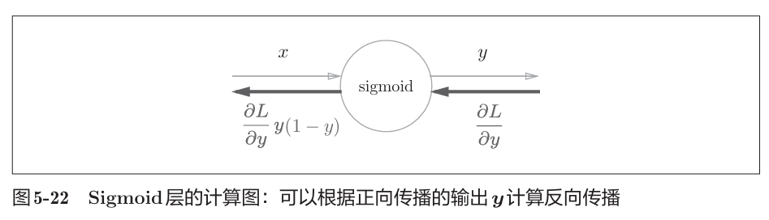

现在，我们用Python实现Sigmoid层。参考图5-22，可以像下面这样实现（实现的代码在common/layers.py中）

```python
class Sigmoid:
    def __init__(self):
        self.out = None

	def forward(self, x):
        out = 1 / (1 + np.exp(-x))
        self.out = out
        return out
    
    def backward(self, dout):
        dx = dout * (1.0 - self.out) * self.out
        return dx
```


## 5.6 Affine/Softmax层的实现

### 5.6.1 Affine层

神经网络的正向传播中，为了计算加权信号的总和，使用了矩阵的乘积运算

```python
>>> X = np.random.rand(2) # 输入
>>> W = np.random.rand(2,3) # 权重
>>> B = np.random.rand(3) # 偏置
>>>
>>> X.shape # (2,)
>>> W.shape # (2, 3)
>>> B.shape # (3,)
>>>
>>> Y = np.dot(X, W) + B
```

神经网络的正向传播中进行的矩阵的乘积运算在几何学领域被称为“仿射变换”。因此，这里将进行仿射变换的处理实现为“Affine层”

现在将这里进行的求矩阵的乘积与偏置的和的运算用计算图表示出来。将乘积运算用“dot”节点表示的话，则`np.dot(X, W) + B`的运算可用图5-24所示的计算图表示出来。

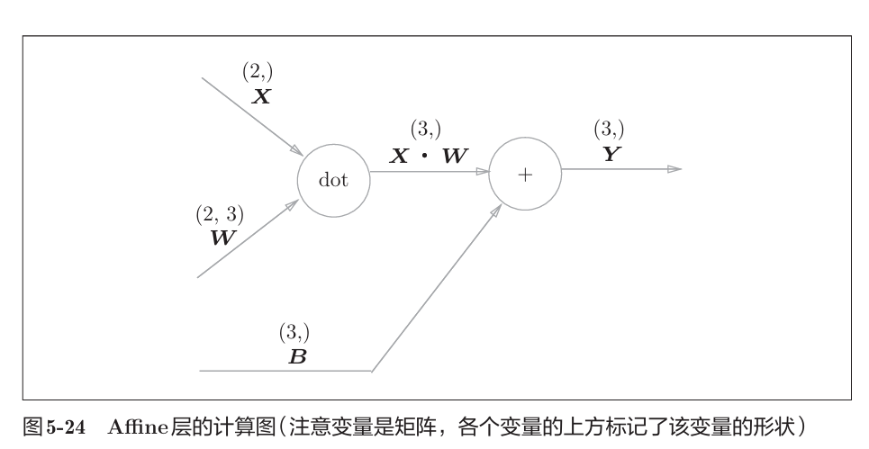

图5-24是比较简单的计算图，不过要注意`X、W、B`是矩阵（多维数组）。

现在我们来考虑图5-24的计算图的反向传播。实际写一下的话，可以得到下式（这里省略了式（5.13）的推导过程）。
$$
\begin{aligned}
&\frac{\partial L}{\partial X} ={\frac{\partial L}{\partial\boldsymbol{Y}}}\cdot W^{\mathrm{T}} \\
&&\text{(5.13)} \\
&\frac{\partial L}{\partial W} =X^{\mathrm{T}}\cdot\frac{\partial L}{\partial Y} 
\end{aligned}
$$
现在，我们根据式（5.13），尝试写出计算图的反向传播，如图5-25所示。

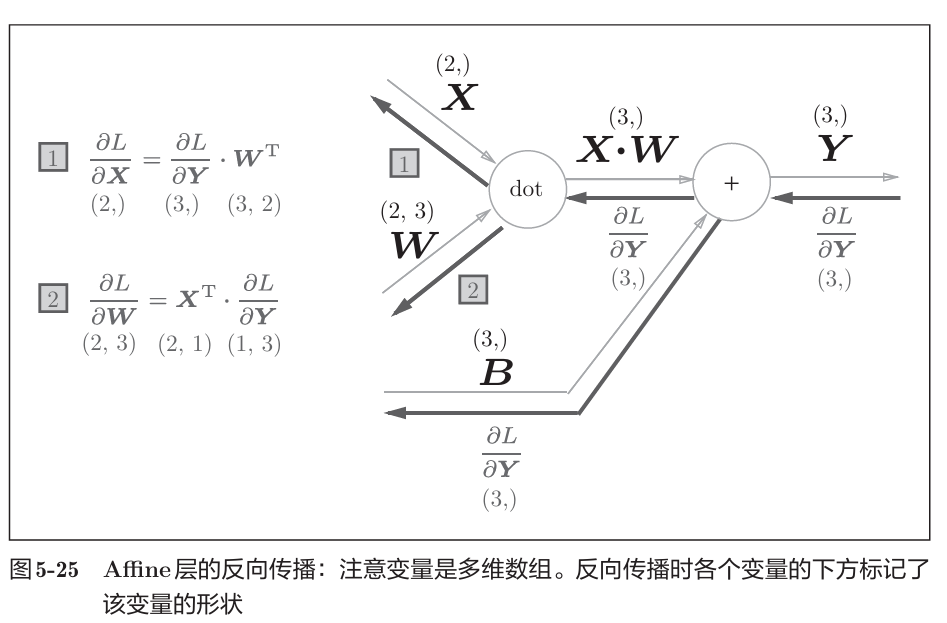


### 5.6.2 批版本的Affine层

前面介绍的Affine层的输入X是以单个数据为对象的。现在我们考虑N个数据一起进行正向传播的情况，也就是批版本的Affine层

先给出批版本的Affine层的计算图，如图5-27所示。

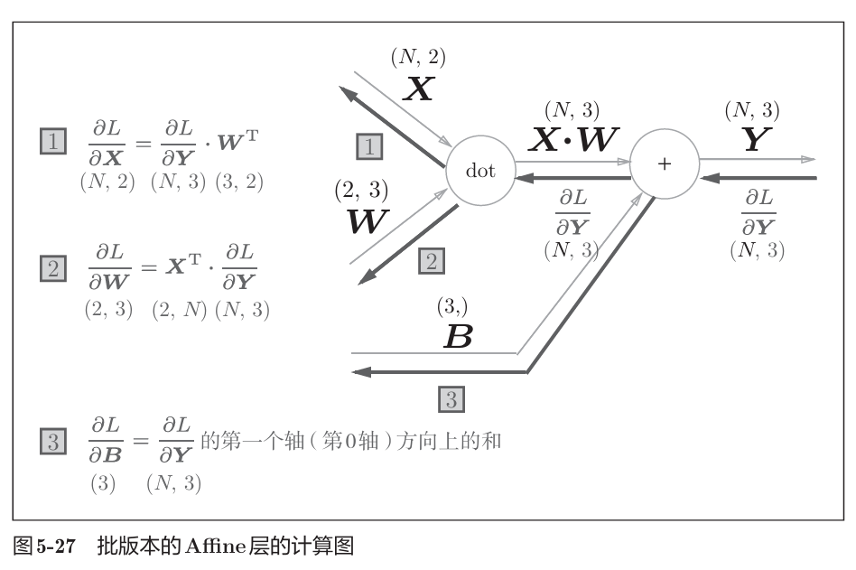

**批版本偏置特点：**

- 正向传播时，偏置被加到X·W的各个数据上。比如，N = 2（数据为2个）时，偏置会被分别加到这2个数据

  ```python
  >>> X_dot_W = np.array([[0, 0, 0], [10, 10, 10]])
  >>> B = np.array([1, 2, 3])
  >>>
  >>> X_dot_W
  array([[ 0, 0, 0],
   [ 10, 10, 10]])
  >>> X_dot_W + B
  array([[ 1, 2, 3],
   [11, 12, 13]])
  ```

- 正向传播时，偏置会被加到每一个数据（第1个、第2个……）上。因此，反向传播时，各个数据的反向传播的值需要汇总为偏置的元素。

  ```python
  >>> dY = np.array([[1, 2, 3,], [4, 5, 6]])
  >>> dY
  array([[1, 2, 3],
   [4, 5, 6]])
  >>>
  >>> dB = np.sum(dY, axis=0)
  >>> dB
  array([5, 7, 9])
  ```


**Affine层代码实现：**

```python
class Affine:
    def __init__(self, W, b):
        self.W = W
        self.b = b
        self.x = None
        self.dW = None
        self.db = None
	
    def forward(self, x):
        self.x = x
        out = np.dot(x, self.W) + self.b
        return out
    
    def backward(self, dout):
        dx = np.dot(dout, self.W.T)
        self.dW = np.dot(self.x.T, dout)
        self.db = np.sum(dout, axis=0)
        
        return dx
```


### 5.6.3 Softmax-with-Loss 层

softmax函数会将输入值正规化之后再输出。比如手写数字识别时，Softmax层的输出如图5-28所示。

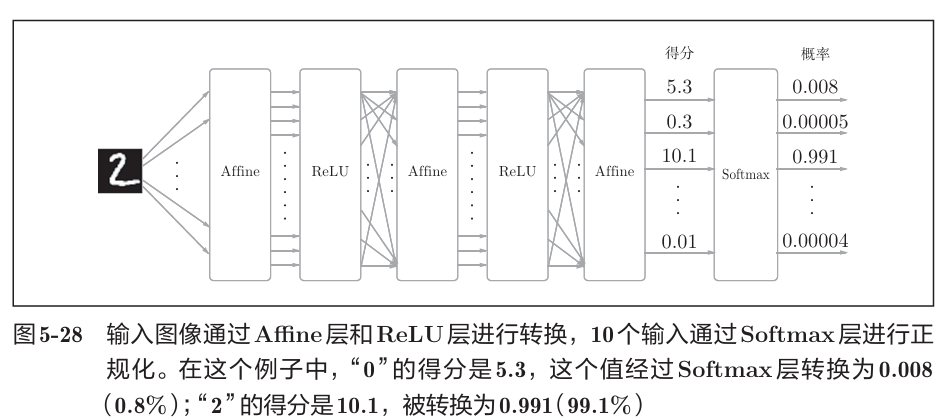

在图5-28中，Softmax层将输入值正规化（将输出值的和调整为1）之后再输出。另外，因为手写数字识别要进行10类分类，所以向Softmax层的输入也有10个。

神经网络中进行的处理有**推理（inference）**和**学习**两个阶段。

- 神经网络的**推理**通常不使用 Softmax层。也就是说，当神经网络的推理只需要给出一个答案的情况下，因为此时只对得分最大值感兴趣，所以不需要 Softmax层。
- 神经网络的**学习阶段则**需要 Softmax层。


下面来实现Softmax层。考虑到这里也包含作为损失函数的交叉熵误差（cross entropy error），所以称为“Softmax-with-Loss层”。

Softmax-with-Loss层（Softmax函数和交叉熵误差）的计算图如图5-29所示。

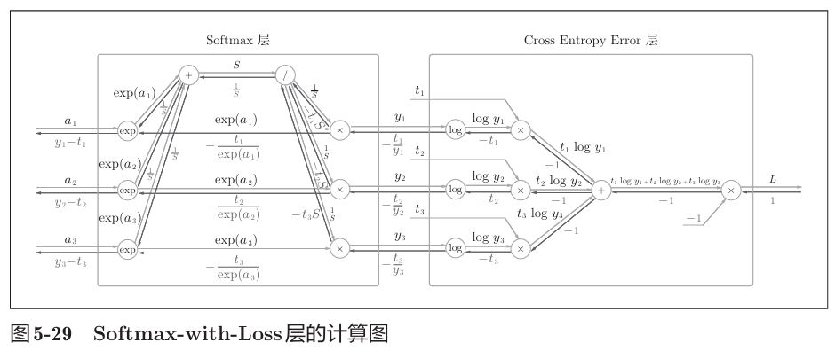

可以看到，Softmax-with-Loss层有些复杂。这里只给出了最终结果

图5-29的计算图可以简化成图5-30。

图5-30的计算图中，softmax函数记为Softmax层，交叉熵误差记为Cross Entropy Error层。这里假设要进行3类分类，从前面的层接收3个输入（得分）。如图5-30所示，Softmax层将输入（a1, a2, a3）正规化，输出（y1,  y2, y3）。Cross Entropy Error层接收Softmax的输出（y1, y2, y3）和监督标签（t1, t2, t3），从这些数据中输出损失L。

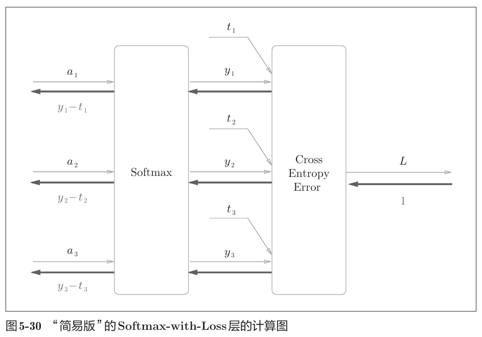

图5-30中要注意的是反向传播的结果。Softmax层的反向传播得到了（y1 − t1, y2 − t2, y3 − t3）这样“漂亮”的结果。由于（y1, y2, y3）是Softmax层的输出，（t1, t2, t3）是监督数据，所以（y1 − t1, y2 − t2, y3 − t3）是Softmax层的输出和监督标签的差分。**神经网络的反向传播会把这个差分表示的误差传递给前面的层，这是神经网络学习中的重要性质。**

现在来进行Softmax-with-Loss层的实现，实现过程如下所示。

```python
class SoftWithLoss:
    def __init__(self):
        self.loss = None # 损失
        self.y = None # softmax的输出
        self.t = None # 监督数据（one-hot vector）
    
    def forward(self, x, t):
        self.t = t
        self.y = softmax(x)
        self.loss = cross_entropy_error(self.y, self.t)
        
        return self.loss
    
    def backward(self, dout=1):
        batch_size = self.t.shape[0]
        dx = (self.y - self.t) / batch_size
        
        return dx
```

请注意反向传播时，将要传播的值除以批的大小（batch_size）后，传递给前面的层的是单个数据的误差。


## 5.7 误差反向传播法的实现

通过像组装乐高积木一样组装上一节中实现的层，可以构建神经网络。本节我们将通过组装已经实现的层来构建神经网络。


### 5.7.1 神经网络学习的全貌图

**前提**

神经网络中有合适的权重和偏置，**调整权重和偏置以便拟合训练数据的过程称为学习**。神经网络的学习分为下面4个步骤。

1. **步骤1（mini-batch）**

   从训练数据中随机选择一部分数据。

2. **步骤2（计算梯度）**

   计算损失函数关于各个权重参数的梯度。

3. **步骤3（更新参数）**

   将权重参数沿梯度方向进行微小的更新。

4. **步骤4（重复）**

   重复步骤1、步骤2、步骤3。


### 5.7.2 对应误差反向传播法的神经网络的实现

这里我们要把2层神经网络实现为TwoLayerNet。

通过使用层，获得识别结果的处理（predict()）和计算梯度的处理（gradient()）只需通过层之间的传递就能完成。下面是TwoLayerNet的代码实现。

```python
# -*- coding: utf-8 -*-
import sys
import os

sys.path.append(os.pardir)
from collections import OrderedDict

import numpy as np

from common.layers import *
from common.gradient import numerical_gradient


class TwoLayerNet:
    def __init__(self, input_size, hidden_size, output_size, weight_init_std=0.01):
        # 初始化权重
        self.params = {'W1': weight_init_std * np.random.randn(input_size, hidden_size), 'b1': np.zeros(hidden_size),
                       'W2': weight_init_std * np.random.randn(hidden_size, output_size), 'b2': np.zeros(output_size)}

        # 生成层
        self.layers = OrderedDict()
        self.layers['Affine1'] = Affine(self.params['W1'], self.params['b1'])
        self.layers['Relu1'] = Relu()
        self.layers['Affine2'] = Affine(self.params['W2'], self.params['b2'])

        self.lastLayer = SoftmaxWithLoss()

    def predict(self, x):
        for layer in self.layers.values():
            x = layer.forward(x)
        return x

    # x:输入数据, t:监督数据
    def loss(self, x, t):
        y = self.predict(x)
        return self.lastLayer.forward(y, t)

    def accuracy(self, x, t):
        y = self.predict(x)
        y = np.argmax(y, axis=1)
        if t.ndim != 1:
            t = np.argmax(t, axis=1)
        accuracy = np.sum(y == t) / float(x.shape[0])
        return accuracy

    def numerical_gradient(self, x, t):
        loss_W = lambda W: self.loss(x, t)

        grads = {
            'W1': numerical_gradient(loss_W, self.params['W1']),
            'b1': numerical_gradient(loss_W, self.params['b1']),
            'W2': numerical_gradient(loss_W, self.params['W2']),
            'b2': numerical_gradient(loss_W, self.params['b2'])
        }
        return grads

    def gradient(self, x, t):
        # forward
        self.loss(x, t)

        # backward
        dout = 1
        dout = self.layers.backward(dout)

        layers = list(self.layers.values())
        layers.reverse()
        for layer in layers:
            dout = layer.backward(dout)

        # 设定
        grads = {
            'W1': self.layers['Affine1'].dW, 'b1': self.layers['Affine1'].db, 
            'W2': self.layers['Affine2'].dW, 'b2': self.layers['Affine2'].db
        }
        return grads
```

请注意，将神经网络的层保存为OrderedDict这一点非常重要。OrderedDict是有序字典，“有序”是指它可以
记住向字典里添加元素的顺序。因此，神经网络的正向传播只需按照添加元素的顺序调用各层的forward()方法就可以完成处理，而反向传播只需要按照相反的顺序调用各层即可。因为Affine层和ReLU层的内部会正确处理正向传播和反向传播，所以这里要做的事情仅仅是以正确的顺序连接各层，再按顺序（或者逆序）调用各层。

**像这样通过将神经网络的组成元素以层的方式实现，可以轻松地构建神经网络。**


### 5.7.3 误差反向传播法的梯度确认

两种求梯度的方法。

- 一种是基于**数值微分**的方法
- 另一种是**解析性地求解数学式**的方法

后一种方法通过使用误差反向传播法，即使存在大量的参数，也可以高效地计算梯度。


数值微分的计算很耗费时间，而且如果有误差反向传播法的（正确的）实现的话，就没有必要使用数值微分的实现了。那么数值微分有什么用呢？**实际上，在确认误差反向传播法的实现是否正确时，是需要用到数值微分的。**

数值微分的优点是实现简单，因此，一般情况下不太容易出错。而误差反向传播法的实现很复杂，容易出错。所以，经常会比较数值微分的结果和误差反向传播法的结果，以确认误差反向传播法的实现是否正确。

确认**数值微分**求出的梯度结果和**误差反向传播法**求出的结果是否一致（严格地讲，是非常相近）的操作称为**梯度确认（gradient check）**。梯度确认的代码实现如下所示

```python
import sys, os
sys.path.append(os.pardir)
import numpy as np
from dataset.mnist import load_mnist
from two_layer_net import TwoLayerNet


def gradient_check():
    # 读入数据
    (x_train, t_train), (_, _) = load_mnist(normalize=True, one_hot_label=True)

    network = TwoLayerNet(input_size=784, hidden_size=50, output_size=10)
    x_batch, t_batch = x_train[:3], t_train[:3]
    grad_numerical = network.numerical_gradient(x_batch, t_batch)
    grad_backward = network.gradient(x_batch, t_batch)
    
    # 求各个权重的绝对误差的平均值
    for key in grad_numerical.keys():
        diff = np.average(np.abs(grad_backward[key] - grad_numerical[key]))
        print(key + ': ' + str(diff))
```


### 5.7.4 使用误差反向传播法的学习

下使用了误差反向传播法的神经网络的学习的实现（源代码在ch05/train_neuralnet.py中）。

```python
import sys, os
sys.path.append(os.pardir)
import numpy as np
from dataset.mnist import load_mnist
from two_layer_net import TwoLayerNet


def train_and_test_two_layer_net(iters_num: int = 10000, batch_size: int = 100, learning_rate: float = 0.1):
    # 读入数据
    (x_train, t_train), (x_test, t_test) = load_mnist(normalize=True, one_hot_label=True)
    train_size = x_train.shape[0]

    network = TwoLayerNet(input_size=784, hidden_size=50, output_size=10)
    train_loss_lis, train_acc_lis, test_acc_lis = [], [], []
    iter_per_epoch = int(max(train_size / batch_size, 1))

    for i in range(iters_num):
        batch_mask = np.random.choice(train_size, batch_size)
        x_batch, t_batch = x_train[batch_mask], t_train[batch_mask]

        # 通过误差反向传播法求梯度
        grad = network.gradient(x_batch, t_batch)
        # update params
        for key in network.params.keys():
            network.params[key] -= learning_rate * grad[key]

        loss = network.loss(x_batch, t_batch)
        train_loss_lis.append(loss)

        if i % iter_per_epoch == 0:
            train_acc = network.accuracy(x_train, t_train)
            test_acc = network.accuracy(x_test, t_test)
            train_acc_lis.append(train_acc)
            test_acc_lis.append(test_acc)
            print(f'epoch {str(int(i / iter_per_epoch) + 1)}: train acc: {train_acc}; test acc: {test_acc}')

    print("Train and Test done!")
```


