# 深度学习入门-笔记2

# 6. 与学习相关的技巧

## 6.1 参数的更新

为了找到最优参数，我们将参数的梯度（导数）作为了线索。 使用参数的梯度，沿梯度方向更新参数，并重复这个步骤多次，从而逐渐靠 近最优参数，这个过程称为**随机梯度下降法（stochastic gradient descent）**， 简称**SGD**。

### 6.1.2 SGD

用数 学式可以将SGD写成如下的式（6.1）
$$
\mathbf{W}\leftarrow\mathbf{W}-\eta\frac{\partial L}{\partial\mathbf{W}}\quad(6.1)
$$
需要更新的权重参数记为$W$，把损失函数关于$W$的梯度记为。 $η$表示学习率，实际上会取0.01或0.001这些事先决定好的值。式子中的 $\leftarrow$ 表示用右边的值更新左边的值。

### 6.1.3 SGD的缺点

思考一下求下面这个函数的最小值的问题。
$$
f(x,y)=\frac{1}{20}x^2+y^2\quad(6.2)
$$
如图6-1所示，式（6.2）表示的函数是向$x$轴方向延伸的“碗”状函数。 实际上，式（6.2）的等高线呈向$x$轴方向延伸的椭圆状。

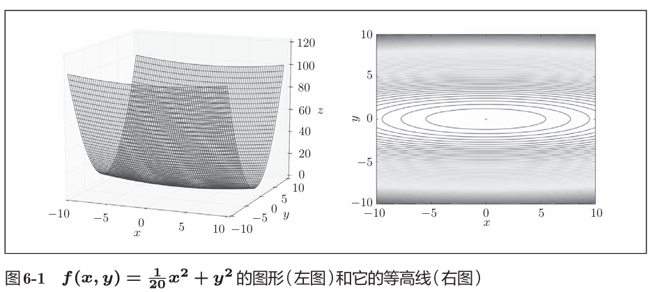

现在看一下式（6.2）表示的函数的梯度。如果用图表示梯度的话，则如 图6-2所示。

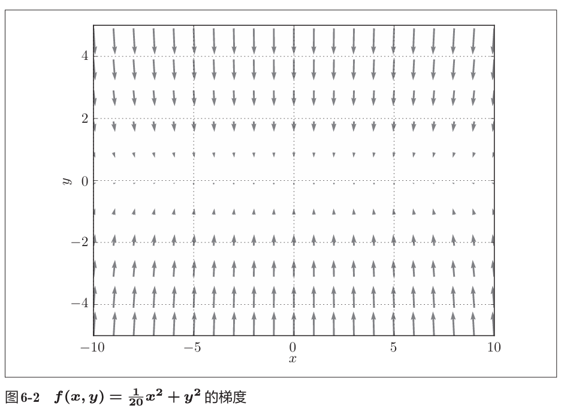

我们来尝试对图6-1这种形状的函数应用SGD。从 $(x,y)=(−7.0,2.0)$ 处 （初始值）开始搜索，结果如图6-3所示。

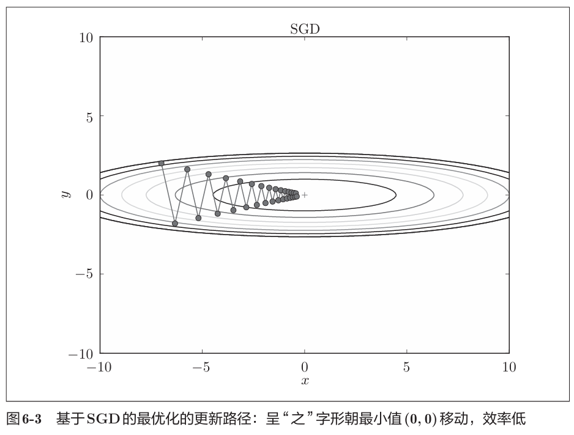

SGD的缺点是，如果函数的形状非均向（anisotropic），比如呈延伸状，搜索 的路径就会非常低效。SGD低效的根本原因是，梯度的方向并没有指向最小值的方向。

###  6.1.4 Momentum

用数学式表示Momentum方法，如下所示。
$$
\boldsymbol{v}\leftarrow\alpha\boldsymbol{v}-\eta\frac{\partial L}{\partial\boldsymbol{W}}\quad{(6.3)}
$$

$$
\boldsymbol{W}\leftarrow\boldsymbol{W}+\boldsymbol{v}\quad{(6.4)}
$$

W表示要更新的权重参数，表示损失函数关于$W$的梯度，$η$表示学习率。这里新出现了一个变量$v$，对应物理上的速度。

Momentum的代码实现（源代码在`common/optimizer.py`中 ）

使用Momentum解决式（6.2）的最优化问题，如图6-5所示。

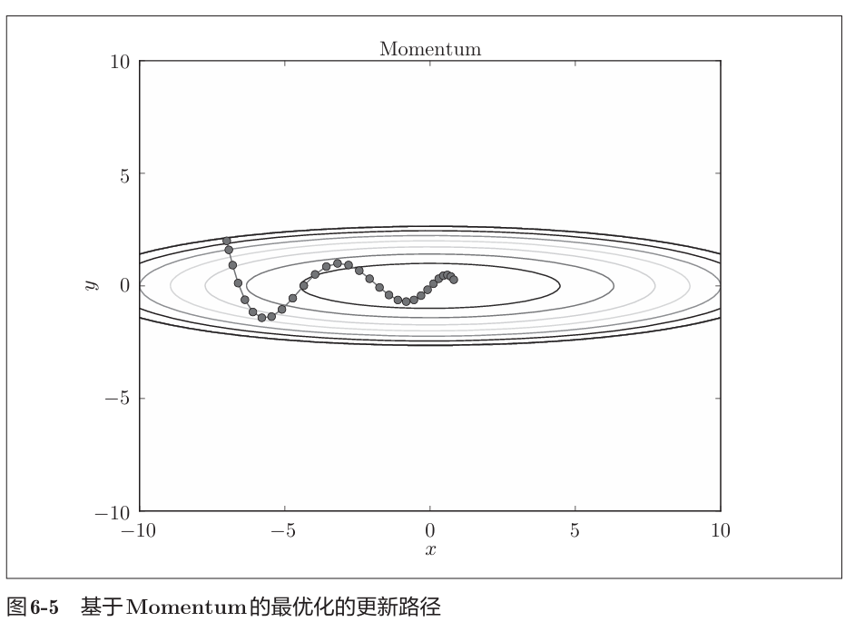

### 6.1.5 AdaGrad

学习率衰减（learning rate  decay）的方法，即随着学习的进行，使学习率逐渐减小。

逐渐减小学习率的想法，相当于将“全体”参数的学习率值一起降低。 而AdaGrad进一步发展了这个想法，针对“一个一个”的参数，赋予其“定 制”的值。

AdaGrad会为参数的每个元素适当地调整学习率，与此同时进行学习。用数学式表示AdaGrad的更新方法。
$$
\boldsymbol{h}\leftarrow\boldsymbol{h}+\frac{\partial L}{\partial\boldsymbol{W}}\odot\frac{\partial L}{\partial\boldsymbol{W}}\quad{(6.5)}
$$

$$
\boldsymbol{W}\leftarrow\boldsymbol{W}-\eta\frac{1}{\sqrt{\boldsymbol{h}}}\frac{\partial L}{\partial\boldsymbol{W}}\quad{(6.6)}
$$

$W$表示要更新的权重参数，$\frac{\partial L}{\partial\boldsymbol{W}}$表示损失函数关 于W的梯度，$η$表示学习率。这里新出现了变量$h$，如式(6.5)所示，它保存了以前的所有梯度值的平方和（式（6.5）中的$\odot$表示对应矩阵元素的乘法）。然后，在更新参数时，通过乘以$\frac{1}{\sqrt{\boldsymbol{h}}}$，就可以调整学习的尺度。这意味着， 参数的元素中变动较大（被大幅更新）的元素的学习率将变小。

AdaGrad的实现过程如下所示（源代码在 `common/optimizer.py`中 ）。使用AdaGrad解决式（6.2）的最优化问题，结果如图6-6 所示。

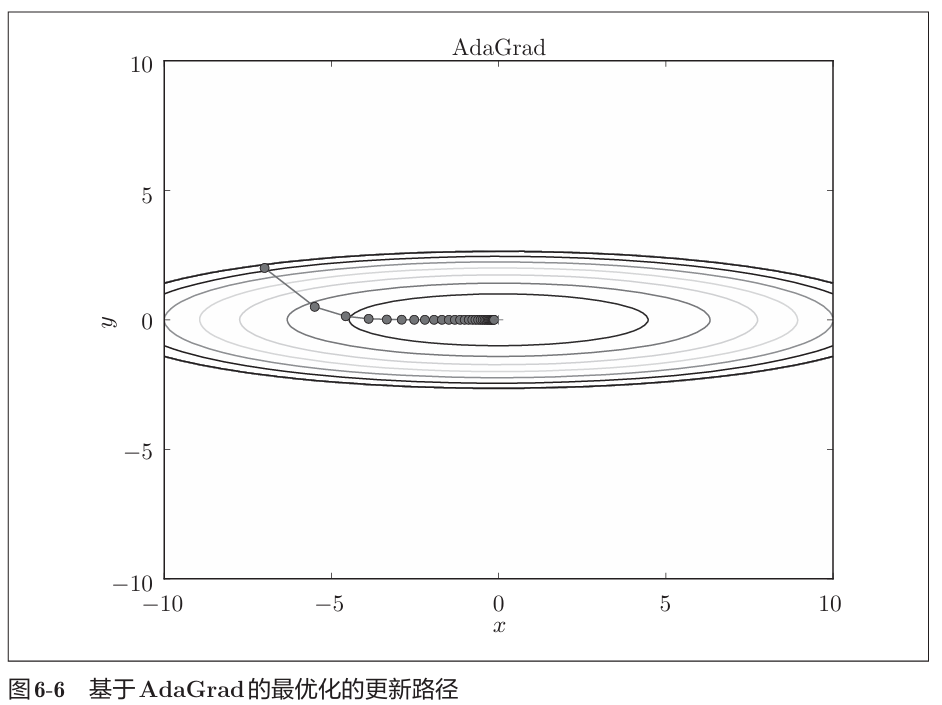

### 6.1.6 Adam

Adam直观地讲，就是融 合了Momentum和AdaGrad的方法。通过组合前面两个方法的优点，有望 实现参数空间的高效搜索。

关于Python 的实现，`common/optimizer.py`中将其实现为了Adam类

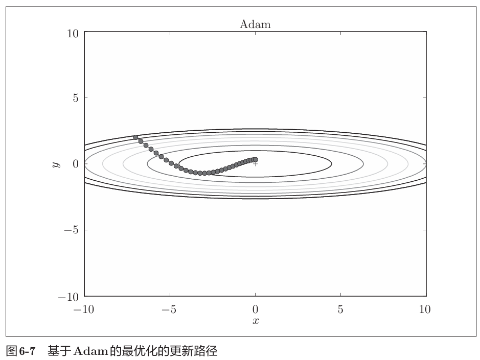

### 6.1.7 使用哪种更新方法呢

比较一 下这4种方法（源代码在`ch06/optimizer_compare_naive.py`中 ）。

如图6-8所示，根据使用的方法不同，参数更新的路径也不同。

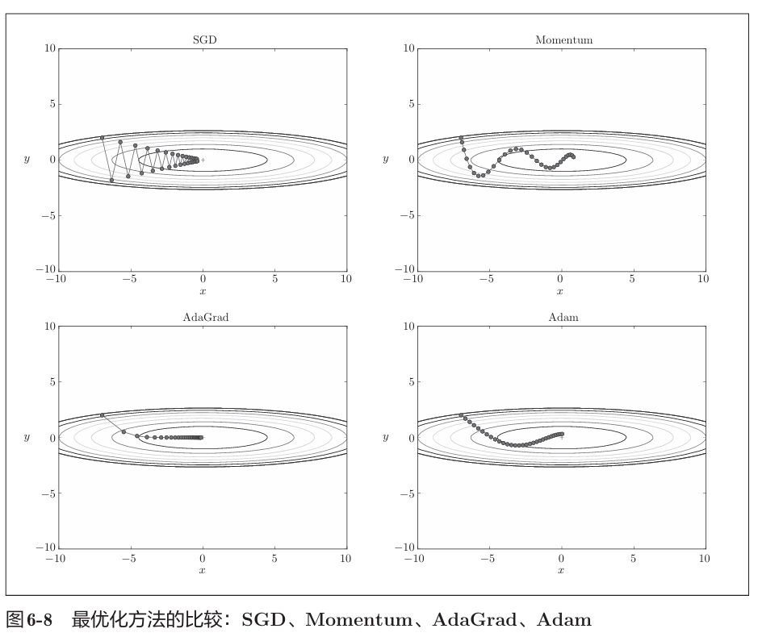

这4种方法各有各的特点，都有各自擅长解决的问题和不擅长解决 的问题。

### 6.1.8 基于MNIST数据集的更新方法的比较

以手写数字识别为例，比较前面介绍的SGD、Momentum、 AdaGrad、Adam这4种方法，并确认不同的方法在学习进展上有多大程度 的差异。先来看一下结果，如图6-9所示（源代码在`ch06/optimizer_compare_ mnist.py`中 ）。

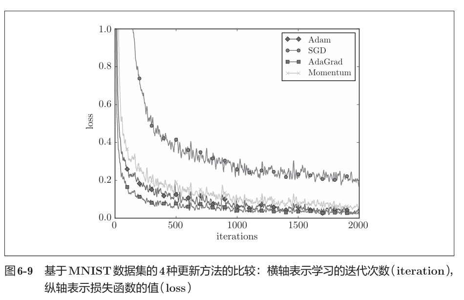

这个实验以一个5层神经网络为对象，其中每层有100个神经元。激活 函数使用的是ReLU。

## 6.2 权重的初始值

### 6.2.1 可以将权重初始值设为0吗

把权重初始值全部设为0以减小权重的值，会怎么样呢？事实上，将权重初始值设为 0的话，将无法正确进行学习。

这是因为在误差反向传播法中，所有的权重值都会进行相同的更新。

因此，权重被更新为相同的值，并拥有了对称的值（重复的值）。 这使得神经网络拥有许多不同的权重的意义丧失了。为了防止“权重均一化” （严格地讲，是为了瓦解权重的对称结构），必须随机生成初始值。

### 6.2.2 隐藏层的激活值的分布

观察隐藏层的激活值（激活函数的输出数据）的分布，可以获得很多启发。

这里要做的实验是，向一个5层神经网络（激活函数使用 sigmoid函数）传入随机生成的输入数据，用直方图绘制各层激活值的数据分布。

进行实验的源代码在`ch06/weight_init_activation_histogram.py`中

这里假设神经网络有5层，每层有100个神经元。然后，用高斯分布随 机生成1000个数据作为输入数据，并把它们传给5层神经网络。激活函数使 用sigmoid函数，各层的激活值的结果保存在activations变量中。

运行这段代码后，可以得到图6-10的直方图。

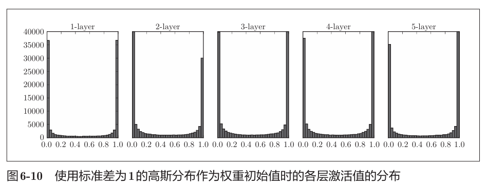

从图6-10可知，各层的激活值呈偏向0和1的分布。这里使用的sigmoid 函数是S型函数，随着输出不断地靠近0（或者靠近1），它的导数的值逐渐接近0。因此，**偏向0和1的数据分布会造成反向传播中梯度的值不断变小，最后消失。这个问题称为梯度消失（gradient vanishing**）。层次加深的深度学习 中，梯度消失的问题可能会更加严重。

使用标准差为0.01的高斯分布时，各层的激活值的分布 如图6-11所示。

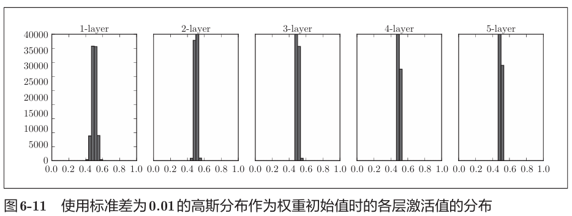

这次呈集中在0.5附近的分布。因为不像刚才的例子那样偏向0和1，所 以不会发生梯度消失的问题。但是，激活值的分布有所偏向，说明在表现力 上会有很大问题。为什么这么说呢？因为如果有多个神经元都输出几乎相同 的值，那它们就没有存在的意义了。比如，如果100个神经元都输出几乎相 同的值，那么也可以由1个神经元来表达基本相同的事情。因此，激活值在 分布上有所偏向会出现“表现力受限”的问题。

Xavier初始值，为了使各层的激活值呈现出具有相同广度的分布，推导了合适的权重尺度。推导出的结论是，如果前一层的节点数为$n$，则初始 值使用标准差为 $\frac{1}{\sqrt{n}}$ 的分布（图6-12）。

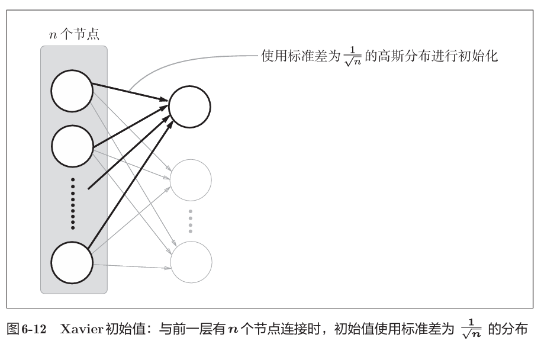

使用Xavier初始值后，前一层的节点数越多，要设定为目标节点的初始值的权重尺度就越小。

使用Xavier初始值后的结果如图6-13所示。从这个结果可知，越是后 面的层，图像变得越歪斜，但是呈现了比之前更有广度的分布。因为各层间传递的数据有适当的广度，所以sigmoid函数的表现力不受限制，有望进行高效的学习。

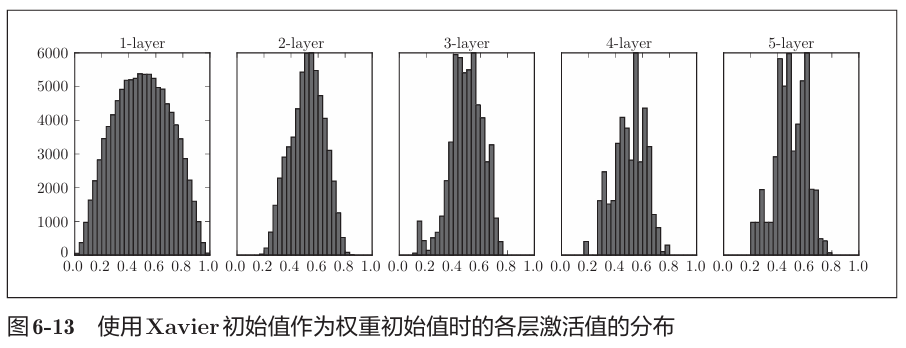

### 6.2.3 ReLU的权重初始值

Xavier初始值是以激活函数是线性函数为前提而推导出来的。因为sigmoid函数和tanh函数左右对称，且中央附近可以视作线性函数，所以适合使用Xavier初始值。但当激活函数使用ReLU时，一般推荐使用ReLU专用的初始值，也称为“He初始值”。He初始值使用标准差为 $\frac{2}{\sqrt{n}}$ 的高斯分布。

现在来看一下激活函数使用ReLU时激活值的分布。我们给出了3个实 验的结果（图6-14）

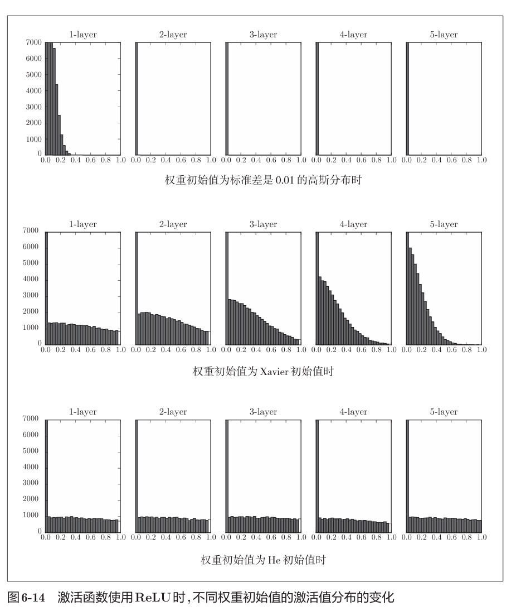

观察实验结果可知，当“std=0.01”时，各层的激活值非常小。神经网络上传递的是非常小的值，说明逆向传播时权重的梯度也同样很小。这是很 严重的问题，实际上学习基本上没有进展。

接下来是初始值为Xavier初始值时的结果。在这种情况下，随着层的加深， 偏向一点点变大。实际上，层加深后，激活值的偏向变大，学习时会出现梯度消失的问题。

而当初始值为He初始值时，各层中分布的广度相同。由于 即便层加深，数据的广度也能保持不变，因此逆向传播时，也会传递合适的值。

### 6.2.4 基于MNIST数据集的权重初始值的比较

基于std=0.01、Xavier初始值、He初 始值进行实验（源代码在`ch06/weight_init_compare.py`中）。先来看一下结果， 如图6-15所示。

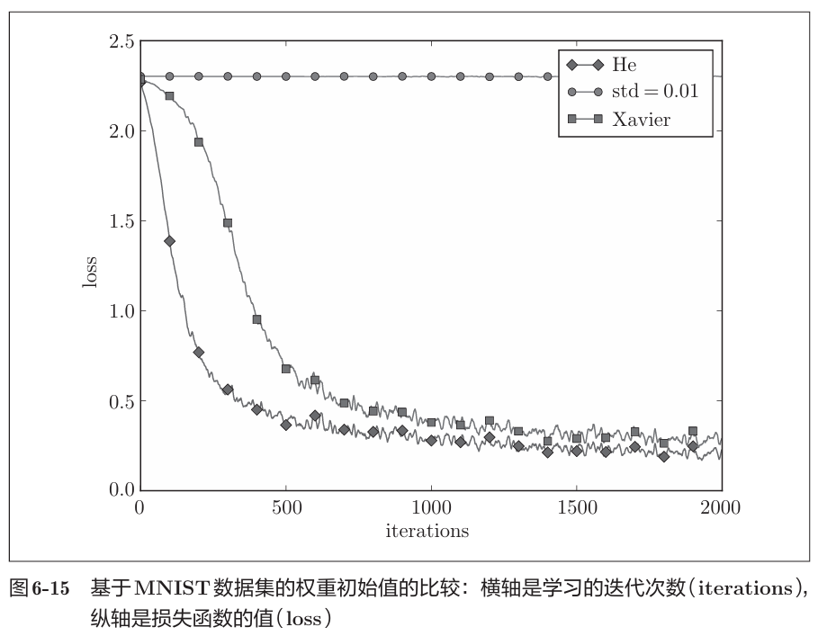

这个实验中，神经网络有5层，每层有100个神经元，激活函数使用的 是ReLU。从图6-15的结果可知，`std=0.01`时完全无法进行学习。这和刚 才观察到的激活值的分布一样，是因为正向传播中传递的值很小（集中在0附近的数据）。因此，逆向传播时求到的梯度也很小，权重几乎不进行更新。

相反，当权重初始值为Xavier初始值和He初始值时，学习进行得很顺利。 并且，我们发现He初始值时的学习进度更快一些。

综上，在神经网络的学习中，权重初始值非常重要。很多时候权重初始 值的设定关系到神经网络的学习能否成功。

## 6.3 Batch Normalization

如果设定了合 适的权重初始值，则各层的激活值分布会有适当的广度，从而可以顺利地进 行学习。

### 6.3.1 Batch Normalization 的算法

Batch Normalization

- 可以使学习快速进行（可以增大学习率）
- 不那么依赖初始值（对于初始值不用那么神经质）
- 抑制过拟合（降低Dropout等的必要性）

Batch Norm的思路是调整各层的激活值分布使其拥有适当的广度。为此，要向神经网络中插入对数据分布进行正规化的层，即Batch Normalization层（下文简称Batch Norm层），如图6-16所示。

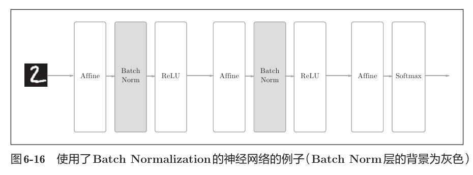

Batch Norm，顾名思义，以进行学习时的mini-batch为单位，按mini batch进行正规化。具体而言，就是进行使数据分布的均值为0、方差为1的 正规化。用数学式表示的话，如下所示。
$$
\begin{aligned}
 & \mu_{B} & & \leftarrow\frac{1}{m}\sum_{i=1}^mx_i \\
 & \sigma_{B}^2 & & \leftarrow\frac{1}{m}\sum_{i=1}^m(x_i-\mu_B)^2 & (6.7) \\
 & \hat{x}_{i} & & \leftarrow\frac{x_i-\mu_B}{\sqrt{\sigma_B^2+\varepsilon}}
\end{aligned}
$$
这里对mini-batch的m个输入数据的集合$B=\{x_1,x_2,...,x_m\}$求均值 $\mu_{B}$和方差$\sigma_{B}^2$。然后，对输入数据进行均值为0、方差为1（合适的分布）的正规化。式（6.7）中的 $\varepsilon$ 是一个微小值（比如，10e-7等），它是为了防止出现除以0的情况。

接着，Batch Norm层会对正规化后的数据进行缩放和平移的变换，用数学式可以如下表示。
$$
y_i\leftarrow\gamma\hat{x}_i+\beta\quad(6.8)
$$
这里，γ和β是参数。一开始γ=1，β=0，然后再通过学习调整到合 适的值。

Batch Norm可以表示为图6-17。

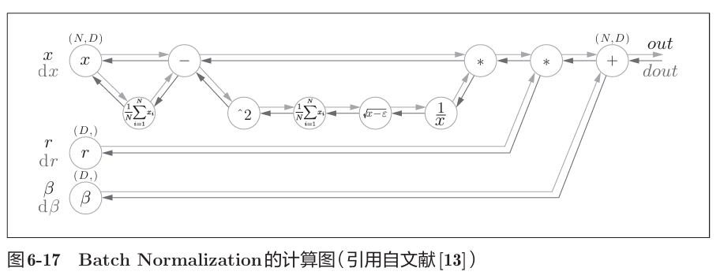

### 6.3.2 Batch Normalization的评估

使用MNIST数据集，观察使用Batch Norm层和不使用Batch Norm层时学习的过程会如何变化（源代码在`ch06/batch_norm_test.py`中），结果如图6-18所示。

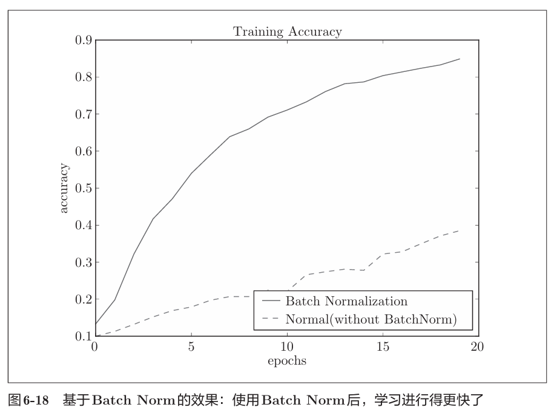

从图6-18的结果可知，使用Batch Norm后，学习进行得更快了。

接着， 给予不同的初始值尺度，观察学习的过程如何变化。图6-19是权重初始值的 标准差为各种不同的值时的学习过程图。

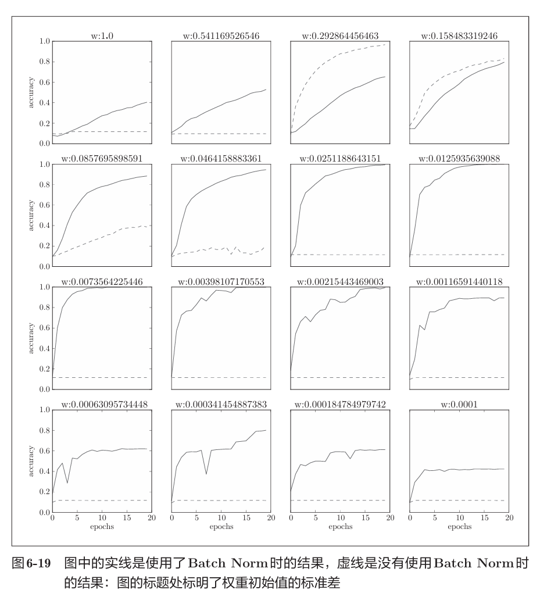

我们发现，几乎所有的情况下都是使用Batch Norm时学习进行得更快。 同时也可以发现，实际上，在不使用Batch Norm的情况下，如果不赋予一 个尺度好的初始值，学习将完全无法进行。

综上，通过使用Batch Norm，可以推动学习的进行。并且，对权重初 始值变得健壮（“对初始值健壮”表示不那么依赖初始值）。

##  6.4 正则化

**过拟合**指的是只能拟合训练数据，但不能很好地拟合不包含在训练数据中的其他数据的状态。机器学习的目标是提高泛化能力，即便是没有包含在训练数据里的未观测数据， 也希望模型可以进行正确的识别。我们可以制作复杂的、表现力强的模型，但是相应地，抑制过拟合的技巧也很重要。

### 6.4.1 过拟合

发生过拟合的原因，主要有以下两个。

- 模型拥有大量参数、表现力强。
- 训练数据少。

这里，我们故意满足这两个条件，制造过拟合现象。为此，要从 MNIST数据集原本的60000个训练数据中只选定300个，并且，为了增加网络的复杂度，使用7层网络（每层有100个神经元，激活函数为ReLU）

实验的代码在`ch06/overfit_weight_decay.py`

 `train_acc_list`和`test_acc_list`中以epoch为单位（看完了所有训练数据的单位）保存识别精度。现在，我们将这些列表（train_acc_list、test_acc_ list）绘成图，结果如图6-20所示。

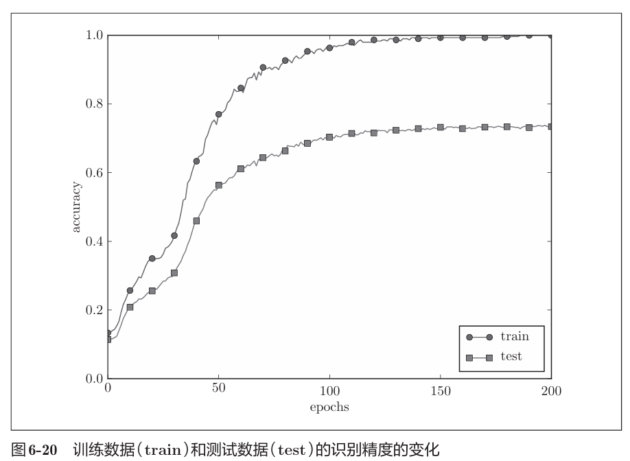

过了100个epoch左右后，用训练数据测量到的识别精度几乎都为 100%。但是，对于测试数据，离100%的识别精度还有较大的差距。如此大 的识别精度差距，是只拟合了训练数据的结果。从图中可知，模型对训练时 没有使用的一般数据（测试数据）拟合得不是很好。

### 6.4.2 权值衰减

权值衰减是一直以来经常被使用的一种抑制过拟合的方法。该方法通过 在学习的过程中对大的权重进行惩罚，来抑制过拟合。

损失函数加上权重的平方范数（L2范数）（L2范数相当于各个元素的平方和。）。用符号表示的话，如果将权重记为$W$，L2范数的权值衰减就是$\frac{1}{2}\lambda W^{2}$后将这个$\frac{1}{2}\lambda W^{2}$ 加到损失函数上。

应用λ=0.1的权值衰减， 结果如图6-21所示。实验代码在`ch06/overfit_weight_decay.py`

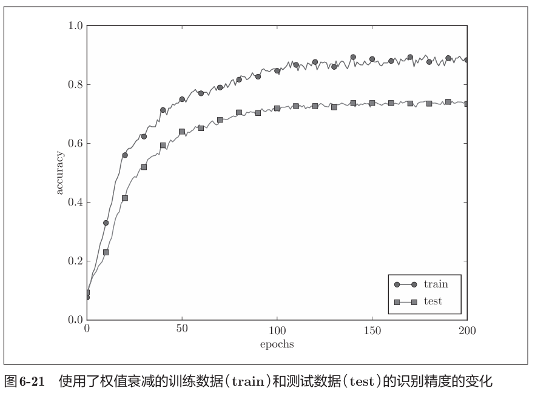

### 6.4.3 Dropout

如果网络的模型变得很复杂，只用权值衰减就难以应对了。在这种情 况下，我们经常会使用Dropout方法。

Dropout是一种在学习的过程中随机删除神经元的方法。训练时，随机 选出隐藏层的神经元，然后将其删除。被删除的神经元不再进行信号的传递， 如图6-22所示。训练时，每传递一次数据，就会随机选择要删除的神经元。 然后，测试时，虽然会传递所有的神经元信号，但是对于各个神经元的输出， 要乘上训练时的删除比例后再输出。

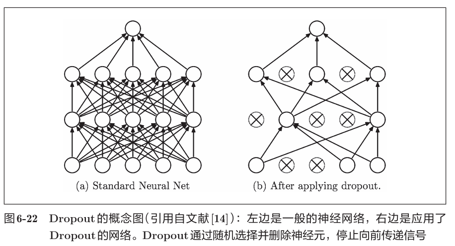

Dropout的实验，使用7层网络（每层有100个神经元， 激活函数为ReLU），一个使用Dropout，另一个不使用Dropout，实验的结 果如图6-23所示。

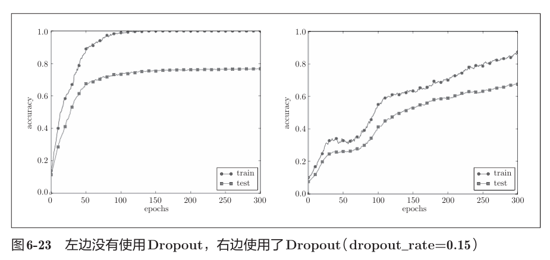

图6-23中，通过使用Dropout，训练数据和测试数据的识别精度的差距变小了。并且，训练数据也没有到达100%的识别精度。像这样，通过使用 Dropout，即便是表现力强的网络，也可以抑制过拟合。

## 6.5 超参数的验证

**超参数（hyper-parameter）**是指，比如各层的神经元数量、batch大小、参 数更新时的学习率或权值衰减等。如果这些超参数没有设置合适的值，模型 的性能就会很差。

### 6.5.1 验证数据

数据集分成了训练数据和测试数据，训练数据用于学习， 测试数据用于评估泛化能力。

调整超参数时，必须使用超参数专用的确认数据。用于调整超参 数的数据，一般称为验证数据（validation data）。我们使用这个验证数据来 评估超参数的好坏。

### 6.5.2 超参数的最优化

进行超参数的最优化时，逐渐缩小超参数的“好值”的存在范围非常重要。

在超参数的最优化中，要注意的是深度学习需要很长时间（比如，几天 或几周）。因此，在超参数的搜索中，需要尽早放弃那些不符合逻辑的超参数。

超参数的最优化的内容

1. 设定超参数的范围
2. 从设定的超参数范围中随机采样。
3. 使用步骤1中采样到的超参数的值进行学习，通过验证数据评估识别精 度（但是要将epoch设置得很小）。
4. 重复步骤2和步骤3（100次等），根据它们的识别精度的结果，缩小超参数的范围。

在超参数的最优化中，如果需要更精炼的方法，可以使用贝叶斯最优化（Bayesian optimization）

### 6.5.3 超参数最优化的实现

进行超参数最优化的源代码在`ch06/hyperparameter_optimization.py`中

下面我们就以权值衰减系数为$10^{−8}$到$10^{−4}$、学习率为$10^{−6}$到$10^{−2}$的范围 进行实验，结果如图6-24所示。

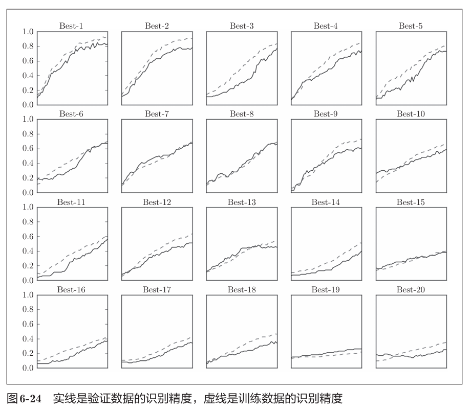

图6-24中，按识别精度从高到低的顺序排列了验证数据的学习的变化。 从图中可知，直到“Best-5”左右，学习进行得都很顺利。

# 7. 卷积神经网络

卷积神经网络（Convolutional Neural Network，**CNN**）

## 7.1 整体结构

神经网络中，相邻层的所有神经元之间都有连接，这称为**全连接（fully-connected）**。我们用Affine层实现了全连接层。

如图7-1所示，全连接的神经网络中，Affine层后面跟着激活函数ReLU层（或 者 Sigmoid层）。

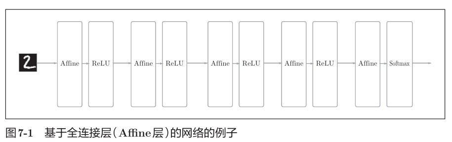

图7-2是CNN的一个例子。

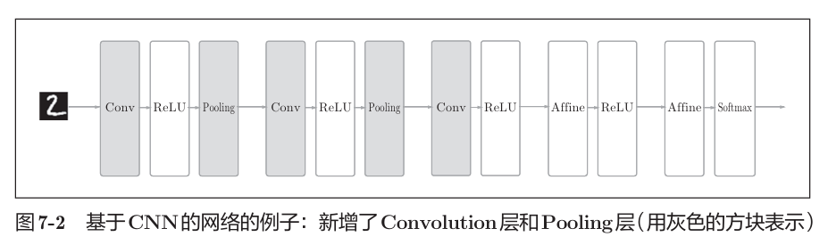

## 7.2 卷积层

### 7.2.1 全连接层存在的问题

全连接层存在什么问题呢？那就是数据的形状被“忽视”了。比如，输入数据是图像时，图像通常是高、长、通道方向上的3维形状。但是，向全连接层输入时，需要将3维数据拉平为1维数据。

图像是3维形状，这个形状中应该含有重要的空间信息。比如，空间上 邻近的像素为相似的值、RBG的各个通道之间分别有密切的关联性、相距 较远的像素之间没有什么关联等，3维形状中可能隐藏有值得提取的本质模式。

而卷积层可以保持形状不变。当输入数据是图像时，卷积层会以3维 数据的形式接收输入数据，并同样以3维数据的形式输出至下一层。因此， 在CNN中，可以（有可能）正确理解图像等具有形状的数据。

CNN中，有时将卷积层的输入输出数据称为特征图（feature  map）。其中，卷积层的输入数据称为输入特征图（input feature map）， 输出数据称为输出特征图（output feature map）。

### 7.2.2 卷积运算

卷积运算相当于图像处理中的“滤波 器运算”。看一个具体的例子（图7-3）。

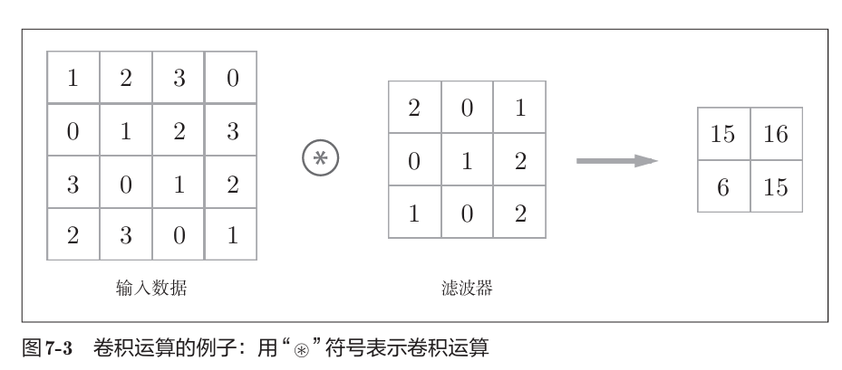

图7-4 中展示了卷积运算的计算顺序。将各个位置上滤波器的元素和输入的对应元素相乘，然后再求和（有时将这个计算称为乘积累加运算）。

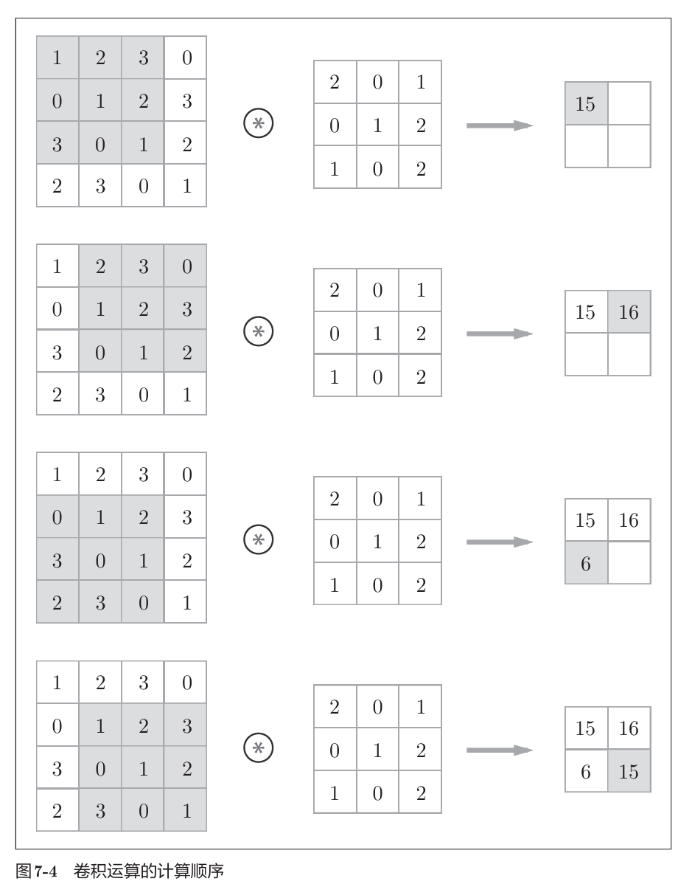

如图7-5所示，向应用了滤波器的数据加上了偏置。偏置通常只有1个。这个值会被加到应用了滤波器的所有元素上。

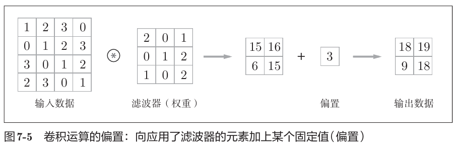

### 7.2.3 填充

在进行卷积层的处理之前，有时要向输入数据的周围填入固定的数据（比如0等），这称为填充（padding），是卷积运算中经常会用到的处理。在图7-6的例子中，对大小为(4,4)的输入数据应用了幅度为1的填充。“幅 度为1的填充”是指用幅度为1像素的0填充周围。

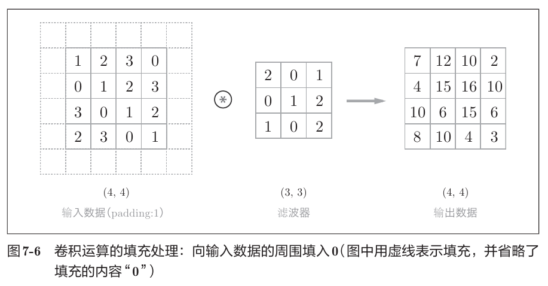

### 7.2.4 步幅

应用滤波器的位置间隔称为步幅（stride）。之前的例子中步幅都是1，如果将步幅设为2，则如图7-7所示，应用滤波器的窗口的间隔变为2个元素。

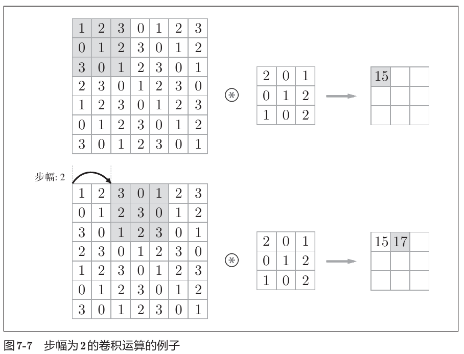

假设输入大小为(H,W)，滤波器大小为(FH,FW)，输出大小为 (OH,OW)，填充为P，步幅为S。此时，输出大小可通过式(7.1)进行计算。
$$
\begin{aligned}
 & \mathrm{OH}=\frac{H+2P-FH}{S}+1 \\
 & & (7.1) \\
 & \mathrm{OW}=\frac{W+2P-FW}{S}+1
\end{aligned}
$$

### 7.2.5 3维数据的卷积运算

图像是3维数据，除了高、长方向之外，还需要处理通道方向。

图7-8是卷积运算的例子，图7-9是计算顺序。这里以3通道的数据为例， 展示了卷积运算的结果。和2维数据时（图7-3的例子）相比，可以发现纵深方向（通道方向）上特征图增加了。通道方向上有多个特征图时，会按通道进行输入数据和滤波器的卷积运算，并将结果相加，从而得到输出。

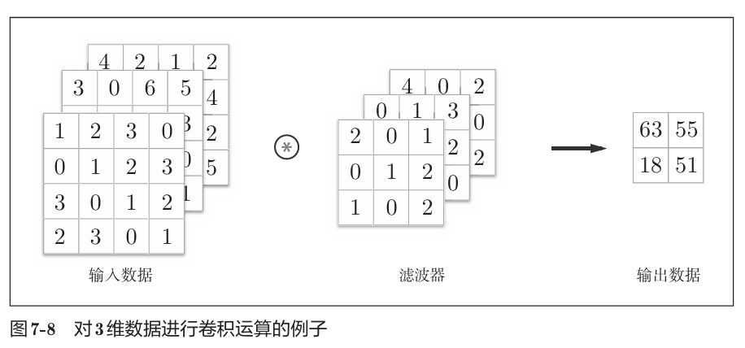

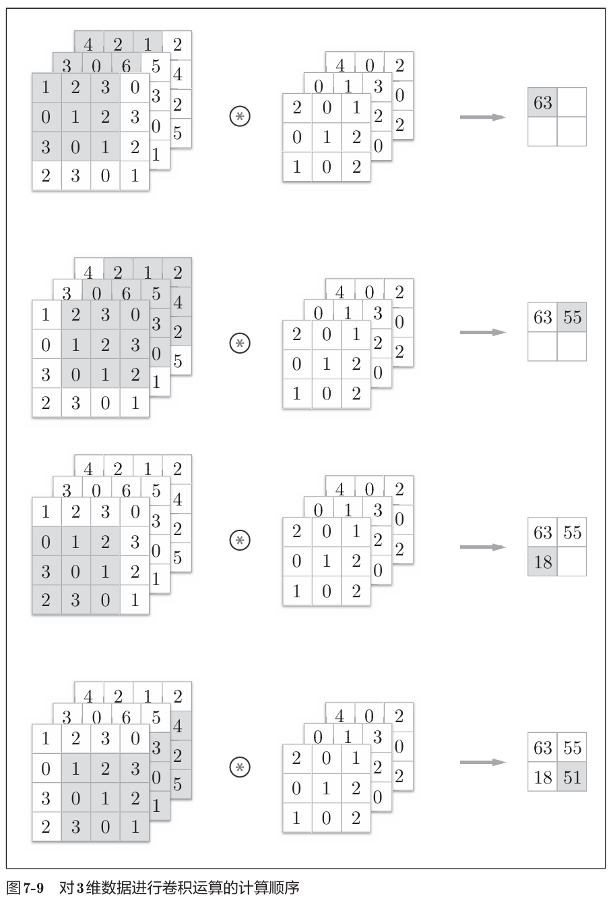

需要注意的是，在3维数据的卷积运算中，输入数据和滤波器的通道数要设为相同的值。

### 7.2.6 结合方块思考

方块是如图7-10所示的3维长方体。把3维数据表示为多维数组 时，书写顺序为（channel, height, width）。

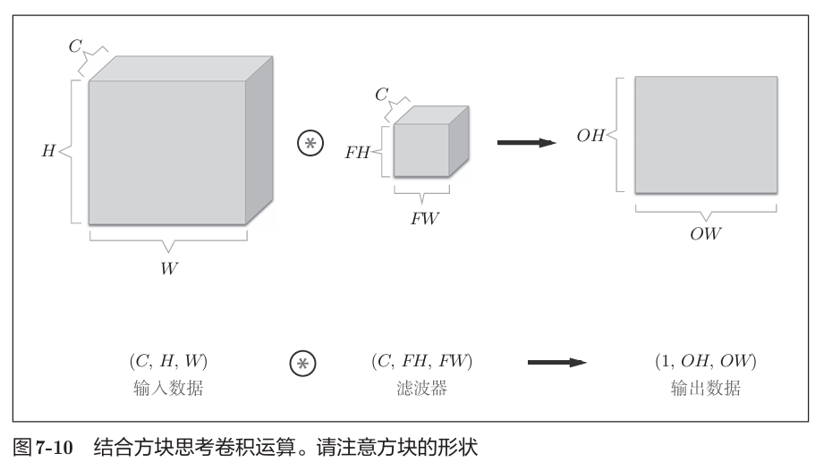

在这个例子中，数据输出是1张特征图。所谓1张特征图，换句话说， 就是通道数为1的特征图。那么，如果要在通道方向上也拥有多个卷积运算的输出，该怎么做呢？为此，就需要用到多个滤波器（权重）。用图表示的话， 如图7-11所示。

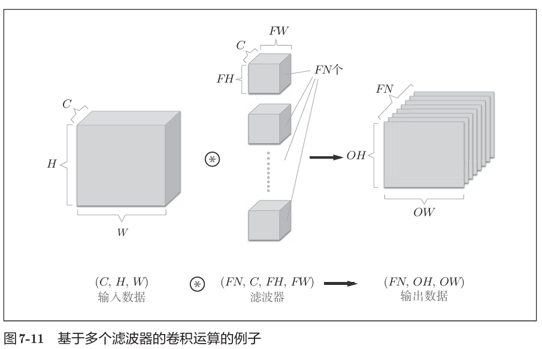

图7-11中，通过应用FN个滤波器，输出特征图也生成了FN个。如果将这FN个特征图汇集在一起，就得到了形状为(FN,OH,OW)的方块。将 这个方块传给下一层，就是CNN的处理流。

卷积运算中（和全连接层一样）存在偏置。在图7-11的例子中，如果进 一步追加偏置的加法运算处理，则结果如下面的图7-12所示。

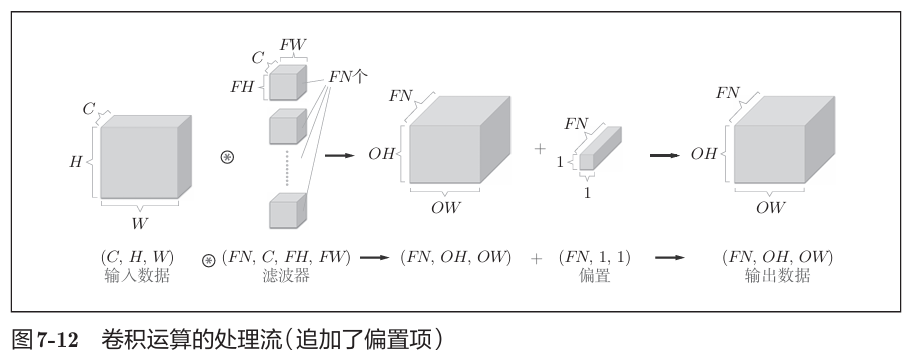

### 7.2.7 批处理

卷积运算也同样对应批处理。为此，需要将在各层间传递的数据保存为4维数据。具体地讲，就是按(batch_num,channel,height,width) 的顺序保存数据。比如，将图7-12中的处理改成对N个数据进行批处理时， 数据的形状如图7-13所示。

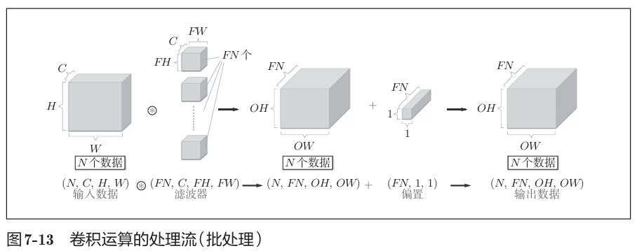

### 7.3 池化层

池化是缩小高、长方向上的空间的运算。比如，如图7-14所示，进行将 2 ×2的区域集约成1个元素的处理，缩小空间大小。

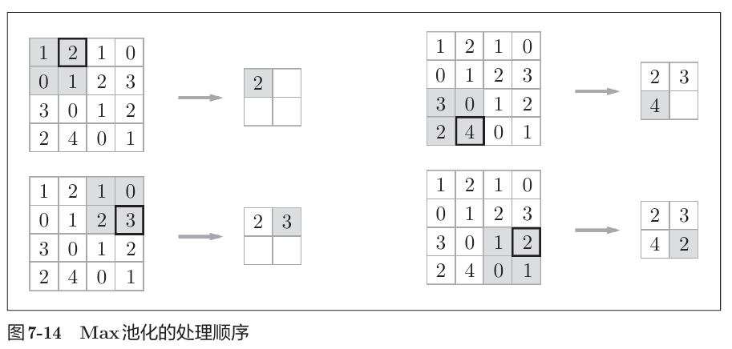

**池化层的特征:**

- **没有要学习的参数**

  池化层和卷积层不同，没有要学习的参数。池化只是从目标区域中取最 大值（或者平均值），所以不存在要学习的参数。

- **通道数不发生变化**

  经过池化运算，输入数据和输出数据的通道数不会发生变化。如图7-15 所示，计算是按通道独立进行的。

  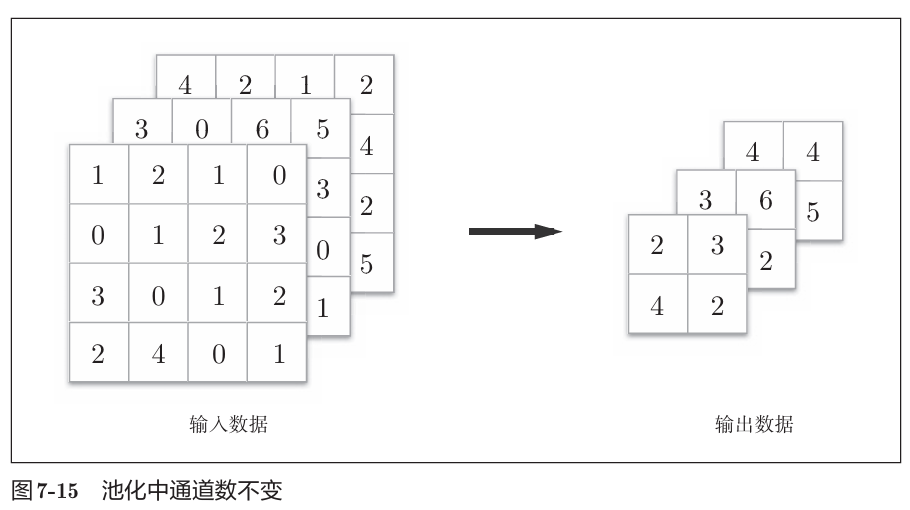

- **对微小的位置变化具有鲁棒性（健壮）**

  输入数据发生微小偏差时，池化仍会返回相同的结果。因此，池化对 输入数据的微小偏差具有鲁棒性。

  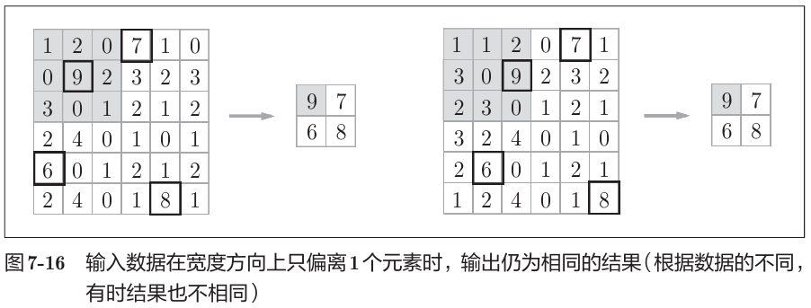

## 7.4 卷积层和池化层的实现

### 7.4.2 基于im2col的展开

im2col是一个函数，将输入数据展开以适合滤波器（权重）。如图7-17所示， 对3维的输入数据应用im2col后，数据转换为2维矩阵

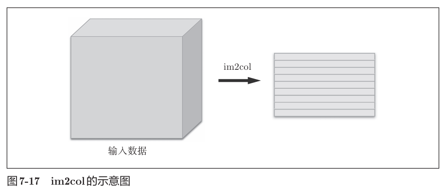

im2col会把输入数据展开以适合滤波器（权重）。具体地说，如图7-18所示， 对于输入数据，将应用滤波器的区域（3维方块）横向展开为1列。im2col会 在所有应用滤波器的地方进行这个展开处理。

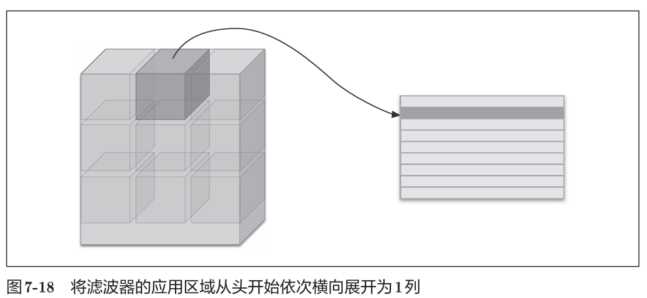

汇总成一个大的矩阵进行计算，对计算机的计算颇有 益处。比如，在矩阵计算的库（线性代数库）等中，矩阵计算的实现已被高 度最优化，可以高速地进行大矩阵的乘法运算。

使用im2col展开输入数据后，之后就只需将卷积层的滤波器（权重）纵 向展开为1列，并计算2个矩阵的乘积即可（参照图7-19）

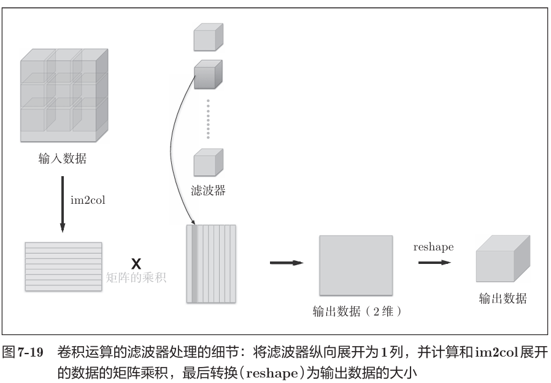

### 7.4.3　卷积层的实现

transpose会更改多维数组的轴的顺序。如图7-20 所示，通过指定从0开始的索引（编号）序列，就可以更改轴的顺序。

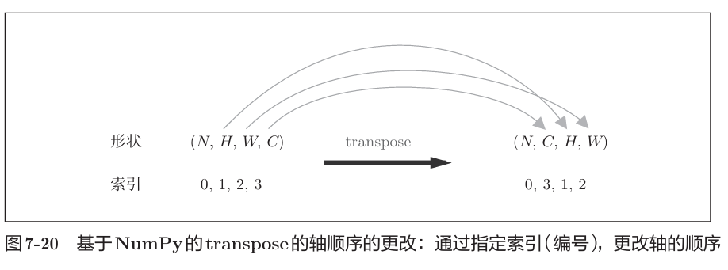

卷积层的反向传播的实现在`common/layer.py`中

### 7.4.4 池化层的实现

池化层的实现和卷积层相同，都使用im2col展开输入数据。具体地讲，如图 7-21所示，池化的应用区域按通道单独展开。

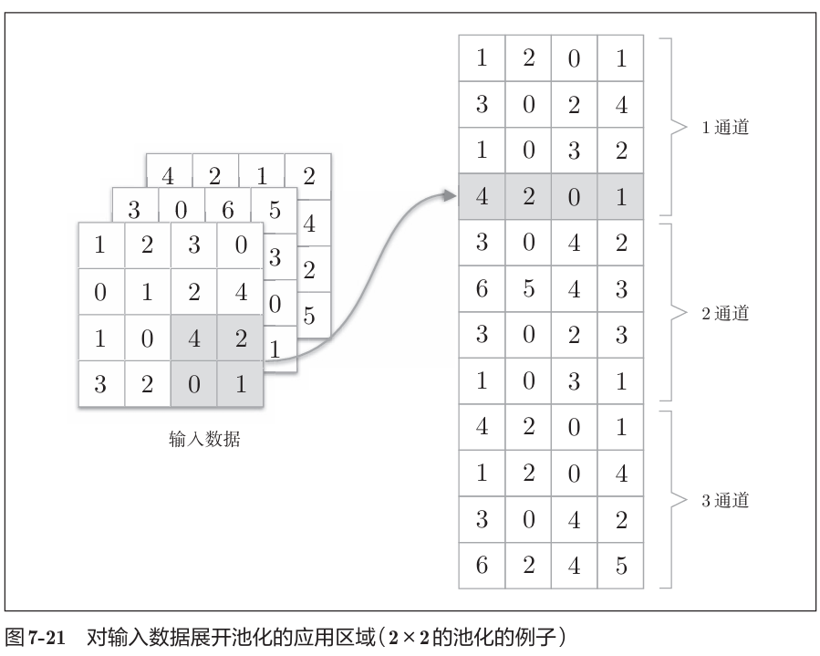

像这样展开之后，只需对展开的矩阵求各行的最大值，并转换为合适的形状即可（图7-22）。

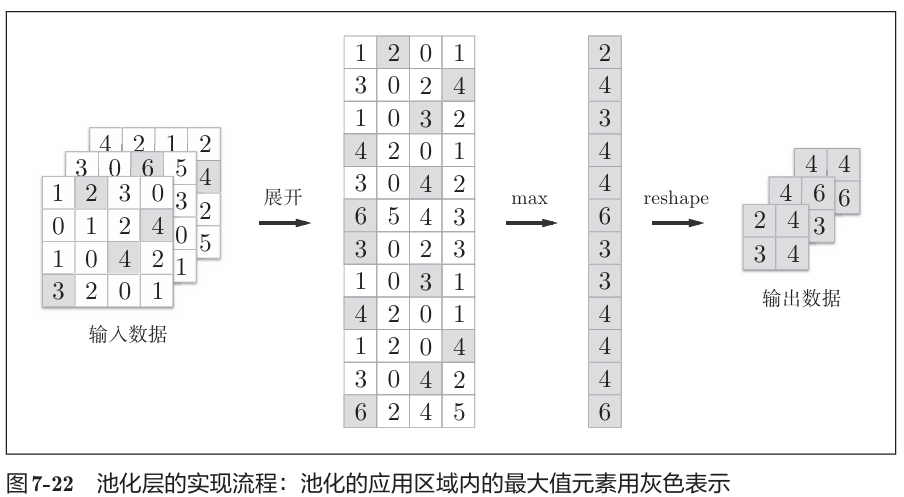

## 7.5  CNN的实现

我们已经实现了卷积层和池化层，现在来组合这些层，搭建进行手写数 字识别的CNN。这里要实现如图7-23所示的CNN。

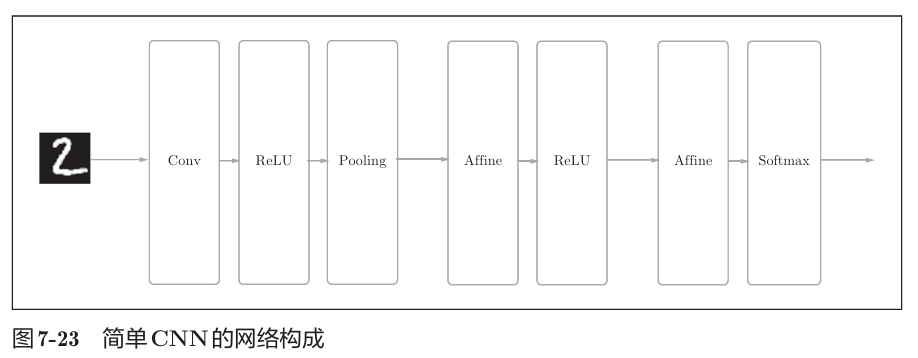

源代码在`ch07/train_convnet.py`中

## 7.6 CNN的可视化

### 7.6.1 第1层权重的可视化

这里，我 们来比较一下学习前和学习后的权重，结果如图7-24所示（源代码在`ch07/ visualize_filter.py`中 ）

图7-24中，学习前的滤波器是随机进行初始化的，所以在黑白的浓淡上 没有规律可循，但学习后的滤波器变成了有规律的图像。我们发现，通过学 习，滤波器被更新成了有规律的滤波器，比如从白到黑渐变的滤波器、含有 块状区域（称为blob）的滤波器等。

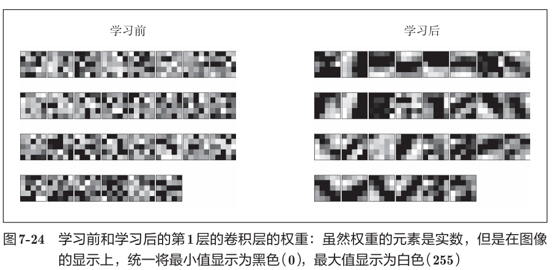

如果要问图7-24中右边的有规律的滤波器在“观察”什么，答案就是它 在观察边缘（颜色变化的分界线）和斑块（局部的块状区域）等。比如，左半部分为白色、右半部分为黑色的滤波器的情况下，如图7-25所示，会对垂直 方向上的边缘有响应。

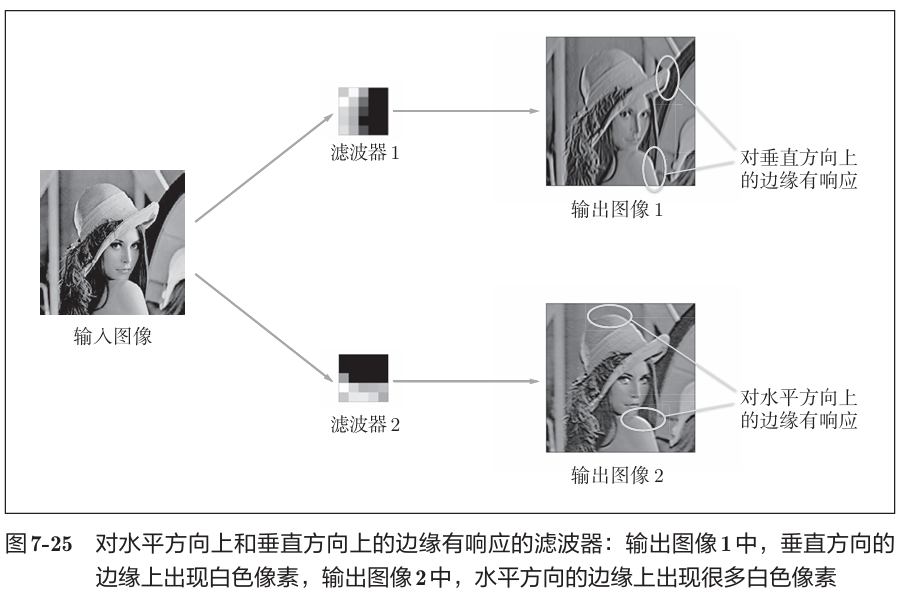

由此可知，卷积层的滤波器会提取边缘或斑块等原始信息。而刚才实现 的CNN会将这些原始信息传递给后面的层。

### 7.6.2 基于分层结构的信息提取

随着层次加深，提取的信息（正确地讲，是反映强烈的神经元）也越来越抽象。

图7-26中展示了进行一般物体识别（车或狗等）的8层CNN。

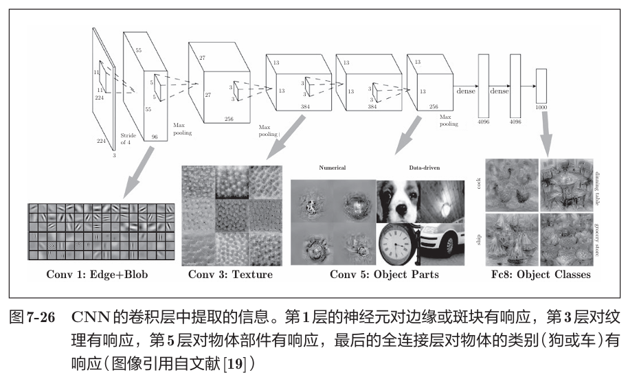

如图7-26所示，如果堆叠了多层卷积层，则随着层次加深，提取的信息也愈加复杂、抽象，这是深度学习中很有意思的一个地方。最开始的层对简单的边缘有响应，接下来的层对纹理有响应，再后面的层对更加复杂的物体部件有响应。也就是说，随着层次加深，神经元从简单的形状向“高级”信息 变化。换句话说，就像我们理解东西的“含义”一样，响应的对象在逐渐变化。

## 7.7  具有代表性的CNN

### 7.7.1 LeNet

 LeNet, 如图7-27所示， 它有连续的卷积层和池化层，最后经全连接层输出结果。

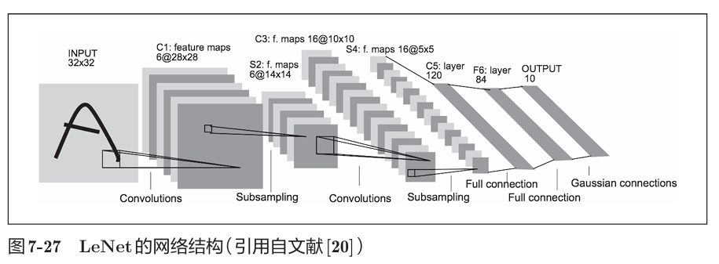

### 7.7.2 AlexNet

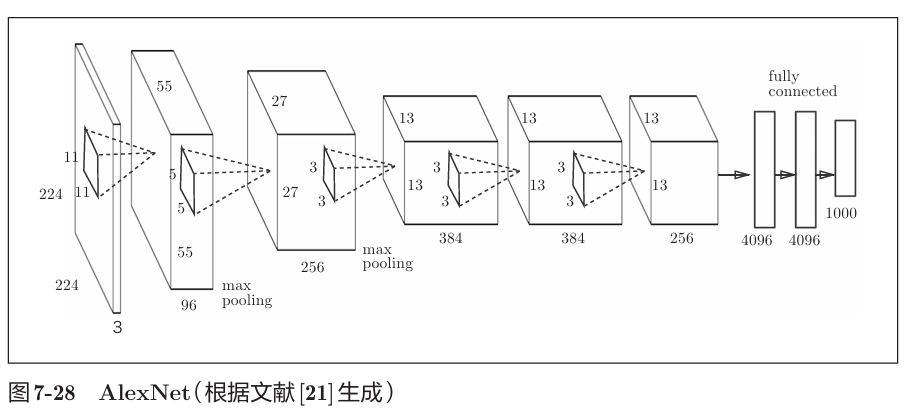

AlexNet叠有多个卷积层和池化层，最后经由全连接层输出结果。虽然 结构上AlexNet和LeNet没有大的不同，但有以下几点差异。

- 激活函数使用ReLU。
- 使用进行局部正规化的LRN（Local Response Normalization）层
- 使用Dropout

# 8. 深度学习

