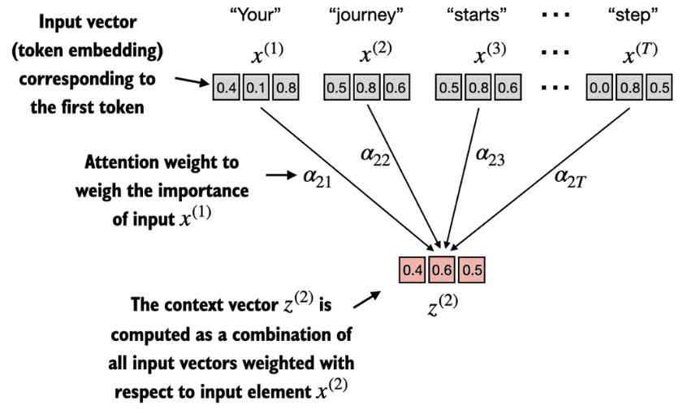

## 3.1 The problem with modeling long sequences

如 Figure 3.3 所示，由于源语言和目标语言的语法结构差异，我们无法简单地逐词翻译文本。

<div align="center">

</div>

---

在 encoder-decoder RNN 中，输入文本被送入 encoder，encoder 按顺序处理输入。encoder 在每一步更新其 hidden state（隐藏层的内部值），试图将整个输入句子的含义压缩到最终的 hidden state 中，如 Figure 3.4 所示。然后，decoder 接收这个最终的 hidden state 来开始生成翻译后的句子，每次生成一个词。decoder 也会在每一步更新其 hidden state，该 hidden state 应携带下一个词预测所需的上下文信息。

<div align="center">

</div>

> Figure 3.4: 在 transformer 模型出现之前，encoder-decoder RNN 是机器翻译的常用选择。encoder 接收来自源语言的 token 序列作为输入，其中 encoder 的 hidden state（一个中间神经网络层）对整个输入序列进行压缩编码。然后，decoder 使用其当前的 hidden state 开始逐 token 翻译。

虽然我们不需要了解这些 encoder-decoder RNN 的内部工作原理，但关键思想是：encoder 部分将整个输入文本处理为一个 hidden state（memory cell）。然后 decoder 接收这个 hidden state 来生成输出。


## 3.2 Capturing data dependencies with attention mechanisms

因此，研究人员在 2014 年开发了所谓的 Bahdanau attention mechanism（以相关论文第一作者命名），它对 encoder-decoder RNN 进行了修改，使得 decoder 在每个解码步骤中可以选择性地访问输入序列的不同部分，如 Figure 3.5 所示。

<div align="center">

</div>

> Figure 3.5 使用 attention mechanism，网络中负责生成文本的 decoder 部分可以选择性地访问所有输入 token。这意味着某些输入 token 对于生成给定的输出 token 比其他 token 更重要。这种重要性由所谓的 attention weights 决定，我们将在后面进行计算。
> 
> 请注意，此图展示的是 attention 的一般思想，并不是 Bahdanau mechanism 的精确实现，Bahdanau mechanism 是一种 RNN 方法，超出了本书的范围。

---

Self-attention 是一种机制，它允许输入序列中的每个位置在计算序列表示时关注同一序列中的所有位置。Self-attention 是当代基于 transformer 架构的 LLM（如 GPT 系列）的关键组件。

本章重点介绍 GPT 类模型中使用的 self-attention mechanism 的编码和理解，如 Figure 3.6 所示。

<div align="center">

</div>

> Figure 3.6 Self-attention 是 transformer 中的一种机制，通过允许序列中每个位置与同一序列中所有其他位置进行交互并权衡其重要性，来计算更高效的输入表示。


## 3.3 Attending to different parts of the input with self-attention

### 3.3.1 A simple self-attention mechanism without trainable weights

在本节中，我们实现一个简化版的 self-attention，不包含任何可训练权重，总结如 Figure 3.7 所示。

<div align="center">

</div>


---

考虑以下输入句子，它已经被嵌入为 3 维向量（如第 2 章所讨论的）。为了便于说明，我们选择较小的 embedding 维度，以确保内容可以在页面上显示而无需换行：

```python
import torch


inputs = torch.tensor(
    [[0.43, 0.15, 0.89], # Your (x^1)
    [0.55, 0.87, 0.66], # journey (x^2)
    [0.57, 0.85, 0.64], # starts (x^3)
    [0.22, 0.58, 0.33], # with (x^4)
    [0.77, 0.25, 0.10], # one (x^5)
    [0.05, 0.80, 0.55]] # step (x^6)
)
```


**逐步计算过程：**

1. 实现 self-attention 的第一步是计算中间值 $\omega$，称为 attention scores，如 Figure 3.8 所示。
    $$
    \omega_{ij} = x^{(i)} \cdot (x^{(j)})^T, \quad \text{x.shape = (T, d)}
    $$
    
    <div align="center">
    
    </div>

2. 下一步，如 Figure 3.9 所示，我们对之前计算的每个 attention score 进行归一化。
    $$
    \alpha_{ij} = \frac{\exp(\omega_{ij})}{\sum_{k=1}^T \exp(\omega_{ik})}
    $$

    <div align="center">
    
    </div>

3. 现在我们已经计算了归一化的 attention weights，可以进行 Figure 3.10 所示的最后一步：通过将嵌入的输入 token $x^{i}$ 与相应的 attention weights 相乘，然后将结果向量求和，来计算 context vector $z^{(2)}$。
    $$
    z^{(i)} = \sum_{j=1}^T \alpha_{ij} x^{(j)}
    $$
    
    <div align="center">
    
    </div>

    例如 $z^{(2)}$ 的计算（矩阵化形式）：
    
    $$
    z^{(2)} = W^{(2)}X = 
    \begin{bmatrix}
    \alpha_{21} &  \alpha_{22} &..,  &\alpha_{2T}
    \end{bmatrix} \
    \begin{bmatrix}
    x^{(1)}\\
    x^{(2)}\\
    ..,\\
    x^{(T)}\\
    \end{bmatrix}
    $$

Figure 3.10 中所示的 context vector $z^{(2)}$ 是所有输入向量的加权和。


### 3.3.2 Computing attention weights for all input tokens

在上一节中，我们计算了输入 2 的 attention weights 和 context vector，如 Figure 3.11 中高亮行所示。现在，我们将这个计算扩展到所有输入的 attention weights 和 context vectors。

<div align="center">

</div>

---


我们遵循与之前相同的三个步骤，总结如 Figure 3.12 所示：

<div align="center">

</div>

设输入矩阵 $X\in\mathbb{R}^{n\times d}$：

1. 首先，在 Figure 3.12 所示的步骤 1 中，我们添加一个额外的 for 循环来计算所有输入对的 dot product；
   $$
   S = XX^T
   $$

   $S \in \mathbb{R}^{n\times n} \text{ is the attention scores matrix}$
2. 在 Figure 3.12 所示的步骤 2 中，我们现在对每一行进行归一化，使每行的值之和为 1；
   $$
   W = \mathrm{softmax}_{\text{row}}(S),\quad
   W_{ij}=\frac{\exp(S_{ij})}{\sum_{k=1}^{n}\exp(S_{ik})}
   $$

   $W \in \mathbb{R}^{n\times n} \text{ is the attention weights matrix}$
3. 在第三步也是最后一步中，我们使用这些 attention weights 通过矩阵乘法计算所有 context vectors。
   $$
   C = WX
   $$

   $C \in \mathbb{R}^{n\times d} \text{ is the context vectors matrix}$


## 3.4 Implementing self-attention with trainable weights

这些可训练的权重矩阵至关重要，因为它们使模型（具体来说是模型内部的 attention 模块）能够学习产生"好的" context vectors。


### 3.4.1 Computing the attention weights step by step

我们将通过引入三个可训练的权重矩阵 $W_q, W_k$ 和 $W_v$ 来逐步实现 self-attention mechanism。这三个矩阵用于将嵌入的输入 token $x^{(i)}$ 投影为 query、key 和 value 向量，如 Figure 3.14 所示。

- $W_q$、$W_k$ 和 $W_v$, 分别是Query、Key、Value,专有名词
- 这三个矩阵用于通过矩阵乘法将嵌入的输入标记 $x^{(i)}$ 映射到查询向量、键向量和值向量：
  - 查询向量：$q^{(i)} = W_q \,x^{(i)}$  
  - 键向量：$k^{(i)} = W_k \,x^{(i)}$  
  - 值向量：$v^{(i)} = W_v \,x^{(i)}$  

<div align="center">

</div>

1. 首先定义一些变量；接下来，初始化 Figure 3.14 中所示的三个权重矩阵 $W_q$、$W_k$ 和 $W_v$；
   $$
   x^{(2)} = \text{inputs[1]}, \quad d_{in} = \text{inputs.shape[1]}, \quad d_{out} = 2 \\
   q^{(2)} = x^{(2)} W_q, \quad k^{(2)} = x^{(2)} W_k, \quad v^{(2)} = x^{(2)} W_v
   $$
   
   $$
   Q=X W_q, \quad K=X W_k, \quad V=X W_v
   $$

2. 第二步是计算 attention scores，如 Figure 3.15 所示；
    $$
    \omega_{i} = q^{(i)} \cdot K^T, \quad \omega_{ij} = q^{(i)} \cdot (k^{(j)})^T
    $$

    <div align="center">
    
    </div>
3. 第三步是将 attention scores 转换为 attention weights，如 Figure 3.16 所示；
    $$
    \alpha_{ij} = \frac{\exp(\omega_{ij})}{\sum_{k=1}^{n}\exp(\omega_{ik})}
    $$

    <div align="center">
    
    </div>
4. 最后一步是计算 context vectors，如 Figure 3.17 所示。
    $$
    z^{(i)} = \sum_{j=1}^T \alpha_{ij} v^{(j)}
    $$

    <div align="center">
    
    </div>


### 3.4.2 Implementing a compact self-attention Python class

Figure 3.18 总结了我们刚刚实现的 self-attention mechanism。

1. 计算 queries、keys 和 values：
    $$
    Q=X W_q, \quad K=X W_k, \quad V=X W_v
    $$

2. 计算 attention weight 矩阵：
    $$
    W = QK^T
    $$

3. 归一化 attention weight 矩阵：
    $$
    A = \mathrm{softmax}_{row}(W), \quad A_{ij} = \frac{\exp(W_{ij})}{\sum_{k=1}^{n}\exp(W_{ik})}
    $$
    
4. 计算 context vectors：
    $$
    Z = A V
    $$

<div align="center">

</div>

> Figure 3.18 在 self-attention 中，我们使用三个权重矩阵 $W_q$、$W_k$ 和 $W_v$ 对输入矩阵 X 中的输入向量进行变换。
>
> 然后，我们根据得到的 queries (Q) 和 keys (K) 计算 attention weight 矩阵。利用 attention weights 和 values (V)，我们最终计算出 context vectors (Z)。


## 3.5 Hiding future words with causal attention

Causal attention，也称为 masked attention，是 self-attention 的一种特殊形式。它限制模型在处理任何给定 token 时只考虑序列中之前的和当前的输入。这与标准的 self-attention mechanism 不同，标准 self-attention 允许一次访问整个输入序列。

因此，在计算 attention scores 时，causal attention mechanism 确保模型只考虑序列中当前 token 及其之前位置的 token。

为了在 GPT 类 LLM 中实现这一点，对于处理的每个 token，我们屏蔽掉输入文本中当前 token 之后的 future tokens，如 Figure 3.19 所示。

<div align="center">

</div>


### 3.5.1 Applying a causal attention mask

在本节中，我们用代码实现 causal attention mask。我们从 Figure 3.20 中总结的流程开始。

<div align="center">

</div>

---

虽然到此我们在技术上已经可以完成 causal attention 的实现，但我们可以利用 softmax 函数的数学特性，以更少的步骤更高效地计算 masked attention weights，如 Figure 3.21 所示。

<div align="center">

</div>

```python
mask = torch.triu(torch.ones(context_length, context_length), diagonal=1)
masked = attn_scores.masked_fill(mask.bool(), -torch.inf)
attn_weights = torch.softmax(masked / keys.shape[-1] ** 0.5, dim=1)
print(attn_weights)
```


### 3.5.2 Masking additional attention weights with dropout

在这里，我们在计算 attention weights 之后应用 dropout mask，如 Figure 3.22 所示，因为这是实践中更常见的做法。

<div align="center">

</div>


## 3.6 Extending single-head attention to multi-head attention

"Multi-head" 指的是将 attention mechanism 分成多个 "head"，每个 head 独立运作。在这个语境下，单个 causal attention 模块可以被视为 single-head attention，其中只有一组 attention weights 按顺序处理输入。


### 3.6.1 Stacking multiple single-head attention layers

Figure 3.24 展示了 multi-head attention 模块的结构，它由多个 single-head attention 模块（如之前 Figure 3.18 所示）堆叠而成。

<div align="center">

</div>

---

例如，如果我们使用带有两个 attention head 的 `MultiHeadAttentionWrapper` 类（通过 `num_heads=2`）和 `CausalAttention` 输出维度 `d_out=2`，则会产生 4 维的 context vectors（`d_out * num_heads=4`），如 Figure 3.25 所示。

<div align="center">

</div>

> 多头注意力的核心思想是使用不同的学习到的线性投影，并行地多次运行注意力机制。这使得模型能够在不同位置同时关注来自不同表示子空间的信息。


### 3.6.2 Implementing multi-head attention with weight splits

`MultiHeadAttention` 类采用了一种集成的方法。它从一个 multi-head 层开始，然后在内部将该层拆分为单独的 attention head，如 Figure 3.26 所示。

<div align="center">

</div>
