## 4.1 Coding an LLM architecture

LLM（如 GPT，即 Generative Pretrained Transformer）是大型深度神经网络架构，旨在逐词（或逐 token）生成新文本。

图 4.2 提供了类 GPT 的 LLM 的顶层视图，其中突出显示了主要组件。

<div align="center">
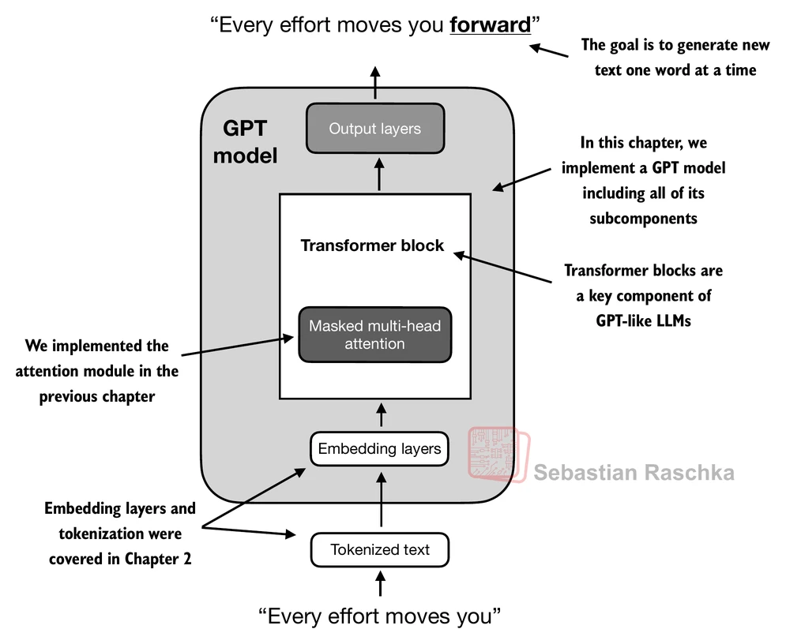
</div>


```python
GPT_CONFIG_124M = {
    "vocab_size": 50257,  # Vocabulary size
    "context_length": 1024,  # Context length
    "emb_dim": 768,  # Embedding dimension
    "n_heads": 12,  # Number of attention heads
    "n_layers": 12,  # Number of layers
    "drop_rate": 0.1,  # Dropout rate
    "qkv_bias": False  # Query-Key-Value bias
}
```

---

使用上述配置，我们将在本节中从实现一个 GPT 占位架构（DummyGPTModel）开始，如图 4.3 所示。这将为我们提供一个全局视角，了解所有部分如何协同工作，以及在后续章节中还需要编写哪些组件来组装完整的 GPT 模型架构。

<div align="center">
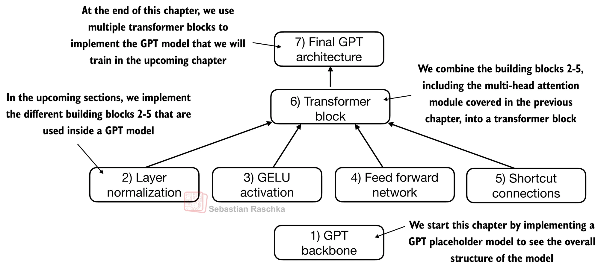
</div>


```python
# A placeholder GPT model architecture class
import torch
import torch.nn as nn


class DummyGPTModel(nn.Module):
    def __init__(self, cfg: dict):
        super().__init__()
        self.tok_emb = nn.Embedding(cfg["vocab_size"], cfg["emb_dim"])
        self.pos_emb = nn.Embedding(cfg["context_length"], cfg["emb_dim"])
        self.drop_emb = nn.Dropout(cfg["drop_rate"])

        self.trf_blocks = nn.Sequential(*[DummyTransformerBlock(cfg) for _ in range(cfg["n_layers"])])
        self.final_norm = DummyLayerNorm(cfg["emb_dim"]) 
        self.out_head = nn.Linear(cfg["emb_dim"], cfg["vocab_size"], bias=False)

    def forward(self, in_idx: torch.Tensor) -> torch.Tensor:
        batch_size, seq_len = in_idx.shape
        tok_embeds = self.tok_emb(in_idx)
        pos_embeds = self.pos_emb(torch.arange(seq_len, device=in_idx.device))

        x = tok_embeds + pos_embeds
        x = self.drop_emb(x)
        x = self.trf_blocks(x)
        x = self.final_norm(x)
        logits = self.out_head(x)
        return logits


class DummyTransformerBlock(nn.Module):
    def __init__(self, cfg: dict):
        super().__init__()
    
    def forward(self, x: torch.Tensor) -> torch.Tensor:
        return x


class DummyLayerNorm(nn.Module):
    def __init__(self, normalized_shape, eps=1e-5): 
        super().__init__()
    
    def forward(self, x: torch.Tensor) -> torch.Tensor:
        return x
```

---

接下来，我们将准备输入数据并初始化一个新的 GPT 模型来演示其用法。基于我们在第 2 章中编写 tokenizer 时所看到的图示，图 4.4 提供了数据如何流入和流出 GPT 模型的高层概览。

<div align="center">
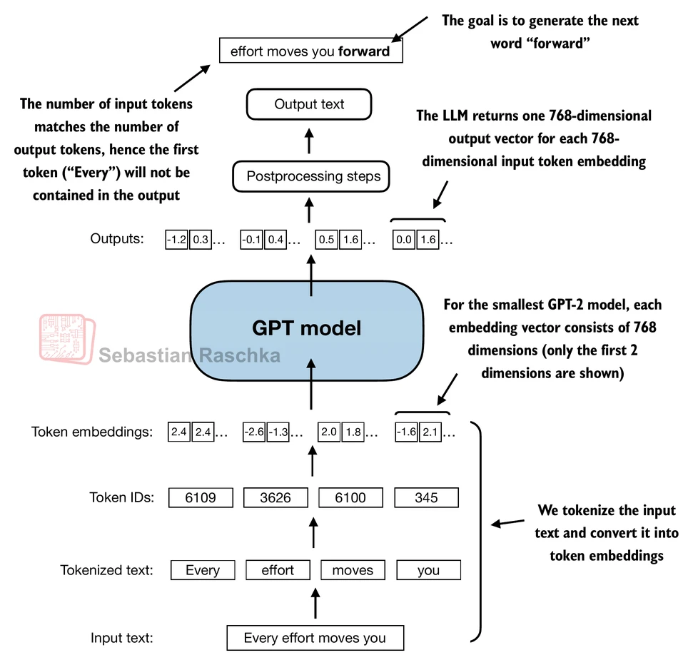
</div>


---

```python
import tiktoken

tokenizer = tiktoken.get_encoding("gpt2")
batch = []
txt1 = "Every effort moves you"
txt2 = "Every day holds a"

batch.append(torch.tensor(tokenizer.encode(txt1)))
batch.append(torch.tensor(tokenizer.encode(txt2)))
batch = torch.stack(batch, dim=0)  # torch.Size([2, 4])

torch.manual_seed(123)
model = DummyGPTModel(GPT_CONFIG_124M)
logits = model(batch)
print("Output shape:", logits.shape)  # torch.Size([2, 4, 50257])
```

输出 tensor 有两行，分别对应两个文本样本。每个文本样本由 4 个 token 组成；每个 token 是一个 50,257 维的向量，与 tokenizer 的词汇表大小一致。

embedding 具有 50,257 个维度，因为其中每个维度对应词汇表中的一个唯一 token。在本章末尾，当我们实现后处理代码时，会将这些 50,257 维的向量转换回 token ID，然后将其解码为单词。


## 4.2 Normalizing activations with layer normalization

训练具有多层的深度神经网络有时可能面临挑战，原因在于 **vanishing gradient**（梯度消失）或 **exploding gradient**（梯度爆炸）等问题。

我们将实现 layer normalization 来提高神经网络训练的稳定性和效率。

layer normalization 背后的核心思想是将神经网络层的 activation（输出）调整为均值为 0、方差为 1（也称为 **unit variance**，单位方差）。

图 4.5 提供了 layer normalization 工作方式的可视化概览。

<div align="center">
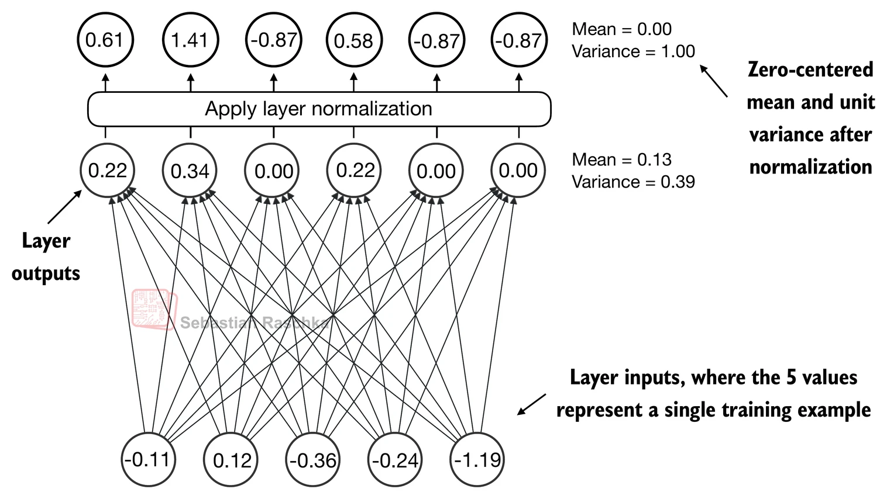
</div>


---

$x$ 是形状为 $(1, d)$ 的向量，$\mu$ 和 $\sigma^2$ 分别是 $x$ 的均值和方差。

1. 计算 $x$ 的均值和方差：
    $$
    \mu = \frac{1}{d} \sum_{i=1}^{d} x_i, \quad
    \sigma^2 = \frac{1}{d} \sum_{i=1}^{d} (x_i - \mu)^2
    $$

2. 使用均值和方差对 $x$ 进行归一化：
    $$
    \hat{x_{i}} = \frac{x_i - \mu}{\sqrt{\sigma^2 + \epsilon}}
    $$

**提示：**

- $x_i$ 是 $x$ 的第 $i$ 个元素；
- $\hat{x_{i}}$ 是归一化后的元素；
- $\epsilon$ 是一个很小的常数，用于避免除以零。

`dim` 参数指定了在 tensor 中沿哪个维度执行统计量计算（此处为均值或方差），如图 4.6 所示。

<div align="center">
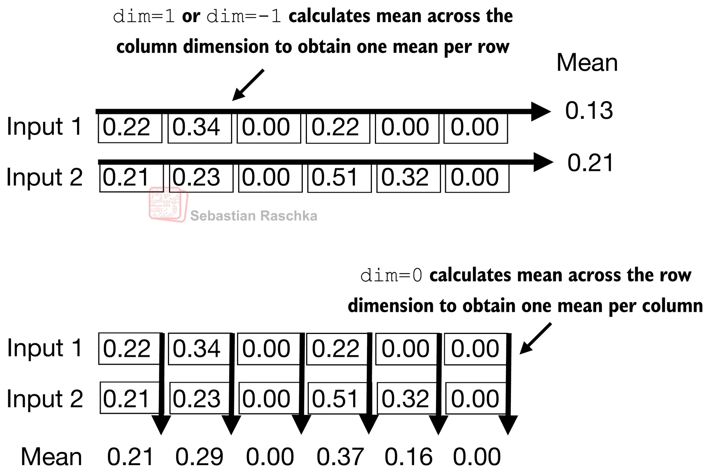
</div>


## 4.3 Implementing a feed forward network with GELU activations

从历史上看，ReLU activation function 因其简单性和在各种神经网络架构中的有效性而被广泛使用。然而，在 LLM 中，除了传统的 ReLU 之外，还采用了其他几种 activation function。两个值得注意的例子是 GELU（Gaussian Error Linear Unit）和 SwiGLU（Swish-Gated Linear Unit）。

GELU 和 SwiGLU 是更复杂且平滑的 activation function，分别采用了 Gaussian 和 sigmoid 门控线性单元。

GELU activation function 可以通过多种方式实现；其精确版本定义为 $\text{GELU}(x)=x⋅\Phi(x)$，其中 $\Phi(x)$ 是标准 Gaussian 分布的累积分布函数。但在实践中，通常使用计算成本更低的近似（原始的 GPT-2 模型也是用这种近似进行训练的）：

$$
\operatorname{GELU}(x) \approx 0.5 \cdot x \cdot\left(1+\tanh \left[\sqrt{(2 / \pi)} \cdot\left(x+0.044715 \cdot x^{3}\right]\right)\right.
$$

```python
import torch.nn as nn


class GELU(nn.Module):
    def __init__(self):
        super().__init__()
    
    def forward(self, x):
        return 0.5 * x * (1 + torch.tanh(torch.sqrt(
            torch.tensor(2.0 / torch.pi)) * (x + 0.044715 * torch.pow(x, 3))))
```

---

使用以下代码绘制 GELU 和 ReLU activation function ，如 图4.8 所示

```python
import matplotlib.pyplot as plt

gelu, relu = GELU(), nn.ReLU()

x = torch.linspace(-5, 5, 100)
y_gelu, y_relu = gelu(x), relu(x)
plt.figure(figsize=(8, 3))
for i, (y, label) in enumerate(zip([y_gelu, y_relu], ["GELU", "ReLU"]), 1):
    plt.subplot(1, 2, i)
    plt.plot(x, y)
    plt.title(f"{label} activation function")
    plt.xlabel("x")
    plt.ylabel(f"{label}(x)")
    plt.grid(True)
plt.tight_layout()
plt.show()
```

从图 4.8 的结果图中可以看到，ReLU 是一个分段线性函数，如果输入为正则直接输出输入值，否则输出零。GELU 是一个平滑的非线性函数，近似于 ReLU，但对负值有非零梯度。

GELU 的平滑性（如图 4.8 所示）可以在训练过程中带来更好的优化特性，因为它允许对模型参数进行更细微的调整。

---

图 4.9 展示了当我们传入一些输入时，embedding 大小在这个小型 feed forward 神经网络内部是如何变化的。

<div align="center">
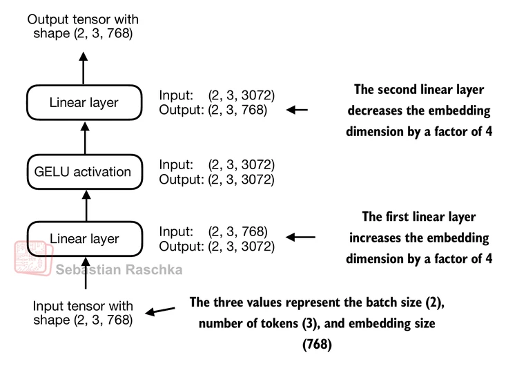
</div>


尽管该模块的输入和输出维度相同，但它在内部通过第一个线性层将 embedding 维度扩展到更高维的空间，如图 4.10 所示。这种扩展之后是一个非线性的 GELU activation，然后通过第二个线性变换收缩回原始维度。这样的设计允许探索更丰富的表示空间。

<div align="center">
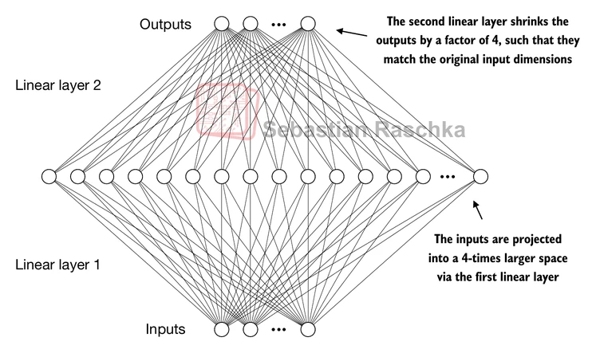
</div>


## 4.4 Adding shortcut connections

shortcut connection 最初是在计算机视觉的深度网络中（具体来说是在 residual network 中）提出的，用于缓解 vanishing gradient 问题。vanishing gradient 问题是指梯度（在训练过程中指导权重更新）在反向传播通过各层时逐渐变小，导致难以有效训练较早的层，如图 4.12 所示。

<div align="center">
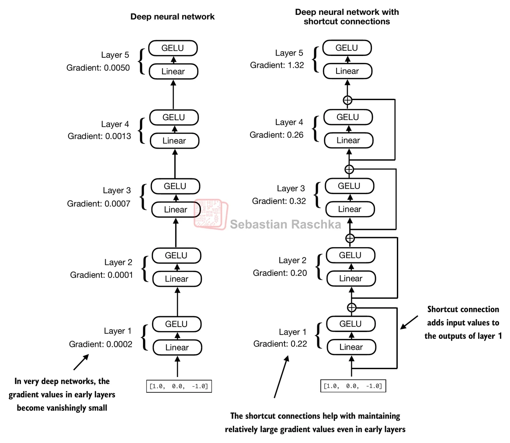
</div>


## 4.5 Connecting attention and linear layers in a transformer block

在本节中，我们将实现 transformer block，它是 GPT 和其他 LLM 架构的基本构建模块。该模块结合了我们之前介绍的几个概念：multi-head attention、layer normalization、dropout、feed forward 层和 GELU activation，如图 4.13 所示。

<div align="center">
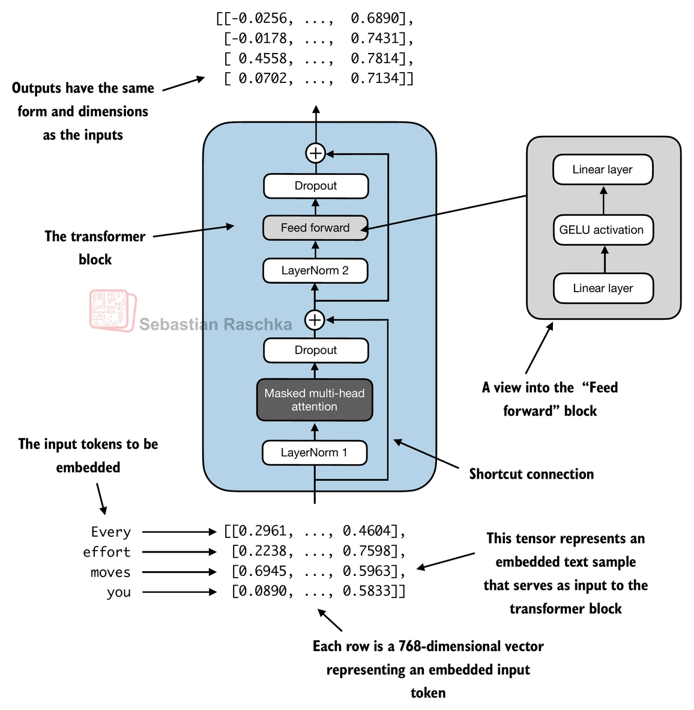
</div>


其核心思想是，multi-head attention block 中的 self-attention 机制识别并分析输入序列中元素之间的关系。而 feed forward 网络则在每个位置上独立地修改数据。这种组合不仅能够更细致地理解和处理输入，还增强了模型处理复杂数据模式的整体能力。


## 4.6 Coding the GPT model

在用代码组装 GPT-2 模型之前，让我们在图 4.15 中查看其整体结构，该图结合了本章到目前为止涵盖的所有概念。

<div align="center">
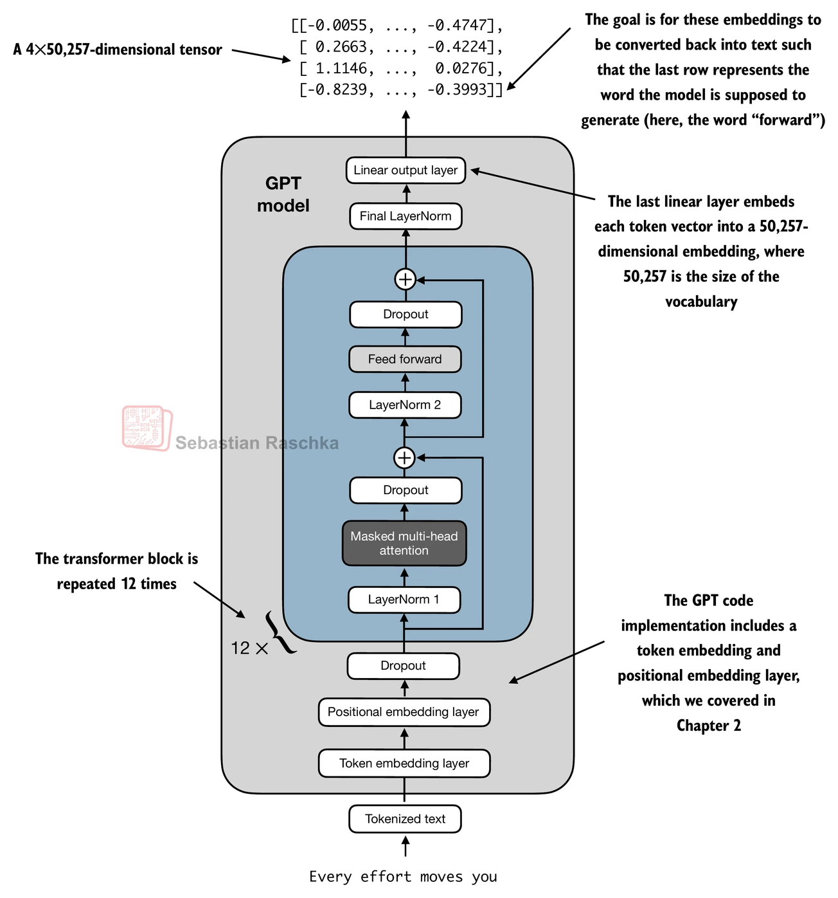
</div>


## 4.7 Generating text

如图 4.16 所示，像 LLM 这样的生成模型是如何逐词（或逐 token）生成文本的。

<div align="center">
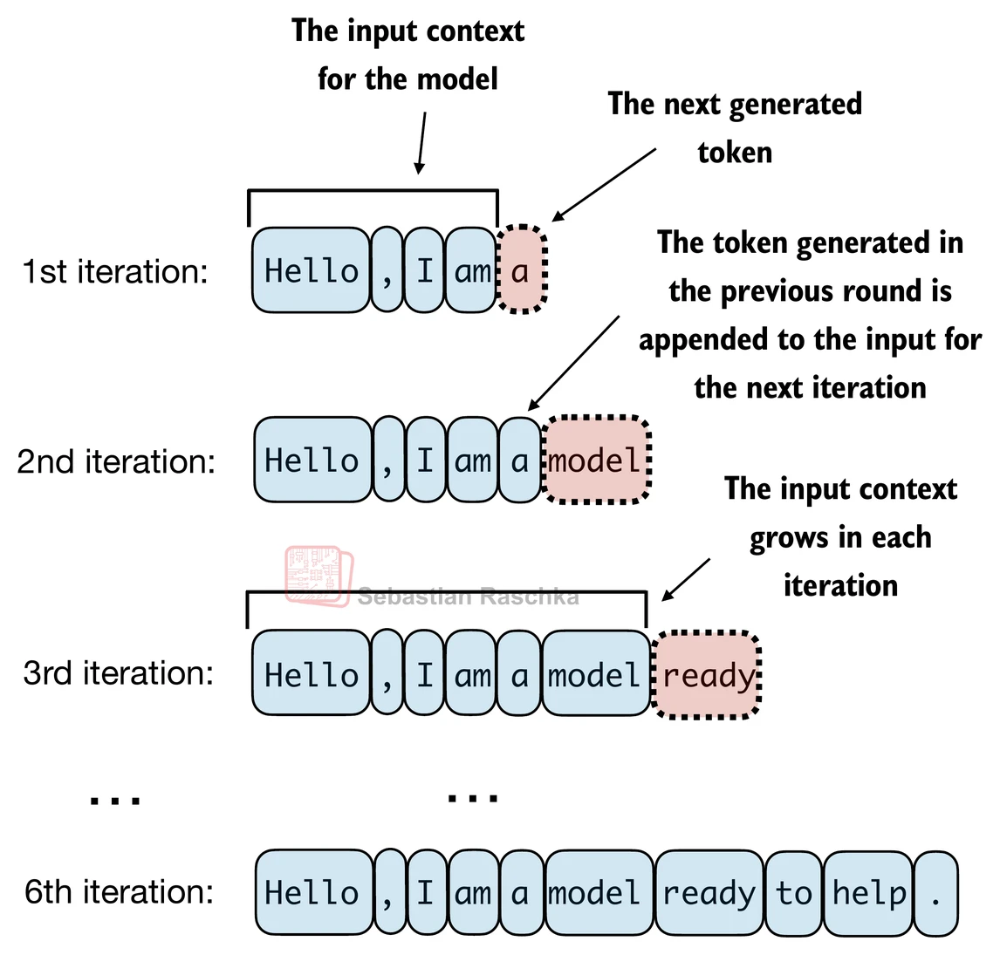
</div>


---

GPT 模型从输出 tensor 到生成文本的过程涉及多个步骤，如图 4.17 所示。这些步骤包括解码输出 tensor、基于概率分布选择 token，以及将这些 token 转换为人类可读的文本。

<div align="center">
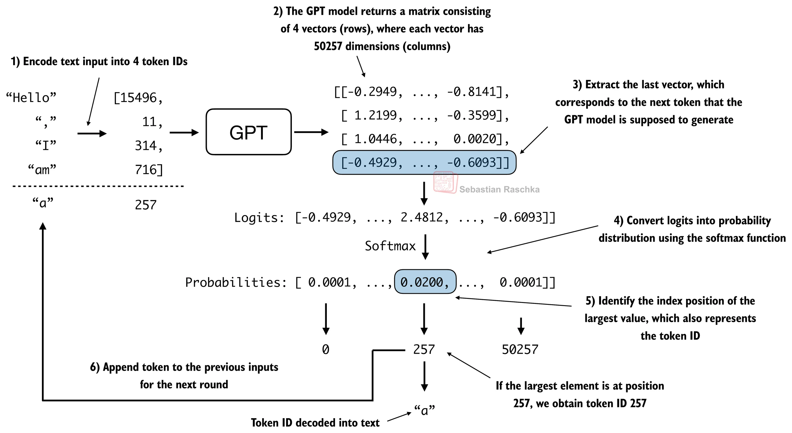
</div>


```python
def generate_text_simple(model: nn.Module, idx: torch.Tensor, 
                         max_new_tokens: int, context_size: int) -> torch.Tensor:
    for _ in range(max_new_tokens):
        idx_cond = idx[:, -context_size:]
        with torch.no_grad():
            logits = model(idx_cond)
        
        logits = logits[:, -1, :]
        probs = torch.softmax(logits, dim=-1)
        idx_next = torch.argmax(probs, dim=-1, keepdim=True)
        idx = torch.cat((idx, idx_next), dim=1)
    return idx
```

---

使用 `generate_text_simple` 函数逐个生成 token ID 并将其追加到上下文中的过程，在图 4.18 中进一步说明。

<div align="center">
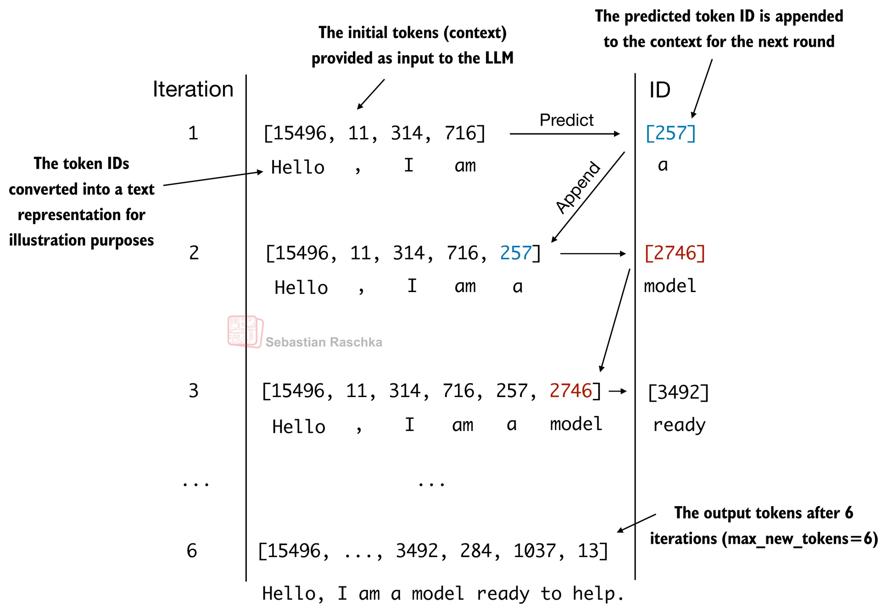
</div>


```python
start_context = "Hello, I am"
encoded = tokenizer.encode(start_context)
encoded_tensor = torch.tensor(encoded).unsqueeze(0)  # add batch dimension (torch.Size([1, 4]))

model.eval()
out = generate_text_simple(
    model=model, idx=encoded_tensor, max_new_tokens=6,
    context_size=GPT_CONFIG_124M["context_length"])
print("Output:", out)  # torch.Size([1, 4 + 6 = 10])

decoded_text = tokenizer.decode(out.squeeze(0).tolist())
print(decoded_text)
```
