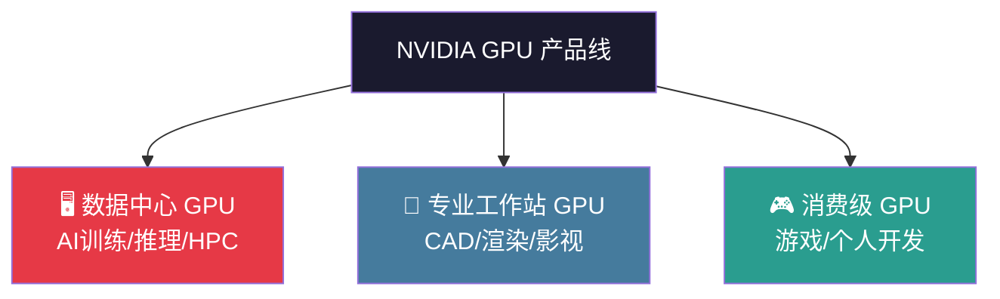
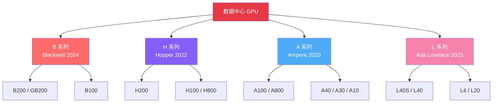
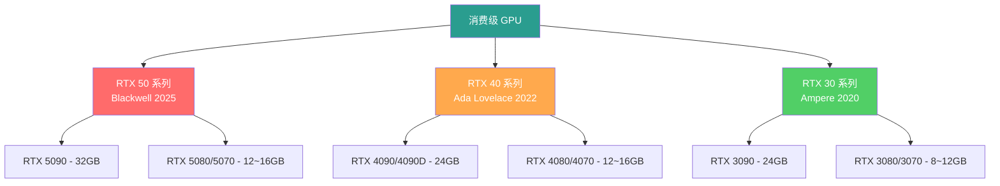
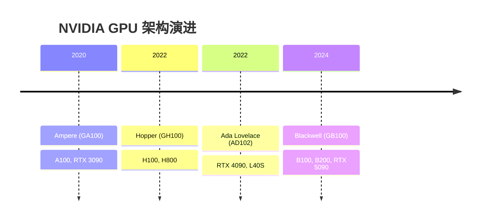
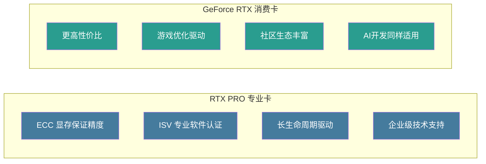
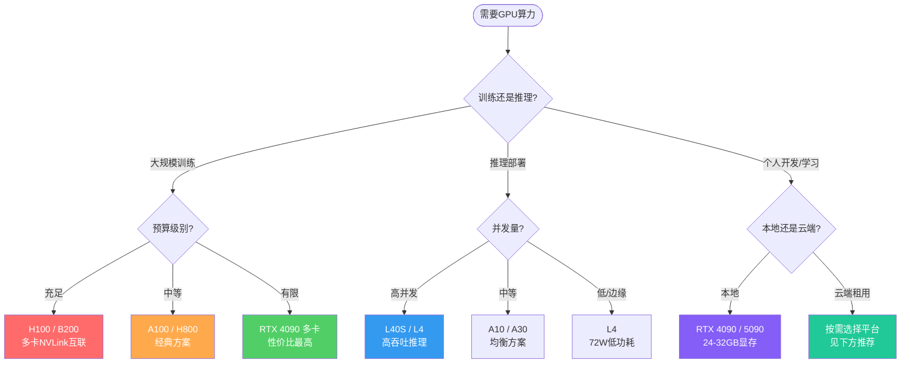
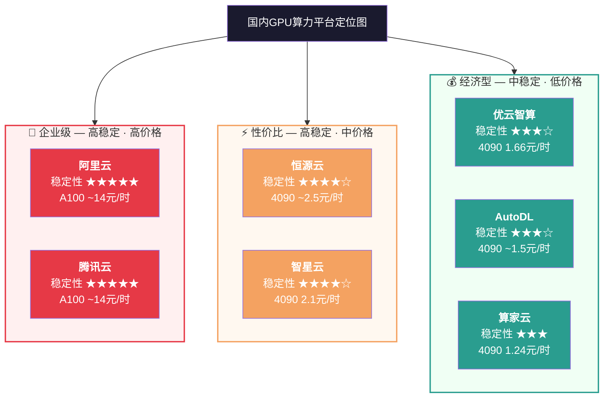
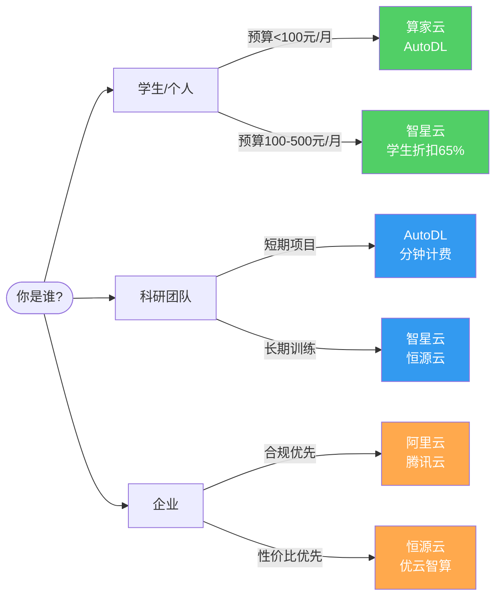
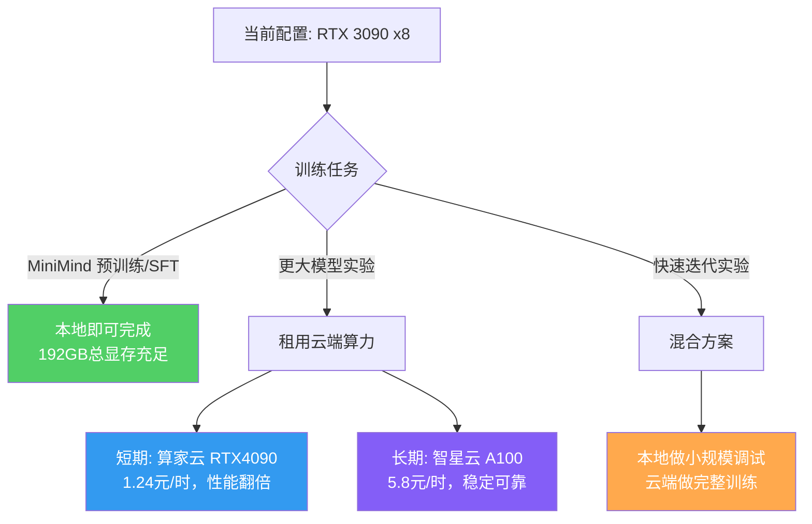

# NVIDIA GPU 分类与国内算力租用指南

## 一、NVIDIA GPU 产品线总览

### 整体架构

### 数据中心 GPU 系列

### 消费级 GPU 系列（GeForce RTX）

---

## 二、架构演进路线

---

## 三、数据中心 GPU 详细参数

### B 系列（Blackwell 架构，2024-2025，最新一代）

| 型号 | 显存 | 带宽 | NVLink | 功耗 | 定位 |
|------|------|------|--------|------|------|
| **GB200** | 2×192GB HBM3e | 8.0 TB/s | 1.8 TB/s | 2700W(模组) | 超级芯片，最强算力 |
| **B200** | 192GB HBM3e | 8.0 TB/s | 1.8 TB/s | 1000W+ | 旗舰训练卡 |
| **B100** | 192GB HBM3e | ~8 TB/s | 1.8 TB/s | 700W | 高端训练/推理 |

### H 系列（Hopper 架构，2022-2023）

| 型号 | 显存 | 带宽 | NVLink | 功耗 | 定位 |
|------|------|------|--------|------|------|
| **H200** | 141GB HBM3e | 4.8 TB/s | 900 GB/s | 700W | H100升级版，大模型训推 |
| **H100 SXM** | 80GB HBM3 | 3.35 TB/s | 900 GB/s | 700W | 主力训练卡 |
| **H100 PCIe** | 80GB HBM3 | 2.0 TB/s | — | 350W | PCIe版本 |
| **H800** | 80GB HBM3 | 3.35 TB/s | 400 GB/s | 700W | 中国特供（NVLink限速） |

### A 系列（Ampere 架构，2020-2021）

| 型号 | 显存 | 带宽 | 功耗 | 定位 |
|------|------|------|------|------|
| **A100 SXM** | 80GB HBM2e | 2.0 TB/s | 400W | 经典训练/推理 |
| **A100 PCIe** | 40/80GB HBM2e | 1.6/2.0 TB/s | 300W | PCIe版本 |
| **A800** | 80GB HBM2e | 2.0 TB/s | 400W | 中国特供版 |
| **A40** | 48GB GDDR6 | 696 GB/s | 300W | 推理+渲染 |
| **A30** | 24GB HBM2e | 933 GB/s | 165W | 中端推理 |
| **A10** | 24GB GDDR6 | 600 GB/s | 150W | 轻量推理 |

### L 系列（Ada Lovelace 架构，2023）

| 型号 | 显存 | 带宽 | 功耗 | 定位 |
|------|------|------|------|------|
| **L40S** | 48GB GDDR6 | 864 GB/s | 350W | AI推理+图形融合 |
| **L40** | 48GB GDDR6 | 864 GB/s | 300W | 图形渲染为主 |
| **L20** | 48GB GDDR6 | 864 GB/s | 350W | 中国特供版 |
| **L4** | 24GB GDDR6 | 300 GB/s | 72W | 边缘/低功耗推理 |

---

## 四、专业工作站 GPU（RTX PRO / 原 Quadro）

### 产品定位

专业工作站 GPU 面向 CAD/CAE、影视特效、科学可视化、数字孪生等专业场景，相比消费级 GPU 具备：

- **ECC 显存**：保证计算精度，避免静默错误
- **ISV 认证**：通过 SolidWorks、Maya、Siemens NX 等专业软件认证
- **更长生命周期**：驱动支持周期长，适合企业批量部署
- **多屏输出**：最多支持 4 路 DisplayPort 2.1 输出

### RTX PRO Blackwell 系列（2025-2026，最新）

| 型号 | 显存 | CUDA核心 | 功耗 | 插槽 | 定位 |
|------|------|---------|------|------|------|
| **RTX PRO 6000** | 96GB GDDR7 (ECC) | — | 600W | 双槽 | 旗舰，大型仿真/AI |
| **RTX PRO 5000** | 48GB GDDR7 (ECC) | 14080 | 300W | 双槽 | 高端，3D渲染/AI推理 |
| **RTX PRO 4500** | 32GB GDDR7 (ECC) | 10496 | 200W | 双槽 | 中高端，工程设计 |
| **RTX PRO 4000** | 24GB GDDR7 (ECC) | — | 140W | 单槽 | 中端，通用专业 |
| **RTX PRO 4000 SFF** | 24GB GDDR7 (ECC) | — | 70W | 小型 | 小型工作站 |
| **RTX PRO 2000** | 16GB GDDR7 (ECC) | — | 70W | 小型 | 入门专业 |

### RTX PRO Ada 系列（2023-2024，上代）

| 型号 | 显存 | 功耗 | 定位 |
|------|------|------|------|
| **RTX 6000 Ada** | 48GB GDDR6 (ECC) | 300W | 旗舰 |
| **RTX 5000 Ada** | 32GB GDDR6 (ECC) | 250W | 高端 |
| **RTX 4000 Ada** | 20GB GDDR6 (ECC) | 130W | 中端 |
| **RTX 2000 Ada** | 16GB GDDR6 (ECC) | 70W | 入门 |

### 与消费级 GPU 对比

> **选型建议**：如果主要做 AI/深度学习开发，消费级 RTX 即可；如果涉及专业 CAD/仿真/影视渲染且需要企业级合规，选 RTX PRO。

---

## 五、消费级 GPU（GeForce RTX）

### RTX 50 系列（Blackwell，2025）

| 型号 | 显存 | 显存带宽 | CUDA核心 | 功耗 | 参考价 |
|------|------|---------|---------|------|--------|
| **RTX 5090** | 32GB GDDR7 | 1792 GB/s | 21760 | 575W | ¥16499 |
| **RTX 5080** | 16GB GDDR7 | 960 GB/s | 10752 | 360W | ¥8299 |
| **RTX 5070 Ti** | 16GB GDDR7 | 896 GB/s | 8960 | 300W | ¥5499 |
| **RTX 5070** | 12GB GDDR7 | 672 GB/s | 6144 | 250W | ¥4299 |

### RTX 40 系列（Ada Lovelace，2022-2023）

| 型号 | 显存 | CUDA核心 | 功耗 | 适用 |
|------|------|---------|------|------|
| **RTX 4090** | 24GB GDDR6X | 16384 | 450W | 当前AI开发主力 |
| **RTX 4090D** | 24GB GDDR6X | 14592 | 425W | 中国特供版 |
| **RTX 4080** | 16GB GDDR6X | 9728 | 320W | 高端 |
| **RTX 4070 Ti** | 12GB GDDR6X | 7680 | 285W | 中高端 |

### RTX 30 系列（Ampere，2020-2021）

| 型号 | 显存 | CUDA核心 | 功耗 | 适用 |
|------|------|---------|------|------|
| **RTX 3090** | 24GB GDDR6X | 10496 | 350W | 上代旗舰 |
| **RTX 3080** | 10/12GB GDDR6X | 8704 | 320W | 上代高端 |
| **RTX 3070** | 8GB GDDR6 | 5888 | 220W | 上代中端 |

---

## 六、GPU 选型决策流程

---

## 七、国内 GPU 算力租用平台推荐（2026）

### 平台对比

> **定位总结**：红色 = 企业首选（贵但稳），橙色 = 性价比之王（稳定+合理价格），绿色 = 入门试用（最便宜）

### 详细价格对比（RTX 4090 为基准）

| 平台 | RTX 4090 时租 | A100 时租 | 计费方式 | 稳定性 | 适合人群 |
|------|-------------|----------|---------|--------|---------|
| **算家云** | 1.24 元/时 | — | 秒级 | ★★★ | 预算极低的个人 |
| **优云智算** | 1.66 元/时 | 6.23元(A800) | 秒级，关机免费 | ★★★☆ | 个人开发者 |
| **AutoDL** | ~1.5-2 元/时 | ~5 元/时 | 分钟级 | ★★★☆ | 学生/短期实验 |
| **智星云** | 2.1 元/时 | 5.8 元/时 | 小时级 | ★★★★☆ | 学生(65%折扣)/科研 |
| **恒源云** | ~2.5 元/时 | ~6 元/时 | 小时级 | ★★★★☆ | 中大规模训练 |
| **阿里云** | — | ~14 元/时 | 按需/包年 | ★★★★★ | 企业级/合规需求 |
| **腾讯云** | — | ~14 元/时 | 按需/包年 | ★★★★★ | 企业级/游戏渲染 |

### 平台选择建议

---

## 八、深度学习场景 GPU 性能对比

| GPU | FP16 算力 (TFLOPS) | 相对性能 |
|-----|-------------------|---------|
| RTX 3090 | 71 | ▓░░░░░░░░░░░░░░░░░░░ |
| RTX 4090 | 165 | ▓▓░░░░░░░░░░░░░░░░░░ |
| A100 | 312 | ▓▓▓▓░░░░░░░░░░░░░░░░ |
| RTX 5090 | 318 | ▓▓▓▓░░░░░░░░░░░░░░░░ |
| H100 | 990 | ▓▓▓▓▓▓▓▓▓░░░░░░░░░░░ |
| H200 | 990 | ▓▓▓▓▓▓▓▓▓░░░░░░░░░░░ |
| B200 | 2250 | ▓▓▓▓▓▓▓▓▓▓▓▓▓▓▓▓▓▓▓▓ |

> 注：以上数据为 FP16 Tensor Core 峰值算力，实际性能因工作负载而异。H200 与 H100 计算核心相同，优势在于显存容量和带宽。

---

## 九、选型口诀

| 口诀 | 含义 |
|------|------|
| **训练看H/B** | 大模型训练选 Hopper/Blackwell |
| **推理选L** | 推理部署选 L 系列（性价比高、低功耗） |
| **稳定用A** | 成熟稳定场景选 Ampere（生态完善） |
| **合规挑800** | 中国合规需求选 800 系列特供版 |
| **专业用PRO** | CAD/仿真/影视选 RTX PRO（ECC+ISV认证） |
| **个人用RTX** | 个人开发/学习选 GeForce RTX |

---

## 十、针对 MiniMind 项目的建议

当前配置：**RTX 3090 × 8**（24GB × 8 = 192GB 总显存）

---

