# Text · Audio · Image 模型数据预处理

> **TL;DR**
> Transformer 之所以能成为"万能架构"，并不是因为它对文本/语音/图像分别做了特殊设计，而是因为这三种模态都被分别以不同方式压成了 **(序列长度, d_model)** 的向量序列。
> 一旦变成向量序列，三者的后续处理几乎一致：`Self-Attention → FFN → ...`。模态的差异主要体现在 **"如何 Tokenize"** 和 **"位置编码怎么打"** 这两步上。

---

## 目录

- [全局视角](#全局视角)
- [Part 1: Text 在 LLM 中的处理](#part-1-text-在-llm-中的处理)
- [Part 2: Audio 在 ASR 中的处理（以 Whisper 为例）](#part-2-audio-在-asr-中的处理以-whisper-为例)
- [Part 3: Image 在视觉模型中的处理（以 ViT 为例）](#part-3-image-在视觉模型中的处理以-vit-为例)
- [Part 4: 三模态核心对比](#part-4-三模态核心对比)
- [Part 5: 多模态融合与扩展](#part-5-多模态融合与扩展)
- [附：三种模态架构对比](#附三种模态架构对比)

---

## 全局视角

> 同一**列** = 处理流水线的同一**阶段**；同一**行** = 同一**模态**从输入到输出的完整路径。
> 三模态的差异主要集中在前 3 列（Tokenize + 嵌入），到了第 4 列 Transformer 内部已经"无差别"。

> 📐 **shape 约定**：每个节点底部的 `shape:` 表示**经过该节点后**的张量形状。
> 示例配置：Whisper-large `d_model=1280`、ViT-Base `d_model=768`、LLaMA 类 `d_model=4096`。

### 阶段 A：模态差异化预处理 — 原始输入 → `(seq_len, d_model)` 向量序列

> 这一段是三模态**差异最大**的部分：不同的 Tokenize 方式 + 不同的嵌入策略，目的都是把异构输入压成同构的向量序列。

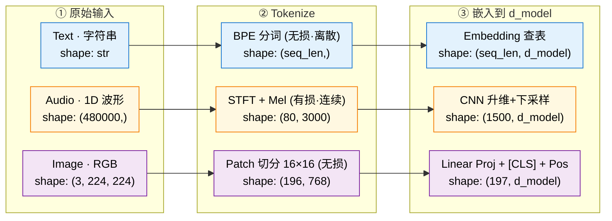

### 阶段 B：统一 Transformer 处理 — 向量序列 → 任务输出

> 一旦变成 `(L, d_model)`，三模态在此**汇合为同一数据结构**，Transformer 内部几乎**无差别**；差异只剩 Attention 类型（Causal vs Full）和输出头的形态。

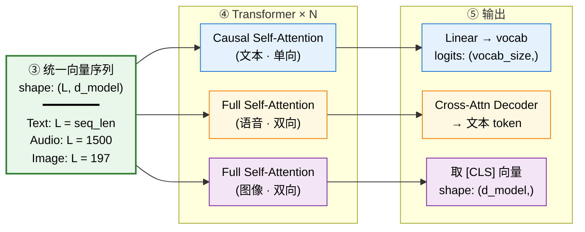

---

## Part 1: Text 在 LLM 中的处理

### 完整流程

Text 在 LLM 中的处理可以划分为 **3 个阶段**：① 输入侧预处理 → ② Transformer 内部上下文化 → ③ 输出侧解码。

#### 阶段 1️⃣：输入侧预处理 — 文本 → 静态向量

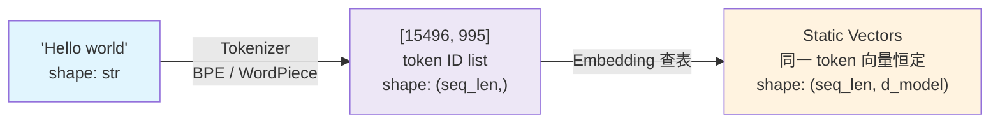

#### 阶段 2️⃣：Transformer 内部 — 静态向量 → 上下文化向量

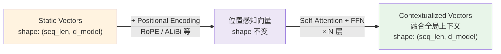

#### 阶段 3️⃣：输出侧 — 上下文化向量 → 下一个 token

> 💡 自回归生成时，**只需用最后一个位置**的向量来预测下一个 token，因此先做一次切片：`hidden[-1]`，将 `(seq_len, d_model)` → `(d_model,)`。
> （训练时则是所有位置并行预测，Linear 直接作用于 `(seq_len, d_model)` → `(seq_len, vocab_size)`。）

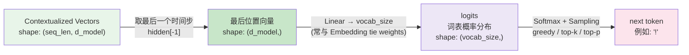

### 逐步详解

#### Step 1: Tokenization — 文本 → Token IDs

```
输入: "Hello world"
        │
        ▼  BPE (Byte Pair Encoding)
输出: [15496, 995]
```

- 将连续字符串切分为**离散符号**（subword）
- 词表大小固定，常见量级：
  - GPT-2: **50,257**
  - LLaMA-2: **32,000**
  - LLaMA-3 / GPT-4o: **~128,000**（更大词表 = 更短序列、更高每 token 信息密度）
- 每个 token 用一个整数 ID 表示

> 💡 **直觉**：BPE 既不是"按字"也不是"按词"，而是按"高频子串"。
> 这样常见词是 1 个 token（`hello` → 1 个），生僻词被拆成多个 token（`anthropomorphism` → 4~5 个）。

#### Step 2: Embedding — Token IDs → Static Vectors

```
[15496, 995]
     │
     ▼  查 Embedding 矩阵 (vocab_size × d_model)
[[0.12, -0.3, ..., 0.5],    ← "Hello" 的向量
 [0.45, 0.8, ..., -0.1]]    ← "world" 的向量
     shape: (2, d_model)
```

- 本质是**查表**操作，无计算（GPU 上是 `gather`）
- 此时向量是**静态**的：同一个 token 无论上下文如何，向量相同
- `"bank"` 在 `"river bank"` 和 `"bank account"` 中向量一样

#### Step 3: Positional Encoding — 注入位置信息

```
embedding + positional_encoding → 带位置的向量
```

- Transformer 本身不感知顺序（并行处理所有 token）
- 必须显式注入位置信息
- 主流方案演进：**Sinusoidal**（原版）→ **Learned**（BERT/GPT-2）→ **RoPE**（LLaMA、Qwen）→ **ALiBi**（MPT）

#### Step 4: Transformer Layers — Static → Contextualized

下图是**一个** Transformer Layer 的内部结构（Pre-Norm 风格，LLaMA / Qwen 等现代 LLM 主流），整个 Block 重复 **× N 层**，输入输出 shape 全程不变：

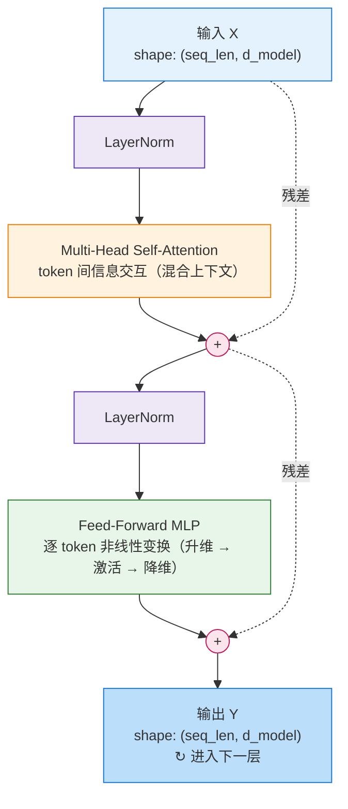

| 子模块 | 作用 | 是否跨 token 交互 |
|--------|------|---------------------|
| **LayerNorm** | 稳定数值，避免训练发散 | ❌ 单 token 内部归一化 |
| **Multi-Head Self-Attention** | 让每个 token "看到" 其他 token，做信息聚合 | ✅ **是 Transformer 的核心** |
| **Feed-Forward (MLP)** | 对每个 token 单独做非线性升维→降维 | ❌ 逐位置独立 |
| **Residual (+)** | 把输入"短路"加到输出上，缓解梯度消失 | — |

- **Self-Attention**：让每个 token 可以"看到"序列中所有其他 token（Decoder 中是单向的"只看左边"）
- 经过 N 层后，向量变为**上下文化**的：同一个 `bank` 在不同语境中得到不同向量
- 这是 LLM "理解语义" 的核心

> ⚠️ **易错点**：`Embedding` 出来的向量 ≠ "词向量"，那是**静态向量**，不带语义；
> 真正的"语义向量"是 Transformer 最后一层的 **Contextualized Vector**。

#### Step 5: Output Projection — 预测下一个 Token

```
Transformer 输出: contextualized vectors, shape (seq_len, d_model)
     │
     ▼  取最后一个时间步  hidden[-1]      ← 自回归生成只关心"下一个 token"，只用最后位置
最后位置向量, shape (d_model,)
     │
     ▼  Linear (d_model → vocab_size)   ← 通常与 Input Embedding 共享权重 (tie weights)
logits, shape (vocab_size,): [0.01, 0.002, ..., 0.95, ...]
     │
     ▼  Softmax → 概率分布 → Sampling (greedy / top-k / top-p / temperature)
next_token = "!"
```

> 💡 **训练 vs 推理**：
> - 推理（生成下一个 token）：只取最后位置 → `(d_model,)` → `(vocab_size,)`
> - 训练（teacher forcing）：所有位置并行预测 → Linear 直接作用于 `(seq_len, d_model)` → `(seq_len, vocab_size)`，与右移一位的 label 计算交叉熵

### 🎯 Text 关键直觉

- 文本天生是**离散**的，所以 Tokenization 是"无损 + 确定性"的
- Embedding 是**查表**，不是计算
- "Token" 是有意义的最小语言单位 → **每个 token 信息密度高**

---

## Part 2: Audio 在 ASR 中的处理（以 Whisper 为例）

### 完整流程

Audio 在 Whisper 中也可以划分为 **3 个阶段**：① 信号处理（波形 → 频谱 → 特征） → ② Encoder 上下文化 → ③ Decoder 解码为文本。

> Whisper-large 的具体配置：`d_model = 1280`，Encoder/Decoder 各 32 层，文本词表 ~51,865。
> 输入永远 padding/截断到 30 秒，所以 Encoder 的序列长度恒为 1500。

#### 阶段 1️⃣：信号处理 — 波形 → 梅尔频谱 → CNN 特征

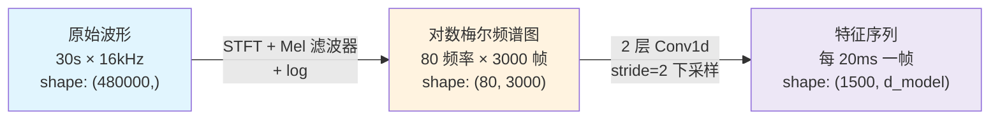

#### 阶段 2️⃣：Transformer Encoder — 上下文化音频特征

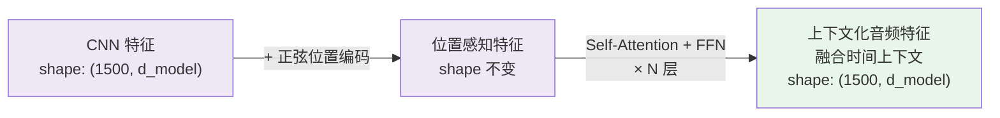

#### 阶段 3️⃣：Decoder — Cross-Attention 生成文本

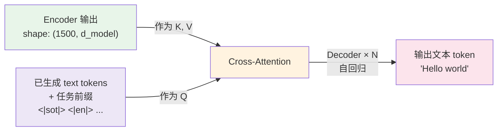

### 逐步详解

#### Step 1: 原始波形 → 梅尔频谱图（类比 Tokenization）


**为什么要转频谱图？**

- 原始波形是一维时间信号，信息**隐含在频率组合中**（人耳感知的是频率而非瞬时振幅）
- STFT 将时域信号转为时频表示：纵轴 = 频率，横轴 = 时间
- Mel 滤波器模拟人耳感知特性：低频分辨率高、高频分辨率低（人对低频更敏感）
- log 压缩动态范围，模拟人耳对音量的对数感知

```
波形:     ～～～～～～～～～～～～～
                    │
                    ▼ STFT + Mel + log
频谱图:   ┌──────────────────┐
          │ ░░▓▓██░░░░░░░░░░ │  ← 高频
          │ ░▓▓██▓▓░░░░░░░░░ │
          │ ▓▓████▓▓░░░░░░░░ │
          │ █████████░░░░░░░ │  ← 低频
          └──────────────────┘
            时间 →
          每一列 = 10ms 内的 80 维频率分布
```

> ⚠️ **与文本的关键区别**：这一步是**有损的**（丢弃了相位信息），不是无损分词。
> 这也是为什么 ASR 不可能 100% 还原说话人声纹细节的根因之一。

#### Step 2: CNN 下采样（类比 Embedding）

```
梅尔频谱图 (80, 3000)
     │
     ▼  Conv1d(80 → d_model, kernel=3, padding=1)    # 通道变换，时间不变
     ▼  GELU
     ▼  Conv1d(d_model → d_model, kernel=3, stride=2) # 时间减半
     │
输出: (1500, d_model)    ← 每 20ms 一个 d_model 维向量
```

- 3000 帧 → 1500 帧（stride=2 下采样，降低后续 Attention 的 O(N²) 计算量）
- 80 维频率特征 → d_model 维隐藏特征
- 类似文本中 Embedding 层的"升维"作用，但用 **CNN 而不是查表**（因为输入已是连续值）

#### Step 3: Transformer Encoder — 上下文化

与文本处理一样，通过多层 Self-Attention 让每个时间帧感知全局上下文。
区别：这里用**正弦位置编码**（固定的，因为时间步是均匀的连续量）。

#### Step 4: Cross-Attention Decoder — 生成文本

Decoder 与纯 LLM Decoder 的关键区别：**Cross-Attention 接收两个来源的输入** —— `Q` 来自 Decoder 自己（已生成的文本），`K/V` 来自 Encoder（音频特征）。

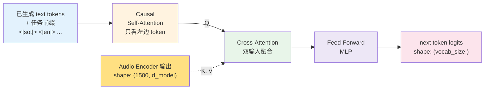

> 上图省略了 Residual / LayerNorm（参考 Part 1 Step 4 的 Pre-Norm 结构），聚焦 Decoder 的核心特点：**`Q` 实线 = 来自 Decoder 自己；`K/V` 虚线 = 来自 Encoder 跨过来**。

| Attention 类型 | Q 来自 | K, V 来自 | 作用 |
|----------------|--------|-----------|------|
| **Causal Self-Attention** | 当前 Decoder 序列 | 当前 Decoder 序列 | 只看已生成的文本，避免"偷看未来" |
| **Cross-Attention** | Decoder | Encoder | **跨模态桥梁**：让文本生成"对齐"音频内容 |
| **Encoder Self-Attention**（Step 3） | Encoder 自己 | Encoder 自己 | 让每个时间帧融合全局音频上下文 |

- Decoder 通过 **Cross-Attention** 机制"看"音频特征
- 自回归地一个个生成文本 token
- Whisper 还用一组**任务前缀 token** 控制行为，比如：
  `<|startoftranscript|> <|en|> <|transcribe|> <|notimestamps|> ...`
  → 同一个模型既能转写、又能翻译、又能识别语种、又能输出时间戳

### 🎯 Audio 关键直觉

- 音频是**连续信号**，不能像文本那样切分，所以"Tokenize" 等价于**信号处理**（STFT + Mel）
- "音频 token" 没有语义，只是一个时间窗的频率分布 → **信息密度低**（大量静音/沉默帧）
- 序列长度 ∝ 时长（Whisper：30 秒 → 1500 frames）

---

## Part 3: Image 在视觉模型中的处理（以 ViT 为例）

### 完整流程

Image 在 ViT 中也可以划分为 **3 个阶段**：① Patch 化（图像 → Patch → Embedding + CLS + Pos） → ② Encoder 上下文化 → ③ 输出（取 CLS → 分类 / 视觉特征）。

> ViT-Base 配置：patch=16, layers=12, d_model=768, heads=12 → 86M 参数。
> ViT-Large：layers=24, d_model=1024, heads=16 → 307M 参数。

#### 阶段 1️⃣：Patch 化 — 图像 → Patch Embeddings + [CLS] + Pos

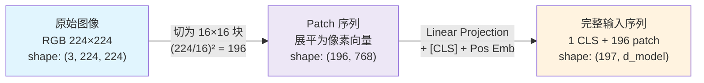

#### 阶段 2️⃣：Transformer Encoder — 上下文化视觉特征

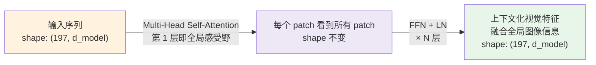

#### 阶段 3️⃣：输出侧 — 取 CLS / 全部 patch 用于下游

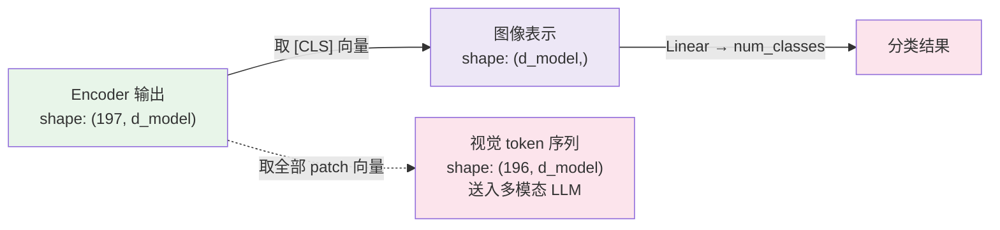

### 逐步详解

#### Step 1: 图像 → Patch 切分（类比 Tokenization）

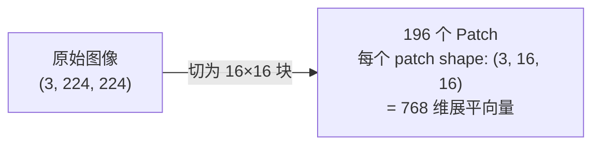

```
原始图像 224 × 224:
┌──┬──┬──┬──┬──┬──┬─ ─ ─┬──┐
│P1│P2│P3│P4│P5│P6│     │P14│  ← 第 1 行: 14 个 patch
├──┼──┼──┼──┼──┼──┼─ ─ ─┼──┤
│  │  │  │  │  │  │     │  │  ← 第 2 行: 14 个 patch
├──┼──┼──┼──┼──┼──┼─ ─ ─┼──┤
│  │  │  │  │  │  │     │  │
│  :  :  :  :  :  :     :  │  ← ... 共 14 行
├──┼──┼──┼──┼──┼──┼─ ─ ─┼──┤
│  │  │  │  │  │  │     │  │  ← 第 14 行
└──┴──┴──┴──┴──┴──┴─ ─ ─┴──┘
        14 × 14 = 196 个 patch
        每个 patch = 16 × 16 × 3 = 768 像素值
```

- 图像没有天然的"词"或"音节"，ViT 的做法是**暴力切块**
- 每个 16×16 的色块就是一个 "visual token"
- 224×224 图像 → (224/16)² = **196 个 patch**
- 高分辨率会快速膨胀：448×448 → 784 patch；1024×1024 → 4096 patch（这是多模态大模型处理高清图的核心瓶颈）

#### Step 2: Patch → Embedding（类比 Embedding 查表）

```
每个 patch (3, 16, 16) → 展平为 768 维向量
     │
     ▼  Linear Projection (768 → d_model)
每个 patch → 一个 d_model 维向量
     │
全部 196 个 patch → shape: (196, d_model)
```

- 与文本不同：不是查表，而是**线性投影**（实现上等价于 `Conv2d(kernel=16, stride=16)`）
- 也可以用 CNN backbone 替代（如 ResNet 提取特征图再展平），称为 Hybrid ViT

#### Step 3: 加入 [CLS] Token + Position Embedding

序列长度变化：`196` → 拼接 [CLS] → `197` →（逐元素加 PosEmb，shape 不变）→ `197`：

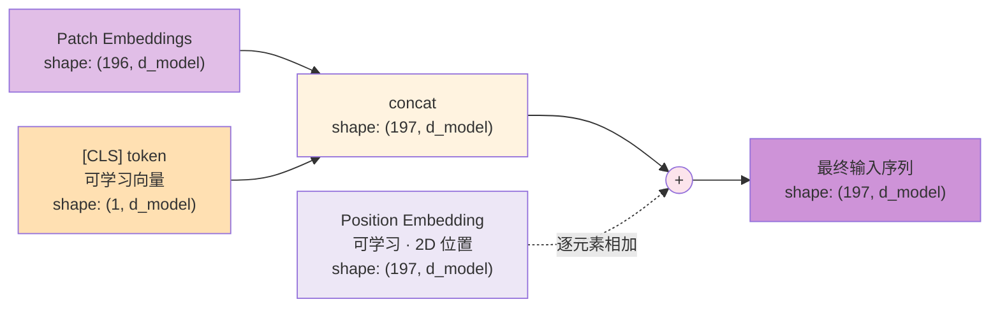

- **[CLS] token**：一个特殊的可学习向量，拼在序列最前面，最终用它代表整张图
- **Position Embedding**：可学习的（不是正弦），让模型知道每个 patch 在图像中的空间位置
- 最终输入：1 (CLS) + 196 (patches) = **197 个向量**

> 📌 **新趋势**：DINOv2 / Vision Transformer with Registers 在 [CLS] 之外再加几个 register token，
> 缓解 ViT 在背景区域出现的"伪影 attention"问题。

#### Step 4: Transformer Encoder — 上下文化

ViT Encoder Layer 的内部结构与 Part 1 Step 4 的 LLM Layer **完全一致**，唯一区别：

> ⚡ **ViT 用的是 Full Self-Attention（双向），LLM 用的是 Causal Self-Attention（只看左边）**。

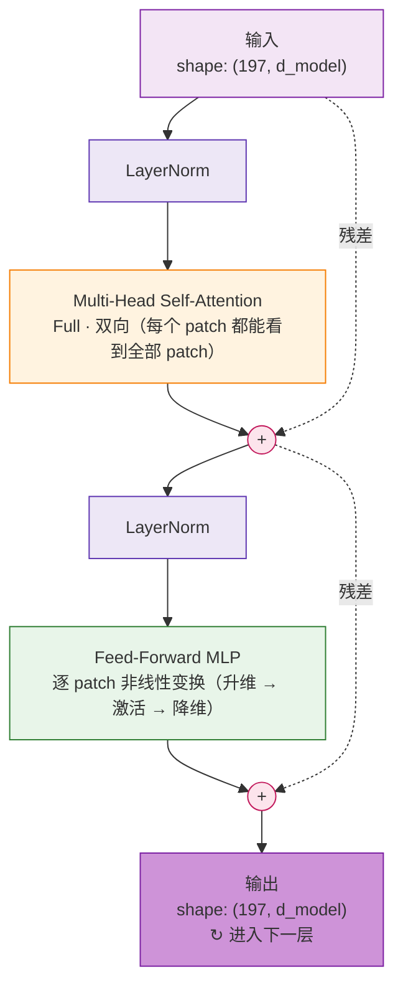

- 与文本 Transformer 完全相同的结构
- 每个 patch 可以 attend 到所有其他 patch → **第 1 层就拥有全局感受野**（CNN 需要堆很多层才能做到）
- 经过 N 层后，每个 patch 向量都融合了全局图像信息

#### Step 5: 输出 — 分类或多模态融合

```
Transformer 输出 (197, d_model)
     │
     ├── 取 [CLS] token 的向量 → 代表整张图 → 接分类头
     │
     └── 取全部 196 个 patch 向量 → 作为视觉 token 送入多模态 LLM
         （如 LLaVA, Qwen-VL, GPT-4V 的做法）
```

### 变体：CNN 路径 vs ViT 路径

同样的输入 `(3, 224, 224)`，**左路 CNN** 靠堆叠卷积让感受野逐步扩大，**右路 ViT** 在第 1 层 Self-Attention 就拿到全局感受野；两路最终都得到一个"图像表示"向量，但维度和语义来源完全不同：

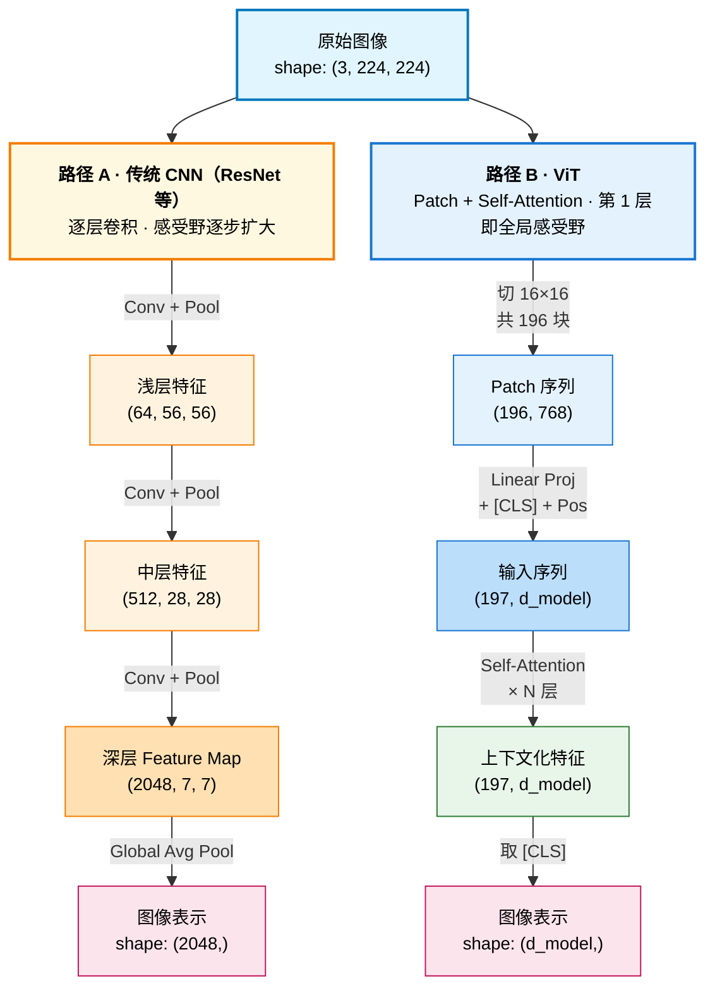


**全面的横向对比**

| 维度 | CNN (ResNet) | ViT |
|------|--------------|-----|
| 特征提取方式 | 逐层卷积，感受野逐渐扩大 | Patch + Self-Attention，一步全局 |
| 中间表示 | 空间张量 (C, H, W) | 序列张量 (seq_len, d_model) |
| 聚合方式 | Global Avg Pool（纯平均） | 取 `[CLS]`（可学习摘要） |
| 归纳偏置 | 强（局部性 + 平移不变性） | 弱（需要大量数据弥补） |
| 数据需求 | 较少即可训练好 | 需要大数据（ImageNet-21k+ 起步） |
| 扩展性 | 较差（深度边际收益递减） | 更好（scale up 效果显著） |
| 主流地位 | 边缘设备 / 小数据场景仍主流 | 大模型 / 多模态默认骨干 |

### 🎯 Image 关键直觉

- 图像没有天然 token，ViT 用"**固定大小空间窗**"暴力切块
- "图像 token" 是连续值，需要用 Linear Projection 投影到 d_model
- 序列长度 ∝ 像素数 → **高分辨率成本极高**（这是为什么有 SwinV2、Mamba-Vision、Token Merging 等方案）

---

## Part 4: 三模态核心对比

### 输入处理对比

三条模态各自的"原始输入 → 离散/连续中间表示 → d_model 向量序列"路径如下：

#### 📝 Text 路径（离散化 → 查表）

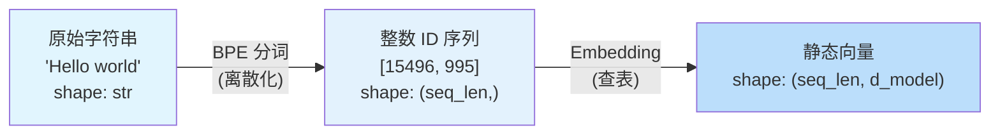

#### 🎵 Audio 路径（信号处理 → CNN 升维）

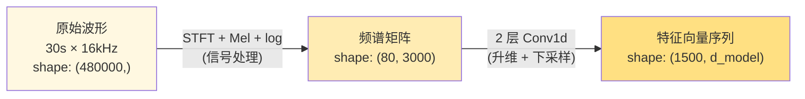

#### 🖼️ Image 路径（Patch 切分 → 线性投影）

```mermaid
%%{init: {'flowchart': {'nodeSpacing': 30, 'rankSpacing': 60}, 'themeVariables': {'fontSize': '15px'}}}%%
flowchart LR
    II["原始图像<br/>RGB 224×224<br/>shape: (3, 224, 224)"] -->|"切 16×16<br/>共 196 块"| IID["Patch 序列<br/>shape: (196, 768)"]
    IID -->|"Linear Projection<br/>+ [CLS] + Pos"| IV["Patch 向量序列<br/>shape: (197, d_model)"]

    style II fill:#f3e5f5
    style IID fill:#e1bee7
    style IV fill:#ce93d8
```

> 💡 **三条路径殊途同归**：起点形态差异巨大（字符串 / 一维波形 / 二维像素），但终点都是 `(seq_len, d_model)` 的**向量序列**，从此就能塞进同一个 Transformer 里处理。

### 关键差异对照表

| 维度 | Text (LLM) | Audio (Whisper) | Image (ViT) |
|------|-------------|-----------------|--------------|
| **原始输入** | 离散符号（有限字符集） | 连续信号（1D 波形） | 连续信号（2D 像素矩阵） |
| **"Tokenization"** | BPE 分词（无损、确定性） | STFT + Mel（有损、近似） | Patch 切分（无损、确定性） |
| **"Token" 本质** | 整数 ID → 查表得向量 | 80 维频率向量（连续） | 768 维像素块（连续） |
| **是否查表** | ✅ Embedding 查表 | ❌ CNN 投影 | ❌ Linear 投影 |
| **序列长度** | 与文本长度成正比 | 与时长成正比（~50 帧/秒） | 与分辨率²成正比 |
| **典型序列长度** | 几百 ~ 数百万 | 30s → 1500 | 224² → 196；1024² → 4096 |
| **信息密度** | 高（每 token 有语义） | 低（大量静音帧） | 中（局部冗余但无"静音"） |
| **位置编码** | RoPE / ALiBi（1D） | 正弦编码（1D，固定） | 可学习编码（2D 空间） |
| **特殊 Token** | `[BOS] [EOS] [PAD]` | `<\|sot\|> <\|en\|> <\|transcribe\|>` | `[CLS]` (+ register) |
| **核心架构** | Decoder-only | Encoder-Decoder | Encoder-only |
| **典型代表** | GPT-4, LLaMA-3, Qwen | Whisper, Conformer | ViT, DINOv2, SAM |
| **典型任务** | 文本生成 | 语音 → 文本 | 分类 / 检测 / 多模态 |

### "Tokenization" 直觉对比

```
Text:    "Hello world"  →  [Hello] [world]     →  2 个离散 token
                            ▲ 按语言学规则切分

Audio:   ～～～波形～～～  →  [帧1][帧2]...[帧3000] →  3000 个连续"帧 token"
                            ▲ 按固定时间窗切分 (每 10ms)

Image:   ┌────────┐       [P1][P2]...[P196]     →  196 个连续"块 token"
         │ 🖼️图片 │  →    ▲ 按固定空间窗切分 (每 16×16)
         └────────┘
```

### 本质共性

三种模态最终都归结为同一个范式：

```
原始输入 → 某种方式转为向量序列 → Transformer 处理 → 输出
```

- **Text**：Tokenizer + Embedding 查表 → 向量序列
- **Audio**：STFT + Mel + CNN → 向量序列
- **Image**：Patch 切分 + Linear Projection → 向量序列
- 一旦变成向量序列，后续 Transformer 处理逻辑**几乎一致**

这正是 Transformer 成为"万能架构"的原因 —— 它不关心输入是什么模态，只要你能把它变成一个向量序列。

---

## Part 5: 多模态融合与扩展

### 5.1 拼接式多模态（GPT-4o / LLaVA / Qwen-VL）

各模态各自做"Tokenization"得到向量序列后**拼接**送入统一 Transformer：

```mermaid
%%{init: {'flowchart': {'nodeSpacing': 30, 'rankSpacing': 35}, 'themeVariables': {'fontSize': '14px'}}}%%
flowchart TD
    T1["Text · 字符串"]:::textN
    T2["BPE → Embedding<br/>shape: (L_text, d_model)"]:::textN

    A1["Audio · 波形"]:::audioN
    A2["Mel + Audio Encoder<br/>shape: (L_audio, d_audio)"]:::audioN
    AP["Projector / MLP<br/>shape: (L_audio, d_model)"]:::audioN

    I1["Image · 像素"]:::imageN
    I2["Patch + Vision Encoder<br/>shape: (L_image, d_vision)"]:::imageN
    IP["Projector / MLP<br/>shape: (L_image, d_model)"]:::imageN

    MERGE["拼接为统一序列<br/>[ text ; audio ; image ]<br/>shape: (L_total, d_model)"]:::hubN
    LLM["统一 LLM Backbone<br/>Causal Self-Attention × N"]:::llmN
    OUT["多模态输出<br/>(文本 / 工具调用 / 函数参数 …)"]:::outN

    T1 --> T2 --> MERGE
    A1 --> A2 --> AP --> MERGE
    I1 --> I2 --> IP --> MERGE
    MERGE --> LLM --> OUT

    classDef textN fill:#e3f2fd,stroke:#1976d2,color:#000
    classDef audioN fill:#fff8e1,stroke:#f57c00,color:#000
    classDef imageN fill:#f3e5f5,stroke:#7b1fa2,color:#000
    classDef hubN fill:#e8f5e9,stroke:#2e7d32,stroke-width:2px,color:#000
    classDef llmN fill:#fce4ec,stroke:#c2185b,stroke-width:2px,color:#000
    classDef outN fill:#ede7f6,stroke:#5e35b1,color:#000
```

> 📐 **关键点**：Text 不需要 Projector（BPE Embedding 本来就在 LLM 的 `d_model` 维度上）；Audio / Image 各自有自己的 `d_audio / d_vision`，必须经 **Projector** 投影到 `d_model` 才能与 Text token 拼到同一序列。
> 拼接后 `L_total = L_text + L_audio + L_image`，LLM Backbone 完全无感地用 Causal Self-Attention 一起处理这条"混合长序列"。

- 关键组件：**Projector**（通常是 2 层 MLP 或 Q-Former），把视觉/音频 encoder 输出的维度**对齐**到 LLM 的 d_model
- 训练范式：先冻结 LLM 训 Projector，再 LoRA 微调 LLM

### 5.2 对比学习对齐（CLIP / ImageBind）

不在序列层面拼接，而是把不同模态各自编码到**同一个语义空间**，用对比损失拉齐：

```
图像 → ViT Encoder ─┐
                    ├─→ 在共享空间做对比学习 (InfoNCE)
文本 → Text Encoder ┘    匹配的 (image, text) 拉近，不匹配的推远
```

- 最终：相同语义的图像和文本在向量空间中靠近
- 应用：**零样本分类**、**图文检索**、**Stable Diffusion 的文本编码器**
- ImageBind 把这个思想扩展到 6 种模态（图像、文本、音频、深度、热成像、IMU）共享空间

### 5.3 视频与 3D 模态

视频/3D 本质是"图像 + 时间"或"图像 + 空间"的扩展：

| 模态 | "Token" 怎么切 | 代表模型 |
|------|----------------|----------|
| 视频 | tubelet（时空小立方块），如 `2×16×16` | VideoMAE, ViViT, V-JEPA |
| 点云 | Point Patch / Voxel | Point Transformer, PointMAE |
| 3D 网格 | Mesh Patch | MeshGPT |

→ 可以看到，"**怎么把信号切成固定大小的块**"始终是设计新模态 Transformer 的第一个问题。

---

## 附：三种模态架构对比

三种代表模型用了 Transformer 的 3 种典型组合方式：**Decoder-Only / Encoder-Decoder / Encoder-Only**。

#### 📝 GPT 类 LLM — Decoder-Only

> **特点**：单向因果注意力，自回归生成；输入 = 输出 = 文本。

```mermaid
%%{init: {'flowchart': {'nodeSpacing': 30, 'rankSpacing': 60}, 'themeVariables': {'fontSize': '15px'}}}%%
flowchart LR
    TI2["Token IDs<br/>shape: (seq_len,)"] -->|"Embedding<br/>查表"| EMB["静态向量<br/>shape: (seq_len, d_model)"]
    EMB -->|"Transformer Decoder × N<br/>Causal Self-Attention"| CTX["上下文化向量<br/>shape: (seq_len, d_model)"]
    CTX -->|"Linear → vocab + Softmax"| OUT2["Next Token"]

    style TI2 fill:#e1f5fe
    style EMB fill:#e3f2fd
    style CTX fill:#bbdefb
    style OUT2 fill:#fce4ec
```

#### 🎵 Whisper — Encoder-Decoder

> **特点**：Encoder 处理音频、Decoder 通过 Cross-Attention 看 Encoder 输出生成文本。

```mermaid
%%{init: {'flowchart': {'nodeSpacing': 30, 'rankSpacing': 55}, 'themeVariables': {'fontSize': '15px'}}}%%
flowchart LR
    MEL["Mel 频谱图<br/>shape: (80, 3000)"] -->|"CNN × 2"| ENC2["Transformer Encoder × N<br/>Full Self-Attention<br/>shape: (1500, d_model)"]
    ENC2 -.->|"K, V<br/>Cross-Attention"| DEC["Transformer Decoder × N"]
    PREV["Previous Tokens<br/>+ 任务前缀"] -->|"Q"| DEC
    DEC --> OUT3["Next Token"]

    style MEL fill:#fff8e1
    style ENC2 fill:#ffe082
    style PREV fill:#ede7f6
    style DEC fill:#fff3e0
    style OUT3 fill:#fce4ec
```

#### 🖼️ ViT — Encoder-Only

> **特点**：只用 Encoder，输出 `[CLS]` 向量作为整图表示，下接分类头或多模态融合。

```mermaid
%%{init: {'flowchart': {'nodeSpacing': 30, 'rankSpacing': 60}, 'themeVariables': {'fontSize': '15px'}}}%%
flowchart LR
    PAT["Image Patches<br/>shape: (196, 768)"] -->|"Linear Projection<br/>+ [CLS] + Pos"| INP["输入序列<br/>shape: (197, d_model)"]
    INP -->|"Transformer Encoder × N<br/>Full Self-Attention"| ENC3["上下文化特征<br/>shape: (197, d_model)"]
    ENC3 -->|"取 [CLS]"| CLS3["分类头 / 视觉特征<br/>shape: (d_model,)"]

    style PAT fill:#f3e5f5
    style INP fill:#e1bee7
    style ENC3 fill:#ce93d8
    style CLS3 fill:#fce4ec
```

#### 三种架构横向对比

| 维度 | Decoder-Only (GPT) | Encoder-Decoder (Whisper) | Encoder-Only (ViT) |
|------|---------------------|----------------------------|---------------------|
| **注意力方向** | Causal（只看左边） | Encoder=Full，Decoder=Causal+Cross | Full（双向） |
| **输入源** | 1 个（文本） | 2 个（音频 + 已生成文本） | 1 个（图像） |
| **输出方式** | 自回归生成 | 自回归生成 | 一次性输出向量 |
| **典型任务** | 续写 / 对话 / 推理 | 翻译 / 转写 / Seq2Seq | 分类 / 表征 / 多模态骨干 |
| **代表模型** | GPT-4, LLaMA, Qwen | Whisper, T5, BART | ViT, DINOv2, BERT |

### 一句话总结

> **模态的边界在输入端，到了 Transformer 内部已经是无差别的向量序列。**
> 学新模态，本质就是学"它该如何被 Tokenize"。

---

## 延伸阅读

- 📄 [Attention Is All You Need (2017)](https://arxiv.org/abs/1706.03762) — Transformer 原始论文
- 📄 [An Image is Worth 16x16 Words (ViT, 2020)](https://arxiv.org/abs/2010.11929)
- 📄 [Robust Speech Recognition via Large-Scale Weak Supervision (Whisper, 2022)](https://arxiv.org/abs/2212.04356)
- 📄 [Learning Transferable Visual Models From Natural Language Supervision (CLIP, 2021)](https://arxiv.org/abs/2103.00020)
- 📄 [Visual Instruction Tuning (LLaVA, 2023)](https://arxiv.org/abs/2304.08485)
- 🌐 [The Illustrated Transformer — Jay Alammar](https://jalammar.github.io/illustrated-transformer/)
