# 三(AI编译原理)-1.传统编译器


# 1. 编译器基础概念

## 编译器与解释器

**编译器（Compiler）**和**解释器（Interpreter）**是两种不同的工具，都可以将编程语言和脚本语言转换为机器语言。二者最大的区别在于：**解释器在程序运行时将代码转换成机器码，编译器在程序运行之前将代码转换成机器码**。


### 编译器 Compiler

编译器可以将整个程序转换为目标代码(object code)，这些目标代码通常存储在文件中。目标代码也被称为二进制代码，在进行链接后可以被机器直接执行。典型的编译型程序语言有 C 和 C++。

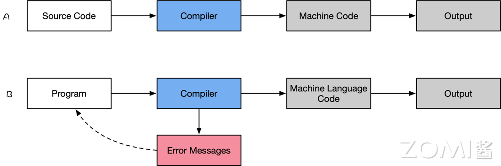


### 解释器 Interpreter

解释器能够直接执行程序或脚本语言中编写的指令，而不需要预先将这些程序或脚本语言转换成目标代码或者机器码。典型的解释型语言有 Python、PHP 和 Matlab。

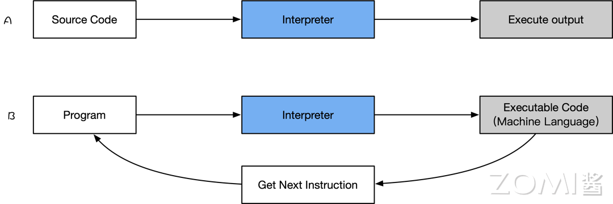


## JIT 和 AOT 编译方式

目前，程序主要有两种运行方式：**静态编译**和**动态解释**。

- **静态编译**的代码程序在执行前全部被翻译为机器码，通常将这种类型称为 AOT（Ahead of time），即“提前编译”；
- **动态解释**的程序则是对代码程序边翻译边运行，通常将这种类型称为 JIT（Just in time），即“即时编译”。

通常区分是否为 AOT 的标准就是看**代码在执行之前是否需要编译**，只要需要编译，无论其编译产物是字节码还是机器码，都属于 AOT 的方式。


### 优缺点对比

在 JIT 中其优点为：

- 可以根据当前硬件情况实时编译生成最优机器指令
- 可以根据当前程序的运行情况生成最优的机器指令序列
- 当程序需要支持动态链接时，只能使用 JIT 的编译方式
- 可以根据进程中内存的实际情况调整代码，使内存能够更充分的利用

JIT 缺点也非常明显：

1. 编译需要占用运行时 Runtime 的资源，会导致进程执行时候卡顿
2. 编译占用运行时间，对某些代码编译优化不能完全支持，需在流畅和时间权衡
3. 在编译准备和识别频繁使用的方法需要占用时间，初始编译不能达到最高性能


AOT 的优点所在：

1. 在程序运行前编译，可以避免在运行时的编译性能消耗和内存消耗
2. 可以在程序运行初期就达到最高性能
3. 可以显著的加快程序的执行效率

AOT 也会带来一些问题：

1. 在程序运行前编译会使程序安装的时间增加
2. 将提前编译的内容保存起来，会占用更多的内存
3. 牺牲高级语言的一致性问题


### 在 AI 框架中区别

目前主流的 AI 框架，都会带有前端的表达层，再加上 AI 编译器对硬件使能，因此 AI 框架跟 AI 编译器之间关系非常紧密，部分如 MindSpore、TensorFlow 等 AI 框架中默认包含了自己的 AI 编译器。目前 PyTorch2.X 版本升级后，也默认自带 Inductor 功能特性，可以对接多个不同的 AI 编译器。

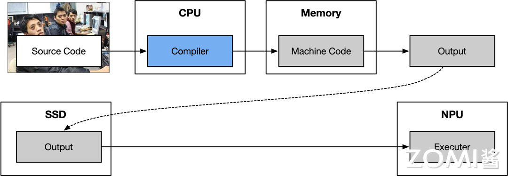


PyTorch 框架中的 JIT 特性，可以将 Python 代码实时编译成本地机器代码，实现对神经网络模型的优化和加速。

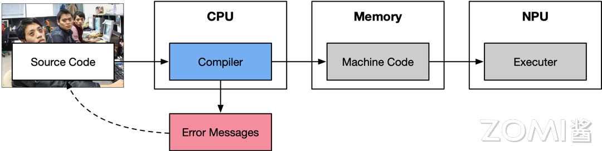


## Pass 和中间表示 IR

### Pass 定义和原理

**Pass 主要是对源程序语言的一次完整扫描或处理**。在编译器中，Pass 指所采用的一种结构化技术，用于完成编译对象（IR）的分析、优化或转换等功能。

如图所示，现代编译器中，一般会采用分层、分段的结构模式，不管是在中间层还是后端，都存在若干条优化的 Pipeline，而这些 Pipeline，则是由一个个 Pass 组成的，对于这些 Pass 的管理，则是由 PassManager 完成的。

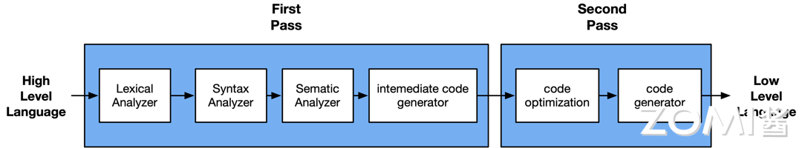

在编译器 LLVM 中提供的 Pass 分为三类：Analysis pass、Transform pass 和 Utility pass。


### IR 中间表示

IR（Intermediate Representation）中间表示，是编译器中很重要的一种数据结构。编译器在完成前端工作以后，首先生成其自定义的 IR，并在此基础上执行各种优化算法，最后再生成目标代码。

如图所示，在编译原理中，通常**将编译器分为前端和后端**。其中，**前端**会对所输入的程序进行**词法分析、语法分析、语义分析**，然后生成**中间表达形式 IR**。**后端**会对 IR 进行优化，然后**生成目标代码**。

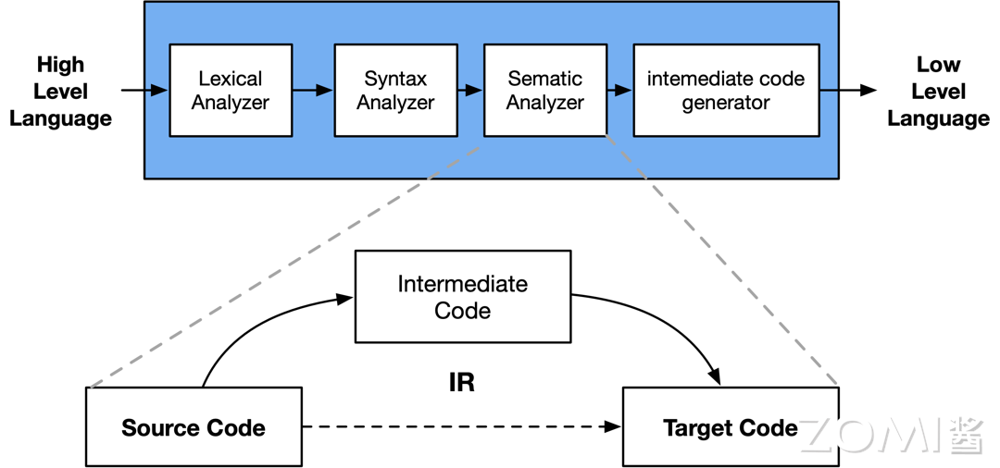


**编译器的前端，优化器，后端**之间，唯一交换的数据结构类型就是 IR，通过 IR 来实现不同模块的解耦。


如在 LLVM 编译器里，会根据抽象层次从高到低，采用了前后端分离的三段结构，这样在为编译器添加新的语言支持或者新的目标平台支持的时候，就十分方便，大大减小了工程开销。而 LLVM IR 在这种前后端分离的三段结构之中，主要分开了三层 IR，IR 在整个编译器中则起着重要的承上启下作用。从便于开发者编写程序代码的理解到便于硬件机器的理解。


# 2. 开源编译器的发展

编译技术是计算机科学皇冠上的一颗明珠，作为基础软件中的核心技术，程序员的终极追求是能够掌握编译器相关的技术。

简单的说，编译器其实只是一段程序，它用来将编程语言 A 翻译成另外-种编程语言 B，上面将源代码翻译为目标代码的过程是叫作编译（compile）。完整的编译过程通常包含词法分析、语法分析、语义分析、中间代码生成、优化、目标代码生成等步骤。


## 基础介绍

### 什么是编译器

编译器可以将整个程序转换为目标代码（object code），这些目标代码通常存储在文件中。目标代码也被称为二进制代码，在进行链接后可以被机器直接执行。

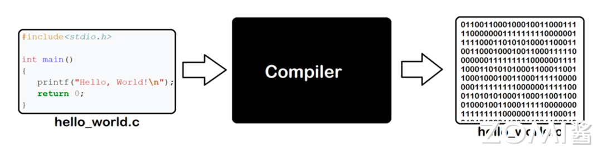

**编译器能够识别高级语言程序代码中的词汇、句子以及各种特定的格式和数据结构，并将其转换成机器能够识别的二进制码，这个过程称为编译（Compile）**。


在 C 语言的编译器有很多种，不同的平台下有不同的编译器，例如：

- Windows：常用的是微软编译器（cl.exe），被集成在 Visual Studio 或 Visual C++ 中，一般不单独使用；
- Linux：常用 GUN 组织开发的 GCC，很多 Linux 发行版都自带 GCC；
- Mac：常用的是 LLVM/Clang，被集成在 Xcode 中


### 基本构成

目前主流如 LLVM 和 GCC 等经典的开源编译器，通常分为三个部分，前端(Frontend)，优化器(Optimizer)和后端(Backend)。

1. **Frontend**：主要负责词法和语法分析，将源代码转化为抽象语法树，即将程序划分为基本的组成部分，检查代码的语法、语义和语法，然后生成中间代码
2. **Optimizer**：优化器则是在前端的基础上，对得到的中间代码进行优化（如去掉冗余代码、子表达式消除等工作），使代码更加高效
3. **Backend**：后端则是将已经优化的中间代码，针对具体的硬件生成目标代码，转换成为包括代码优化器和代码生成器

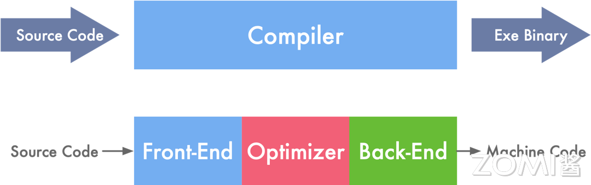


## 编译体系

### 基础设施

新兴编程语言的快速发展少不了基础设施的逐步完善。如 LLVM (Low Level Virtual Machine) 的出现，可以让任意编程语言前端编译到一个 LLVM 的中间表示（IR），再由 LLVM 中的后端编译至具体硬件平台，并且可以分不同阶段实现优化。

LLVM 极大地简化了编程语言编译器的开发过程，不同语言只需要实现语言到 LLVM IR 的前端编译程序，再调用 LLVM 后端编译器，就可以得到编译至任意平台的能力，而无需为不同的平台实现不同的编译器。

LLVM 和 GCC 如今已不再是某个具体的编译工具，而已然成为了一套**编译基础设施**。LLVM 和 GCC 不仅提供了一系列编译器，也主要提供了一些 C/C++ 语言相关配套工具


### 虚拟机与优化

一些高级编程语言（如 Java、Python、JavaScript）的运行，依赖于运行时（Runtime），并常常带有虚拟机（VM）和解释器。

这些语言有的作为脚本语言不需要编译，或者是可编译为跨平台的字节码。语言性能通常较静态且直接编译为机器码的语言低许多，原因也是很明显的，因为其需要在运行时先解释代码再执行。不过如今也有许多技术手段能够提升这些语言的性能。


### 集成环境

实际开发中，除了编译器是必须的工具，往往还需要很多其他辅助软件，例如：

- **编辑器**
- **代码提示器**
- **调试器**
- **管理工具**
- **开发的界面**

这些工具通常被打包在一起，统一发布和安装，统称为**集成开发环境（IDE，Integrated Development Environment）**。


## 传统编译器之争

GCC、LLVM 和 Clang 都是常见的编译器，用于将高级语言代码转换为机器语言代码。


### GCC

GCC（GNU Compiler Collection，GNU 编译器套装），是一套由 GNU 开发的编程语言编译器。


### Clang

Clang 是一个 C、 C++、 Objective-C 和 Objective-C++ 编程语言的编译器前端。它采用了底层虚拟机（LLVM）作为其后端。


### LLVM

LLVM (Low Level Virtual Machine，底层虚拟机) 提供了与编译器相关的支持，能够进行程序语言的编译期优化、链接优化、在线编译优化、代码生成。简而言之，可以作为多种编译器的后台来使用。

LLVM 作为一个编译器的基础建设，它是为了任意一种编程语言写成的程序，利用虚拟技术，创造出编译时期，链结时期，运行时期以及“闲置时期”的优化。


### 差异对比

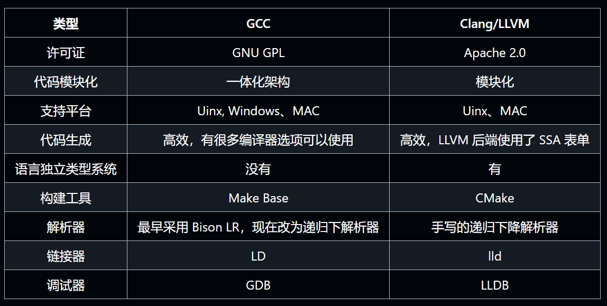


# 3. GCC编译过程和原理

最初，GCC 仅是一个用于编译 C 语言的编译器，但很快扩展以支持其他编程语言，其设计强调可移植性和模块化，使其能够适应多种硬件和操作系统环境。

作为一个模块化设计的软件，GCC 提供了丰富的功能和灵活性，既能在本地平台上进行编译，也支持跨平台的交叉编译。

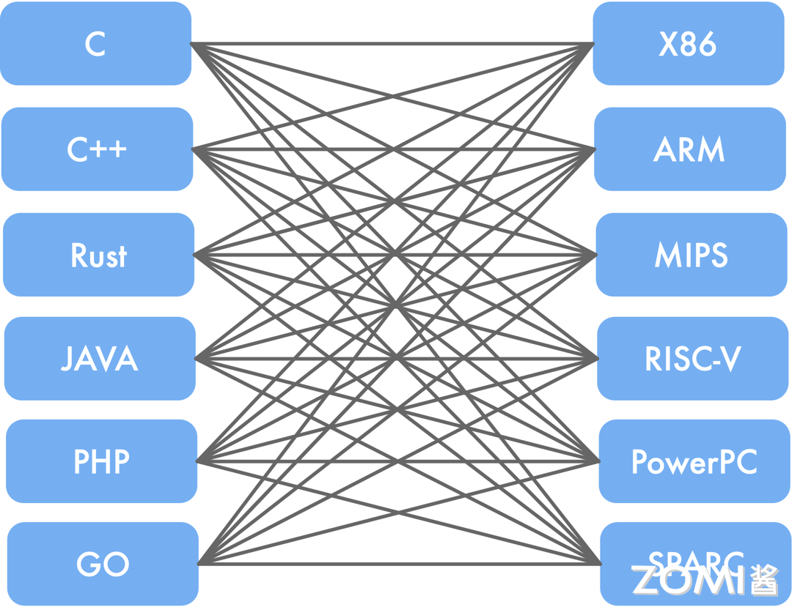

GCC 具有以下主要特征：

- 可移植性：支持多种硬件平台，使得用户可以在不同的硬件架构上进行编译。
- 跨平台交叉编译：支持在一个平台上为另一个平台生成可执行文件，这对嵌入式开发尤为重要。
- 多语言前端：除了 C 语言，还支持 C++、Objective-C、Fortran、Ada、Go 和 D 等多种编程语言。
- 模块化设计：允许轻松添加新语言和 CPU 架构的支持，增强了扩展性。
- 开源自由软件：源代码公开，用户可以自由使用、修改和分发。


## GCC 编译流程

GCC 的编译过程可以大致分为预处理、编译、汇编和链接四个阶段。

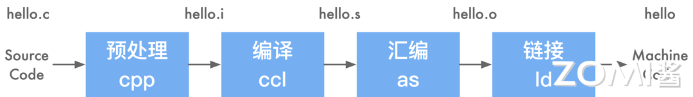


### 源程序(文本)

当编写源程序时，通常会使用以 .c 或 .cpp 为扩展名的文件。


### 预处理(cpp)

```bash
gcc -E hello.c -o hello.i
```

在预处理过程中，源代码会被读入，并检查其中包含的预处理指令和宏定义，然后进行相应的替换操作。此外，预处理过程还会删除程序中的注释和多余空白字符。最终生成的.i 文件包含了经过预处理后的代码内容。


### 编译(ccl)

在这里，编译并不仅仅指将程序从源文件转换为二进制文件的整个过程，而是特指将经过预处理的文件（hello.i）转换为特定汇编代码文件（hello.s）的过程。

生成文件 hello.s：

```bash
gcc -S hello.i -o hello.s
```


### 汇编(as)

将汇编代码转换成机器指令。这一步是通过汇编器(as)完成的。汇编器是 GCC 的后端，其主要功能是将汇编代码转换成机器指令。

生成文件 hello.o

```bash
gcc -c hello.s -o hello.o
```


### 链接(ld)

链接过程中，链接器的作用是将目标文件与其他目标文件、库文件以及启动文件等进行链接，从而生成一个可执行文件。在链接的过程中，链接器会对符号进行解析、执行重定位、进行代码优化、确定空间布局，进行装载，并进行动态链接等操作。通过链接器的处理，将所有需要的依赖项打包成一个在特定平台可执行的目标程序，用户可以直接执行这个程序。

```bash
gcc -o hello.o -o hello
```

- 静态链接

  静态链接是指在链接程序时，需要使用的每个库函数的一份拷贝被加入到可执行文件中。

- 动态链接

  动态链接是指可执行文件只包含文件名，让载入器在运行时能够寻找程序所需的函数库。通过动态链接使用动态链接库进行链接，生成的程序在执行时需要加载所需的动态库才能运行。


## GCC 编译方法

### 本地编译

所谓"本地编译"，是指编译源代码的平台和执行源代码编译后程序的平台是同一个**平台**。这里的平台，可以理解为 **CPU 架构+操作系统**。


### 交叉编译

所谓"交叉编译（Cross_Compile）"，是指编译源代码的平台和执行源代码编译后程序的平台是两个不同的平台。


## 与传统编译区别

传统的三段式划分是指将编译过程分为前端、优化、后端三个阶段，每个阶段都有专门的工具负责。


而在 GCC 中，编译过程被分成了预处理、编译、汇编、链接四个阶段 。

GCC 编译过程的四个阶段与传统的三段式划分的前端、优化、后端三个阶段有一定的重合和对应关系，但 GCC 更为详细和全面地划分了编译过程，使得每个阶段的功能更加明确和独立。


# 4. LLVM设计架构

## LLVM 架构特点

LLVM 架构具有独立的组件和库化的特点，使得前端和后端工程师能够相对独立地进行工作，从而提高了开发效率和代码维护性。其核心在于中间表示（IR），通过统一且灵活的 IR 实现了对不同编程语言和目标平台的支持。优化器能够将 IR 转换为高效的形式，再由后端生成目标平台的机器码。这种设计使得 LLVM 具有适应不同编程需求和硬件架构的灵活性和高性能，为软件开发提供了强大的支持。


### LLVM 组件独立性

LLVM 具有一个显著的特点，即其组件的独立性和库化架构。在使用 LLVM 时，前端工程师只需实现相应的前端，而无需修改后端部分，从而使得添加新的编程语言变得更加简便。这是因为后端只需要将中间表示（IR）翻译成目标平台的机器码即可。

在 LLVM 中，IR 扮演着至关重要的角色。它是一种类似汇编语言的底层语言，但具有强类型和精简指令集的特点（RISC），并对目标指令集进行了抽象。


### LLVM 中间表达

LLVM 提供了一套适用于编译器系统的中间语言（Intermediate Representation，IR），并围绕这个中间语言进行了大量的变换和优化。经过这些变换和优化，IR 可以被转换为目标平台相关的汇编语言代码。

与传统 GCC 的前端直接对应于后端不同，LLVM 的 IR 是统一的，可以适用于多种平台，进行优化和代码生成。

GCC：

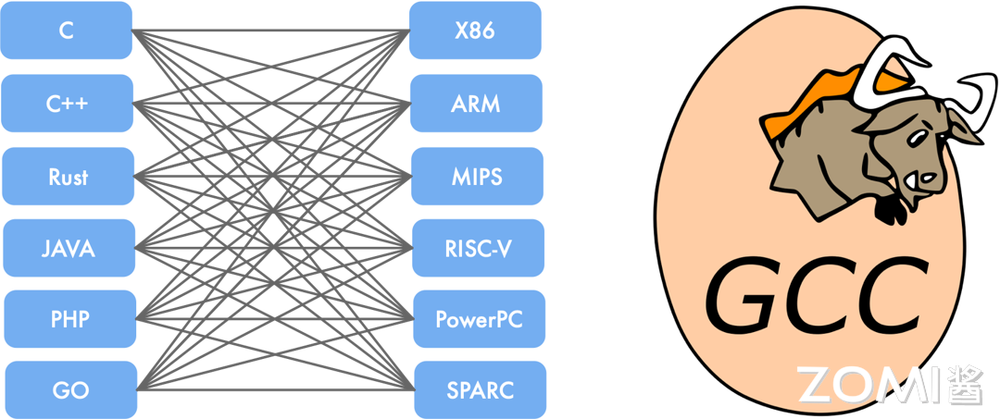

LLVM：

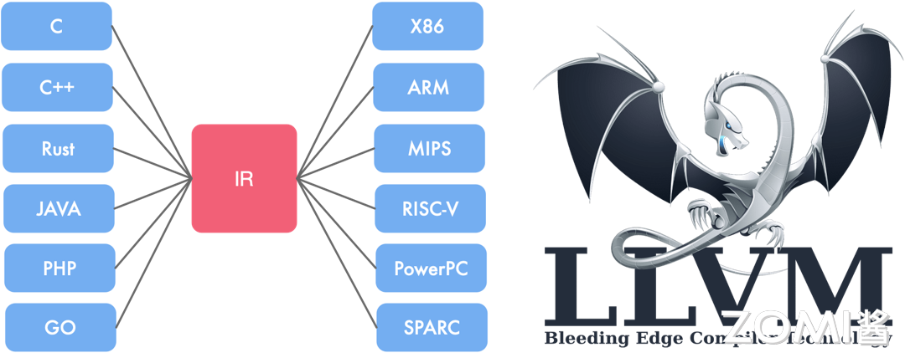

LLVM IR 的优点包括：

1. 更独立：LLVM IR 设计为可在编译器之外的任意工具中重用，使得轻松集成其他类型的工具，如静态分析器和插桩器成为可能。
2. 更正式：拥有明确定义和规范化的 C++ API，使得处理、转换和分析变得更加便捷。
3. 更接近硬件：LLVM IR 提供了类似 RISCV 的模拟指令集和强类型系统，实现了其“通用表示”的目标。具有足够底层指令和细粒度类型的特性使得上层语言和 IR 的隔离变得简单，同时 IR 的行为更接近硬件，为进一步在 LLVM IR 上进行分析提供了可能性。


## LLVM 整体架构

LLVM 是一个模块化和可重用的编译器和工具链技术库。它的整体架构包含从前端语言处理到最终生成目标机器码的完整优化流程。对于用户而言，通常会使用 Clang 作为前端，而 LLVM 的优化器和后端处理则是透明的。

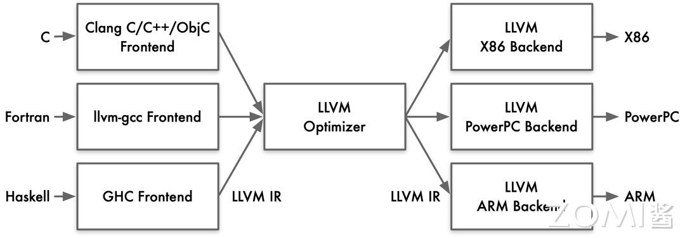

- 前端（Front-End）：负责处理高级语言（如 C/C++/Obj-C）的编译，生成中间表示（IR）。
- 优化器（Optimizer）：对中间表示进行各种优化，提高代码执行效率。
- 后端（Back-End）：将优化后的中间表示转换为目标平台的机器码。


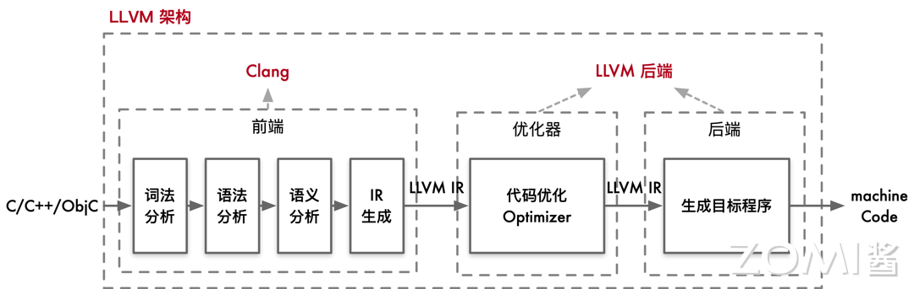

当用户编写的 C/C++/Obj-C 代码输入到 Clang 前端时，Clang 会执行以下步骤：

- 词法分析（Lexical Analysis）：将源代码转换为标记（tokens）。
- 语法分析（Syntax Analysis）：将标记转换为抽象语法树（AST）。
- 语义分析（Semantic Analysis）：检查语义正确性，生成中间表示（IR）。

生成的抽象语法树（AST）通过进一步处理，转换为 LLVM 的中间表示（IR）。这个中间表示是一种平台无关的低级编程语言，用于连接前端和后端。


在详细的架构图中，我们可以看到 LLVM 的前端、优化器、后端等各个组件的交互。在前端，Clang 会将高级语言代码转换为为 LLVM 的中间表示（IR）。

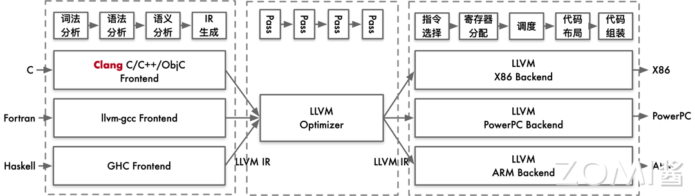

LLVM 的优化器通过多个优化 pass 来提升中间表示（IR）的性能。每个 pass 都对 IR 进行特定的优化操作


## Clang + LLVM 案例实践

1. 生成`.i `文件

   ```bash
   clang -E -c .\hello.c -o .\hello.i
   ```

2. 将预处理过后的`.i `文件转化为`.bc` 文件

   ```bash
   clang -emit-llvm .\hello.i -c -o .\hello.bc
   
   clang -emit-llvm .\hello.c -S -o .\hello.ll  # 这一步将 hello.c 文件直接编译成 LLVM 中间表示的汇编代码文件 hello.ll，这是一种人类可读的中间表示形式，适用于进一步的分析和优化。
   ```

3. llc：可以使用 llc 工具将这些中间表示文件转换为目标平台的汇编代码。

   ```bash
   llc .\hello.ll -o .\hello.s
   llc .\hello.bc -o .\hello2.s
   ```

4. 转变为可执行的二进制文件

   ```bash
   clang .\hello.s -o hello
   ```

5. 查看编译过程

   ```bash
   clang -ccc-print-phases .\hello.c
   ```

   ```bash
                   +- 0: input, ".\hello.c", c
               +- 1: preprocessor, {0}, cpp-output
           +- 2: compiler, {1}, ir
       +- 3: backend, {2}, assembler
       +- 4: assembler, {3}, object
     +-5: linker, {4}, image
   6: bind-arch,"x86_64", {5}, image
   ```

其中 0 是输入，1 是预处理，2 是编译，3 是后端优化，4 是产生汇编指令，5 是库链接，6 是生成可执行的 x86_64 二进制文件。


# 5. LLVM IR详解

[文章](https://github.com/chenzomi12/AISystem/blob/main/03Compiler/01Tradition/06LLVMDetail.md)


# 6. LLVM 前端和优化层

[文章](https://github.com/chenzomi12/AISystem/blob/main/03Compiler/01Tradition/07LLVMFrontend.md)


# 7. LLVM后端代码生成

[文章](https://github.com/chenzomi12/AISystem/blob/main/03Compiler/01Tradition/08LLVMBackend.md)


