# 二(AI芯片体系结构)-1.AI计算体系

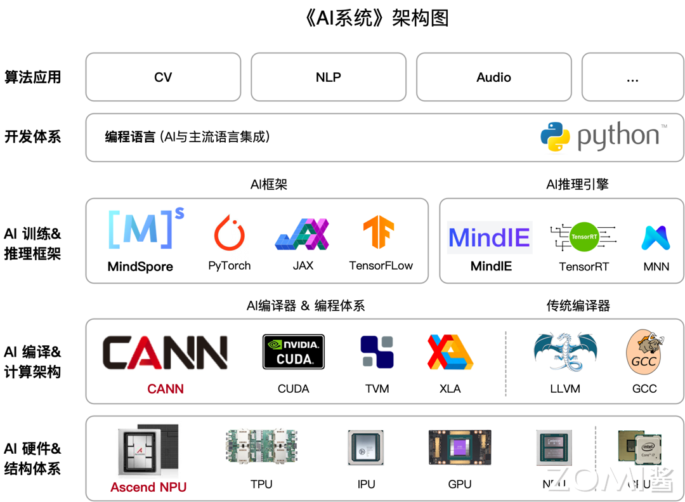

# 1. 概览

## 1.1 什么是 AI 芯片

在 AI 应用还没有得到市场验证之前，通常使用已有的通用芯片（如 CPU）进行计算，可以避免专门研发 ASIC 芯片的高投入和高风险。但是这类通用芯片设计初衷并非专门针对深度学习，因而存在性能、功耗等方面的局限性。随着人工智能应用规模持续扩大，这类问题日益突显，待深度学习算法稳定后，AI 芯片可采用 ASIC 设计方法进行全定制，使性能、功耗和面积等指标面向深度学习算法做到最优。

## 1.2 AI 芯片的分类

AI 芯片的广泛定义是指那些面向人工智能应用的芯片。

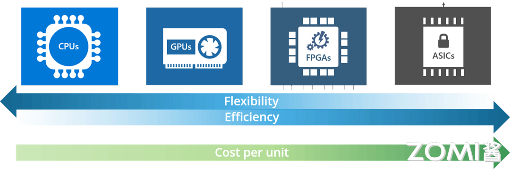

比如按照技术架构分为：

- **CPU**：CPU 是冯诺依曼架构下的处理器，遵循“Fetch （取指）-Decode （译码）- Execute （执行）- Memory Access （访存）-Write Back （写回）”的处理流程。作为计算机的核心硬件单元，CPU 具有大量缓存和复杂的逻辑控制单元，非常擅长逻辑控制、串行的运算，不擅长复杂算法运算和处理并行重复的操作。CPU 能够支持所有的 AI 模型算法。
- **GPU**：图形处理器，最早应用于图像处理领域，与 CPU 相比，减少了大量数据预取和决策模块，增加了计算单元 ALU 的占比，从而在并行化计算效率上有较大优势。但 GPU 无法单独工作，必须由 CPU 进行控制调用才能工作，而且功耗比较高。
- **FPGA**：其基本原理是在 FPGA 芯片内集成大量的基本门电路以及存储器，用户可以通过更新 FPGA 配置文件来定义这些门电路以及存储器之间的连线。与 CPU 和 GPU 相比，FPGA 同时拥有硬件流水线并行和数据并行处理能力，适用于以硬件流水线方式处理一条数据，且整数运算性能更高。FPGA 具有非常好的灵活性，可以针对不同的算法做不同的设计，对算法支持度很高，常用于深度学习算法中的推理阶段。不过 FPGA 需要直接与外部 DDR 数据交换数据，其性能不如 GPU 的内存接口高效，并且对开发人员的编程门槛相对较高。
- **ASIC**：根据产品需求进行特定设计和制造的集成电路，能够在特定功能上进行强化，具有更高的处理速度和更低的功耗。但是研发周期长，成本高。比如神经网络计算芯片 NPU、Tensor 计算芯片 TPU 等都属于 ASIC 芯片。因为是针对特定领域定制，所以 ASIC 往往可以表现出比 GPU 和 CPU 更强的性能

按照应用场景的角度，AI 芯片可以分为云端，边缘端两类。

- **云端**的场景又分为训练应用和推理应用，像电商网站的用户推荐系统、搜索引擎、短视频网站的 AI 变脸等都是属于推理应用。
- **边缘**的应用场景更加丰富，如智能手机、智能驾驶、智能安防等。通过 AI 芯片丰富的应用场景，可以看到人工智能技术对我们未来生活的影响程度。

## 1.3 后摩尔定律时代

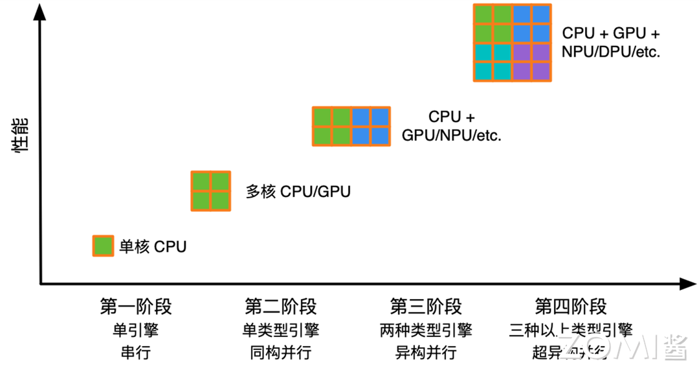

# 2. AI计算模式(上)

## 经典模型结构设计与演进

### 神经网络的基本概念

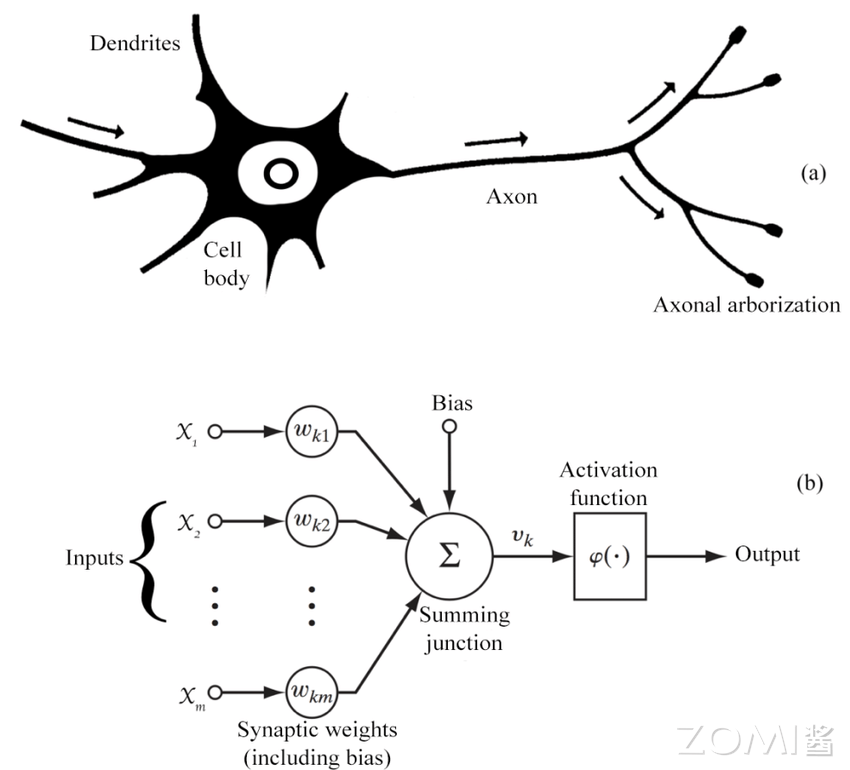

一个神经网络模型的基础组件

- **神经元（Neuron）**：神经网络的基本组成单元
- **激活函数（Activation Function）**：用于神经元输出非线性化的函数，常见的激活函数包括 Sigmoid、ReLU 等。
- **模型层数（Layer）**：神经网络由多个层次组成，包括输入层、隐藏层和输出层。隐藏层可以有多层，用于提取数据的不同特征。
- **前向传播（Forward Propagation）**：输入数据通过神经网络从输入层传递到最后输出层的过程，用于生成预测结果。
- **反向传播（Backpropagation）**：通过计算损失函数对网络参数进行调整的过程，以使网络的输出更接近预期输出。
- **损失函数（Loss Function）**：衡量模型预测结果与实际结果之间差异的函数，常见的损失函数包括均方误差和交叉熵。
- **优化算法（Optimization Algorithm）**：用于调整神经网络参数以最小化损失函数的算法，常见的优化算法包括梯度下降，自适应评估算法（Adaptive Moment Estimation）等，不同的优化算法会影响模型训练的收敛速度和能达到的性能。

神经网络的产生包含训练和推理两个阶段。整体来说，训练阶段的目的是通过最小化损失函数来学习数据的特征和内在关系，优化模型的参数；推理阶段则是利用训练好的模型来对新数据做出预测或决策。

神经网络中的主要计算范式：**权重求和**。下图是一个简单的神经网络结构，左边中间灰色的圈圈表示一个简单的神经元，每个神经元里有求和和激活两个操作，求和就是指乘加或者矩阵相乘，激活函数则是决定这些神经元是否对输出有用，Tanh、ReLU、Sigmoid 和 Linear 都是常见的激活函数。神经网络中 90%的计算量都是在做乘加（multiply and accumulate, MAC）的操作，也称为权重求和。

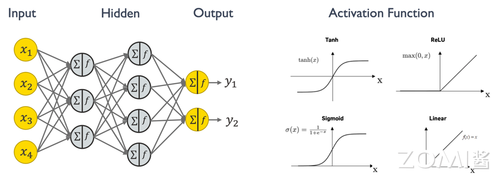

### 主流的网络模型结构

主流的模型结构:

1. 全连接 Fully Connected Layer

   全连接层（Fully Connected Layer），也称为密集连接层或仿射层，是深度学习神经网络中常见的一种层类型，通常位于网络的最后几层，全连接层的每个神经元都会与前一层的所有神经元进行全连接，通过这种方式，全连接层能够学习到输入数据的全局特征，并对其进行分类或回归等任务。

   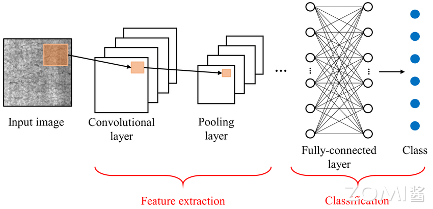

   - **输出层**：在分类任务中，全连接层通常作为网络的最后一层，并配合 Softmax 激活函数用于生成类别预测的概率分布。在回归任务中，全连接层的输出通常直接作为最终的预测值。
   - **过拟合风险**：全连接层的参数数量通常较大，因此在训练过程中容易产生过拟合的问题。为了缓解过拟合，可以采用正则化技术、dropout 等方法。

2. 卷积层 Convolutional Layer

   卷积层是深度学习神经网络中常用的一种层类型，主要用于处理图像和序列数据。它的主要作用是通过学习可重复使用的卷积核（Filter）来提取输入数据中的特征。

   - **特征图**：卷积操作的输出称为特征图（Feature Map），它是通过卷积核在输入数据上滑动并应用激活函数得到的。特征图的深度（通道数）取决于卷积核的数量。
   - **参数共享**：卷积层的参数共享是指在整个输入数据上使用相同的卷积核进行卷积操作，这样可以大大减少模型的参数数量，从而减少过拟合的风险并提高模型的泛化能力。
   - **池化操作**：在卷积层之后通常会使用池化层来减小特征图的尺寸并提取最重要的特征。常见的池化操作包括最大池化和平均池化。

3. **循环网络 Recurrent Layer**

   循环神经网络（RNN）是一种用于处理序列数据的神经网络结构。它的独特之处在于具有循环连接，允许信息在网络内部传递，从而能够捕捉序列数据中的时序信息和长期依赖关系。基本的 RNN 结构包括一个或多个时间步（time step），每个时间步都有一个输入和一个隐藏状态（hidden state）。隐藏状态在每个时间步都会被更新，同时也会被传递到下一个时间步。这种结构使得 RNN 可以对序列中的每个元素进行处理，并且在处理后保留之前的信息。然而，传统的 RNN 存在着梯度消失或梯度爆炸的问题，导致难以捕捉长期依赖关系。为了解决这个问题，出现了一些改进的 RNN 结构，其中最为著名的就是长短期记忆网络（LSTM）和门控循环单元（GRU）。

   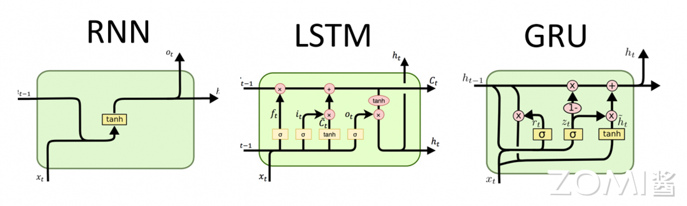

4. **注意力机制 Attention Layer**

   深度学习中的注意力机制（Attention Mechanism）是一种模仿人类视觉和认知系统的方法，它允许神经网络在处理输入数据时集中注意力于相关的部分。通过引入注意力机制，神经网络能够自动地学习并选择性地关注输入中的重要信息，提高模型的性能和泛化能力。其中由谷歌团队在 2017 年的论文[《Attention is All Your Need》](https://arxiv.org/pdf/1706.03762)中以编码器-解码器为基础，创新性的提出了一种 Transformer 架构。该架构可以有效的解决 RNN 无法并行处理以及 CNN 无法高效的捕捉长距离依赖的问题，后来也被广泛地应用到了计算机视觉领域。Transformer 是目前很多大模型结构的基础组成部分，而 **Transformer 里的重要组件就是 Scaled Dot-Product Attention 和 Multi-Head Attention**，下图是它们的结构示意图。

   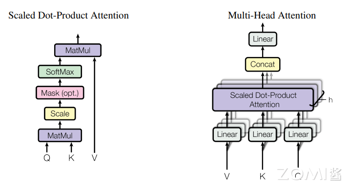

## 模型量化与压缩

模型量化和网络剪枝就是专门针对 AI 的神经网络模型在训练和推理不同阶段需求的特点做出的优化技术，旨在减少模型的计算和存储需求，加速推理速度，从而提高模型在移动设备、嵌入式系统和边缘设备上的性能和效率。

- **型量化**是指通过减少神经模型权重表示或者激活所需的比特数来将高精度模型转换为低精度模型。
- **网络剪枝**则是研究模型权重中的冗余，尝试在不影响或者少影响模型推理精度的条件下删除/修剪冗余和非关键的权重。

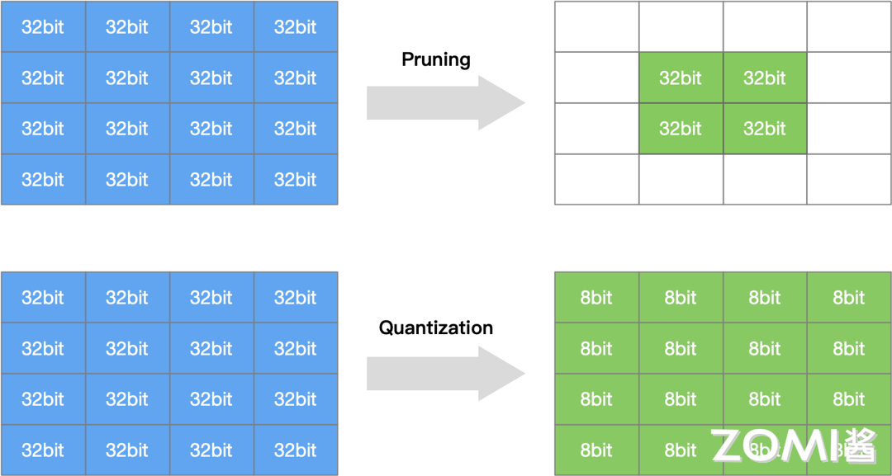

### 模型量化

将高比特模型进行低比特量化具有如下几个好处

- **降低内存**：低比特量化将模型的权重和激活值转换为较低位宽度的整数或定点数，从而大幅减少了模型的存储需求，使得模型可以更轻松地部署在资源受限的设备上。
- **降低成本**：低比特量化降低了神经网络中乘法和加法操作的精度要求，从而减少了计算量，加速了推理过程，提高了模型的效率和速度。
- **降低能耗**：低比特量化减少了模型的计算需求，因此可以降低模型在移动设备和嵌入式系统上的能耗，延长设备的电池寿命。
- **提升速度**：虽然低比特量化会引入一定程度的信息丢失，但在合理选择量化参数的情况下，可以最大程度地保持模型的性能和准确度，同时获得存储和计算上的优势。
- **丰富模型的部署场景**：低比特量化压缩了模型参数，可以使得模型更容易在移动设备、边缘设备和嵌入式系统等资源受限的环境中部署和运行，为各种应用场景提供更大的灵活性和可行性。

#### 量化基本概念

量化的类型分对称量化和非对称量化。量化策略算法有很多种，其中 MinMax 量化算法最为通用。

#### 数据精度格式

目前神经网络中的常用的类型有 FP32, TF32, FP16, BF16 这四种类型。

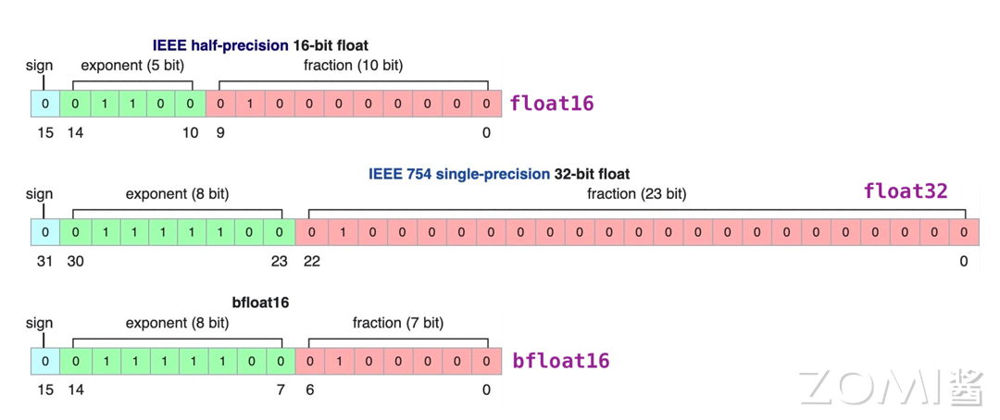

### 模型剪枝

模型剪枝是一种有效的模型压缩方法，通过对模型中的权重进行剔除，降低模型的复杂度，从而达到减少存储空间、计算资源和加速模型推理的目的。

**剪枝的基本概念**

下图是一个简单的多层神经网络的剪枝示意，卷积算法定义可以分为两种，一种是右图上面示意的对全连接层神经元之间的连接线进行剪枝，另一种是对神经元的剪枝。

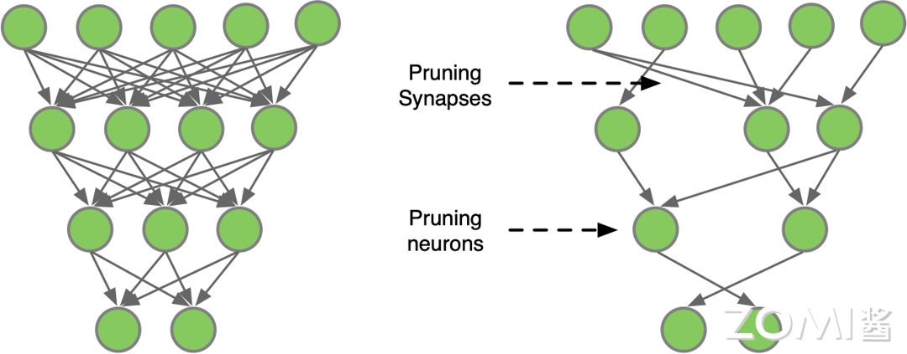

根据剪枝的时机和方式，可以将模型剪枝分为以下几种类型：

- **静态剪枝**：在训练结束后对模型进行剪枝，这种方法的优点是简单易行，但无法充分利用训练过程中的信息。
- **动态剪枝**：在训练过程中进行剪枝，根据训练过程中的数据和误差信息动态地调整网络结构。这种方法的优点是能够在训练过程中自适应地优化模型结构，但实现起来较为复杂。
- **知识蒸馏剪枝**：通过将大模型的“知识”蒸馏到小模型中，实现小模型的剪枝。这种方法需要额外的训练步骤，但可以获得较好的压缩效果。

对神经网络模型的剪枝可以描述为如下三个步骤：

- **训练 Training**：训练过参数化模型，得到最佳网络性能，以此为基准；
- **剪枝 Pruning**：根据算法对模型剪枝，调整网络结构中通道或层数，得到剪枝后的网络结构；
- **微调 Finetune**：在原数据集上进行微调，用于重新弥补因为剪枝后的稀疏模型丢失的精度性能。

# 3. AI计算模式(下)

## 轻量化网络模型

### 模型轻量化方法

网络模型的轻量级衡量指标有两个，一个是**网络参数量**、另一个是**浮点运算数(Floating-point Operations, FLOPs)**，也就是计算量。

- **Params 网络参数量**
- **FLOPs 浮点运算数**

一般来说，网络模型参数量和浮点运算数越小，模型的速度越快，但是衡量模型的快慢不仅仅是参数量和计算量的多少，还有内存访问的次数多少相关，也就是和网络结构本身相关。

轻量化设计：

1. **减少内存空间的设计**

   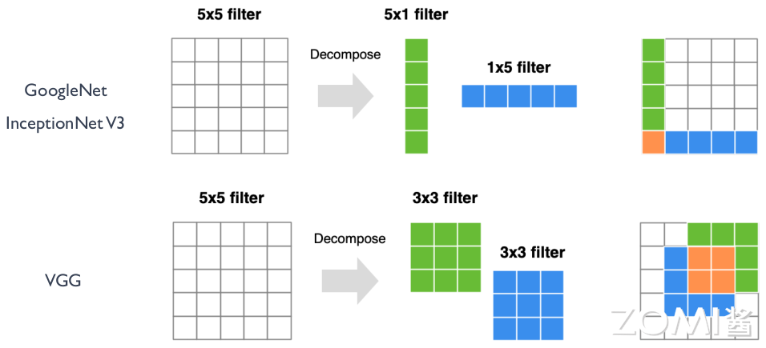

2. **减少通道数的设计**

   MobileNet 系列的网络设计中，提出了深度可分离卷积的设计策略，其中通过 Depthwise 逐层卷积加 1×1 的卷积核来实现一个正常的卷积操作（如下图所示）

   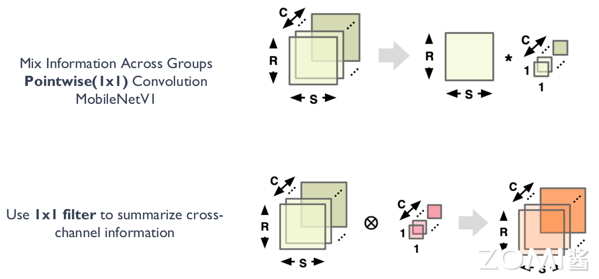

3. **减少卷积核个数的设计**

   在 DenseNet 和 GhostNet 的模型设计中，提出了一种通过 Reuse Feature Map 的设计方式来减少模型参数和运算量。

   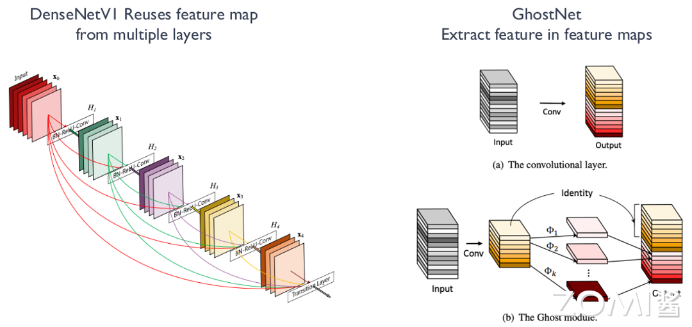

## 大模型分布式并行

分布式并行分为数据并行、模型并行，模型并行又分为张量并行和流水线并行。

### 集合通信原语

在并行计算中，通信原语是指用于在不同计算节点或设备之间进行数据传输和同步的基本操作。这些通信原语在并行计算中起着重要作用，能够实现节点间的数据传输和同步，从而实现复杂的并行算法和应用。一些常见的通信原语包括：

- All-reduce：所有节点上的数据都会被收集起来，然后进行某种操作（通常是求和或求平均），然后将结果广播回每个节点。这个操作在并行计算中常用于全局梯度更新。
- All-gather：每个节点上的数据都被广播到其他所有节点上。每个节点最终都会收到来自所有其他节点的数据集合。这个操作在并行计算中用于收集各个节点的局部数据，以进行全局聚合或分析。
- Broadcast：一台节点上的数据被广播到其他所有节点上。通常用于将模型参数或其他全局数据分发到所有节点。
- Reduce：将所有节点上的数据进行某种操作（如求和、求平均、取最大值等）后，将结果发送回指定节点。这个操作常用于在并行计算中进行局部聚合。
- Scatter：从一个节点的数据集合中将数据分发到其他节点上。通常用于将一个较大的数据集合分割成多个部分，然后分发到不同节点上进行并行处理。
- Gather：将各个节点上的数据收集到一个节点上。通常用于将多个节点上的局部数据收集到一个节点上进行汇总或分析。

### 数据并行技术

根据模型在设备之间的通信程度，数据并行技术可以分为 DP, DDP, FSDP 三种。

1. Data parallelism, DP 数据并行

   具体实施是将大规模数据集分割成多个小批量，每个批量被发送到不同的计算设备（如 NPU）上并行处理。每个计算设备拥有完整的模型副本，并单独计算梯度，然后通过 all_reduce 通信机制在计算设备上更新模型参数，以保持模型的一致性。

2. Distribution Data Parallel, DDP 分布式数据并行

   DDP 是一种分布式训练方法，它允许模型在多个计算节点上进行并行训练，每个节点都有自己的本地模型副本和本地数据。DDP 通常用于大规模的数据并行任务，其中模型参数在所有节点之间同步，但每个节点独立处理不同的数据批次。

   DDP 通常与 AI 框架（如 PyTorch）一起使用，这些框架提供了对 DDP 的内置支持。

3. Fully Sharded Data Parallel, FSDP 全分片数据并行

   Fully Sharded Data Parallelism (FSDP) 技术是 DP 和 DDP 技术的结合版本，可以实现更高效的模型训练和更好的横向扩展性。

   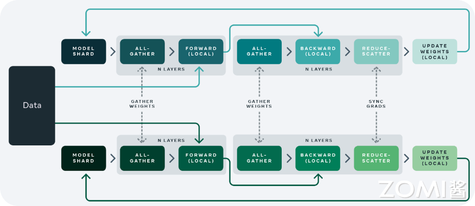

### 模型并行技术

模型的并行技术可以总结为张量并行和流水并行。

1. **张量并行**

   将模型的张量操作分解成多个子张量操作，并且在不同的设备上并行执行这些操作。这样做的好处是可以将大模型的计算负载分布到多个设备上，从而提高模型的计算效率和训练速度。在张量并行中，需要考虑如何划分模型的不同层，并且设计合适的通信机制来在不同设备之间交换数据和同步参数。通常会使用诸如 All-reduce 等通信原语来实现梯度的聚合和参数的同步。

2. **流水并行**

   将模型的不同层划分成多个阶段，并且每个阶段在不同的设备上并行执行。每个设备负责计算模型的一部分，并将计算结果传递给下一个设备，形成一个计算流水线。在流水并行中，需要设计合适的数据流和通信机制来在不同设备之间传递数据和同步计算结果。通常会使用缓冲区和流水线控制器来管理数据流，并确保计算的正确性和一致性。

   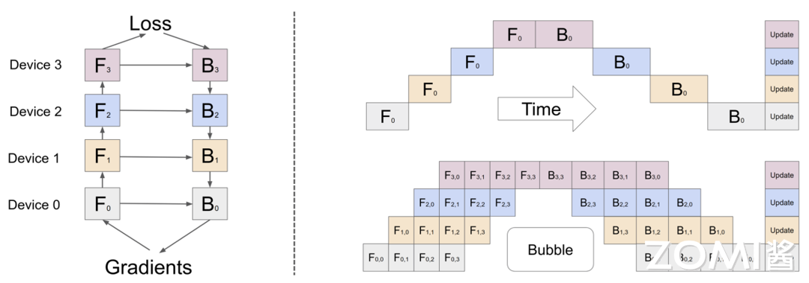

# 4. 关键设计指标

[文档](https://github.com/chenzomi12/AISystem/blob/main/02Hardware/01Foundation/04Metrics.md)

# 5. 核心计算：矩阵乘

AI 模型中往往包含大量的矩阵乘运算，该算子的计算过程表现为较高的内存搬移和计算密度需求，所以矩阵乘的效率是 AI 芯片设计时性能评估的主要参考依据。

## 从卷积到矩阵乘

AI 模型中的卷积层的实现定义大家应该都已经比较熟悉了，卷积操作的过程大概可以描述为按照约定的窗口大小和步长，在 Feature Map 上进行不断地滑动取数，窗口内的 Feature Map 和卷积核进行逐元素相乘，再把相乘的结果累加求和得到输出 Feature Map 的每个元素结果。卷积到矩阵乘的的转换关系示意如下图。

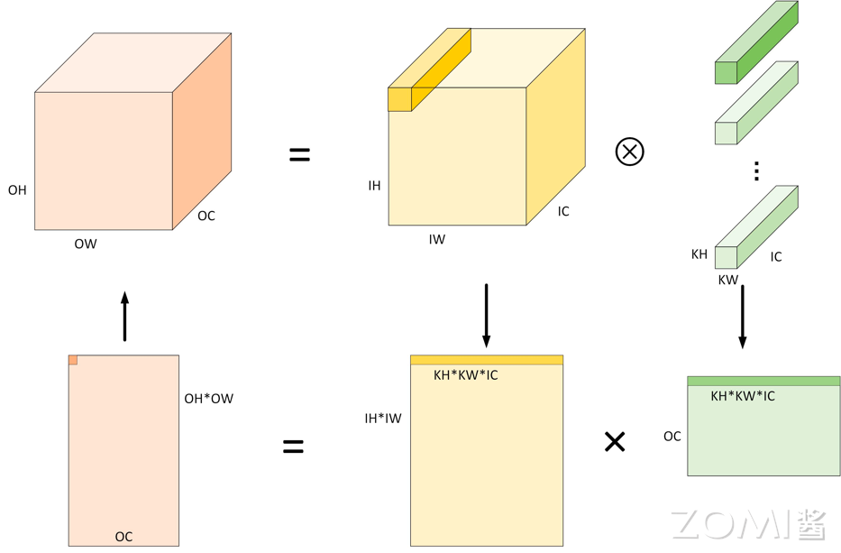

下图是对应的卷积到矩阵乘的转换示意，输入、输出特征图和卷积核都用不同的颜色表示，图中数字表示位置标记。

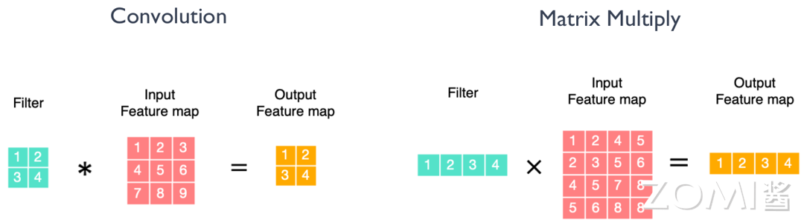

## 矩阵乘分块 Tilling

上面介绍了卷积到矩阵乘的转换过程，我们可以发现，转换后的矩阵乘的维度非常大，而芯片里的内存空间往往是有限的（成本高），表现为越靠近计算单元，带宽越快，内存越小。为了平衡计算和内存加载的时间，让算力利用率最大化，AI 芯片往往会进行由远到近，多级内存层级的设计方式，达到数据复用和空间换时间的效果。根据这样的设计，矩阵乘实际的数据加载和计算过程将进行分块 Tiling 处理。

下图中的 Step1, Step2 展示了两次数据加载可以完成一个输出 Tile 块的计算过程。

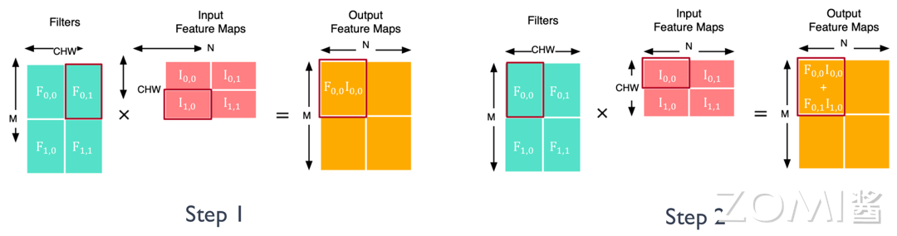

## 矩阵乘的库

矩阵乘作为 AI 模型中的重要性能算子，CPU 和 GPU 的平台上都有专门对其进行优化实现的库函数。比如 CPU 的 OpenBLAS, Intel MKL 等，GPU 的 cuBLAS, cuDNN 等。实现的方法主要有 **Loop 循环优化 (Loop Tiling)和多级缓存 (Memory Hierarchy)。**

下图展示了对矩阵乘进行 Loop 循环优化和多级缓存结合的实现流程。

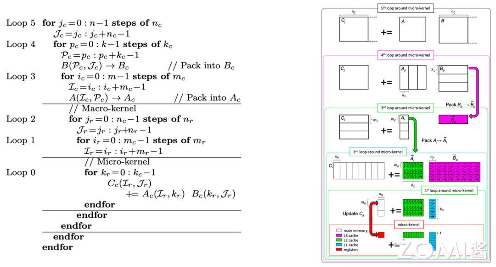

## 矩阵乘的优化

矩阵乘作为计算机科学领域的一个重要基础操作，有许多优化算法可以提高其效率。下面我们对常见的矩阵乘法优化算法做一个整体的归类总结。

1. **基本的循环优化**：通过调整循环顺序、内存布局等手段，减少缓存未命中（cache miss）和数据依赖，提高缓存利用率，从而加速矩阵乘法运算。
2. **分块矩阵乘法（Blocked Matrix Multiplication）**：将大矩阵划分成小块，通过对小块矩阵进行乘法运算，降低了算法的时间复杂度，并能够更好地利用缓存。
3. **SIMD 指令优化**：利用单指令多数据（SIMD）指令集，如 SSE（Streaming SIMD Extensions）和 AVX（Advanced Vector Extensions），实现并行计算，同时处理多个数据，提高计算效率。
4. **SIMT 多线程并行化**：利用多线程技术，将矩阵乘法任务分配给多个线程并行执行，充分利用多核处理器的计算能力。
5. **算法改进**：如 Fast Fourier Transform 算法，Strassen 算法、Coppersmith-Winograd 算法等，通过矩阵分解和重新组合，降低了算法的时间复杂度，提高了计算效率。

这些优化算法通常根据硬件平台、数据规模和计算需求选择不同的策略，以提高矩阵乘法运算的效率。在具体的 AI 芯片或其它专用芯片里面，对矩阵乘的优化实现主要就是减少指令开销，可以表现为两个方面：

1. **让每个指令执行更多的 MACs 计算。**比如 CPU 上的 SIMD/Vector 指令，GPU 上的 SIMT/Tensor 指令，NPU 上 SIMD/Tensor,Vector 指令的设计。
2. **在不增加内存带宽的前提下，单时钟周期内执行更多的 MACs。**比如英伟达的 Tensor Core 中支持低比特计算的设计，对每个 cycle 执行 512bit 数据的带宽前提下，可以执行 64 个 8bit 的 MACs，大于执行 16 个 32bit 的 MACs。

# 6. 数据单位：比特位

## 比特位宽的定义

### 浮点数类型

在计算机中，浮点数据类型的表示通常采用 IEEE 754 标准，该标准定义了两种精度的浮点数表示：单精度和双精度。

一个单精度浮点数通常由 32 位二进制组成，按照 IEEE 754 标准的定义，这 32 位被划分为三个部分：符号位、指数部分和尾数部分。

- **符号位：**占用 1 位，表示数值的正负。
- **指数部分：**占用 8 位，用于表示数值的阶码（数据范围）。
- **尾数部分：**占用 23 位，用于表示数值的有效数字部分（小数精度）。

单精度和双精度浮点数的取值范围和精度有所不同，双精度浮点数通常具有更高的精度和更大的取值范围。

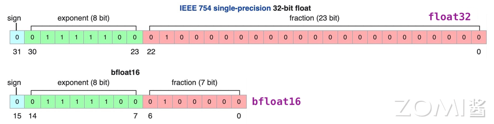

## AI 的数据类型及应用

在 AI 模型中常用数据位宽有 8bit、16bit 和 32bit，根据不同的应用场景和模型训练推理阶段需求，可以选择不同位宽的数据类型。

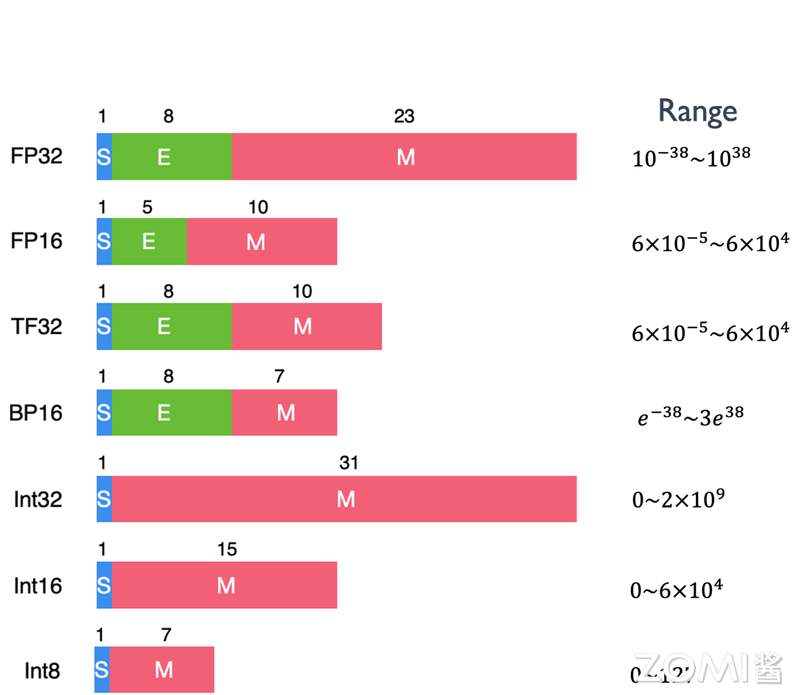

## 降低比特位宽

似乎 AI 模型设计中绕不开对低比特位宽数据的探索，在计算资源有限，成本有限的大环境背景下，这是一个必然的选择。高比特的数据位宽，可以保证模型的精度，但是硬件的计算和存储成本也会更高，而对不同的场景，有不同的模型精度需求，所以需要对不同的场景，设计使用不同精度的数据类型，以降低硬件执行的成本。

降低比特位宽其实就是降低数据的精度，对于 AI 芯片来说，降低比特位宽可以带来如下好处：

1. 降低 MAC 的输入和输出数据位宽，能够有效减少数据的搬运和存储开销。更小的内存搬移带来更低的功耗开销。
2. 减少 MAC 计算的开销和代价，比如，两个 int8 数据类型的相乘，累加和使用 16bit 位宽的寄存器即可，而 FP16 数据类型的相乘，累加和需要设计 32 位宽的寄存器。8bit 和 16bit 计算对硬件电路设计的复杂度影响也很大。

