# 二(AI芯片体系结构)-2.AI芯片基础

# 1. CPU基础

## CPU 基本构成

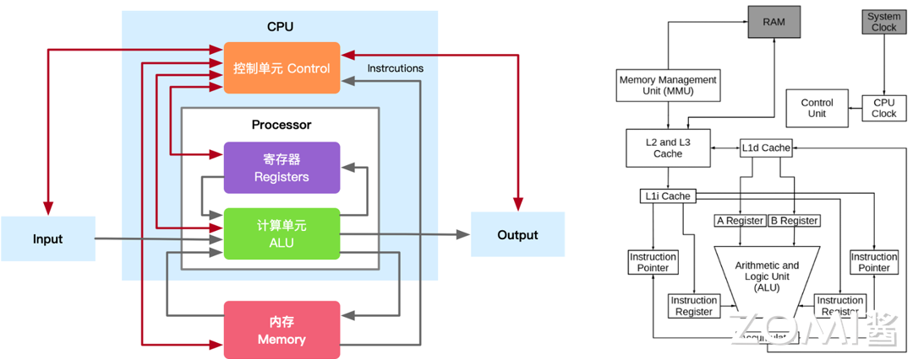

### 算术单元

CPU 的主要功能就是运算，这正是通过**算术逻辑单元（ALU，Arithmetic Logic Unit）**实现的。ALU 电路内部由算术单元（AU）和逻辑单元（LU）组合而成，可对两个输入值（操作数）执行算术或逻辑运算并产生一个输出值。

算术单元负责对二进制数执行加减等数学运算，而逻辑单元执行与、或、非等逻辑运算，以及对两个操作数进行比较等。另外 ALU 还具备位移功能，将输入的操作数向左或向右移动从而得到新的操作数.

如图所示，ALU 包含各种输入和输出连接，这使得外部电子设备和 ALU 之间可以投射数字信号。ALU 输入从外部电路获取信号，作为响应，外部电子设备从 ALU 获取输出信号。

1. **数据**：ALU 包含三个并行总线，包括两个输入和输出操作数。这三个总线处理的信号数量是相同的。
2. **操作码**：当 ALU 将要执行操作时，操作选择码描述了 ALU 将执行哪种类型的运算或逻辑运算。
3. **输出**：ALU 操作的结果由状态输出以补充数据的形式提供，因为它们是多个信号。通常，诸如溢出、零、执行、负数等状态信号都包含在通用 ALU 中。当 ALU 完成每个操作时，外部寄存器包含状态输出信号。这些信号存储在外部寄存器中，使它们可用于未来的 ALU 操作。
4. **输入**：当 ALU 执行一次操作时，状态输入允许 ALU 访问更多信息以成功完成操作。此外，存储的来自先前 ALU 操作的进位被称为单个“进位”位。

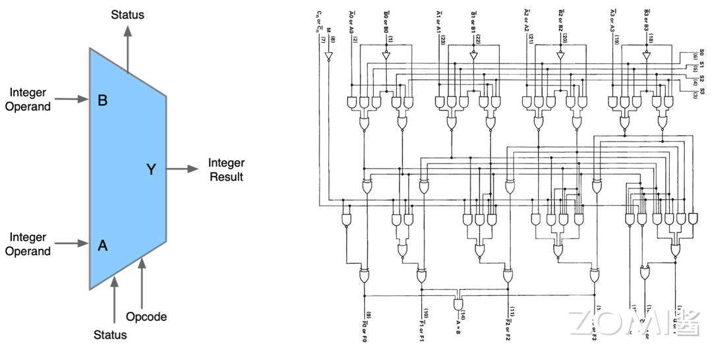

### 存储单元

**存储单元（MU，Memory Unit）**也可以称为**寄存器**

**寄存器**主要分为两种**指令寄存器**和**数据寄存器**，负责暂存指令、ALU 所需操作数、ALU 算出结果等。

寄存器的存储容量是根据其位数来决定的，不同的寄存器有不同的位数，可以存储的数据数量也不同

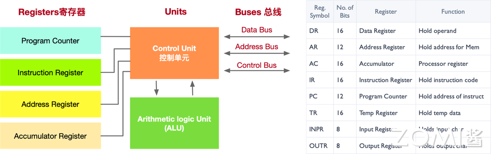

如上图所示寄存器的种类有很多，下面我们来看看几个常见寄存器的功能：

1. **数据寄存器（DR）**：数据寄存器（Data Register，DR）又称数据缓冲寄存器，数据寄存器用于存放操作数，其位数应满足多数数据类型的数值范围，其主要功能是作为 CPU 和主存、外设之间信息传输的中转站，用以弥补 CPU 和主存、外设之间操作速度上的差异。
2. **地址寄存器（AR）**：地址寄存器（Address Register，AR）用来保存 CPU 当前所访问的主存单元的地址。
3. **累加寄存器（AC）**：累加寄存器通常简称累加器（AC），是一个通用寄存器。
4. **程序计数器（PC）**：程序计数器（PC），具有寄存信息和计数两种功能，一般用来存放下一条指令在主存储器中的地址。在程序执行之前，首先必须将程序的首地址，即程序第一条指令所在主存单元的地址送入 PC，因此 PC 的内容即是从主存提取的第一条指令的地址。
5. **指令寄存器（IR）**：指令寄存器（Instruction Register，IR），用来保存当前欲执行的指令。

**寄存器和内存的区别：**

1. 功能：寄存器是中央处理器内的组成部件，用于暂存指令和数据，可用来高速地存放操作数和中间结果，以及作为 CPU 内部和外部存储器之间或和输入/输出设备之间进行数据交换的缓冲区。内存主要功能是存放 CPU 的运算数据，以及与硬盘等外部存储器交换的数据。
2. 速度：寄存器位于 CPU 内部，执行速度快。内存的速度相对较慢。寄存器的速度非常快，通常可以在几个纳秒内完成数据的存取操作。相比之下，内存的速度相对较慢，但也是非常快速的存储器之一，可比硬盘快多了。
3. 容量：寄存器通常只有几字节到几十字节的容量。内存的存储容量通常远远大于寄存器，可以扩展到几个 GB 或者更大。

### 控制单元

控制单元（CU，Control Unit）的主要工作用一句话概括就是告知最有效的工作方法。控制单元从主存中检索和选取指令，对其进行解码，然后发出适当的控制信号，指导计算机的其他组件执行所需的操作。控制单元自身并不执行程序指令，它只是输出信号指示系统的其他部分如何做。

控制单元的任务可以分为解码指令、生成控制信号，并将这些信号发送给其他组件

1. **指令解码**：控制单元负责从存储器中读取指令，并对其进行解码。
2. **控制信号生成**：控制单元根据解码的指令类型和操作数，生成相应的控制信号，以控制计算机中各个部件的操作。
3. **指令执行顺序**：控制控制单元还负责管理指令的执行顺序。它会按照指令序列的顺序，逐条调度指令的执行，并确保每条指令的操作在正确的时钟周期内完成。控制单元能够根据不同指令的需求，控制指令的跳转、分支和循环等控制流程。

CU 所接收的输入有三个：节拍发生器（Step Counter）、操作译码器（Instruction）、标志信号（Condition Signal），CU 接收这三个外部参数后，就能够发出控制信号——微命令（Control Signals），来指挥 CPU 做出微操作。

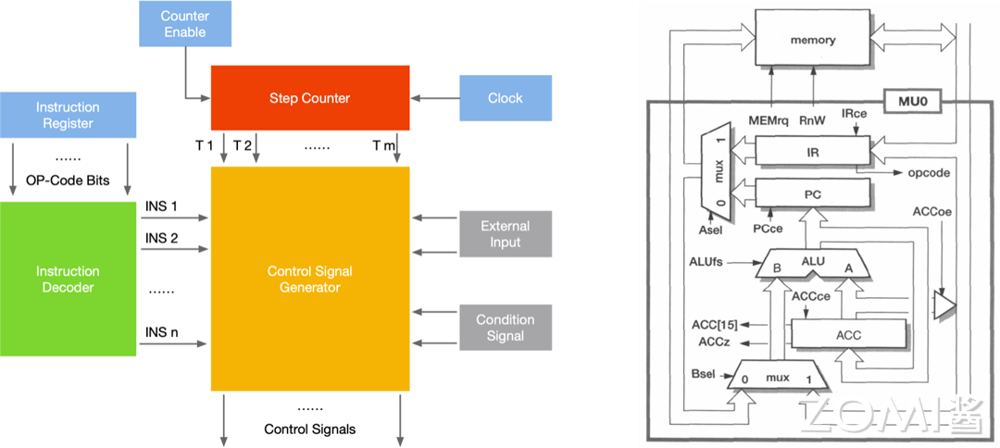

## CPU 工作流

CPU 的工作流，主要分为 4 步：

1. **取指**：从内存提取指令的阶段，是将内存中的指令读取到 CPU 中寄存器的过程，程序寄存器用于存储下一条指令所在的地址
2. **解码**：解码指令译码阶段，在取指令完成后，立马进入指令译码阶段，在指令译码阶段，指令译码器按照预定的指令格式，对取回的指令进行拆分和解释，识别区分出不同的指令类别以及各种获取操作数的方法。
3. **执行**：执行指令阶段，译码完成后，就需要执行这一条指令了，此阶段的任务是完成指令所规定的各种操作，具体实现指令的功能。根据指令的需要，有可能需要从内存中提取数据，根据指令地址码，得到操作数在主存中的地址，并从主存中读取该操作数用于运算。
4. **写回**：结果写回阶段，作为最后一个阶段，结果写回（Write Back，WB）阶段把执行指令阶段的运行结果数据写回到 CPU 的内部寄存器中，以便被后续的指令快速地存取；

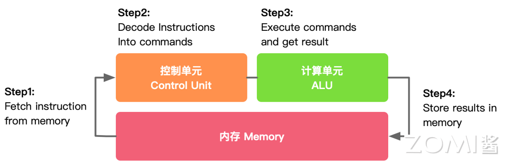

下图是 CPU 的一个简要架构图，从下往上是 DRAM（Dynamic Random Access Memory，动态随机存取存储器）以及 Cache 这些其实都可以当作是内存，然后有控制器，真正的执行单元就是 ALU，我们可以看到真正执行单元的 ALU 占的面积是非常的小的，图中假设有 4 个 ALU 或者计算盒，而在整体电路里面占了绝大部分面积的是内存还有控制器，而并非计算，所以说 CPU 是非常适合擅长处理逻辑控制，而并非计算。

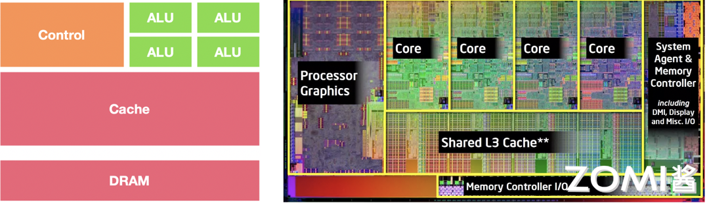

## CPU 约束与限制

ALU 模块（逻辑运算单元）是用来完成数据计算，其他各个模块的存在都是为了保证指令能够一条接一条的有序执行。这种通用性结构对于传统的编程计算模式非常适合，同时可以通过提升 CPU 主频(提升单位时间内执行指令的条数）来提升计算速度。 

但是，依照冯·诺依曼架构针对**指令的“顺序执行”的原则**，CPU 只能执行完一条指令再来下一条，计算能力进一步受限。当然了，我们会存在多核的情况，一次或可以执行多条指令，因为大原则受限于顺序执行，所以计算能力的提升是受到限制的。

# 2. CPU指令集架构

计算机指令是指挥机器工作的指示和命令，程序就是一系列指令按照顺序排列的集合，执行程序的过程就是计算机的工作过程。

## ISA 指令集架构

通常用来区分 CPU 的标准是**指令集架构（Instruction Set Architecture，ISA）**，简称 ISA。

### 什么是 ISA

ISA 是处理器支持的所有指令的语义，包括指令本身及其操作数的语义，以及与外围设备的接口。这组指令通常称为指令集（Instruction Set）

开发人员基于指令集架构（ISA），使用不同的处理器硬件实现方案，来设计不同性能的处理器

Intel 和 AMD CPU 使用 x86 指令集，IBM 处理器使用 PowerPC R 指令集，HP 处理器使用 PA-RISC 指令集，ARM 处理器使用 ARMR 指令集

现在从更宏观的视角来看看指令集架构，可以将指令集架构理解为一个抽象层，它是处理器底层硬件与运行在硬件上的软件之间桥梁和接口，如下层所示上面是软件部分，下面是硬件部分。

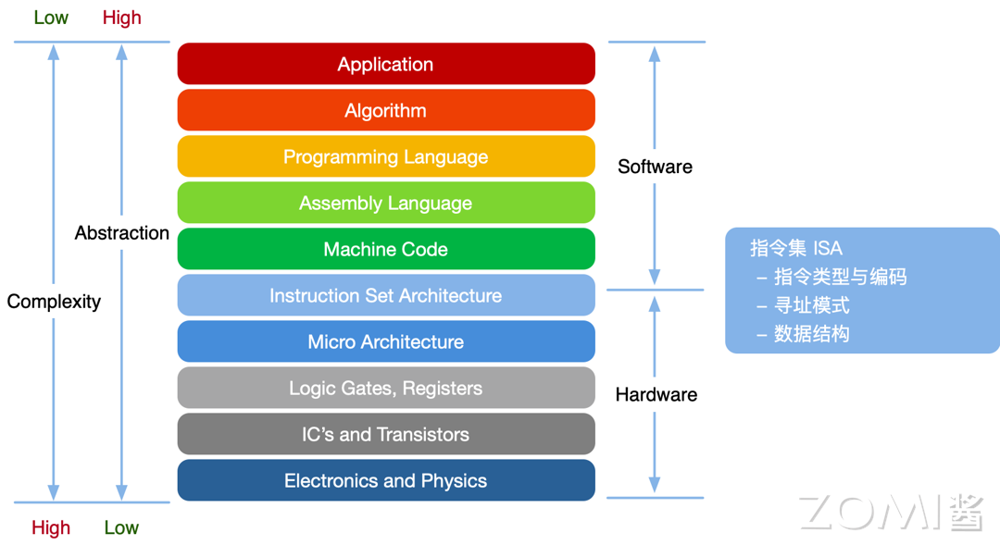

### 指令例子解析

如下图所示的是一条 addi 指令，那为什么是 addi 指令呢？决定这条指令功能的是前 6 位，也就是 op code，也可以理解为运算符，不同的 op code 对应了不同的操作，图中是以“加法”为例。

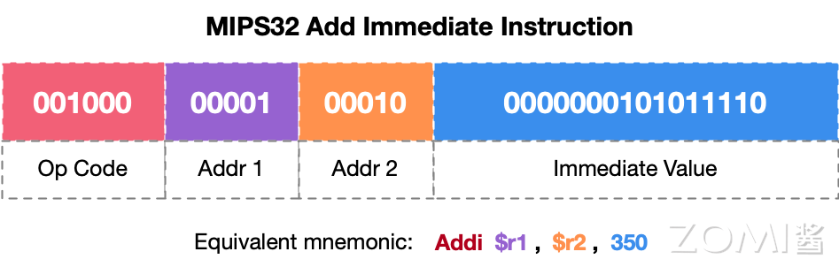

### ISA 基本分类

在计算机体系结构中，CPU 的运算指令、控制指令和数据移动指令是构成指令集的基本元素。

1. 运算指令：在 ALU 中执行的计算操作
2. 数据移动指令：读写存储操作（包括寄存器读写）
3. 控制指令：更改指令执行顺序，进行程序跳转，实现 if/else，循环等

### ISA 生命周期

ISA 的生命周期，生命周期所描述的是如何执行一条指令。主要分为如下所示的 6 个阶段

1. FETCH：在这个阶段，CPU 的取指单元根据程序计数器（PC）的值，从内存中读取指令。
2. DECODE：译码阶段是理解指令含义的关键步骤。
3. EVALUATE ADDRESS：对于访问内存的指令，如加载（Load）和存储（Store），在取数之前需要计算出内存地址。
4. FETCH OPERANDS：在取数阶段，CPU 从指定的源（寄存器、内存或立即数）获取操作数。
5. EXECUTE：执行阶段是指令周期的核心，所有的计算和逻辑操作都在此阶段完成。
6. STORE RESULT：执行完成后，结果需要被存储起来。如果操作涉及寄存器，结果将写回相应的寄存器。如果是存储指令，结果将通过内存总线写入内存。对于分支指令，执行阶段的结果可能会影响程序计数器的值，从而改变程序的执行流程。

这个周期是顺序执行指令的模型，但在现代处理器中，为了提高性能，会采用**流水线技术、乱序执行、分支预测**等技术来优化指令的执行。这些技术允许处理器在不违反数据依赖性的情况下，同时执行多条指令的不同阶段

## CISC vs RISC

按照指令系统复杂程度的不同，CPU 的 ISA 可分为 CISC 和 RISC 两大阵营。

- CISC 是指复杂指令系统计算机（Complex Instruction Set Computer）；
- RISC 是指精简指令系统计算机（Reduced Instruction Set Computer）

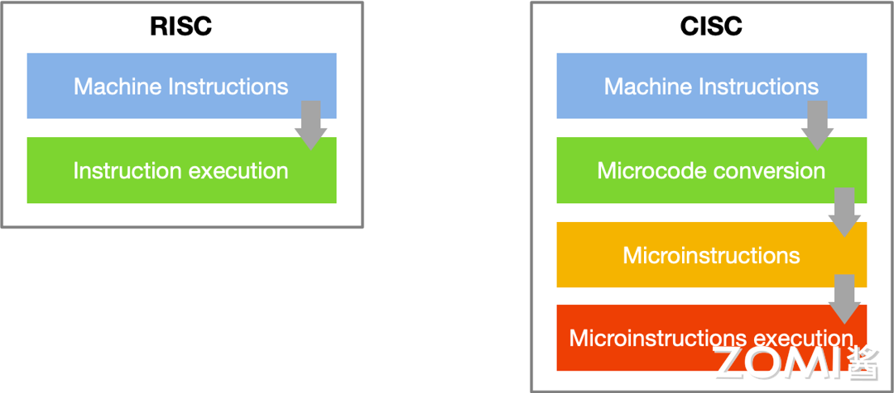

**CISC 和 RISC 并不是具体的指令集**，而是两种不同的指令体系，相当于指令集中的门派，**是指令的设计思想。**

### CISC 架构

CISC 的设计原则主要强调通过复杂的指令集和多样的寻址模式来简化编程，减少程序指令数量，从而提高编程效率和代码密度。利用微代码控制来实现复杂指令则是为了在简化硬件设计的同时，确保复杂指令的执行。

CISC 处理器的主要特点包括复杂的指令集、多样的寻址模式、不定长的指令、微代码控制以及复杂的解码逻辑。

优缺点：

- CISC 架构优点：在于编程简便、代码密度高以及向后兼容性强。由于每条指令可以执行多个操作，程序员可以用较少的指令完成更多的任务，从而简化了编程过程。复杂指令减少了程序中的指令数量，提高了代码密度，节省了内存空间。此外，注重向后兼容性的新处理器可以运行旧的软件和操作系统，保护了现有的软件投资。
- CISC 架构缺点：由于指令复杂且不定长，解码和执行过程相对较慢，影响了整体性能。复杂的指令集和解码逻辑增加了硬件设计的复杂性和成本。相较于 RISC 处理器，CISC 处理器的能效较低，难以在高性能和低功耗之间取得平衡。

### RISC 架构

RISC 架构的设计原则是通过**简化指令集和统一指令执行时间**来提高处理器效率。RISC 处理器仅支持少量的、固定长度的简单指令，每条指令通常只执行一个操作，这使得指令解码和执行过程更高效。

RISC 处理器的主要特点包括简化的指令集、固定长度指令、加载-存储架构、大量寄存器和硬件流水线。简化的指令集使得每条指令执行一个操作，从而简化了指令解码和执行过程。固定长度的指令（例如 32 位）简化了指令取指和解码过程，提高了处理效率。加载-存储架构将内存访问限制在特定的加载（load）和存储（store）指令上，其他指令只在寄存器之间操作，大大简化了指令集。大量的通用寄存器减少了内存访问次数，提高了数据处理速度。硬件流水线技术允许多个指令在不同阶段并行处理，提高了指令执行的吞吐量和处理器的整体性能。

优缺点：

- RISC 架构优点：包括指令执行速度快、硬件设计简单和高效的能量使用。由于每条指令执行一个操作且指令长度固定，指令解码和执行过程非常高效，允许处理器以更高的时钟速度运行。简化的指令集和固定长度的指令使得硬件设计更为简单，降低了设计复杂性和成本。由于指令执行效率高，RISC 处理器通常具有更高的能效，适用于需要低功耗和高性能的应用场景。
- RISC 架构缺点：**包括程序代码长度较长和对编译器优化的依赖**。由于每条指令执行的操作较少，实现同样功能的程序可能需要更多的指令，从而增加了程序代码的长度。RISC 架构依赖编译器生成高效的机器代码，这要求编译器具备较高的优化能力，以充分发挥处理器的性能。

### ISA 历史种类

常见的指令集架构简要介绍：

1. x86 架构：封闭架构，由英特尔和 AMD 牢牢掌握话语权，AMD 给 HG 授权 zen1 架构；VIA（台湾威盛）曾获得 x86 架构 Licence 授权，后来被 Z 芯收购；20 多年来没有第四家授权，其他芯片公司想用也用不了。
2. Arm 架构：开放架构，虽然由 Arm 公司所有，但授权开放，需要花钱购买。目前，华为和飞腾拥有 ARM v8 架构永久性授权；阿里平头哥、中兴等国内厂商购买了 ARM v9 架构 IP 授权。
3. MIPS 架构：开放架构，目前已开放了 MIPS 指令集的 R6 版本，以 Wave Computing 管理，但也难挽颓势，最后宣布终止开发，加入 RISC-V 基金会。LX 前期基于 MIPS 架构授权研发，后衍生出 LoongArch 自主架构。
4. Alpha 架构：开放架构，目前已经无实体主张该指令集的权利，但相关专利已被 HP、Intel 等瓜分。我国的申威前期基于 Alpha 架构，后衍生出 SW64 自主架构。
5. RISC-V 架构：开源架构，最特殊，不属于任何机构或国家，开源免费，想用就用，运营成本全靠基金会的兄弟们帮衬。由阿里平头哥主导，越来越多的创业公司加入 RISC-V 架构阵营。

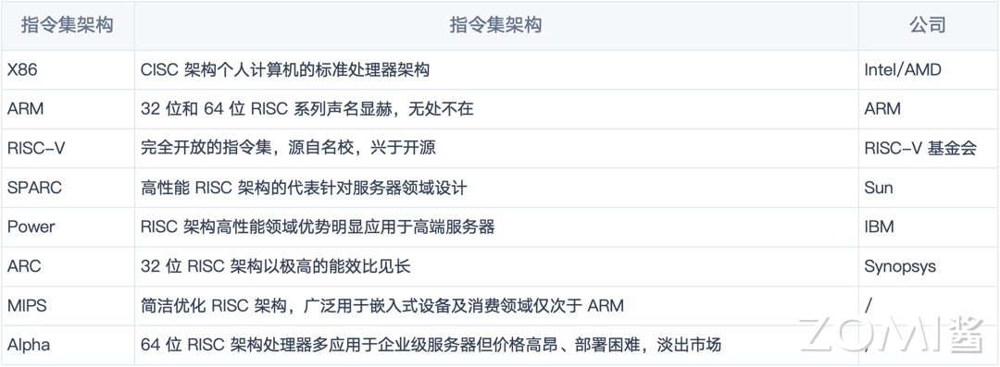

### 两者之间的异同

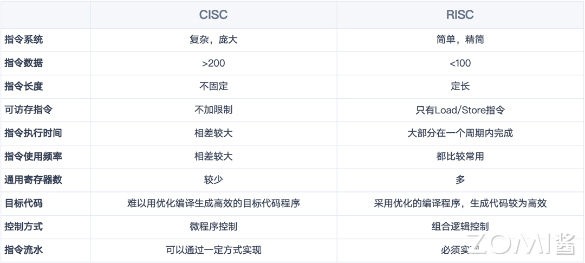

## CPU 并行处理架构

1966 年，MichealFlynn 根据指令和数据流的概念对计算机的体系结构进行了分类，这就是所谓的 Flynn 分类法。Flynn 将计算机划分为四种基本类型，如下所示：

1. 单指令流单数流（SISD）系统
2. 单指令流多数据流（SIMD）系统
3. 多指令流单数据流（MISD）系统
4. 多指令流多数据流（MIMD）系统

## CPU 应用场景

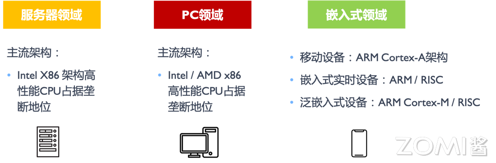

手机市场几乎完全由 ARM 架构主导，所有主流智能手机处理器（如 Apple A 系列、Qualcomm Snapdragon、Samsung Exynos 等）都基于 ARM 架构。在其他嵌入式领域，ARM（例如 Cortex-M 系列、Cortex-R 系列和 Cortex-A 系列）同样占据主导地位。ARM 处理器广泛用于物联网设备、智能家居、可穿戴设备、工业控制器、车载信息娱乐系统、仪表盘、智能家电、便携式医疗设备等。其低功耗、高集成度的特性使其在这些应用中非常受欢迎。

ARM 架构的主要优点在于低功耗和高集成度，适合电池供电的便携设备和需要高效能的应用。此外，ARM 处理器成本较低，适合大规模生产和应用。其缺点包括在某些高性能需求场景下性能较低，软件兼容性较弱。x86 架构的优点则是高性能和成熟的生态系统，适合复杂计算和数据处理。其缺点是高功耗和成本较高，在资源受限的嵌入式设备中不具竞争力。

# 3. CPU计算本质

## 从数据看 CPU 计算

### CPU 算力

算力(Computational Power)，即计算能力，是计算机系统或设备执行数值计算和处理任务的核心能力。

1. **数据读取与 CPU 计算关系**

   对于 CPU 来说，算力并不一定是最重要的。数据的加载和传输同样至关重要。

   如果内存每秒可以传输 200 GB 的数据（200 GBytes/sec），而计算单元每秒能够执行 2000 亿次双精度浮点运算（2000 GFLOPs），则需要考虑两者之间的平衡。

   根据**计算强度**的公式：
   $$
   \text{Required Compute Intensity}=\frac{\mathrm{FLOPs}}{\mathrm{Data~Rate}}=80
   $$
   这意味着，为了使加载数据的成本值得，每加载一次数据，需要执行 80 次计算操作。

2. **操作与数据加载的平衡点**

   为了平衡计算和数据加载，每从内存中加载一个数据，需要执行 80 次计算操作。**这种平衡点确保了计算单元和内存带宽都能得到充分利用**，避免了计算资源的浪费或内存带宽的瓶颈。

3. **CPU 算力计算公式**

   CPU 的算力通常用**每秒执行的浮点运算次数（FLOPS，Floating Point Operations Per Second）**来衡量

   CPU 的算力可以通过以下公式计算：

   

### 影响 CPU 算力因素

1. 核心数量：核心数量是衡量 CPU 并行处理能力的重要指标之一。
2. 时钟频率：时钟频率指的是 CPU 每秒钟可以执行的周期数，通常以 GHz（千兆赫兹）为单位。
3. 每个时钟周期的浮点运算次数：现代 CPU 架构采用超标量设计和向量化技术来增加每个时钟周期内可以执行的浮点运算次数。
4. 缓存和内存带宽：缓存和内存带宽是影响 CPU 数据访问速度的关键因素。
5. 指令集架构：指令集架构（ISA）是 CPU 如何执行指令的基础。

## 算力与敏感度

算力敏感度是指计算性能对不同参数变化的敏感程度。

### 算力敏感度关键要素

1. **操作强度（Operational Intensity）**：操作强度常用 ops/byte（操作次数/字节）表示，是指每字节数据进行的操作次数。操作强度越高，意味着处理器在处理数据时进行更多计算操作，而不是频繁访问内存。这种情况下，处理器需要的数据带宽相对较低，因为大部分时间花费在计算上，而非在数据传输上。反之，操作强度较低时，处理器的计算操作较少，大部分时间可能花费在内存数据的读取和写入上，这时对数据带宽的需求较高。
2. **处理元素（Processing Elements, PEs）**：处理元素是指计算系统中执行操作的基本单元。它们是计算的核心，负责实际的数据处理任务。在现代计算架构中，处理元素可以是一个独立的 CPU 核心、一个 GPU 流处理器，或是一个专用计算单元。
3. **带宽（Bandwidth）**：带宽是指系统在单位时间内可以处理的数据量，通常以 GB/s（千兆字节每秒）或 TB/s（太字节每秒）为单位来表示。带宽是计算系统中的一个关键指标，直接影响数据传输的效率。
4. **理论峰值性能（Theoretical Peak Performance）**：理论峰值性能是指系统在最佳条件下可以达到的最大性能，通常用于评估计算系统的潜在能力。它是通过考虑处理元素的数量、频率及其计算能力来计算的，通常以 FLOPS（每秒浮点运算次数）为单位表示。

### 算力敏感度重要性

- **识别性能瓶颈**：通过算力敏感度分析，可以识别系统在不同条件下的性能瓶颈，从而优化系统设计。
- **优化资源分配**：了解不同参数对性能的影响，可以更有效地分配计算资源，提高整体系统效率。
- **性能预测**：算力敏感度分析可以帮助预测系统在不同工作负载下的性能表现，指导系统设计和改进。

下图深入解析了计算系统性能与操作强度、处理元素数量以及带宽之间的复杂关系。

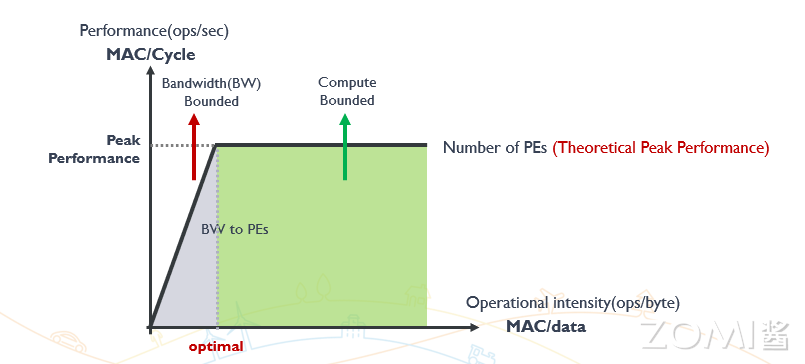

- 当操作强度较低时，系统性能主要受限于带宽，因为处理器需要频繁从内存中读取和写入数据，导致大量时间花费在数据传输上。
- 随着操作强度的增加，处理器可以更多地专注于计算操作而非数据传输，此时系统的性能逐渐转向受限于处理元素的计算能力。
- 在这两个极端之间，存在一个最佳性能区域。在这个区域内，操作强度与系统的资源利用达到了平衡，使得系统性能接近其理论峰值。

# 4. CPU计算时延

CPU 计算时延是指从指令发出到完成整个指令操作所需的时间。

## 内存、带宽与时延关系

**内存和带宽的关系**：内存的速度和系统带宽共同决定了数据在 CPU 和内存之间的传输效率。

**带宽和时延的关系**：高带宽通常能够减少数据传输所需的时间，因此可以间接降低时延。

**内存和时延的关系**：内存的速度和延迟直接影响 CPU 的访问时间。

## CPU 计算时延

### CPU 计算时延组成

- **指令提取时延（Instruction Fetch Time）**：指令提取时延是指从内存中读取指令到将其放入指令寄存器的时间。这个时延受内存速度和缓存命中率的影响。
- **指令解码时延（Instruction Decode Time）**：指令解码时延是指将从内存中读取的指令翻译成 CPU 能够理解的操作的时间。这个时延受指令集架构和解码逻辑复杂性影响。
- **执行时延（Execution Time）**：执行时延是指 CPU 实际执行指令所需的时间。这个时延取决于指令的类型和 CPU 的架构，指令类型中不同的指令需要不同的执行时间。
- **存储器访问时延（Memory Access Time）**： 存储器访问时延是指 CPU 访问主存储器或缓存所需的时间。这个时延受缓存层次结构（L1, L2, L3 缓存）和内存带宽的影响。
- **写回时延（Write-back Time）**：写回时延是指执行完指令后将结果写回寄存器或存储器的时间。这一过程也受缓存的影响。

### 影响计算时延因素

- **CPU 时钟频率（Clock Frequency）**
- **流水线技术（Pipelining）**
- **并行处理（Parallel Processing）**
- **缓存命中率（Cache Hit Rate）**
- **内存带宽（Memory Bandwidth）**

### 优化计算时延方法

优化 CPU 计算时延是一个复杂的过程，需要综合考虑指令提取、解码、执行、存储器访问和写回等多个方面的因素。

- **提高时钟频率**：在不超出散热和功耗限制的情况下，通过提高 CPU 的时钟频率可以直接减少计算时延。
- **优化流水线深度**：适当增加流水线深度，提高指令并行处理能力，但需要平衡流水线的复杂性和效率。
- **增加缓存容量**：增加 L1、L2、L3 缓存的容量和优化缓存管理策略，可以提高缓存命中率，减少存储器访问时延。
- **使用高效的并行算法**：开发和采用适合并行处理的算法，提高多核处理器的利用率，降低计算时延
- **提升内存子系统性能**：采用高速内存技术和更高带宽的内存接口，减少数据传输时延，提高整体系统性能。

### 时延产生

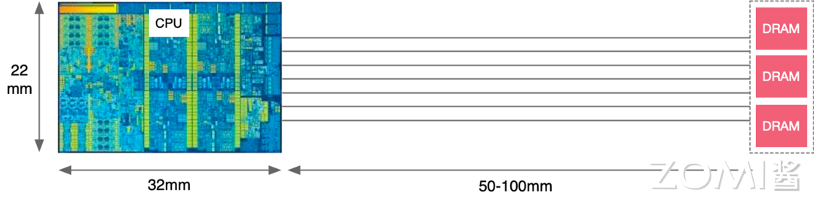

图中显示了 CPU 和 DRAM 之间存在一定的物理距离。在实际硬件中，数据需要在这个距离上通过内存总线进行传输。虽然电信号在这种短距离上的传播速度非常快（接近光速），但仍然会产生可测量的延迟。这个延迟是内存访问时延的一部分。

# 5. GPU基础

## GPU vs CPU

- **CPU 即中央处理单元（Central Processing Unit）**，负责处理操作系统和应用程序运行所需的各类计算任务，需要很强的通用性来处理各种不同的数据类型，同时逻辑判断又会引入大量的分支跳转和中断的处理，使得 CPU 的内部结构异常复杂。
- **GPU 即图形处理单元（Graphics Processing Unit）**，可以更高效地处理并行运行时复杂的数学运算，最初用于处理游戏和动画中的图形渲染任务，现在的用途已远超于此。两者具有相似的内部组件，包括核心、内存和控制单元。

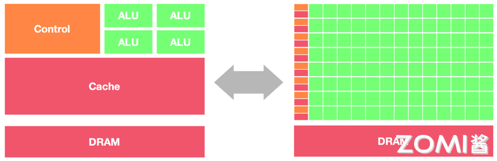

GPU 和 CPU 在架构方面的主要区别包括以下几点：

1. **并行处理能力**
2. **内存架构**：CPU 被缓存 Cache 占据了大量空间，大量缓存可以保存之后可能需要访问的数据，可以降低延时； GPU 缓存很少且为线程（Thread）服务，如果很多线程需要访问一个相同的数据，缓存会合并这些访问之后再去访问 DRAM，获取数据之后由 Cache 分发到数据对应的线程。GPU 更多的寄存器可以支持大量 Thread。
3. **指令集**：CPU 的指令集更加通用，适合执行各种类型的任务； GPU 的指令集主要用于图形处理和通用计算，如 CUDA 和 OpenCL。
4. **功耗和散热**：CPU 的功耗相对较低，散热要求也相对较低；由于 GPU 的高度并行特性，其功耗通常较高，需要更好的散热系统来保持稳定运行。

因此，CPU 更适合处理顺序执行的任务，如操作系统、数据分析等；而 GPU 适合处理需要计算密集型 (Compute-intensive) 程序和大规模并行计算的任务，如图形处理、深度学习等。

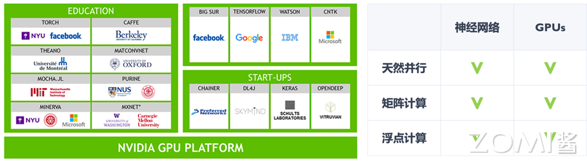

# 6. NPU基础

近年来，随着 AI 技术的飞速发展，**AI 专用处理器**如 **NPU（Neural Processing Unit）**和 **TPU（Tensor Processing Unit）**也应运而生。

## 什么是 AI 芯片

AI 芯片是专门为加速 AI 应用中的大量针对矩阵计算任务而设计的处理器或计算模块。AI 芯片采用针对特定领域优化的体系结构（Domain-Specific Architecture，DSA），侧重于提升执行 AI 算法所需的专用计算性能。

AI 芯片作为一种专用加速器，通过在硬件层面优化深度学习算法所需的矩阵乘法、卷积等关键运算，可以显著加速 AI 应用的执行速度，降低功耗。

他们的架构区别如下图

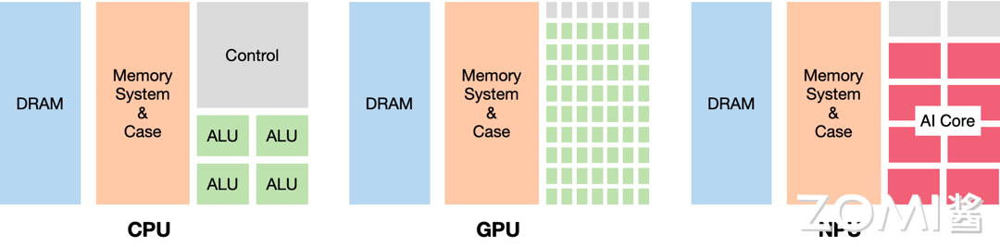

- CPU 最为均衡，可以处理多种类型的任务，各种组件比例适中；
- GPU 则减少了控制逻辑的存在但大量增加了 ALU 计算单元，提供给我们以高计算并行度；
- 而 NPU 则是拥有大量 AI Core，这可以让我们高效完成针对性的 AI 计算任务。

## AI 芯片任务和部署

AI 芯片的任务和部署极为复杂，但其功能最终可以归结为两种主要形态：训练和推理。

### 训练芯片

在训练阶段，AI 芯片需要支持大规模的数据处理和复杂的模型训练。这需要芯片具有强大的并行计算能力、高带宽的存储器访问以及灵活的数据传输能力。

算力、存储、传输、功耗、散热、精度、灵活性、可扩展性、成本，九大要素构筑起训练阶段 AI 芯片的“金字塔”

### 推理芯片

在推理阶段，AI 芯片需要在功耗、成本和实时性等方面进行优化，以满足不同应用场景的需求。**云端推理**通常对性能和吞吐量要求较高，因此需要使用高性能的 AI 芯片，如 GPU、FPGA 等。相比之下，**边缘和端侧推理**对功耗和成本更加敏感，因此需要使用低功耗、低成本的 AI 芯片，如专门为移动和嵌入式设备设计的 NPU、TPU 等。

## AI 芯片技术路线

作为加速应用的 AI 芯片，主要的技术路线有三种：GPU、FPGA、ASIC。它们三者间的区别如下图：

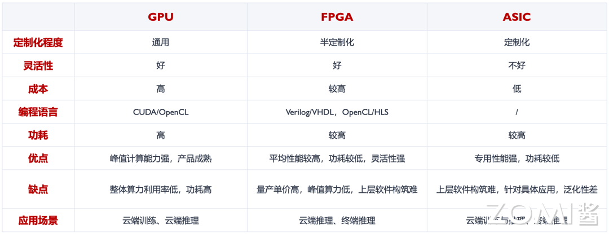

## AI 芯片应用场景

1. AI 计算中心

2. 自动驾驶和安防应用

   在自动驾驶领域，AI 芯片可以用于处理车载传感器采集的大量数据，实现对道路环境的实时感知和决策。

   在安防领域，AI 芯片可以用于智能视频分析、人脸识别、行为分析等任务，提高安防系统的智能化水平。

3. IOT 应用

   IoT 设备是 AI 芯片的另一个重要应用场景。随着 AI 技术的发展，越来越多的 IoT 设备开始搭载 AI 芯片，实现本地智能处理和决策。

   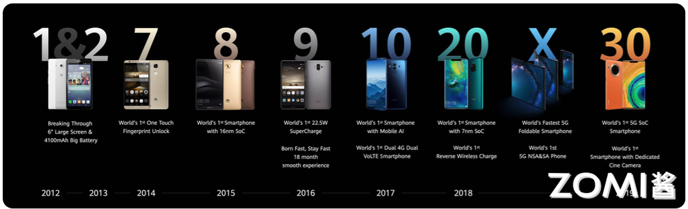

   IoT 设备种类繁多，对 AI 芯片的需求也各不相同。例如，智能音箱对语音识别和自然语言处理的要求较高，而智能摄像头则对图像处理和目标检测的要求较高。

