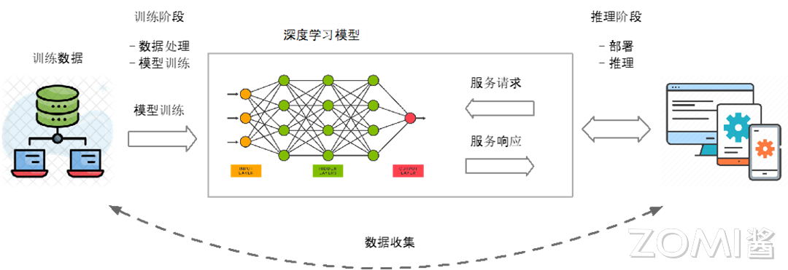
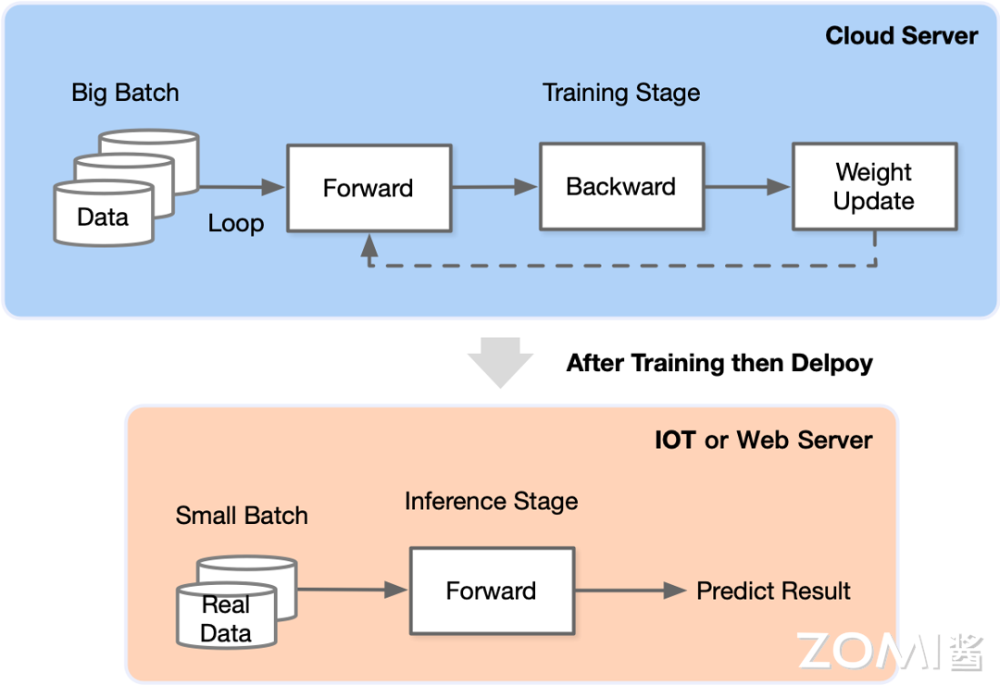
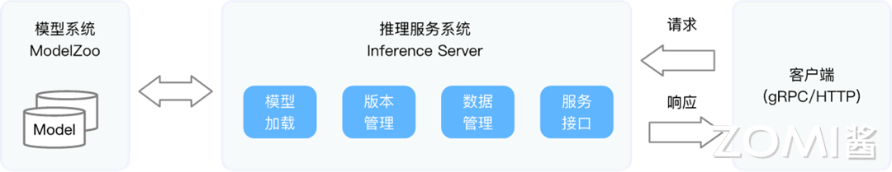
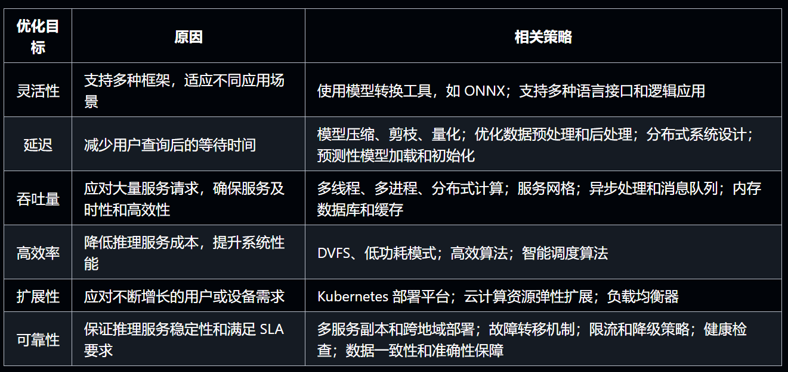
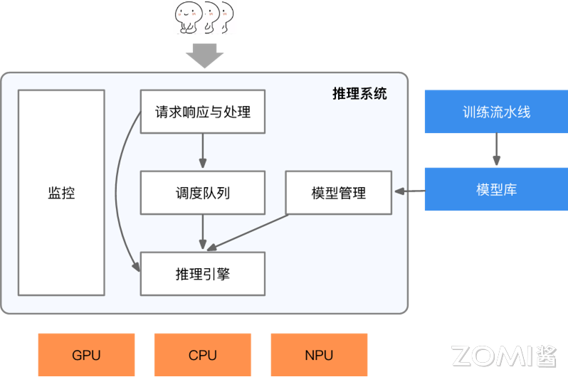

# 四(AI推理系统)-1.推理系统介绍

# 1. 内容介绍

## 推理系统介绍

推理，简单来说，就是在利用大量数据训练好模型的结构和参数后，使用小批量数据进行一次前向传播，从而得到模型输出的过程。

推理的最终目标，便是将训练好的模型部署到实际的生产环境中，使 AI 真正运行起来，服务于日常生活。


**推理系统**，是一个专门用于部署神经网络模型，执行推理预测任务的 AI 系统。专注于 AI 模型的部署与运行。推理系统会加载模型到内存，并进行版本管理，确保新版本能够顺利上线，旧版本能够安全回滚。此外，它还会对输入数据进行批量尺寸（Batch Size）的动态优化，以提高处理效率。


**推理引擎**，则是推理系统中的重要组成部分，它主要负责 **AI 模型的加载与执行**。推理引擎可分为**调度**与**执行**两层，聚焦于 **Runtime 执行部分**和 **Kernel 算子内核层**，为不同的硬件提供更加高效、快捷的执行引擎。它可以看作是一个基础软件，提供了一组 API，使得开发者能够在特定的加速器平台（如 CPU、GPU 和 TPU）上轻松地进行推理任务。目前市场上已有多种推理引擎，如字节跳动的 LightSeq、Meta AI 的 AITemplate、英伟达的 TensorRT，以及华为的 MindSpore Lite 和腾讯的 NCNN 等。


### 模型小型化

由于**端侧设备资源有限**，执行轻量的模型结构能够确保高效且稳定的推理性能。模型小型化的核心思想在于**设计出更为高效的网络计算方式**，从而在减少模型参数量的同时，保持网络精度，并进一步提升模型的执行效率。


### 离线优化压缩

推理系统作为类似于传统 Web 服务的存在，需要高效响应用户请求并维持高标准的服务等级协议，如响应时间低于 100ms 等。为了实现这一目标，离线优化压缩在端侧推理引擎中发挥着至关重要的作用。与轻量化网络模型设计不同，离线优化压缩主要通过对轻量化或非轻量化模型应用剪枝、蒸馏、量化等压缩算法和手段，使模型体积更小、更轻便，从而提高执行效率。


### 在线部署和优化

推理引擎的在线部署和优化是确保 AI 模型能够在实际应用中高效运行的关键环节。在模型部署的过程中，推理引擎需要应对多种挑战，包括适配多样的 AI 框架、处理不同部署硬件的兼容性问题，以及实现持续集成和持续部署的模型上线发布等软件工程问题。为了应对这些挑战，推理引擎的在线部署和优化显得尤为重要。


## 推理应用

### 人脸 Landmark

如图所示，这款应用在移动终端上实现了精准的人脸 landmark 识别功能。它通过先进的算法技术，能够迅速捕捉并准确识别拍摄者脸部的轮廓、五官位置等关键面部信息。这些信息被实时处理并以一种直观且易于理解的方式显示出来，使用户能够清晰地看到自己脸部的各个特征点。


### 人脸检测与手势识别

左图是使用华为 HMS Core 实现人脸检测，具体来说是使用人脸检测来获取人脸的位置，然后利用这个坐标来控制游戏中的飞船进行移动。而右图是华为 HMS Core 实现手势检测，与左图类似，右图是将左图的面部坐标换成了手的坐标进行飞船的移动，并配合手势去做相应的动作。


### 人工客服应用

推理引擎或推理系统在人工客服和 AI 对话方面有广泛的应用。

- 智能客服：推理引擎可以用于实现智能客服系统，能够理解用户的问题并提供准确的答案。通过对大量的语料库和知识库进行训练，推理引擎可以学习到不同的问题模式和解决方案，从而能够快速准确地回答用户的问题。
- 对话管理
- 情感分析
- 知识图谱：结合知识图谱，推理引擎可以利用实体和关系的信息来进行更深入的推理和回答。它可以根据用户的问题，从知识图谱中检索相关的信息，并以更自然和准确的方式呈现给用户。
- 多轮对话
- 实时响应：推理引擎需要具备快速的推理能力，以实现实时响应。它可以在短时间内处理用户的输入，并给出及时的回答，提高用户体验和满意度。


如图所示，在这个示例中，智能客服系统通过推理引擎理解用户的问题，并根据订单号查询相关的订单信息，然后给出准确的回答。推理引擎的应用使得智能客服能够快速、准确地回答用户的问题，提供高效的服务。


## 推理系统思考点

在实际维护推理系统的过程中，需要全面考虑并解决以下问题：

- 如何设计并生成用户友好、易于调用的 API 接口，以便用户能够便捷地与推理系统进行交互
- 关于数据的生成，需要明确数据的来源、生成方式以及质量保障措施，确保推理系统能够依赖准确、可靠的数据进行运算。
- 在网络环境的影响下，如何实现低延迟的用户反馈是一个关键挑战。需要优化网络传输机制，减少数据传输的延迟，确保用户能够及时获得推理结果。
- 当用户访问量增大时，如何确保服务的稳定性和流畅性是一个必须面对的问题。需要设计合理的负载均衡策略，优化系统架构，提高系统的并发处理能力。此外，为了应对潜在的风险和故障，需要制定冗灾措施和扩容方案，确保在突发情况下推理系统能够稳定运行。
- 随着技术的不断发展，未来可能会有新的网络模型上线。需要考虑如何平滑地集成这些新模型，并制定 AB 测试策略，以评估新模型的性能和效果。

总之，维护推理系统需要综合考虑多个方面的问题，从 API 接口设计、数据生成、网络延迟优化、硬件加速资源利用、服务稳定性保障、冗灾与扩容措施，到新模型上线与测试等方面，都需要进行深入研究与精心规划。


# 2. 什么是推理系统

推理系统是一个专门用于部署神经网络模型，执行推理预测任务的 AI 系统。


## AI 生命周期

应用神经网络模型的应用，其神经网络模型可以部署在数据中心，接受用户的应用程序或者网页服务的请求，也可以部署在边缘侧移动端的 APP 上或者 IoT（Internet of Things, 物联网）设备中实时响应请求。



如上图所示，神经网络模型的生命周期（Life Cycle）最核心的主要由数据准备、模型训练推理以及模型部署三个阶段组成。


### 数据准备

在数据的准备阶段之后，就进入了模型的训练阶段。对于模型的训练阶段如下图的蓝色部分所示，在这个阶段会在云服务器上进行。

- 模型的训练可以采用传统的**中心化训练**方式，将所有的数据都集中存储在一个中心服务器上，模型在这个中心服务器上进行训练。
- 将数据分散存储在不同的地方，同时通过**联合学习**的方式进行模型训练的去中心化分布式训练。


### 训练与推理

在数据的准备阶段之后，就进入了模型的训练阶段。对于模型的训练阶段如下图的蓝色部分所示，在这个阶段会在云服务器上进行。将准备好的数据通过特定的批量大小进行分组，并以迭代的方式向模型进行模型的训练。

在训练停止之后，整个模型的权重和偏置等参数已经被确定下来，也即得到一个固定化的网络模型，可以将其用于后续的数据预测或推理任务。



在完成了训练阶段后，就可以得到固定网络模型参数的权重参数，并通过离线和在线优化（例如压缩、量化等），内核编译（例如内核调优与代码生成）等技术将该模型加载部署在推理系统中。

对于模型的推理阶段如上图的红色部分所示，可以将整个的模型部署在 Web 服务器上或者是 IoT 设备上，通过对外暴露接口（例如，Http 或 gRPC 等），接收用户请求或系统调用，模型通过推理处理完请求后，返回给用户相应的响应结果，完成推理任务。

虽然推理（Inference）阶段与深度学习中的测试（Testing）阶段都通过将输入数据送入模型中，经过前向传播得到输出预测结果。但是，推理通常指的是在训练完成后，将模型应用于新的数据集或实际场景中，并生成预测输出，推理的目的是利用训练好的模型来对未知数据进行预测或分类。

因为推理过程通常是在生产环境中执行的，因此性能和效率至关重要。因此，需要优化模型的计算速度和内存占用，以便实时或高吞吐量地处理输入数据。而测试则是评估模型性能的过程，通常包括在一组已知的测试数据上运行训练好的模型，并评估其在测试数据上的表现，以了解模型的准确性、精确度、召回率等性能指标。测试的目的是验证模型是否能够在真实场景下有效地工作，检查模型在未知数据上的泛化能力。


### 模型部署

推理系统一般可以部署在云或者边缘。

- **云（Cloud）端**：云端有更大的算力，内存，且电更加充足满足模型的功耗需求，同时与训练平台连接更加紧密，更容易使用最新版本模型，同时安全和隐私更容易保证。
- **边缘（Edge）端：**边缘侧设备资源更紧张（例如，手机和 IOT 设备），且功耗受电池约束，需要更加在意资源的使用和执行的效率。用户的响应只需要在自身设备完成，且不需消耗服务提供商的资源。


**Deploy**

- 通过剪枝（减少不必要的参数和连接）、量化（减少数值精度以减小模型大小和计算量）以及蒸馏（利用更小的模型传递主模型的知识）等技术对模型进行优化和压缩，用于提高部署阶段的效率和性能。
- 根据具体需求和平台限制，选择适合的推理引擎。常用的推理引擎如 TensorRT、OpenVINO、ONNX Runtime 等针对不同硬件设备进行优化，提供高效的模型推理能力。有时需要将模型从训练框架转换为推理引擎支持的格式。
- 在部署中可能涉及创建 API 接口、配置服务器、设置数据传输和存储等。
- 在部署后，持续监控模型的性能，并根据需要进行优化。这可能包括调整模型参数、更新推理引擎版本、优化硬件资源分配等。


## 推理场景的重点

在深度学习中，推理任务相较于训练任务确实具有一系列独特的新特点与挑战。具体来说，这些特点和挑战包括：

1. 长期运行服务需求

   神经网络模型在推理阶段通常被部署为长期运行的服务。这类服务对请求的响应有严格的低延迟（Low Latency）和高吞吐（High Throughput）要求。

2. 推理资源约束更为苛刻

   与训练阶段相比，推理阶段通常面临更为严格的资源约束，如更小的内存、更低的功耗等。

3. 不需要反向传播和梯度下降

   在推理阶段，模型不再需要反向传播和梯度下降来进行参数更新。因此，为了提升推理速度和效率，可以采取一些牺牲数据精度的策略，如量化、稀疏性等。这些策略可以在一定程度上换取推理性能的提升。

4. 部署设备型号多样性

   由于神经网络模型需要在各种设备上进行推理，但是这些设备的型号和配置可能各不相同，为了在各种设备上实现高效的推理，因此需要进行多样化的定制和优化。例如，在服务器端，可以通过 Docker 等容器化技术解决环境问题；而在移动端和 IoT 设备端，由于平台、操作系统、芯片和上层软件栈的多样性，需要更为复杂的工具和系统来支持编译和适配。


对于推理阶段，性能目标与训练阶段有所不同。为了最大限度地减少网络的端到端响应时间（End to End Response Time），推理通常比训练批量输入更少的输入样本，也就是更小的批量大小，因为依赖推理工作的服务（例如，基于云的图像处理管道）需要尽可能的更快响应，因此用户不需要让系统累积样本形成更大的批量大小，从而避免了等待几秒钟的响应时间。在推理阶段，低延迟是更为关键的性能指标，而高吞吐量虽然在训练期间是重要的，但在推理时则相对次要。

接下来，可以通过以下使用 Pytorch 实现的 ResNet50 模型在 TensorRT 的推理过程实例来了解模型推理的常见步骤。

```python
import torch
import torchvision.models as models
import tensorrt as trt
import numpy as np
import pycuda.driver as cuda
import pycuda.autoinit

# 步骤 1：加载 PyTorch 模型并转换为 ONNX 格式
model = models.resnet50(pretrained=True) # 加载预训练的 ResNet50 模型
model.eval()
dummy_input = torch.randn(1, 3, 224, 224) # 创建一个示例输入
torch.onnx.export(model, dummy_input, "resnet50.onnx", opset_version=11) # 将模型导出为 ONNX 格式

# 步骤 2：使用 TensorRT 将 ONNX 模型转换为 TensorRT 引擎
TRT_LOGGER = trt.Logger(trt.Logger.WARNING) # 创建一个 Logger
EXPLICIT_BATCH = 1 << int(trt.NetworkDefinitionCreationFlag.EXPLICIT_BATCH) # 如果是动态输入，需要显式指定 EXPLICIT_BATCH
with trt.Builder(TRT_LOGGER) as builder, builder.create_network(EXPLICIT_BATCH) as network, trt.OnnxParser(network, TRT_LOGGER) as parser:
    # 创建一个 Builder 和 Network
    # builder 创建计算图 INetworkDefinition
    builder.max_workspace_size = 1 << 30  # 1GB ICudaEngine 执行时 GPU 最大需要的空间
    builder.max_batch_size = 1 # 执行时最大可以使用的 batchsize

    with open("resnet50.onnx", "rb") as model_file:
        parser.parse(model_file.read())  # 解析 ONNX 文件

    engine = builder.build_cuda_engine(network)  # 构建 TensorRT 引擎

    with open("resnet50.trt", "wb") as f:
        # 将引擎保存到文件
        f.write(engine.serialize())

# 步骤 3：使用 TensorRT 引擎进行推理
def load_engine(engine_file_path):
    # 加载 TensorRT 引擎
    with open(engine_file_path, "rb") as f, trt.Runtime(TRT_LOGGER) as runtime:
        return runtime.deserialize_cuda_engine(f.read())

engine = load_engine("resnet50.trt")
context = engine.create_execution_context() # 将引擎应用到不同的 GPU 上配置执行环境

# 准备输入和输出缓冲区
input_shape = (1, 3, 224, 224)
output_shape = (1, 1000)
input_size = trt.volume(input_shape) * trt.float32.itemsize
output_size = trt.volume(output_shape) * trt.float32.itemsize
d_input = cuda.mem_alloc(input_size)
d_output = cuda.mem_alloc(output_size)
stream = cuda.Stream() # 创建流
input_data = np.random.random(input_shape).astype(np.float32)# 创建输入数据
cuda.memcpy_htod_async(d_input, input_data, stream) # 复制输入数据到 GPU

# 推理
context.execute_async_v2(bindings=[int(d_input), int(d_output)], stream_handle=stream.handle)
# 从 GPU 复制输出数据
output_data = np.empty(output_shape, dtype=np.float32)
cuda.memcpy_dtoh_async(output_data, d_output, stream) # 获取推理结果，并将结果拷贝到主存
stream.synchronize() # 同步流
print("Predicted output:", output_data)
```

当模型被部署之后，可以通过以下图示来观察常见推理系统的模块、与推理系统交互的系统以及推理任务的流水线。




## 优化目标和约束


根据上图示的 AI 框架、推理系统与硬件之间的关系，可以看到，除了应对应用场景的多样化需求，推理系统还需克服由不同训练框架和推理硬件所带来的部署环境多样性挑战，这些挑战不仅增加了部署优化和维护的难度，而且易于出错。

在框架方面，各种框架通常是为训练而设计和优化的，因此需要考虑诸如批量大小、批处理作业对延迟的不敏感性、分布式训练的支持以及更高数据精度的需求等因素。

在硬件方面，需要支持多种部署硬件，考虑到移动端部署场景和相关约束的多样性（例如自动驾驶、智能家居等），这带来了各种空间限制和功耗约束。与此同时，大量专有场景的芯片厂也催生了多样化的芯片体系结构和软件栈。


### 优化目标

推理系统的主要优化目标




### 设计约束

资源约束是推理系统必须面对的现实问题。设备端功耗约束尤为显著，特别是在物联网（IoT）设备中，如手机、汽车等，由于通常采用电池供电，电池电量有限，无法承受计算量过大导致的过高能耗。


## 推理系统 vs 推理引擎

### 推理系统

通过下图可以看到推理系统的全貌：



推理系统在处理请求与响应时，首要任务是高效地序列化和反序列化数据，确保后端能够迅速执行并满足严格的响应延迟标准。推理系统经常需要处理图像、文本、音频等非结构化数据，这些数据的单请求或响应量通常更大。因此，推理系统需要采用高效的传输、序列化、压缩与解压缩机制，以确保数据传输的效率和性能，进而实现低延迟、高吞吐的服务。

在请求调度方面，系统可以根据后端资源的实时利用率，动态调整批处理大小、模型资源分配，从而提高资源利用率和吞吐量。


推理引擎是系统的核心组件，它负责将请求映射到相应的模型作为输入，并在运行时调度神经网络模型的内核进行多阶段处理。当系统部署在异构硬件或多样化的环境中时，推理引擎还可以利用编译器进行代码生成与内核算子优化，使模型能够自动转换为特定平台的高效可执行机器码，进一步提升推理性能。


在边缘端等场景中，推理系统还需要面对更多样化的硬件、驱动和开发库。为了确保模型能够在这些设备上高效运行，需要通过编译器进行代码生成和性能优化，使模型能够跨设备高效执行。


# 3. 推理流程全景


# 4. 推理系统架构


# 5. 推理引擎架构


