# CUDA编程

# 1.1 CUDA介绍

## GPU硬件平台

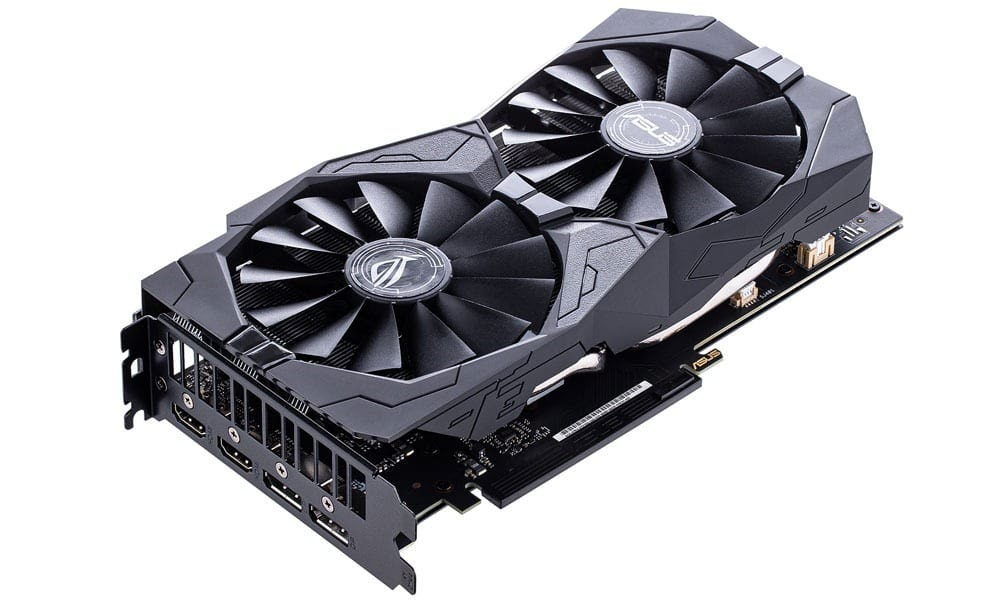

- GPU 意为图形处理器。GPU也常被称为显卡。与它对应的一个概念是CPU。
- GPU: 数据运算
- CPU: 逻辑运算


**GPU性能指标:**

1. 核心数
2. GPU显存容量
3. GPU计算峰值
4. 显存带宽


## CPU+GPU异构架构

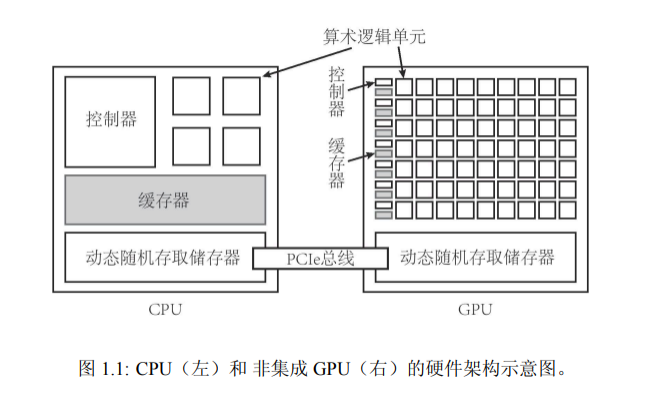

- GPU不能单独计算，CPU+GPU组成异构计算架构;
- CPU起到控制作用，一般称为主机(Host);
- GPU可以看作CPU的协处理器，一般称为设备(Device);
- 主机和设备之间内存访问一般通过PCle总线链接。


## CUDA

- 2006年，NVIDIA公司发布CUDA;
- CUDA建立在NVIDIA的GPU上的一个通用并行计算平台和编程模型;
- 基于GPU的并行训练已经是目前大火的深度学的标配


### CUDA编程语言

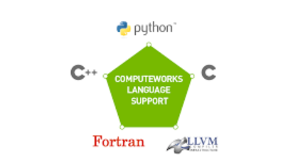

- CUDA旨在支持各种语言和应用程序编程接口
- 最初基于C语言，目前越来越多支持C++，CUDA还支持Python编写


### CUDA运行时API

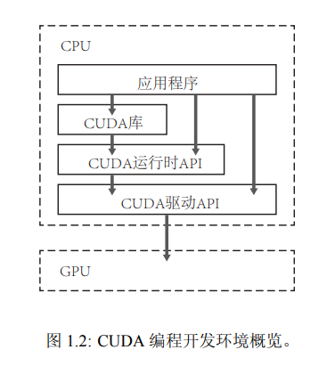

- CUDA 提供两层API接口CUDA驱动(driver)AP和CUDA运行时(runtime)API
- 两种API调用性能几乎无差异，课程使用操作对用户更加友好Runtime APl


# 1.2 CUDA安装、

## 操作系统

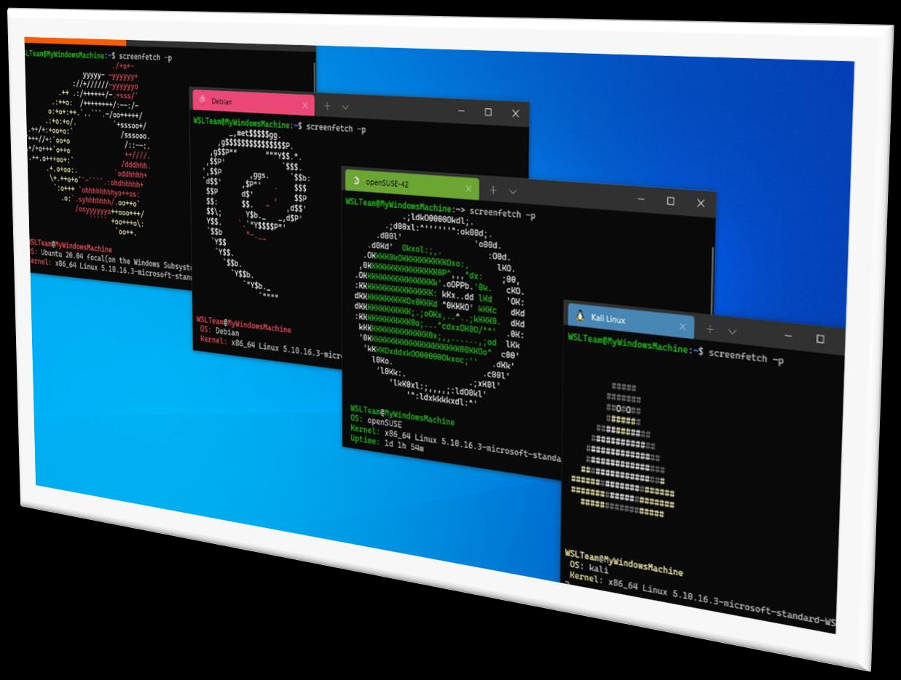

- WSL是Windows系统的Linux子系统，
- 相比较虚拟机会消耗更少的资源，并且与系统锲合度更高，
- 依赖系统，所以也会受到一些限制，与真正的linux还是有一定差别

下载及安装cuda，详见CUDA官网


## 测试

`test.cu`

```c
#include <stdio.h>

// CUDA 核函数：每个线程打印 "Hello World"
__global__ void sayHello() {
    int threadId = blockIdx.x * blockDim.x + threadIdx.x;
    printf("Hello World from thread %d\n", threadId);
}

int main() {
    // 设置线程块和网格大小
    int threadsPerBlock = 4;  // 每个块 4 个线程
    int blocksPerGrid = 2;    // 共 2 个块

    // 启动 CUDA 核函数
    sayHello<<<blocksPerGrid, threadsPerBlock>>>();

    // 同步设备，确保所有线程完成
    cudaDeviceSynchronize();

    printf("CUDA execution completed!\n");
    return 0;
}
```

编译并测试

```bash
nvcc test.cu -o test

./test
```

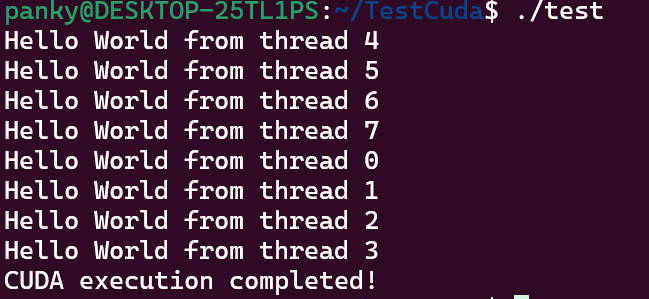


# 1.3 nvidia-smil具

## nvidia-smi指令

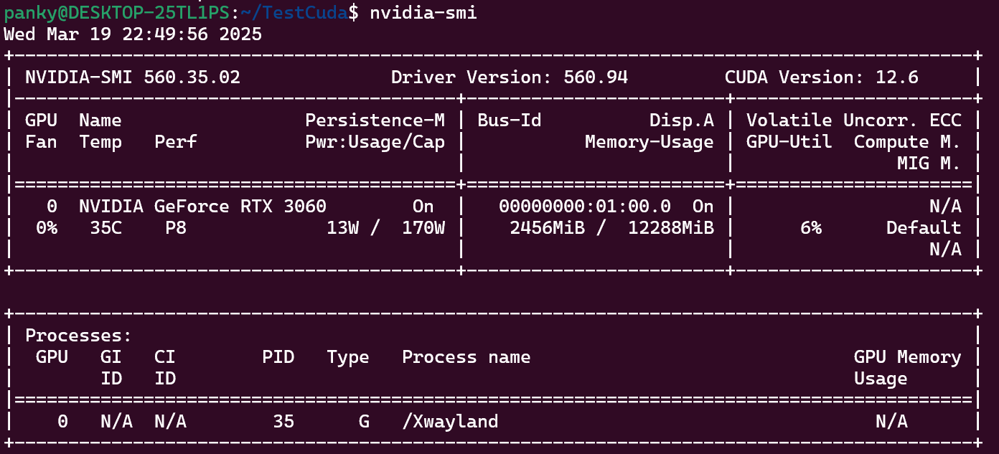

1. NVIDIA-SMI 版本号
2. Driver Version: 驱动版本号
3. CUDA Version: CUDA版本号
4. GPU型号及序号
5. 风扇
6. 温度
7. Perf性能状态
8. Persistence-M: 持续模式状态
9. Pwr:Usage/Cap: 表示显卡功率
10. Bus-ld: 总线
11. Disp.A: Display Active,表示GPU是否初始化
12. Memory-Usage: 显存使用率
13. Volatile GPU-UTil: GPU使用率
14. ECC: 是否开启错误检查和纠错技术0/DISABLED，1/ENABLED
15. Compute M: 计算模式


```bash
# 查询GPU详细信息 
nvidia-smi -9

# 查询特定GPU详细信息
nvidia-smi-q-l0

# 显示GPU特定信息 
nvidia-smi-g-l0-d MEMORY

# 帮助命令 
nvidia-smi -h
```


# 2.1 从C++编程到CUDA编程

## C++中的Hello World

1. 文本编辑器编写源代码，如vscode，可以使用任何文本编辑器，如vim等。
2. 编译器对源码进行预处理、编译、链接等操作生成可执行文件，c++中使用G++。
3. 运行可执行文件


## 编译C++程序


- Ubuntu下载g++: `sudo apt-get install g++`
- 编译: `g++ hello.cpp -o hello`


## CUDA中的Hello World程序

**nvcc:**

1. 安装CUDA即可使用nvcc
2. nvcc支持纯C++代码的编译
3. 编译扩展名为.cu的CUDA文件

编译CUDA文件指令: `nvcc hello.cu -o hello`


# 2.2 CUDA核函数

## 核函数(Kernel function)

1. 核函数在GPU上进行并行执行

2. 注意:

   1. 限定词`__global__`修饰
   2. 返回值必须是`void`

3. 形式:

   1. ```c++
      __global__ void kernel_function(argument arg) 
      {
          printf("Hello World from the GPU!\n")
      }
      ```

   2. ```c++
      void __global__ kernel_function(argument arg) 
      {
          printf("Hello World from the GPU!\n")
      }
      ```


**注意事项:**

1. 核函数只能访问GPU内存
2. 核函数不能使用变长参数
3. 核函数不能使用静态变量
4. 核函数不能使用函数指针
5. **核函数具有异步性**


## CUDA程序编写流程

CUDA程序编写流程:

```c++
int main(void) 
{
    主机代码;
    核函数调用;
    主机代码;
    return 0;
}
```

注意: 核函数不支持C++的iostream


示例：`hello.cuda`

```c++
#include <stdio.h>

// CUDA 核函数
__global__ void sayHello() {
    int threadId = blockIdx.x * blockDim.x + threadIdx.x;
    printf("Hello World from thread %d\n", threadId);
}

// 检查 CUDA 错误
void checkCudaError(cudaError_t err, const char *msg) {
    if (err != cudaSuccess) {
        printf("%s: %s\n", msg, cudaGetErrorString(err));
        exit(EXIT_FAILURE);
    }
}

int main() {
    int threadsPerBlock = 4;
    int blocksPerGrid = 2;

    // 启动核函数
    sayHello<<<blocksPerGrid, threadsPerBlock>>>();
    checkCudaError(cudaGetLastError(), "Kernel launch failed");

    // 同步设备
    checkCudaError(cudaDeviceSynchronize(), "Device synchronization failed");

    printf("CUDA execution completed!\n");
    return 0;
}
```


# 2.3 CUDA线程模型

## 线程模型结构

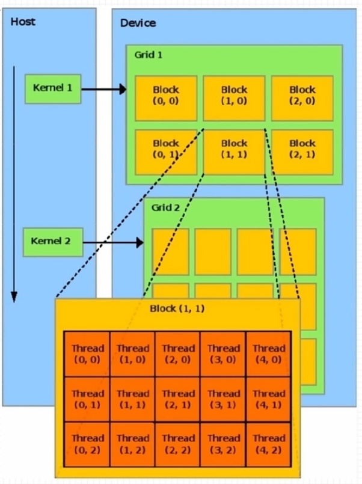

1. 线程模型重要概念:
   1. grid	网格
   2. block   线程块
2. 线程分块是逻辑上的划分，物理上线程不分块
3. 配置线程: `<<<grid size, block_size>>>`
4. 最大允许线程块大小: 1024;  最大允许网格大小:`2**31 - 1`(针对一维网格)


## 一维线程模型

1. 每个线程在核函数中都有一个唯一的身份标识;
2. 每个线程的唯一标识由这两个`<<<grid_size，block_size>>>`确定;  `grid_size，block_size`保存在**内建变量(build-in variable)**, 目前考虑的是一维的情况:
   1. `gridDim.x`: 该变量的数值等于执行配置中变量`grid_size`的值;
   2. `blockDim.x`: 该变量的数值等于执行配置中变量`block_size`的值。
3. **线程索引**保存成内建变量 ( build-in variable)：
   1. `blockIdx.x`: 该变量指定一个线程在一个网格中的线程块索引值，范围为`0~ gridDim.x-1`;
   2. `threadIdx.x`: 该变量指定一个线程在一个线程块中的线程索引值，范围为`0~blockDim.x-1`。

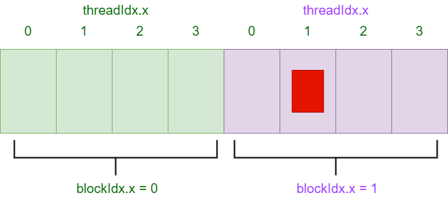

- 例如：`kernel_fun<<<2, 4>>>();`
- 线程唯一标识: `Idx = threadIdx.x + blockIdx.x * blockDim.x`
- `gridDim.x`的值为2; `blockDim.x`的值为4; 
- `blockldx.x`取值范围为0~1; `threadldx.x`取值范围为0~3;


## 推广到多维线程

1. CUDA可以组织三维的网格和线程块

2. `blockldx`和`threadldx`是类型为uint3的变量，该类型是一个结构体，具有x,y,z三个成员(3个成员都为无符号类型的成员构成):

   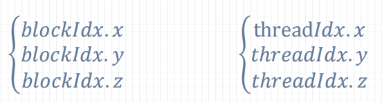

3. `gridDim`和`blockDim`是类型为dim3的变量，该类型是一个结构体，具有x,y,z三个成员

   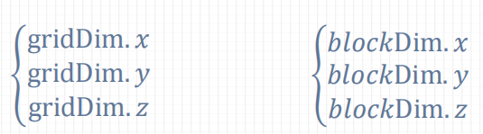

4. 取值范围

   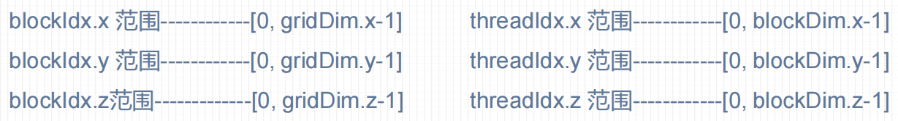

5. `<<<grid size, block size>>>`

   

6. gridDim和blockDim没有指定的维度默认为1:

   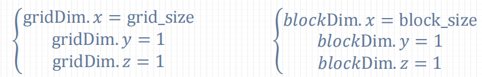

**注意: 内建变量只在核函数有效，且无需定义!**


定义多维网格和线程块(c++构造函数语法)：

```c++
dim3 grid_size(Gx, Gy, Gz);
dim3 block_size(Bx, By, Bz);
```

举个例子,定义一个 2x2x1的网格，5x3x1的线程块，代码中定义如下，

```c++
dim3 grid_size(2, 2);  // 等价于dim3 grid_size(2, 2,1);
dim3 block_size(5, 3);  // 等价于dim3 block_size(5,3,1);
```


多维网格和多维线程块本质是一维的，GPU物理上不分块。

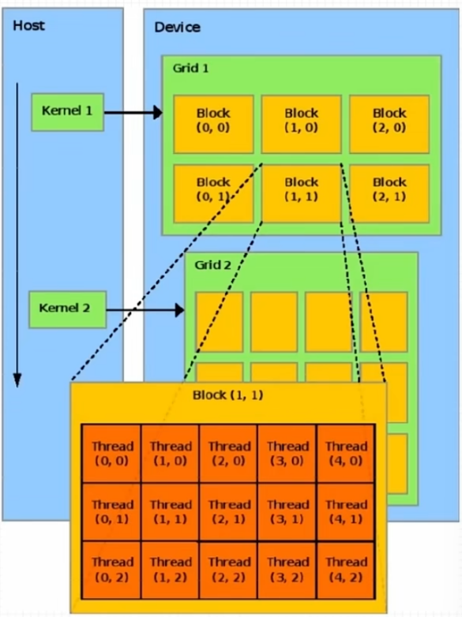

每个线程都有唯一标识:

```c++
int tid = threadldx.y * blockDim.x + threadldx.x,
int bid = blockldx.y* gridDim.x + blockldx.x;
```

多维线程块中的线程索引:

```c++
int tid = threadldx.z* blockDim.x* blockDim.y + threadldx.y * blockDim.x + threadldx.x;
```

多维网格中的线程块索引:

```c++
int bid = blockldx.z * gridDim.x * gridDim.y + blockldx.y * gridDin.x + blockldx.x;
```


大小限制：

1. 网格大小限制:

   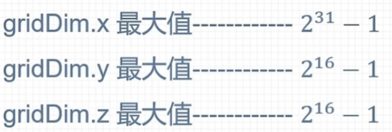

2. 线程块大小限制:

   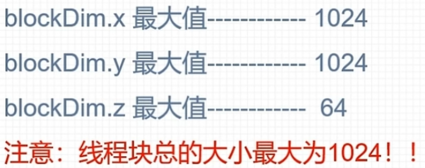


# 2.4 线程全局索引计算方式

## 线程全局索引

### 一维网格 一维线程块

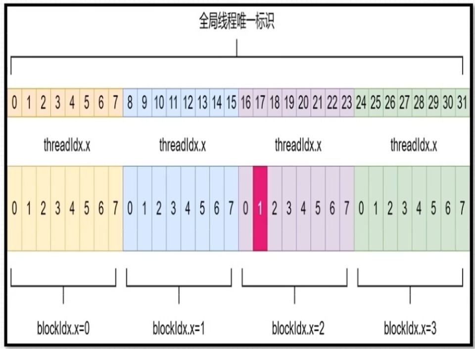

- 定义grid和block尺寸

  ```c
  dim3 grid_size(4);  dim3 block_size(8);
  ```

- 调用核函数: 

  ```c
  kernel_fun<<<grid_size, block_size>>>(...);
  ```

- 具体的线程索引方式如图所示，`blockldx.x`从0到3, `threadldx.x`从0到7

- 计算方式

  ```c
  int id = blockIdx.x * blockDim.x + threadIdx.x;
  ```


### 二维网格 二维线程块

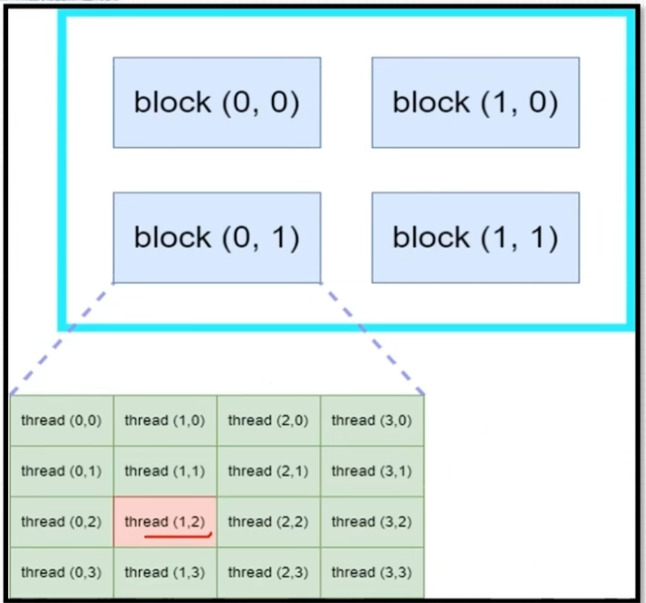

- 定义grid和block尺寸:

  ```c
  dim3 grid_size(2, 2);  dim3 block_size(4, 4);
  ```

- 调用核函数:

  ```c
  kernel_fun<<< grid_size, block_size >>>(...);
  ```

- 具体的线程索引方式如图所示，`blockldx.x`和`blockldx.y`从0到1，`threadldx.x`和`threadldx.y`从0到3。

- 计算方式:

  ```c
  int blockId = blockIdx.x + blockId.y * gridDim.x;
  int threadld = threadldx.y * blockDim.x + threadldx.x;
  int id = blockld * (blockDim.x * blockDim.y) + threadld;
  ```


### 三维网格 三维线程块

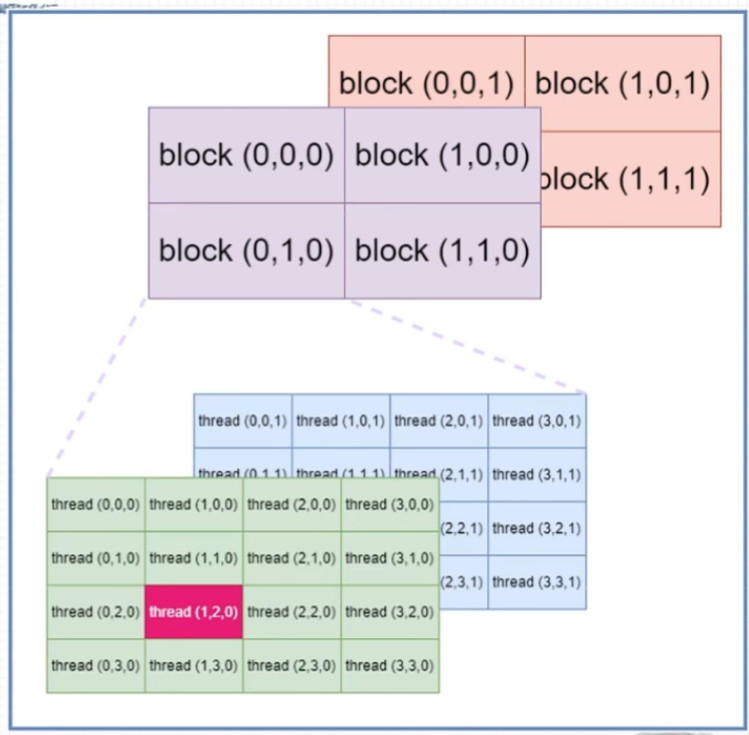

- 定义grid和block尺寸:

  ```c
  dim3_grid_size(2, 2, 2);  dim3_block_size(4, 4, 2);
  ```

- 调用核函数:

  ```c
  kernel_fun<<< grid_size, block_size >>>(...);
  ```

- 具体的线程索引方式如图所示，`blockldx.x, blockldx.y`和`blockldx.z`从0到1，`threadldx.x, threadldx.y`从0到3, `threadldx.z`从0到1。

- 计算方式:

  ```c
  int blockld = blockldx.x + blockldx.y * gridDim.x + gridDim.x * gridDim.y * blockldx.z;
  int threadld = (threadldx.z * (blockDim.x * blockDim.y)) + (threadldx.y* blockDim.x)+ threadldx.x;
  int id = blockId * (blockDim.x * blockDim.y * blockDim.z) + threadId;
  ```


## 不同组合方式列举

###   一维Grid

- 一维Grid 一维Block：

  ```c
  int blockId = blockIdx.x;
  int id = blockldx.x * blockDim.x + threadldx.x;
  ```

- 一维Grid 二维Block：

  ```c
  int blockld = blockldx.x;
  int id = blockldx.x * blockDim.x * blockDim.y + threadldx.y * blockDim.x + threadldx.x;
  ```

- 一维Grid 三维Block：

  ```c
  int blockld = blockldx.x;
  int id = blockldx.x * blockDim.x *blockDim.y * blockDim.z
      + threadldx.z * blockDim.y * blockDim.x
      + threadldx.y * blockDim.x + threadldx.x;
  ```


### 二维Grid

- 二维Grid 一维Block：

  ```c
  int blockld = blockldx.y* gridDim.x+ blockldx.x;
  int id = blockld * blockDim.x+ threadldx.x;
  ```

- 二维Grid 二维Block:

  ```c
  int blockld = blockldx.x + blockldx.y * gridDim.x;
  int id = blockld * (blockDim.x* blockDim.y)+ (threadldx.y * blockDim.x)+ threadldx.x;
  ```

- 二维Grid 三维Block

  ```c
  int blockld = blockldx.x + blockldx.y* gridDim.x;
  int id = blockld *(blockDim.x* blockDim.y* blockDim.z)
      + (threadldx.z*(blockDim.x* blockDim.y))
      + (threadldx.y* blockDim.x)+ threadldx.x;
  ```


### 三维Grid

- 三维Grid 一维Block:

  ```c
  int blockld = blockldx.x + blockldx.y * gridDim.x + gridDim.x * gridDim.y * blockldx.z;
  int id = blockld * blockDim.x + threadldx.x;
  ```

- 三维Grid 二维Block:

  ```c
  int blockld = blockldx.x + blockldx.y * gridDim.x + gridDim.x * gridDim.y * blockldx.z;
  int id = blockld * (blockDim.x * blockDim.y)+ (threadldx.y * blockDim.x)+ threadldx.x;
  ```

- 三维Grid 三维Block：

  ```c
  int blockld = blockldx.x + blockldx.y * gridDim.x + gridDim.x * gridDim.y * blockldx.z;
  int id = blockld * (blockDim.x * blockDim.y* blockDim.z)
      + (threadldx.z*(blockDim.x* blockDim.y))
      + (threadldx.y* blockDim.x)+ threadldx.x;
  ```

  


# 2.5 nvcc编译流程与GPU计算能力

## nvcc编译流程

**nvcc编译流程**

1. nvcc分离全部源代码为：(1)主机代码；(2)设备代码
2. 主机(Host)代码是C/C++语法，设备(device)代码是C/C++扩展语言编写
3. nvcc先将设备代码编译为**PTX(Parallel Thread Execution)**伪汇编代码，再将PTX代码编译为二进制的**cubin目标代码**
4. 在将源代码编译为 PTX 代码时，需要用选项`-arch=compute_XY`指定一个虚拟架构的计算能力，用以确定代码中能够使用的CUDA功能。
5. 在将PTX代码编译为cubin代码时，需要用选项`-code=sm_ZW`指定一个真实架构的计算能力，用以确定可执行文件能够使用的GPU。

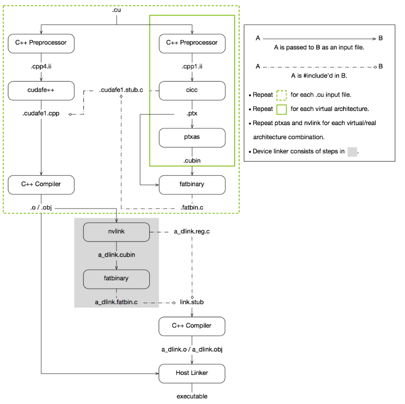

- 具体cuda编译链接流程参考:[cuda文档](https://docs.nvidia.com/cuda/cuda-compiler-driver-nvcc/index.html)


## PTX

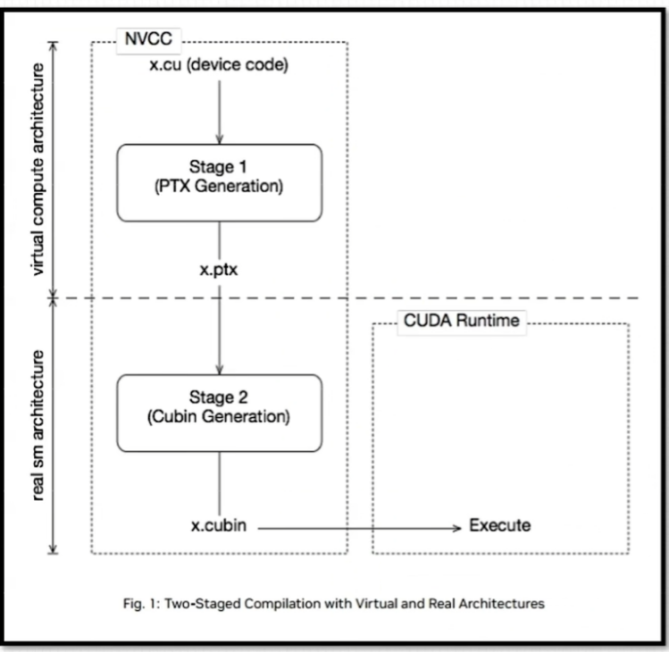

- PTX(Parallel Thread Execution)是CUDA平台为基于GPU的通用计算而定义的虚拟机和指令集
- **nvcc编译**命令总是使用两个体系结构: **一个是虚拟的中间体系结构，另一个是实际的GPU体系结构**
- 虚拟架构更像是对应用所需的GPU功能的声明
- 虚拟架构应该尽可能选择低----适配更多实际GPU；真实架构应该尽可能选择高---充分发挥GPU性能
- [PTX文档](https://docs.nvidia.com/cuda/parallel-thread-execution/index.html)


## GPU计算能力

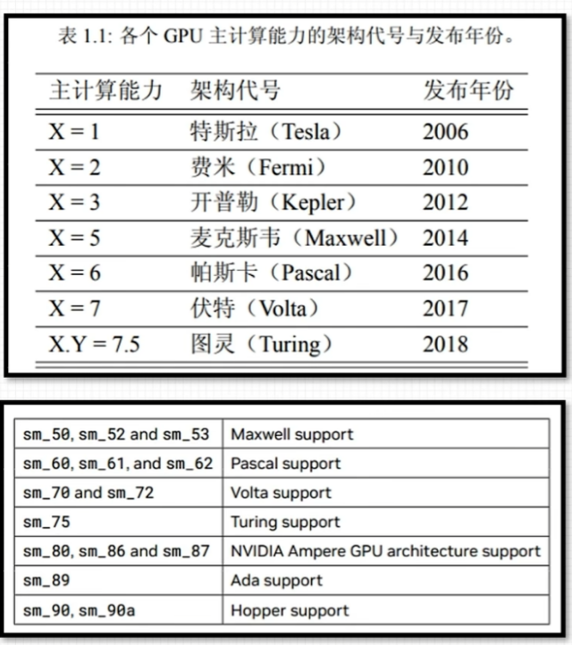

- 每款GPU都有用于标识 “计算能力” （compute capability）的版本号

- 形式`X.Y`，`X`标识主版本号，`Y`表示次版本号

- 并非GPU 的计算能力越高，性能就越高

  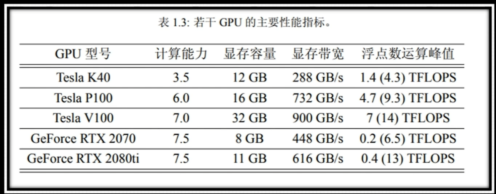


# 2.6 CUDA程序兼容性问题

## 指定虚拟架构计算能力

- C/C++源码编译为PTX时，可以指定虚拟架构的计算能力，用来确定代码中能够使用的CUDA功能

- C/C++源码转化为PTX这一步骤与GPU硬件无关

- 编译指令（**指定虚拟架构计算能力**）：

  ```bash
  # XY：第一个数字X代表计算能力的主版本号，第二个数字Y代表计算能力的次版本号
  -arch=compute_XY
  ```

- PTX的指令只能在更高的计算能力的GPU使用

  ```bash
  nvcc helloworld.cu –o helloworld -arch=compute_61
  ```

  编译出的可执行文件helloworld可以在计算能力>=6.1的GPU上面执行，在计算能力小于6.1的GPU则不能执行。


## 指定真实架构计算能力

- **PTX**指令转化为**二进制cubin**代码与具体的GPU架构有关

- 编译指令**（指定真实架构计算能力）**：

  ```bash
  # XY：第一个数字X代表计算能力的主版本号，第二个数字Y代表计算能力的次版本号
  -code=sm_XY
  ```

- 注意：

  - （1）二进制cubin代码，大版本之间不兼容！！！
  - （2）指定真实架构计算能力的时候必须指定虚拟架构计算能力！！！
  - （3）指定的真实架构能力必须大于或等于虚拟架构能力！！！

- 真实架构可以实现低小版本到高小版本的兼容！


## 指定多个GPU版本编译

- 使得编译出来的可执行文件可以在多GPU中执行

- 同时指定多组计算能力：

  ```bash
  -gencode arch=compute_XY -code=sm_XY
  ```

  例如：

  - `-gencode=arch=compute_35,code=sm_35 ` 开普勒架构
  - `-gencode=arch=compute_50,code=sm_50 `麦克斯韦架构
  - `-gencode=arch=compute_60,code=sm_60 `帕斯卡架构
  - `-gencode=arch=compute_70,code=sm_70` 伏特架构

- 编译出的可执行文件包含4个二进制版本，生成的可执行文件称为胖二进制文件（fatbinary）

- 注意：

  - （1）执行上述指令必须CUDA版本支持7.0计算能力，否则会报错
  - （2）过多指定计算能力，会增加编译时间和可执行文件的大小


## nvcc即时编译

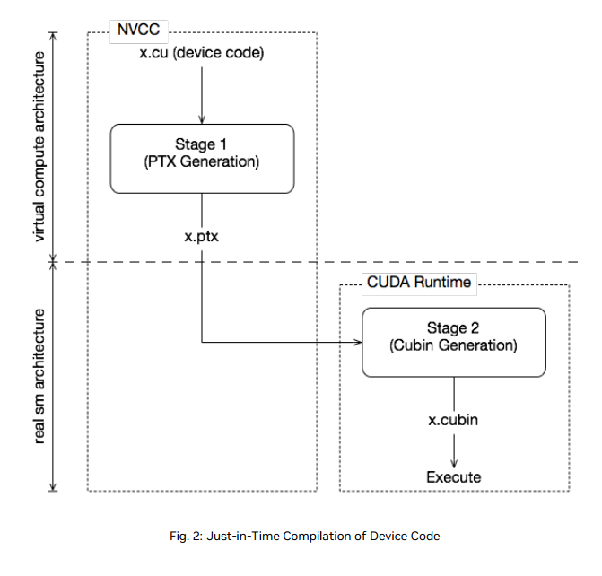

- 在运行可执行文件时，从保留的PTX代码临时编译出cubin文件

- 在可执行文件中保留PTX代码，nvcc编译指令指定所保留的PTX代码虚拟架构：

  指令：`-gencode arch=compute_XY ,code=compute_XY`

- 例如：

  ```bash
  -gencode=arch=compute_35,code=sm_35
  -gencode=arch=compute_50,code=sm_50
  -gencode=arch=compute_61,code=sm_61
  -gencode=arch=compute_61,code=compute_61
  ```

- 简化： `-arch=sm_XY`


## nvcc编译默认计算能力

- 不同版本CUDA编译器在编译CUDA代码时，都有一个默认计算能力

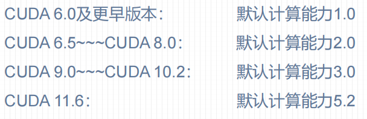


# 3.1 CUDA矩阵加法运算程序

## CUDA程序基本框架

```c
#include <头文件>

__global__ void 函数名(参数...) 
{
    核函数内容;
}

int main(void) 
{
    设置GPU设备;
    分配主机和设备内存;
    初始化主机中的数据;
    数据从主机复制到设备;
    调用核函数在设备中进行计算;
    将计算得到的数据从设备传主机;
    释放主机与设备内存;
}
```


## 设置GPU设备


## 内存管理


