# TensorRT

## TensorRT简介

tensorRT，nvidia发布的dnn推理引擎，是针对nvidia系列硬件进行优化加速，实现最大程度的利用GPU资源，提升推理性能

tensorRT是业内nvidia系列产品部署落地时的最佳选择

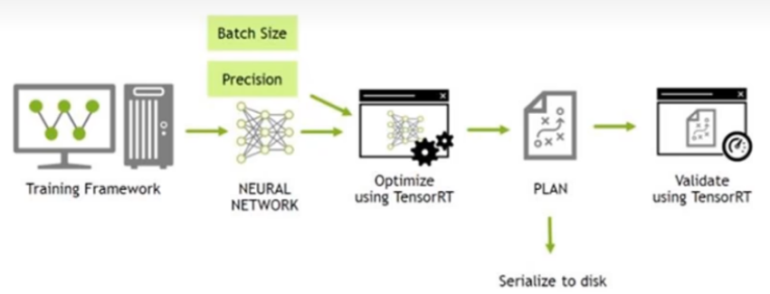

**TensorRT(最新版本 8.6.1)**

- 用于高效实现已训练好的深度学习模型的**推理过程**的 SDK
- 内含**推理优化器**和**运行时环境**
- 使 DL 模型能以**更高吞吐量**和**更低的延迟**运行
- 有 C++和 python 的 API，完全等价可以混用


## TensorRT 做的工作

- **构建期(推理优化器)**
  - **模型解析/建立：**加载 Onnx 等其他格式的模型/使用原生 API 搭建模型
  - **计算图优化：**横向层融合(Conv)，纵向层融合(Conv+add+ReLU)，......
  - **节点消除：**去除无用层，节点变换(Pad，Slice，Concat，Shuffle)，......
  - **多精度支持：**FP32/FP16/INT8/TF32(可能插入 reformat 节点)
  - **优选 kernel/format：**硬件相关优化
  - **导入 plugin：**实现自定义操作
  - **显存优化：**显存池复用
- **运行期（运行时环境）**
  - **运行时环境：**对象生命期管理，内存显存管理，异常处理
  - **序列化反序列化：**推理引擎保存为文件或从文件中加载

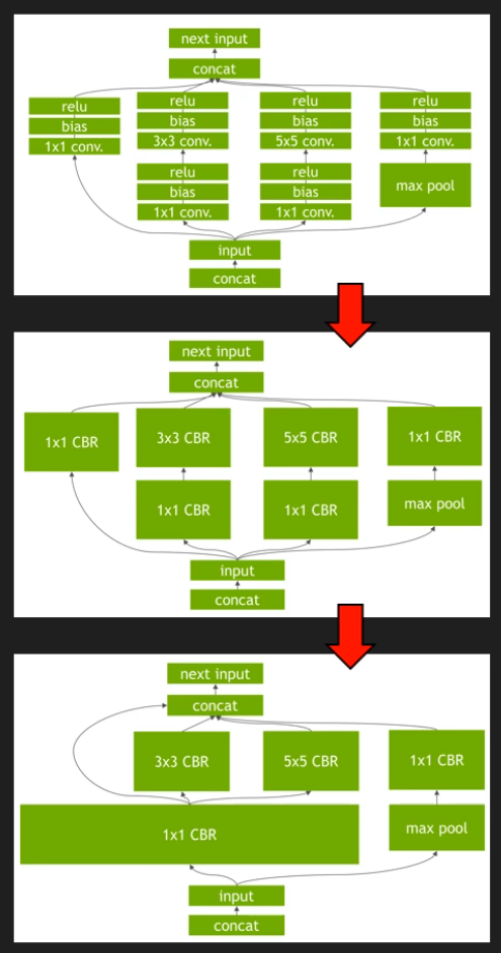


## TensorRT 的表现

- 不同模型加速效果不同
- 选用高效算子提升运算效率
- 算子融合减少访存数据、提高访问效率
- 使用低精度数据类型，节约时间空间

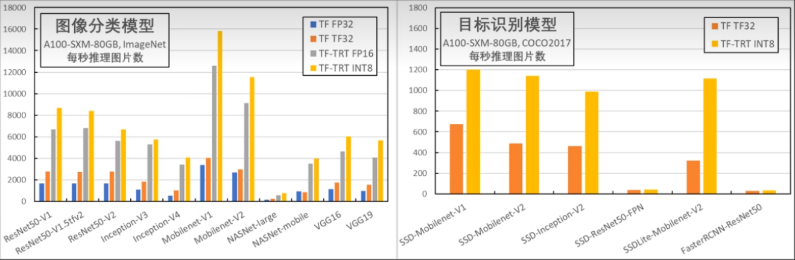

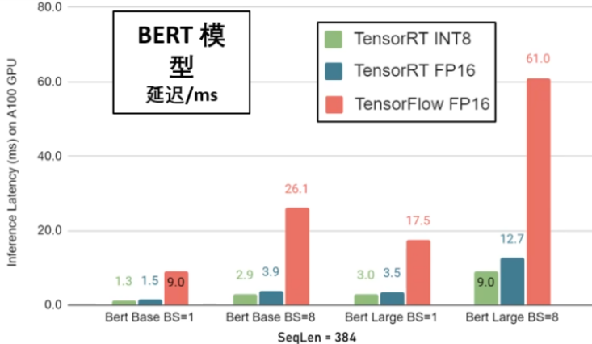

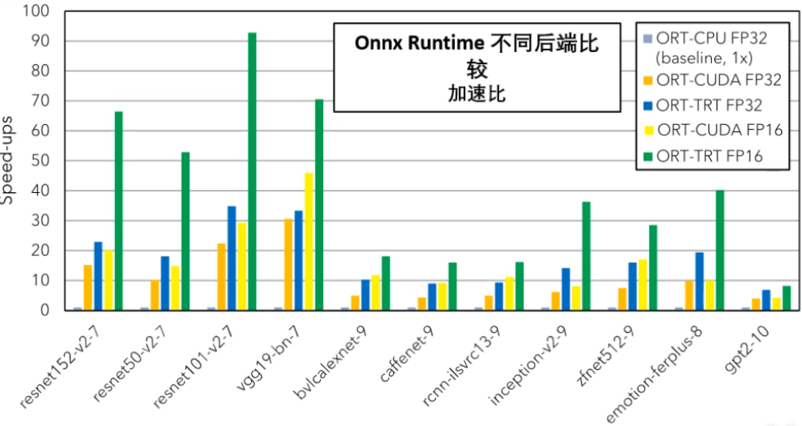


## TensorRT基本流程

**基本流程：**

- 构建期
  - 前期准备(Logger，Builder，Config，Profile)
  - 创建 Network(计算图内容)
  - 生成序列化网络(计算图 TRT 内部表示)
- 运行期
  - 建立 Engine 和 Context
  - Buffer 相关准备(申请+拷贝)
  - 执行推理(Execute)
  - 善后工作


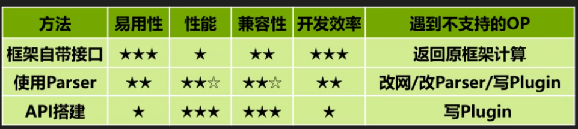

**使用方式：**

- 使用框架自带 TRT接口(TF-TRT，Torch-TensorRT)

  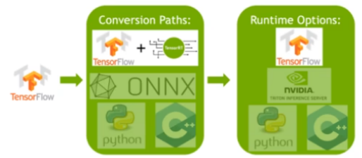

- **使用 Parser**(TF/Torch/...→ ONNX→ TensorRT)

  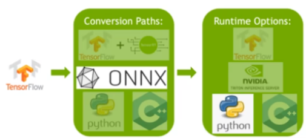

- 使用 TensorRT 原生 API 搭建网络


## 驾驭TensorRT的方案介绍

### C++接口构建方案

[TensorRT提供基于C++接口的构建模型方案](https://github.com/NVIDIA/TensorRT/blob/release/8.0/samples/sampleMNISTAPI/sampleMNISTAPI.cpp)

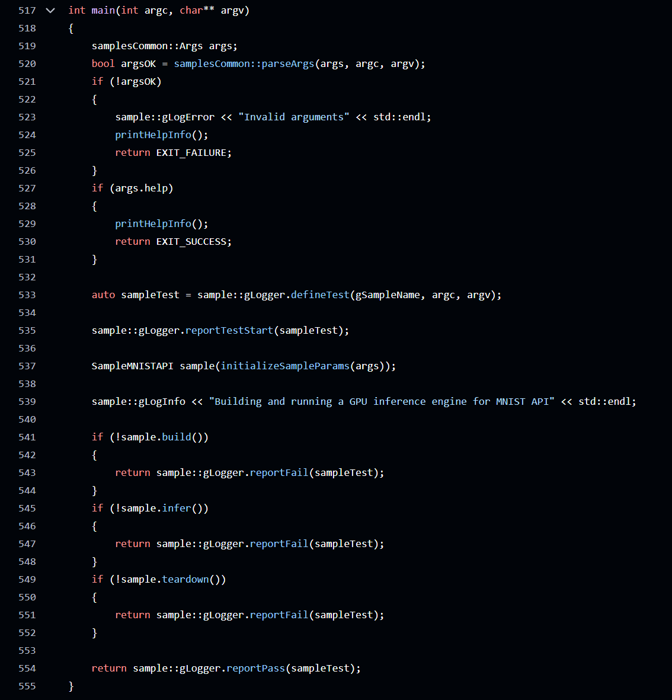


### python接口方案

[提供了python的接口](https://github.com/NVIDIA/TensorRT/blob/release/8.0/samples/python/engine_refit_mnist/sample.py)

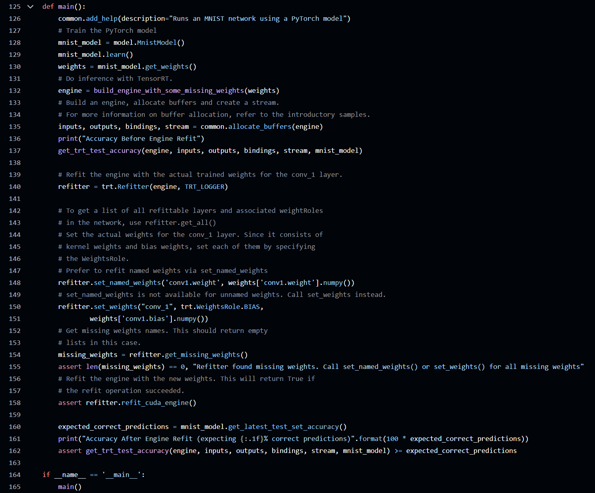


### 主要方案

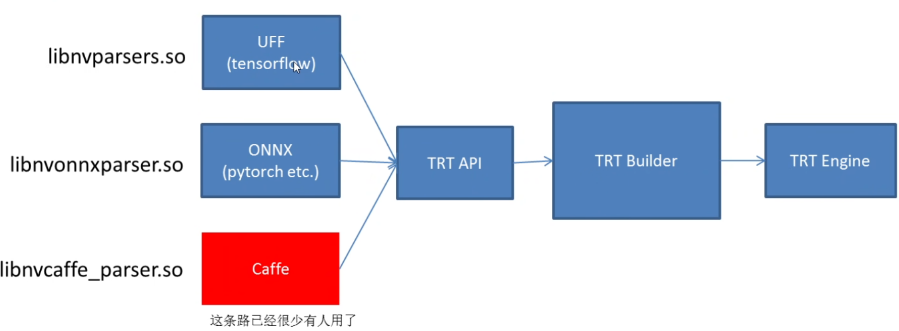


### 优化的repo1

基于tensorRT的发布，又有人在之上做了工作repo1：https://github.com/wang-xinyu/tensorrtx

为每个模型写硬代码

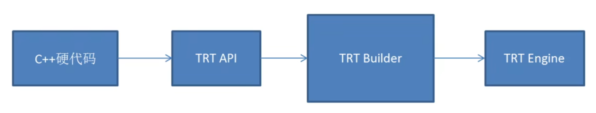

使用作者定义的gen wts.py储存权重

使用C++硬代码调用TensorRTC++API构建模型结构，加载gen wts.py产生的权重组成完整模型

- 优点
  - 可以控制每个layer的细节和权重，直接面对tensorRTAPI
  - 在认为ONNX方案适配性差的前提下，这种方案不存在算子问题，如果存在不支持的算子，可以自行增加插件。灵活性最高
  - 这种方案与官方的samples相似程度高，有参照
  - 作者提供了大量常见模型的硬代码，方便直接使用，受到YoloV5官方引用
- 缺点
  - 过于灵活，需要控制的细节太多，对技能要求较高
  - 模型构建的方式采用的硬代码，灵活度差。新模型需要自己一个layer一个ayer的写C++代码构建，不具有通用性
  - 作者提供的推理代码是demo级，到使用阶段时，需要修改太多。可以看作官方的扩展
  - 部署时无法查看网络结构进行分析和排查


### 优化的repo2

repo2：https://github.com/NVIDIA-Al-OT/torch2trt

为每个算子写`Converter`，反射`Module.forward`捕获输入输出和图结构

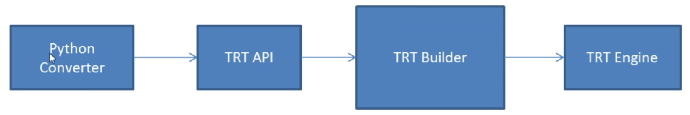

作者为pytorch的每一个操作做了Converter，为每个操作的forward反射到自定义函数下

通过反射torch的forward操作捕获模块的权重，调用PythonAPI接囗实现模型构建

- 优点：直接集成Python、Pytorch，可以实现pytorch模型到tensorRT模型的无缝无脑简单转换
- 缺点：
  - 提供的是Python的方案，并没有C++方案
  - 新的算子需要自己实现Converter,需要维护新的算子库
  - 直接用Pytorch转到tensorRT储存的模型是tensorRT模型。如果垮设备则必须在设备上安装pytorch，灵活度差不利于部署
  - 部署时无法查看网络结构进行分析和排查


### 优化的repo3（推荐方案）

repo3, https://github.com/shouxieai/tensorRT_cpp

基于ONNX路线，提供C++、Python接口，深度定制ONNXParser，低耦合封装，实现常用模型YoloX、YoloV5、RetinaFace、Arcface、SCRFD、DeepSORT算子由官方维护，模型直接导出

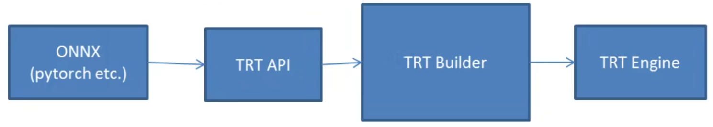

```c++
TRT::compile(
    TRT::Mode::FP32,  // 使用fp32模型编译
    3,				  // max batch size
    "plugin.onnx",	  // onnx 文件
    "plugin.fp32.trtmodel",  // 保存的文件路径
    {}  					// 重新定制输入的shape
);
```

```python
import trtpy


model = models.resnet18(True).eval()
trtpy.from_torch(
    model,
    dummy_input,
    max_batch_size=16,
    onnx_save_file="test.onnx",
    engine_save_file="engine.trtmodel"
)
```

- 优点
  - 集成工业级推理方案、支持tensorRT从模型导出到应用到项目中的全部工作
  - 案例有YoloV5、YoloX、AlphaPose、RetinaFace、SCRFD、Arcface、DeepSORT每个应用均为高性能工业级拿来即可用，低耦合
  - 具有简单的模型导出方法和onnx问题的解决方案
  - 具有简单的模型推理接口，封装tensorRT细节。支持插件
  - 支持python接口导出模型和推理接口
  - 依赖onnx，pytorch方面有官方支持，tensorRT方面也有官方支持。咱们做的是桥梁虽然onnx存在各种兼容性问题，搞清楚了，还是可以轻松驾驭他
- 缺点